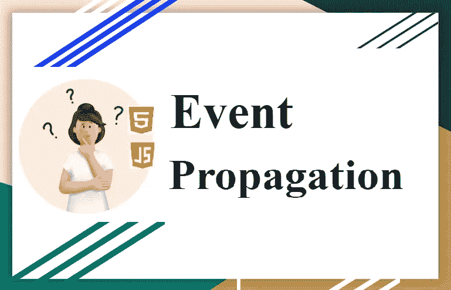
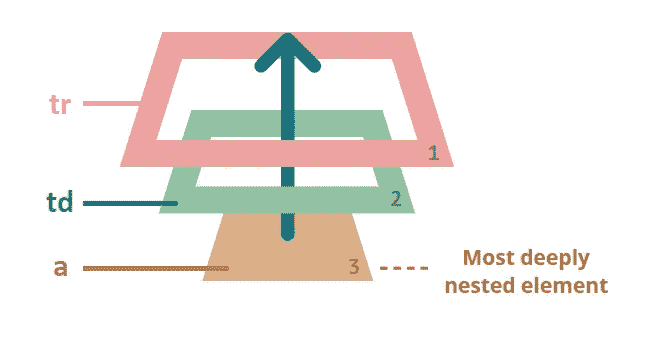
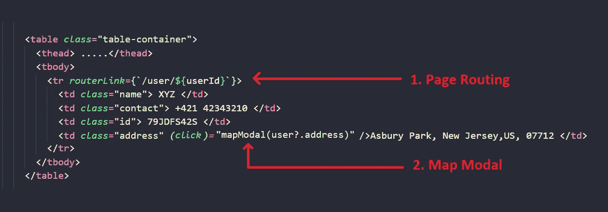
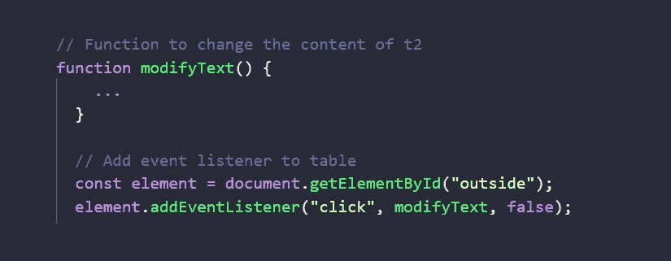

# Javascript 事件传播

> 原文：<https://medium.com/globant/javascript-event-propagation-b66bd2a64fd0?source=collection_archive---------1----------------------->

事件传播并不新鲜，但对一些人来说可能听起来很新鲜。从智能设备问世的第一天起，我们就一直在处理这个问题。

在我们前进之前，打破 2 中的术语可能是理解的开始。

**事件—** 当用户/浏览器试图通过呈现的 HTML 操纵页面时发生的交互。

**传播**——广为传播的行为。

当这两个词结合在一起时，事件传播是一样的。在浏览器上触发单个事件时分散的事件。**用户交互或 web 浏览器操作时在 web 浏览器中触发的事件堆栈。**

事件传播分为 3 个阶段:事件冒泡、目标和事件捕获。

# **事件冒泡**

**‘泡泡’是向上的东西。**事件冒泡只不过是事件在 DOM 中向上移动。

Event Bubbling

考虑一个包含用户详细信息(包括姓名、联系人、地址、id 等)的表。地址栏设计为打开带有 pin 位置的地图模式，而单击特定的员工行将打开另一个页面以了解更多详细信息。

因此，当用户点击标签时，它将加载带有地图的模型，事件冒泡触发 td，也跟随 tr 事件。
点击< a >打开地图模式并改变页面。

**缺点** —当页面/URL 改变时，模式将在几秒钟内关闭。

> 几乎所有的事件都泡汤了。关键是 ***几乎所有的*** 。有一些[事件不会让](https://en.wikipedia.org/wiki/DOM_events#Events)冒泡，例如:聚焦、模糊、滚动等等。([链接了解更多详情](https://en.wikipedia.org/wiki/DOM_events#Events))

# 事件目标

启动事件的“目标”元素在冒泡过程中不会改变。它是嵌套最深的元素，可作为 event.target 访问

> **event.currentTarget —** 给出当前有处理程序的元素。 **event.target —** 给出导致事件的元素。
> **event . event phase**—当前阶段(捕捉=1，目标=2，冒泡=3)。

# 事件捕获

**【捕获】追捕某物。当事件堆栈从父标签向下移动到子标签时，我们称之为事件捕获。**

默认情况下，事件捕获被设置为默认值 false。要查看它的工作情况，必须在事件侦听器中添加属性

> 很少使用事件捕获阶段。

# **预防** —

preventDefault()、stopPropagation()和 stopImmediatePropagation()。

## `preventDefault`对`stopPropagation`

以上两个函数都阻止事件在 DOM 中上移。并非所有 HTML 标签都有默认行为，因此 **element.preventDefault()** 方法面临限制。制造对**元素**的需求。**停止繁殖()**投入使用。

**element . stop propagation()**停止将要冒泡的事件，而当前事件仍将发生。然而，**element . stopmimmediatepropagation**将停止当前处理程序上发生的所有事件。