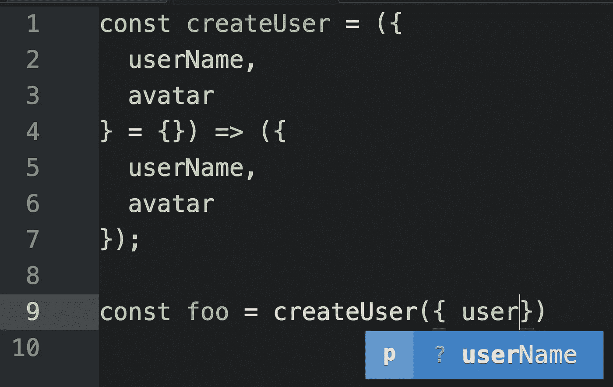
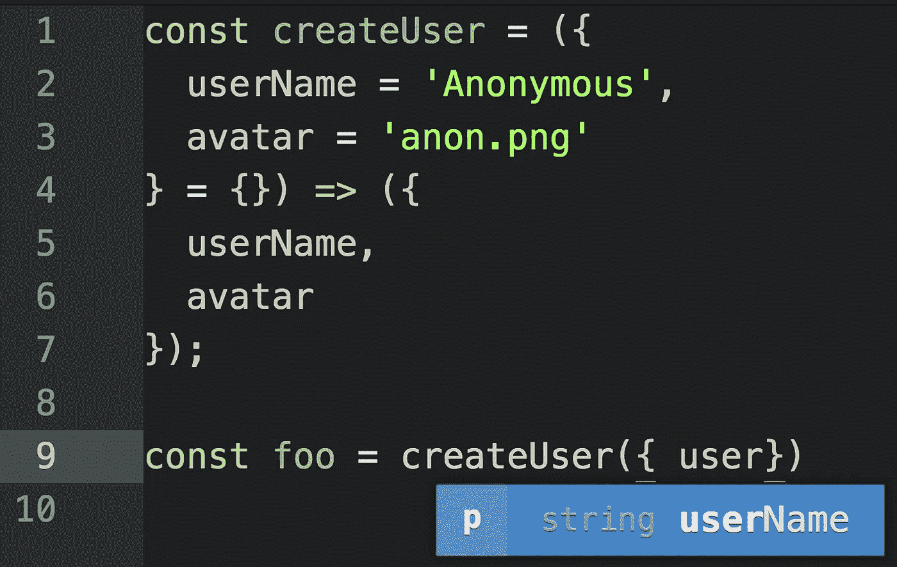

# ES6+的 JavaScript 工厂功能

> 原文：<https://medium.com/javascript-scene/javascript-factory-functions-with-es6-4d224591a8b1?source=collection_archive---------0----------------------->


Smoke Art Cubes to Smoke — MattysFlicks — (CC BY 2.0)

> **注:**这是《作曲软件》系列 **s** [**(现在一本书！)**](https://leanpub.com/composingsoftware) 关于从基础开始学习 JavaScript ES6+中的函数式编程和组合软件技术。敬请关注。还会有更多这样的事情发生！
> [买书](https://leanpub.com/composingsoftware) | [索引](/javascript-scene/composing-software-the-book-f31c77fc3ddc)|[|<上一张](/javascript-scene/the-hidden-treasures-of-object-composition-60cd89480381) | [下一张>](/javascript-scene/functional-mixins-composing-software-ffb66d5e731c)

工厂函数是任何一个函数，它不是一个返回(假设是新的)对象的类或构造函数。在 JavaScript 中，任何函数都可以返回一个对象。当它在没有关键字`new`的情况下这样做时，它是一个工厂函数。

工厂函数在 JavaScript 中一直很有吸引力，因为它们提供了轻松生成对象实例的能力，而无需陷入类和`new`关键字的复杂性。

JavaScript 提供了非常方便的对象文字语法。它看起来像这样:

```
const user = {
  userName: 'echo',
  avatar: 'echo.png'
};
```

像 JSON(基于 JavaScript 的对象文字符号)一样，`:`的左边是属性名，右边是值。您可以使用点符号访问道具:

```
console.log(user.userName); // "echo"
```

您可以使用方括号符号来访问计算属性名:

```
const key = 'avatar';console.log( user[key] ); // "echo.png"
```

如果作用域内的变量与预期的属性名同名，则可以在对象文字创建中省略冒号和值:

```
const userName = 'echo';
const avatar = 'echo.png';const user = {
  userName,
  avatar
};console.log(user);
// { "avatar": "echo.png",   "userName": "echo" }
```

对象文字支持简洁的方法语法。我们可以添加一个`.setUserName()`方法:

```
const userName = 'echo';
const avatar = 'echo.png';const user = {
  userName,
  avatar, setUserName (userName) {
    this.userName = userName;
    return this;
  }
};console.log(user.setUserName('Foo').userName); // "Foo"
```

在简洁的方法中，`this`指的是方法被调用的对象。要调用对象上的方法，只需使用对象点符号访问该方法，并使用括号调用它，例如，`game.play()`会将`.play()`应用于`game`对象。为了应用使用点符号的方法，该方法必须是所讨论的对象的属性。您还可以使用函数原型方法、`.call()`、`.apply()`或`.bind()`将方法应用于任何其他任意对象。

在这种情况下，`user.setUserName('Foo')`将`.setUserName()`应用于`user`，所以`this === user`。在`.setUserName()`方法中，我们通过`this`绑定来更改`user`对象的`.userName`属性，并返回相同的对象实例用于方法链接。

# 文字代表一个，工厂代表多个

如果您需要创建许多对象，您将希望结合对象文字和工厂函数的力量。

使用工厂函数，您可以创建任意多的用户对象。例如，如果您正在构建一个聊天应用程序，您可以有一个代表当前用户的用户对象，以及许多代表当前登录并聊天的所有其他用户的其他用户对象，因此您也可以显示他们的姓名和头像。

让我们把我们的`user`对象变成一个`createUser()`工厂:

```
const createUser = ({ userName, avatar }) => ({
  userName,
  avatar,
  setUserName (userName) {
    this.userName = userName;
    return this;
  }
});console.log(createUser({ userName: 'echo', avatar: 'echo.png' }));/*
{
  "avatar": "echo.png",
  "userName": "echo",
  "setUserName": [Function setUserName]
}
*/
```

# 返回对象

箭头函数(`=>`)有一个隐式返回特性:如果函数体由单个表达式组成，可以省略`return`关键字:`() => 'foo'`是一个不带参数的函数，返回字符串，`"foo"`。

返回对象文本时要小心。默认情况下，JavaScript 假设您想在使用大括号时创建一个函数体，例如`{ broken: true }`。如果您想对对象文字使用隐式返回，您需要通过将对象文字括在括号中来消除歧义:

```
const noop = () => { foo: 'bar' };
console.log(noop()); // undefinedconst createFoo = () => ({ foo: 'bar' });
console.log(createFoo()); // { foo: "bar" }
```

在第一个例子中，`foo:`被解释为一个标签，`bar`被解释为一个没有被赋值或返回的表达式。该函数返回`undefined`。

在`createFoo()`示例中，括号强制将括号解释为待计算的表达式，而不是函数体块。

# 解构

请特别注意函数签名:

```
const createUser = ({ userName, avatar }) => ({
```

在这一行中，大括号(`{`，`}`)代表对象析构。这个函数接受一个参数(一个对象)，但是从这个参数中析构两个形参`userName`和`avatar`。然后，这些参数可以用作函数体范围内的变量。您也可以析构数组:

```
const swap = ([first, second]) => [second, first];console.log( swap([1, 2]) ); // [2, 1]
```

您可以使用 rest and spread 语法(`...varName`)从数组(或参数列表)中收集剩余的值，然后将这些数组元素分散回各个元素:

```
const rotate = ([first, ...rest]) => [...rest, first];console.log( rotate([1, 2, 3]) ); // [2, 3, 1]
```

# 计算属性键

之前，我们使用方括号计算属性访问符号来动态确定要访问的对象属性:

```
const key = 'avatar';console.log( user[key] ); // "echo.png"
```

我们还可以计算要分配给的键值:

```
const arrToObj = ([key, value]) => ({ [key]: value });console.log( arrToObj([ 'foo', 'bar' ]) ); // { "foo": "bar" }
```

在这个例子中，`arrToObj`接受一个由键/值对(也称为元组)组成的数组，并将其转换为一个对象。因为我们不知道键的名称，所以我们需要计算属性名称，以便在对象上设置键/值对。为此，我们从 computed property 访问器中借用方括号符号的概念，并在构建对象文字的上下文中重用它:

```
{ [key]: value }
```

插值完成后，我们得到了最终的对象:

```
{ "foo": "bar" }
```

# 默认参数

JavaScript 中的函数支持默认参数值，这有几个好处:

1.  用户可以用合适的默认值省略参数。
2.  该函数更加自文档化，因为默认值提供了预期输入的示例。
3.  ide 和静态分析工具可以使用默认值来推断参数的预期类型。例如，`1`的默认值意味着参数可以接受`Number`类型的成员。

使用默认参数，我们可以为我们的`createUser`工厂记录预期的界面，如果没有提供用户信息，则自动填写`'Anonymous'`细节:

```
const createUser = ({
  userName = 'Anonymous',
  avatar = 'anon.png'
} = {}) => ({
  userName,
  avatar
});console.log(
  // { userName: "echo", avatar: 'anon.png' }
  createUser({ userName: 'echo' }), // { userName: "Anonymous", avatar: 'anon.png' }
  createUser()
);
```

函数签名的最后一部分可能看起来有点滑稽:

```
} = {}) => ({
```

就在参数签名结束之前的最后一个`= {}`位意味着如果没有为这个参数传递任何东西，我们将使用一个空对象作为缺省值。当您试图从空对象中析构值时，属性的默认值将被自动使用，因为这就是默认值的作用:用一些预定义的值替换`undefined`。

如果没有默认值`= {}`，没有参数的`createUser()`将会抛出一个错误，因为您不能尝试从`undefined`访问属性。

## 类型推理

在撰写本文时，JavaScript 没有任何原生类型注释，但几年来出现了几种竞争格式来填补空白，包括 JSDoc(由于更好的选项的出现而衰落)，[脸书的 Flow](https://flow.org/) ，以及[微软的 TypeScript](https://www.typescriptlang.org/) 。我在文档中使用[rtype](https://github.com/ericelliott/rtype)——我发现这种符号比函数式编程的 TypeScript 可读性更好。

在撰写本文时，类型注释还没有明确的赢家。没有一种替代方案得到了 JavaScript 规范的认可，而且它们似乎都有明显的缺点。

类型推断是根据使用类型的上下文来推断类型的过程。在 JavaScript 中，它是类型注释的一个非常好的替代品。

如果您在标准 JavaScript 函数签名中提供了足够的推断线索，您将获得类型注释的大部分好处，而没有任何成本或风险。

即使您决定使用像 TypeScript 或 Flow 这样的工具，您也应该尽可能多地使用类型推断，并在类型推断不充分的情况下保存类型注释。例如，JavaScript 中没有指定共享接口的本地方法。这对于 TypeScript 或 rtype 来说既简单又有用。

Tern.js 是一个流行的 JavaScript 类型推理工具，它为许多代码编辑器和 ide 提供了插件。

微软的 Visual Studio 代码不需要 Tern，因为它将 TypeScript 的类型推断能力带到了常规的 JavaScript 代码中。

当您在 JavaScript 中为函数指定默认参数时，能够进行类型推断的工具(如 Tern.js、TypeScript 和 Flow)可以提供 ide 提示来帮助您正确使用正在使用的 API。

如果没有缺省值，ide(通常是人类)没有足够的提示来确定预期的参数类型。



Without defaults, the type is unknown for `userName`.

使用缺省值，ide(通常是人类)可以从例子中推断出类型。



With defaults, the IDE can suggest that `userName` is expecting a string.

将参数限制为固定类型并不总是有意义的(这将使泛型函数和高阶函数变得困难)，但是当有意义时，默认参数通常是最好的方法，即使您使用的是 TypeScript 或 Flow。

# 混音合成的工厂功能

工厂非常擅长使用漂亮的调用 API 来生产对象。通常，它们是您所需要的全部，但是偶尔，您会发现自己在不同类型的对象中构建相似的特性，并且您会想要将这些特性抽象成功能混合，以便可以更容易地重用它们。

这就是功能性混音的亮点。让我们构建一个`withConstructor` mixin，将`.constructor`属性添加到所有对象实例中。

`with-constructor.js`:

```
const withConstructor = constructor => o => ({
  // create the delegate [[Prototype]]
  __proto__: {
    // add the constructor prop to the new [[Prototype]]
    constructor
  },
  // mix all o's props into the new object
  ...o
});
```

现在您可以导入它并将其与其他 mixins 一起使用:

```
import withConstructor from `./with-constructor';const pipe = (...fns) => x => fns.reduce((y, f) => f(y), x);
// or `import pipe from 'lodash/fp/flow';`// Set up some functional mixins
const withFlying = o => {
  let isFlying = false;
  return {
    ...o,
    fly () {
      isFlying = true;
      return this;
    },
    land () {
      isFlying = false;
      return this;
    },
    isFlying: () => isFlying
  }
};const withBattery = ({ capacity }) => o => {
  let percentCharged = 100;
  return {
    ...o,
    draw (percent) {
      const remaining = percentCharged - percent;
      percentCharged = remaining > 0 ? remaining : 0;
      return this;
    },
    getCharge: () => percentCharged,
    getCapacity: () => capacity
  };
};const createDrone = ({ capacity = '3000mAh' }) => pipe(
  withFlying,
  withBattery({ capacity }),
  withConstructor(createDrone)
)({});const myDrone = createDrone({ capacity: '5500mAh' });console.log(`
  can fly:  ${ myDrone.fly().isFlying() === true }
  can land: ${ myDrone.land().isFlying() === false }
  battery capacity: ${ myDrone.getCapacity() }
  battery status: ${ myDrone.draw(50).getCharge() }%
  battery drained: ${ myDrone.draw(75).getCharge() }% remaining
`);console.log(`
  constructor linked: ${ myDrone.constructor === createDrone }
`);
```

如您所见，可重用的`withConstructor()` mixin 与其他 mixin 一起被简单地放入管道中。`withBattery()`可用于其他类型的物体，如机器人、电动滑板或便携式设备充电器。`withFlying()`可用于制作飞行汽车、火箭或热气球模型。

合成更多的是一种思维方式，而不是代码中的一种特殊技术。你可以用很多方法来完成它。函数组合只是从头构建它的最简单方法，工厂函数是围绕实现细节包装友好 API 的简单方法。

# 结论

ES6 为处理对象创建和工厂功能提供了方便的语法。大多数时候，这就是你所需要的，但是因为这是 JavaScript，有另一种方法让它看起来更像 Java:关键字`class`。

在 JavaScript 中，类比工厂更加冗长和严格，并且在重构时有点像雷区，但它们也已经被 React 和 Angular 等主要前端框架所接受，并且有几个罕见的用例使复杂性变得值得。

> “有时候，优雅的实现只是一个函数。不是方法。不是一个班。不是框架。只是一个功能。”~约翰·卡马克

从最简单的实现开始，只在需要时才转向更复杂的实现。

[***接下来:为什么跟班作文更难>***](/javascript-scene/why-composition-is-harder-with-classes-c3e627dcd0aa)

# 后续步骤

想了解更多关于用 JavaScript 进行对象组合的知识吗？

[跟 Eric Elliott 学 JavaScript】。如果你不是会员，你就错过了！](http://ericelliottjs.com/product/lifetime-access-pass/)

[](https://ericelliottjs.com/product/lifetime-access-pass/)

***埃里克·艾略特*** *是一位科技产品和平台顾问，《 [*【作曲软件】*](https://leanpub.com/composingsoftware)*[*【EricElliottJS.com】*](https://ericelliottjs.com)*[*devanywhere . io*](https://devanywhere.io)*的联合创始人，以及 dev 团队导师。他曾为 Adobe Systems、* ***、Zumba Fitness、*** ***【华尔街日报、*******【ESPN、*******【BBC】****等顶级录音艺人和包括* ***Usher、【Metallica】********

*他和世界上最美丽的女人享受着与世隔绝的生活方式。*