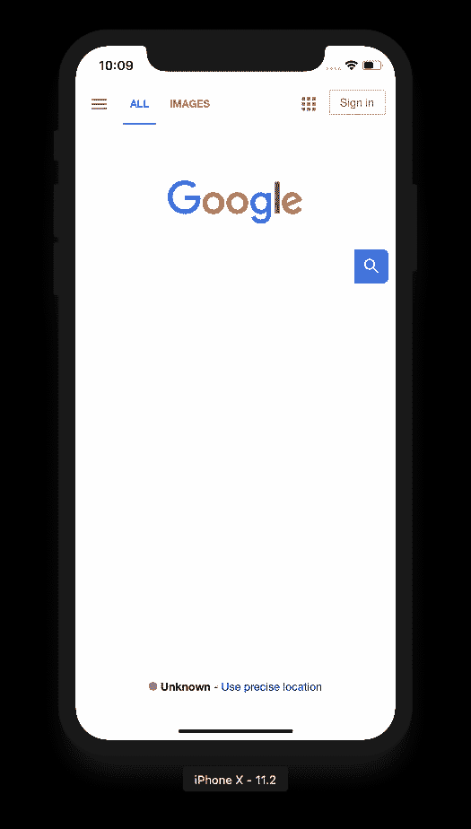
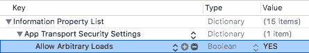

# 使用 WebKit 在 iOS 上操纵 JavaScript

> 原文：<https://medium.com/capital-one-tech/javascript-manipulation-on-ios-using-webkit-2b1115e7e405?source=collection_archive---------0----------------------->

作为 iOS 开发者，有时我们希望在我们的 iOS 应用中包含网络内容。我们可能希望从与本地应用程序版本配对的网站加载内容，或者我们可能希望让用户打开链接而不必打开另一个浏览器。在 iOS 8 之前，我们不得不使用笨重、内存泄露、难以调试的 [UIWebView](https://developer.apple.com/documentation/uikit/uiwebview) 。然而，在 iOS 8 之后，苹果弃用了 UIWebView 作为 [WKWebView](https://developer.apple.com/documentation/webkit/wkwebview) ，并引入了现代 [WebKit API](https://developer.apple.com/documentation/webkit) 。新框架极大地提高了向 iOS 应用程序添加网页内容的性能和灵活性，给了开发者更多的控制权和权力。它还极大地改善了与 JavaScript 的本地通信。

在这篇文章中，我将向您展示如何将脚本注入到您的网页中，并接收数据来做一些事情，如改变网页的背景或直接从 JavaScript 调用本机函数。

# WKWebView

WKWebView 于 2014 年 [WWDC 大会](https://developer.apple.com/videos/play/wwdc2014/206/)首次发布，它改变了在 iOS 应用中呈现网络内容的游戏规则。它利用核心动画和硬件加速，使网页能够以 60fps 的速度滚动。苹果的开发人员去掉了旧的 JavaScript 引擎，用 Nitro 取而代之——与 Safari 的引擎相同。它还包括与 Safari 相同的内置缩放和前后导航手势。也超级容易创作！让我们从一个简单的例子开始，看看 WKWebView 开箱后是什么样子。

您需要做的只是创建一个 WKWebView 对象，添加约束，并传入一个 URLRequest 来加载网页:

Initializing a basic WKWebView object

如果您在模拟器中运行这个程序，您应该会看到类似这样的内容:

请注意，您只能加载默认安全的 URL(即，仅 HTTPS 连接)。您可以将“应用传输安全设置”密钥添加到您的 Info.plist 中，以出于开发目的覆盖此密钥。然后，在应用传输安全设置下，添加密钥“允许任意加载”，并将其值设置为“是”:

这将绕过 HTTPS 要求，因此您可以使用本地主机或 HTTP 连接进行测试。但是，请记住，这仅意味着用于开发，而不是用于生产。你应该始终遵守苹果的安全标准，通过行业标准协议安全地加载网页内容。

# WKUserContentController

因此，我们只用了几行代码就在应用程序中加载了网络内容。如果我们想修改应用程序中的网页，该怎么办？我们可以像以前一样实例化一个 WKWebView 对象，但是这次传入一个类型为 [WKWebViewConfiguration](https://developer.apple.com/documentation/webkit/wkwebviewconfiguration) 的新配置对象:

Initialize WKWebView with Configuration

在这里，当 web 视图被初始化时，有一大堆属性可以修改。例如，您可以控制页面是否以增量方式呈现，播放前哪些媒体类型需要触摸手势，HTML5 视频是否可以画中画显示，或者如何与加载的脚本进行通信。WKWebViewConfiguration 有一个名为 userContentController 的属性，它允许您传入一个 [WKUserContentController](https://developer.apple.com/documentation/webkit/wkusercontentcontroller) 对象。该对象使用 [addUserScript(_:)](https://developer.apple.com/documentation/webkit/wkusercontentcontroller/1537448-adduserscript) 注入 JavaScript，并通过 [add(_:name:)](https://developer.apple.com/documentation/webkit/wkusercontentcontroller/1537172-add) 监听消息处理程序。如果你是一名网络开发人员，这类似于浏览器插件如 [Chrome extensions](https://developer.chrome.com/extensions/getstarted) 对加载的网络内容所做的事情。

# 用户脚本

当添加到 userContentController 时， [WKUserScript](https://developer.apple.com/documentation/webkit/wkuserscript) 对象允许开发人员将 JavaScript 注入到网页中。下面是一个简单的例子，添加一个脚本来改变上面的 Google 网页的背景颜色:

Creating a User Script to Change Background Color

init 方法接受三个参数:

1.  *source* :传入 JavaScript 的字符串表示作为源代码。
2.  *injectionTime* :指定 JavaScript 是在文档开始加载还是在文档结束加载。如果您传入[wkuserinjectiontime . atdocumentstart](https://developer.apple.com/documentation/webkit/wkuserscriptinjectiontime/1537575-atdocumentstart)，您的脚本将在文档元素创建之后、任何文档解析之前运行。如果您传入[wkuserinjectiontime . atdocumentend](https://developer.apple.com/documentation/webkit/wkuserscriptinjectiontime/1537798-atdocumentend)，那么您的脚本将在文档解析完成之后、任何子资源(例如，图像)加载之前运行。这对应于触发 DOMContentLoaded 事件的时间。
3.  *forMainFrameOnly* :指定你的脚本是在所有框架中运行还是只在主框架中运行。

对于您的源代码，您可以简单地传入一个字符串，或者，如果脚本更复杂，从 Xcode 中的本地文件加载它。为此，将您的 JavaScript 文件添加到 Xcode，获取文件的路径，并用文件的内容初始化一个字符串:

Load JavaScript from a local file

这是一个在初始化时向 web 视图添加基本用户脚本的简要概述。你还可以写一个用户脚本来做什么？它可以做网页上普通脚本能做的任何事情——修改文档结构、监听 onload 等事件、加载外部资源(例如，图像、XMLHTTP 请求)。它还可以使用脚本消息通过 [WKScriptMessageHandler](https://developer.apple.com/documentation/webkit/wkscriptmessagehandler) 协议与您的应用程序进行通信。

# 编写消息脚本

虽然用户脚本可以让您将 JavaScript 代码注入到网页中，但脚本消息可以让您从 JavaScript 调用本机代码。为此，在 iOS 端有几个步骤:

1.  对于每个要添加的处理程序，调用 WKUserContentController 对象上的 [add(_:name:)](https://developer.apple.com/documentation/webkit/wkusercontentcontroller/1537172-add) 。name 参数在后面会很重要。
2.  让您的视图控制器符合 WKScriptMessageHandler 协议。
3.  实现所需的功能[userContentController(_:did receive:)](https://developer.apple.com/documentation/webkit/wkscriptmessagehandler/1396222-usercontentcontroller)。

消息处理程序是一个侦听器，一旦某个 JavaScript 事件完成，它将触发并返回数据。例如，您可以使用一个处理程序来解析从 URL 获取的 JSON 数据。通过将这些消息处理程序包含到您的 WKUserContentController 对象中，您的 web 视图将定义一个新的函数 window . WebKit . message handlers .*name*。可以在所有框架中调用的 postMessage( *messageBody* )。下面是一个添加名为“test”的消息处理程序的简单示例，当在脚本标记中调用该处理程序时，它将输出“Hello，world！”：

Add a simple message handler to print Hello, world!

然后，您的 JavaScript 应该在某处包含以下调用:

Add postMessage() call inside JavaScript code

对于消息体，你可以发布任何你喜欢的 JSON 对象，你的 iOS 应用程序会将其捕获为一个 [WKScriptMessage](https://developer.apple.com/documentation/webkit/wkscriptmessage) 对象，然后*会自动将 JSON 对象转换为原生 Swift 类型*。例如，如果您传递如下所示的 JSON

Example JSON for WKScriptMessage Object

…您可以通过如下类型转换获得年龄:

Parsing an example JSON object from postMessage() call

超级爽！

虽然这在大多数情况下都可以完美地工作，但是 Apple 可能会将您的 JSON 对象转换成您可能不会想到的本机类型。根据[苹果的文档](https://developer.apple.com/documentation/webkit/wkscriptmessage/1417901-body)，*允许的类型有*[*ns number*](https://developer.apple.com/documentation/foundation/nsnumber)*，*[*ns string*](https://developer.apple.com/documentation/foundation/nsstring)*，*[*ns date*](https://developer.apple.com/documentation/foundation/nsdate)*，*[*ns array**，*](https://developer.apple.com/documentation/foundation/nsarray) [*NSDictionary*这意味着，例如，布尔类型将被转换为 0 表示假，1 表示真。](https://developer.apple.com/documentation/foundation/nsdictionary)

# 高级 JavaScript 用法

将 window.webkit.messageHandler 函数添加到 JavaScript 代码中是非常巧妙的，对吗？我们可以做得更好。

假设您想同时创建一个 iOS 和 Android 应用程序，这两个应用程序加载相同的网页和相同的 JavaScript 代码。如果包含这些消息处理函数的 JavaScript 被加载到除了 WKWebView 对象之外的任何地方，它都不会编译(你可以尝试在 Chrome 浏览器中加载它，你会得到一个错误)。这意味着你需要为 iOS 和 Android 分别编写特定的 JavaScript 代码。不是很干，是吗？相反，如果我们将消息处理函数直接注入到 init 上的网页中会怎么样呢？这样，我们可以重复使用相同的网页，而不会重复，并将客户端与服务器分离。下面是从上面注入相同消息处理程序的示例，但这次是通过用户脚本注入的:

Inject example postMessage() call

如果一切顺利，您应该会看到 Xcode 的控制台打印“Hello，world！”你可以在这里看到这个[的工作演示。](https://github.com/rckim77/WKWebViewDemoApp)

这仅仅触及了用户脚本和消息处理程序的皮毛。我甚至用这种方法从 JavaScript 库中创建了自己的本地回调，方法是将消息处理程序注入回调函数，并将数据转发给我的应用程序。天空是无限的！

# 结论

WebKit 为 iOS 开发人员提供了一套强大的工具，可以在本地应用程序的 webview 中直接操作 JavaScript，而无需关注样板代码。您可以使用用户脚本在一行代码中直接在网页中注入 JavaScript。您还可以通过遵循 WKScriptMessageHandler 协议、添加消息处理程序的名称并实现 userContentController(_:did receive:)，从 JavaScript 向您的应用程序发送数据。

在你的 iOS 应用中，你可以用 JavaScript 做很多事情，甚至不仅仅是加载网页内容。如果你想继续探索，我建议阅读苹果的 [JavaScriptCore](https://developer.apple.com/documentation/javascriptcore) 框架，用于在你的应用程序中直接运行 JavaScript(参考消息，这在一定程度上是 React Native 等框架的动力所在),以及最近添加的 [SFSafariViewController](https://developer.apple.com/documentation/safariservices/sfsafariviewcontroller) ，用于模仿 Safari 的用户体验，具有自动填充、欺诈网站检测等功能。

我希望你对 WebKit 有所了解——感谢阅读！

*声明:这些观点仅代表作者个人观点。除非本帖中另有说明，否则 Capital One 不属于所提及的任何公司，也不被其认可。使用或展示的所有商标和其他知识产权都是其各自所有者的所有权。本文为 2018 首都一。*