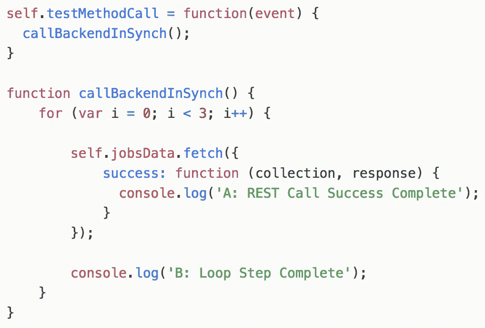
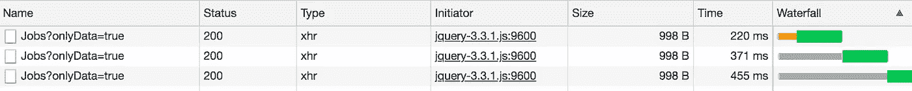
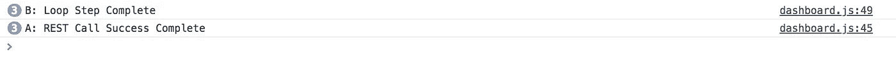
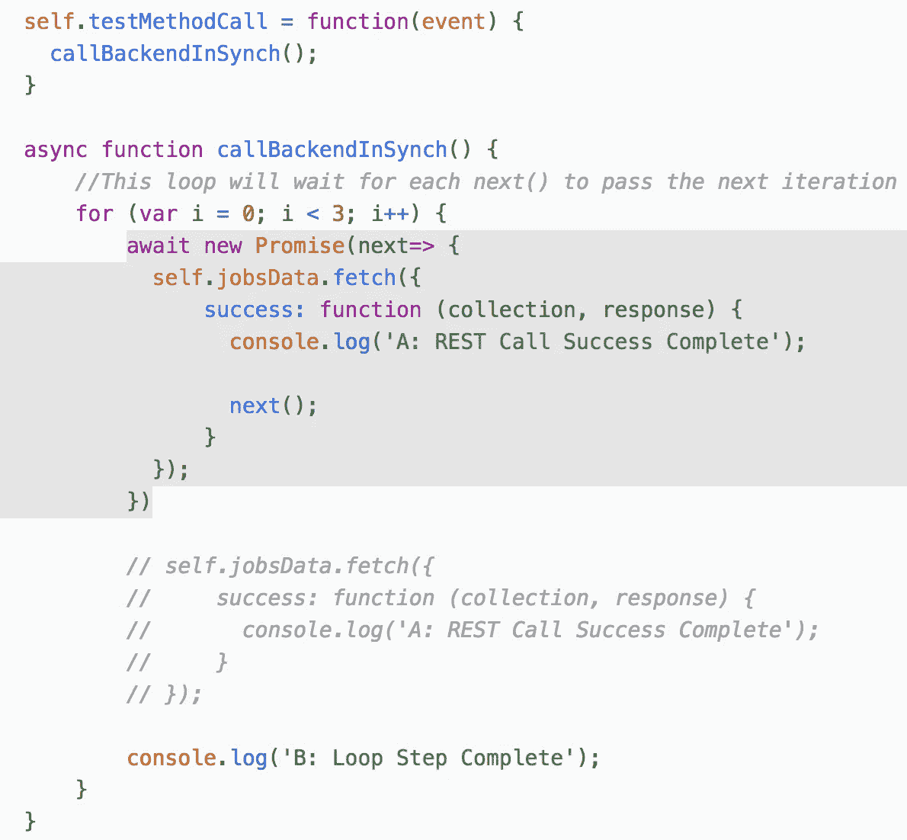
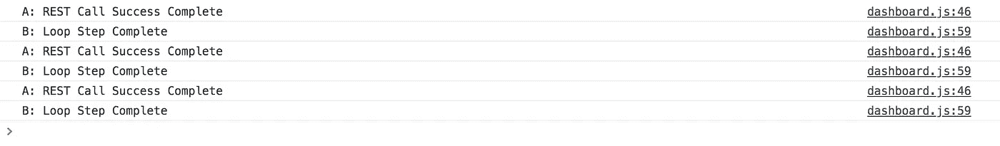

# JavaScript —在顺序循环中调用后端逻辑的方法

> 原文：<https://medium.com/oracledevs/javascript-method-to-call-backend-logic-in-sequential-loop-4c2c627c6783?source=collection_archive---------0----------------------->

当我们从 JavaScript 调用后端 REST 服务时，默认情况下调用是异步执行的。这意味着它不会等到收到后端的响应，而是继续执行代码。在大多数情况下，这是预期的和期望的功能。但这可能是一个需求，你想以同步的方式调用后端。示例—在循环中多次调用后端服务，只有在前一个调用完成后才能调用下一个调用。使用默认异步功能，循环将在第一次 REST 调用之前完成。

下面是调用后端 REST 服务的例子(通过 Oracle JET API，在后台使用 JQuery)。呼叫进行了三次，成功的回叫打印了一条消息。在每次循环迭代结束时，还会打印一条消息:

循环中执行了三个后端 REST 调用:

从第一次迭代开始，循环比 REST 调用早完成，我们可以从日志中看到这一点:

对于大多数情况，这可能是有效的和预期的行为。但是根据后端逻辑，您可能希望保证在第一次迭代调用未完成之前，不会调用第二次迭代的调用。这可以通过指定异步函数和在循环中使用 Promise 来实现。我们应该使用*等待新的承诺*语法，并通过调用 *next()* 在成功回调中解决它:

随着 promise 的应用，循环按顺序执行——只有在调用后端服务成功回调之后，才开始下一个循环迭代。您可以从日志中看到:

源代码可以在我的 GutHub [库](https://github.com/abaranovskis-redsamurai/synchloopapp/blob/master/src/js/viewModels/dashboard.js)上找到。

*原载于 2018 年 6 月 21 日*[*andrejusb.blogspot.com*](https://andrejusb.blogspot.com/2018/06/javascript-method-to-call-backend-logic.html)*。*