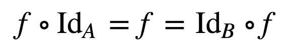
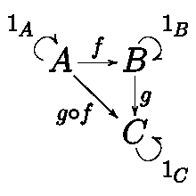

# JavaScript 单子变得简单

> 原文：<https://medium.com/javascript-scene/javascript-monads-made-simple-7856be57bfe8?source=collection_archive---------0----------------------->


Smoke Art Cubes to Smoke — MattysFlicks — (CC BY 2.0)

> **注:**这是《作曲软件》系列 **s** [**(现在一本书！)**](https://leanpub.com/composingsoftware) 关于从基础开始学习 JavaScript ES6+中的函数式编程和组合软件技术。敬请关注。还会有更多这样的事情发生！
> [<上一部](/javascript-scene/composable-datatypes-with-functions-aec72db3b093) | < < [从第一部开始](/javascript-scene/composing-software-an-introduction-27b72500d6ea)

在开始学习单子之前，你应该已经知道:

*   功能组成:`compose(f, g)(x) = (f ∘ g)(x) = f(g(x))`
*   仿函数基础:对数组`.map()`操作的理解。

> “一旦你理解了单子，你马上就变得无法向任何人解释它们了。”

> “霍尼克博士过去常说，任何不能向一个 8 岁的孩子解释自己在做什么的科学家都是骗子。”~库尔特·冯内古特的小说《猫的摇篮》

如果你在互联网上搜索“单子”，你将会受到令人费解的范畴理论数学的轰炸，还有一群人用墨西哥卷饼和宇航服来“有益地”解释单子。

单子很简单。行话很难。让我们切入本质。

一个**单子**是一种组合函数的方式，这些函数除了返回值之外还需要上下文，例如计算、分支或 I/O。单子类型提升、展平和映射，以便这些类型为提升函数`a => M(b)`排队，使它们可组合。这是从某种类型`a`到某种类型`b`的映射以及一些计算上下文，隐藏在提升、展平和映射的实现细节中:

*   功能图:`a => b`
*   带上下文的仿函数映射:`Functor(a) => Functor(b)`
*   单子展平并与上下文映射:`Monad(Monad(a)) => Monad(b)`

但是“扁平化”、“地图”、“语境”是什么意思呢？

*   **映射**的意思是，“对一个`a`应用一个函数，返回一个`b`”。给定一些输入，返回一些输出。
*   **上下文**是单子合成的计算细节(包括提升、展平和贴图)。Functor/Monad API 及其工作方式提供了允许您将 Monad 与应用程序的其余部分组合在一起的上下文。函子和单子的要点是把上下文抽象出来，这样我们在构造东西的时候就不用担心它了。上下文内的映射意味着将函数从`a => b`应用到上下文内的值，并返回包装在同类上下文内的新值`b`。左边的可观测量？右边的可观测量:`Observable(a) => Observable(b)`。数组在左边？右侧数组:`Array(a) => Array(b)`。
*   **类型提升**意味着将一个类型提升到一个上下文中，用一个 API 来支持这个值，你可以用它来计算这个值，触发上下文计算，等等……`a => F(a)`(单子是一种函子)。
*   **展平**意味着从上下文中展开值。`F(a) => a`。

示例:

```
const x = 20;             // Some data of type `a`
const f = n => n * 2;     // A function from `a` to `b`
const arr = Array.of(x);  // The type lift.
// JS has type lift sugar for arrays: [x]// .map() applies the function f to the value x
// in the context of the array.
const result = arr.map(f); // [40]
```

在这种情况下，`Array`是上下文，`x`是我们要映射的值。

这个例子没有包括数组的数组，但是你可以用`.flat()`或者`.concat()`在 JS 中展平数组:

```
[[1], [2, 3], [4]].flat(); // [1, 2, 3, 4] or
[].concat.apply([], [[1], [2, 3], [4]]); // [1, 2, 3, 4]
```

# 你可能已经在用单子了。

不管你的技能水平或对范畴理论的理解如何，使用单子会使你的代码更容易处理。未能利用单子可能会使您的代码更难处理(例如，回调地狱、嵌套的条件分支、更多的冗长)。

记住，软件开发的本质是合成，单子让合成更容易。再看看单子的本质是什么:

*   Functions map: `a => b`，它允许您编写`a => b`类型的函数
*   仿函数与上下文映射:`Functor(a) => Functor(b)`，这让您可以组合函数`F(a) => F(b)`
*   单子展平并映射上下文:`Monad(Monad(a)) => Monad(b)`，这让您可以编写提升函数`a => F(b)`

这些都只是**功能组合**的不同表达方式而已。函数存在的全部原因是你可以组合它们。函数可以帮助您将复杂的问题分解成更容易单独解决的简单问题，这样您就可以用各种方式将它们组合起来，形成您的应用程序。

理解函数及其正确使用的关键是更深入地理解函数的组成。

函数组合创建了数据流经的函数管道。你在管道的第一阶段输入一些数据，然后一些数据从管道的最后一个阶段出来，经过转换。但是要做到这一点，管道的每个阶段都必须期望前一阶段返回的数据类型。

编写简单的函数很容易，因为所有类型都很容易排列。只需将输出类型`b`与输入类型`b`匹配，您就可以开始工作了:

```
g:           a => b
f:                b => c
h = f(g(a)): a    =>   c
```

如果你在映射`F(a) => F(b)`，用仿函数组合也很容易，因为类型是一致的:

```
g:             F(a) => F(b)
f:                     F(b) => F(c)
h = f(g(Fa)):  F(a)    =>      F(c)
```

但是如果你想从`a => F(b)`、`b => F(c)`等等中合成函数，你需要单子。让我们把`F()`换成`M()`来说明这一点:

```
g:                  a => M(b)
f:                       b => M(c)
h = composeM(f, g): a    =>   M(c)
```

哎呀。在本例中，*组件函数类型没有对齐！*对于`f`的输入，我们想要类型`b`，但是我们得到的是类型`M(b)`(一个`b`的单子)。由于这种错位，`composeM()`需要解开`g`返回的`M(b)`，这样我们就可以将它传递给`f`，因为`f`期待的是类型`b`，而不是类型`M(b)`。该过程(通常称为`.bind()`或`.chain()`)是*展平*和*映射*发生的地方。

在将`b`传递给下一个函数之前，它从`M(b)`中解开`b`,这导致:

```
g:             a => M(b) flattens to => b
f:                                      b           maps to => M(c)
h composeM(f, g):
               a       flatten(M(b)) => b => map(b => M(c)) => M(c)
```

单子将类型排列成提升函数`a => M(b)`，这样你就可以组合它们。

在上图中，来自`M(b) => b`的`flatten`和来自`b => M(c)`的地图发生在来自`a => M(c)`的`chain`内。在`composeM()`内部处理`chain`调用。在高水平上，你不用担心。您可以使用与编写普通函数相同的 API 来编写单子返回函数。

单子是必需的，因为许多函数不是来自`a => b`的简单映射。一些函数需要处理副作用(承诺、流)、处理分支(可能)、处理异常(两者之一)等...

这里有一个更具体的例子。如果您需要从异步 API 获取一个用户，然后将该用户数据传递给另一个异步 API 来执行一些计算，该怎么办？：

```
getUserById(id: String) => Promise(User)
hasPermision(User) => Promise(Boolean)
```

让我们写一些函数来演示这个问题。第一，公用事业，`compose()`和`trace()`:

```
const compose = (...fns) => x => fns.reduceRight((y, f) => f(y), x);const trace = label => value => {
  console.log(`${ label }: ${ value }`);
  return value;
};
```

然后是一些功能组合:

```
{
  const label = 'API call composition'; // a => Promise(b)
  const getUserById = id => id === 3 ?
    Promise.resolve({ name: 'Kurt', role: 'Author' }) :
    undefined
  ; // b => Promise(c)
  const hasPermission = ({ role }) => (
    Promise.resolve(role === 'Author')
  ); // Try to compose them. Warning: this will fail.
  const authUser = compose(hasPermission, getUserById); // Oops! Always false!
  authUser(3).then(trace(label));
}
```

当我们试图将`hasPermission()`与`getUserById()`组合成`authUser()`时，我们遇到了一个大问题，因为`hasPermission()`期待一个`User`对象，却得到了一个`Promise(User)`。为了解决这个问题，我们需要用`composePromises()`替换`compose()`——compose 的一个特殊版本，它知道需要使用`.then()`来完成函数组合:

```
{
  const composeM = chainMethod => (...ms) => (
    ms.reduce((f, g) => x => g(x)[chainMethod](f))
  ); const composePromises = composeM('then'); const label = 'API call composition'; // a => Promise(b)
  const getUserById = id => id === 3 ?
    Promise.resolve({ name: 'Kurt', role: 'Author' }) :
    undefined
  ; // b => Promise(c)
  const hasPermission = ({ role }) => (
    Promise.resolve(role === 'Author')
  ); // Compose the functions (this works!)
  const authUser = composePromises(hasPermission, getUserById); authUser(3).then(trace(label)); // true
}
```

稍后，我们将进入`composeM()`正在做什么。

记住单子的本质:

*   功能图:`a => b`
*   带上下文的仿函数映射:`Functor(a) => Functor(b)`
*   单子展平并与上下文映射:`Monad(Monad(a)) => Monad(b)`

在这种情况下，我们的单子实际上是承诺，所以当我们构造这些承诺返回函数时，我们有一个`Promise(User)`而不是`hasPermission()`所期望的`User`。注意，如果你去掉了`Monad(Monad(a))`的外层`Monad()`包装，你会剩下`Monad(a) => Monad(b)`，它只是常规的仿函数`.map()`。如果我们有可以弄平的东西，我们就可以做生意了。

# 单子是由什么组成的

单子基于一种简单的对称——一种将值包装到上下文中的方法，以及一种从上下文中解开值的方法:

*   **提升/单位:**一个类型从某个类型提升到单子上下文:`a => M(a)`
*   **展平/合并:**从上下文中展开类型:`M(a) => a`

由于单子也是函子，它们也可以映射:

*   **地图:**保留上下文的地图:`M(a) -> M(b)`

将 flatten 与 map 结合起来，您可以得到单子提升函数的链式函数合成，也称为 Kleisli 合成，以 [Heinrich Kleisli](https://en.wikipedia.org/wiki/Heinrich_Kleisli) 命名:

*   **平面贴图/链:**展平+贴图:`M(M(a)) => M(b)`

对于单子，`.map()`方法经常从公共 API 中省略。Lift + flatten 不要明确拼出`.map()`，但是你有了制作它所需的所有成分。如果你能解除(又名 of/unit)和锁链(又名 bind/flatMap)，你就可以制造`.map()`:

```
const MyMonad = value => ({
  // <... insert arbitrary chain and of here ...>
  map (f) {
    return this.chain(a => this.constructor.of(f(a)));
  }
});
```

所以，如果你为你的单子定义了`.of()`和`.chain()` / `.join()`，就可以推断出`.map()`的定义。

电梯是工厂/建造者和/或`constructor.of()`方法。在范畴论里叫“单位”。它所做的只是将类型提升到单子的上下文中。它将一个`a`变成一个`a`的`Monad`。

在 Haskell 中，它(非常容易混淆)被称为`return`，当你试图大声谈论它时，它会变得非常混乱，因为几乎每个人都会把它与函数返回混淆。我在散文中几乎总是称之为“提升”或“类型提升”，在代码中则称之为`.of()`。

那个展平过程(在`.chain()`中没有地图)通常被称为`flatten()`或`join()`。经常(但不总是)，`flatten()` / `join()`被完全省略，因为它内置在`.chain()/.flatMap()`中。展平通常与构图联系在一起，所以它经常与贴图结合在一起。记住，展开+贴图都是组成`a => M(a)`函数所需要的。

根据你正在处理的单子的类型，展开过程可能非常简单。在身份单子的情况下，它就像`.map()`，除了你没有把结果值提升回单子上下文。其效果是丢弃了一层包装:

```
{ // Identity monad
const Id = value => ({
  // Functor mapping
  // Preserve the wrapping for .map() by 
  // passing the mapped value into the type
  // lift:
  map: f => Id.of(f(value)), // Monad chaining
  // Discard one level of wrapping
  // by omitting the .of() type lift:
  chain: f => f(value), // Just a convenient way to inspect
  // the values:
  toString: () => `Id(${ value })`
});// The type lift for this monad is just
// a reference to the factory.
Id.of = Id;
```

但是展开部分也是副作用、错误分支或等待异步 I/O 等奇怪事情通常隐藏的地方。在所有的软件开发中，组合是所有真正有趣的事情发生的地方。

比如有了承诺，`.chain()`就叫`.then()`。呼叫`promise.then(f)`不会马上调用`f()`。相反，它会等待承诺解决，然后*再*调用`f()`(因此得名)。

示例:

```
{
  const x = 20;                 // The value
  const p = Promise.resolve(x); // The context
  const f = n => 
    Promise.resolve(n * 2);     // The function const result = p.then(f);     // The application result.then(
    r => console.log(r)         // 40
  );
}
```

有了承诺，就用`.then()`代替`.chain()`，但是*几乎*一样的东西。

你可能听说过承诺严格来说不是单子。这是因为，只有当价值一开始就是一个承诺时，它才会打开外在的承诺。否则，`.then()`的行为类似于`.map()`。

但是因为它对于承诺值和其他值的表现不同，`.then()`并不严格遵守所有函子和/或单子对于所有给定值必须满足的所有数学定律。在实践中，只要你意识到了行为分支，你通常可以把它们当作两者之一。请注意，一些通用的合成工具可能不会像承诺的那样工作。

# 建筑单体(又名 Kleisli)组成

让我们更深入地看看我们用来构建承诺提升函数的`composeM`函数:

```
const composeM = method => (...ms) => (
  ms.reduce((f, g) => x => g(x)[method](f))
);
```

隐藏在那个怪异的 reducer 里的是函数合成的代数定义:`f(g(x))`。让我们更容易发现:

```
{
  // The algebraic definition of function composition:
  // (f ∘ g)(x) = f(g(x))
  const compose = (f, g) => x => f(g(x)); const x = 20;    // The value
  const arr = [x]; // The container // Some functions to compose
  const g = n => n + 1;
  const f = n => n * 2; // Proof that .map() accomplishes function composition.
  // Chaining calls to map is function composition.
  trace('map composes')([
    arr.map(g).map(f),
    arr.map(compose(f, g))
  ]);
  // => [42], [42]
}
```

这意味着我们可以编写一个通用的 compose 实用程序，它应该适用于所有提供`.map()`方法的函子(例如，数组):

```
const composeMap = (...ms) => (
  ms.reduce((f, g) => x => g(x).map(f))
);
```

这只是标准`f(g(x))`的一个微小的变化。给定任意数量的类型为`a -> Functor(b)`的函数，遍历每个函数，并将每个函数应用于其输入值`x`。`.reduce()`方法采用一个带有两个输入值的函数:一个累加器(本例中为`f`)和数组中的当前项(`g`)。

我们返回一个新函数`x => g(x).map(f)`，它在下一个应用程序中变成了`f`。上面我们已经证明了`x => g(x).map(f)`等价于将`compose(f, g)(x)`提升到函子的上下文中。换句话说，这相当于将`f(g(x))`应用于容器中的值:在这种情况下，这将组合应用于数组内部的值。

> 性能警告:我不建议对数组这样做。以这种方式组合函数需要对整个数组(可能包含成千上万的项)进行多次迭代。对于数组上的映射，首先构建简单的`a -> b`函数，然后在数组上映射一次，或者用`.reduce()`或传感器优化迭代。

对于基于数组数据的同步、急切的函数应用程序来说，这是多余的。然而，许多事情是异步的或懒惰的，许多函数需要处理混乱的事情，比如异常或空值的分支。

这就是单子出现的原因。单子可以依赖于值，这些值依赖于组合链中以前的异步或分支动作。在这些情况下，你不能从简单的函数组合中得到一个简单的值。你的单子返回动作以`a => Monad(b)`的形式出现，而不是`a => b`。

每当你有一个函数获取一些数据，点击一个 API，并返回一个相应的值，而另一个函数获取该数据，点击另一个 API，并返回对该数据的计算结果时，你会想要组合类型为`a => Monad(b)`的函数。因为 API 调用是异步的，所以您需要将返回值包装在某种东西中，比如 promise 或 observable。换句话说，这些函数的签名分别是`a -> Monad(b)`和`b -> Monad(c)`。

组合`g: a -> b`、`f: b -> c`类型的函数很容易，因为这些类型排成一行:`h: a -> c`就是`a => f(g(a))`。

组合`g: a -> Monad(b)`、`f: b -> Monad(c)`类型的函数稍微难一点:`h: a -> Monad(c)`不仅仅是`a => f(g(a))`，因为`f`期待的是`b`，而不是`Monad(b)`。

让我们更具体地构建一对异步函数，每个函数返回一个承诺:

```
{
  const label = 'Promise composition'; const g = n => Promise.resolve(n + 1);
  const f = n => Promise.resolve(n * 2); const h = composePromises(f, g); h(20)
    .then(trace(label))
  ;
  // Promise composition: 42
}
```

我们如何编写`composePromises()`以便正确记录结果？提示:你已经看过了。

还记得我们的`composeMap()`功能吗？你所需要做的就是把电话从`.map()`改成`.then()`。`Promise.then()`基本上是异步的`.map()`。

```
{
  const composePromises = (...ms) => (
    ms.reduce((f, g) => x => g(x).then(f))
  ); const label = 'Promise composition'; const g = n => Promise.resolve(n + 1);
  const f = n => Promise.resolve(n * 2); const h = composePromises(f, g); h(20)
    .then(trace(label))
  ;
  // Promise composition: 42
}
```

奇怪的是，当你点击第二个函数`f`(记住， `g`后的`f`)时，输入的值是一个承诺。不是`b`型，是`Promise(b)`型，但是`f`带`b`型，没包装。这是怎么回事？

在`.then()`内部，有一个从`Promise(b) -> b`开始的解包过程。该操作被称为`join`或`flatten`。

你可能已经注意到`composeMap()`和`composePromises()`几乎是相同的功能。这是可以处理这两种情况的高阶函数的完美用例。让我们将 chain 方法混合到一个 curried 函数中，然后使用方括号符号:

```
const composeM = method => (...ms) => (
  ms.reduce((f, g) => x => g(x)[method](f))
);
```

现在，我们可以像这样编写专门的实现:

```
const composePromises = composeM('then');
const composeMap = composeM('map');
const composeFlatMap = composeM('flatMap');
```

# 单子定律

在你开始构建你自己的单子之前，你需要知道所有单子都应该满足三个定律:

1.  左侧标识:`unit(x).chain(f) ==== f(x)`
2.  权利身份:`m.chain(unit) ==== m`
3.  关联性:`m.chain(f).chain(g) ==== m.chain(x => f(x).chain(g))`

# 身份法则



Left and right identity

单子是函子。函子是范畴之间的态射，`A -> B`。态射由箭头表示。除了我们在对象之间明确看到的箭头之外，类别中的每个对象也有一个指向自身的箭头。换句话说，对于类别中的每个对象`X`，都存在一个箭头`X -> X`。这个箭头被称为身份箭头，它通常被绘制成一个小的圆形箭头，从一个对象指向另一个对象。



Identity morphisms

# 结合性

结合律只是意味着当我们组合时，括号放在哪里并不重要。例如，如果您正在添加，`a + (b + c)`与`(a + b) + c`相同。函数组合也是如此:`(f ∘ g) ∘ h = f ∘ (g ∘ h)`。

克莱斯利作文也是如此。你只需要倒着读。当你看到复合运算符(`chain`)时，想想`after`:

```
h(x).chain(x => g(x).chain(f)) ==== (h(x).chain(g)).chain(f)
```

# 证明单子定律

让我们证明单位单子满足单子定律:

```
{ // Identity monad
  const Id = value => ({
    // Functor mapping
    // Preserve the wrapping for .map() by 
    // passing the mapped value into the type
    // lift:
    map: f => Id.of(f(value)), // Monad chaining
    // Discard one level of wrapping
    // by omitting the .of() type lift:
    chain: f => f(value), // Just a convenient way to inspect
    // the values:
    toString: () => `Id(${ value })`
  }); // The type lift for this monad is just
  // a reference to the factory.
  Id.of = Id; const g = n => Id(n + 1);
  const f = n => Id(n * 2); // Left identity
  // unit(x).chain(f) ==== f(x)
  trace('Id monad left identity')([
    Id(x).chain(f),
    f(x)
  ]);
  // Id monad left identity: Id(40), Id(40) // Right identity
  // m.chain(unit) ==== m
  trace('Id monad right identity')([
    Id(x).chain(Id.of),
    Id(x)
  ]);
  // Id monad right identity: Id(20), Id(20) // Associativity
  // m.chain(f).chain(g) ====
  // m.chain(x => f(x).chain(g)  
  trace('Id monad associativity')([
    Id(x).chain(g).chain(f),
    Id(x).chain(x => g(x).chain(f))
  ]);
  // Id monad associativity: Id(42), Id(42)
}
```

# 结论

单子是一种组合类型提升函数的方式:`g: a => M(b)`，`f: b => M(c)`。为此，单子必须在应用`f()`之前将`M(b)`展平为`b`。换句话说，函子是可以映射的东西。单子是可以平面映射的东西:

*   功能图:`a => b`
*   带上下文的仿函数映射:`Functor(a) => Functor(b)`
*   单子展平并与上下文映射:`Monad(Monad(a)) => Monad(b)`

单子基于一种简单的对称——一种将值包装到上下文中的方法，以及一种从上下文中解开值的方法:

*   Lift/Unit:从某个类型到单子上下文的类型提升:`a => M(a)`
*   拼合/连接:从上下文中展开类型:`M(a) => a`

由于单子也是函子，它们也可以映射:

*   地图:保留上下文的地图:`M(a) -> M(b)`

将 flatten 与 map 结合起来，您可以获得提升函数的链式函数合成，也称为 Kleisli 合成:

*   平面贴图/链平面+贴图:`M(M(a)) => M(b)`

单子必须满足三个定律(公理)，统称为单子定律:

*   左身份:`unit(x).chain(f) ==== f(x)`
*   权利身份:`m.chain(unit) ==== m`
*   关联性:`m.chain(f).chain(g) ==== m.chain(x => f(x).chain(g)`

您可能在每天的 JavaScript 代码中遇到的单子的例子包括承诺和可观察到的。Kleisli composition 允许您编写数据流逻辑，而不用担心数据类型 API 的细节，也不用担心可能的副作用、条件分支或隐藏在`chain()`操作中的展开计算的其他细节。

这使得 monads 成为简化代码的一个非常强大的工具。您不必了解或担心单子内部发生了什么来获得单子可以提供的简化好处，但是现在您对引擎盖下的东西有了更多的了解，窥视引擎盖下的东西并不是一件可怕的事情。

没必要害怕莫纳德格林夫人的诅咒。

# 通过实时 1:1 辅导提升您的技能

DevAnywhere 是达到高级 JavaScript 技能的最快方法:

*   现场课程
*   弹性工时
*   一对一指导
*   构建真正的生产应用

[](https://devanywhere.io/)

[https://devanywhere.io/](https://devanywhere.io/)

***埃里克·艾略特*** *是* [*【编程 JavaScript 应用】*](http://pjabook.com) *(O'Reilly)的作者，也是*[*devanywhere . io*](https://devanywhere.io/)*的联合创始人。他为 Adobe Systems******尊巴健身*******华尔街日报*******【ESPN*******BBC****等顶级录音师贡献了软件经验******

**他和世界上最美丽的女人一起在任何他想去的地方工作。**