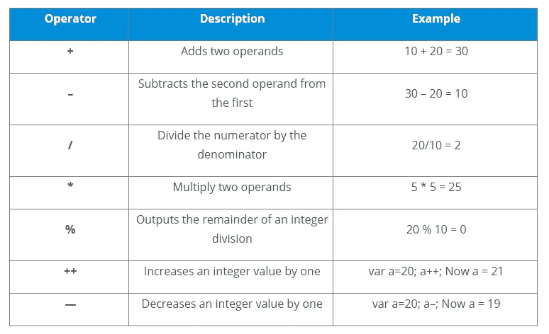
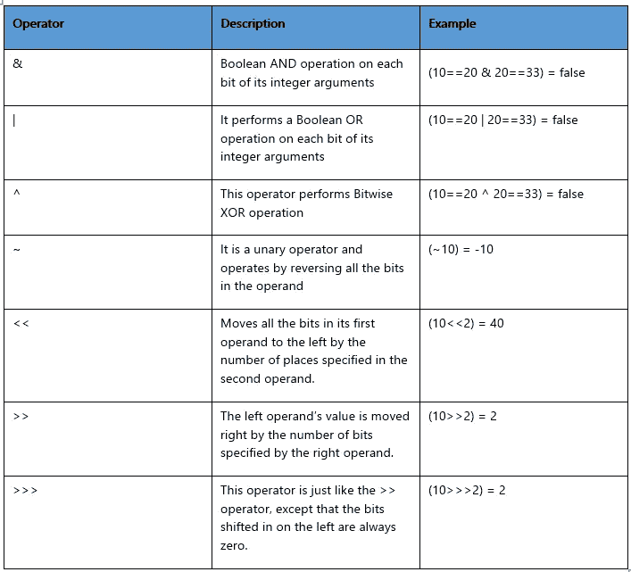
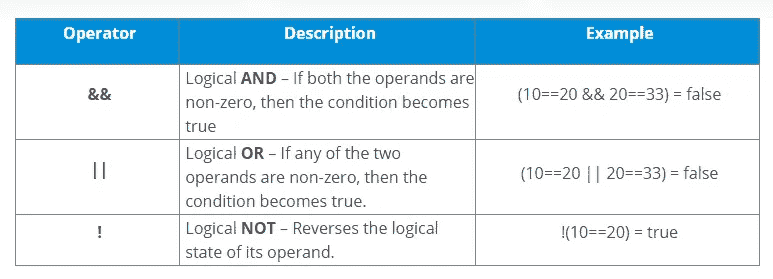
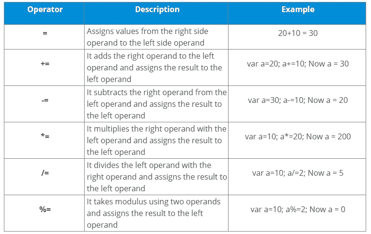

# JavaScript 运算符及其类型

> 原文：<https://medium.com/edureka/javascript-operators-and-its-types-74823cfef296?source=collection_archive---------2----------------------->

运算符用于操作某个值或操作数。运算符用于对操作数执行特定的数学和逻辑计算。在本文中，我们将按以下顺序讨论不同的 JavaScript 操作符以及它们在代码中的用法:

*   什么是运营商？
*   JavaScript 运算符的类型
*   算术运算符
*   比较运算符
*   按位运算符
*   逻辑运算符
*   赋值运算符

# 什么是运营商？

运算符用于比较值、执行算术运算等。比如我们拿一个简单的表达式来说，4 + 5 等于 9。这里的 4 和 5 称为操作数，而“+”称为运算符。JavaScript 由不同类型的操作符组成，用于执行不同的操作。

# JavaScript 运算符的类型

JavaScript 中有不同类型的运算符用于执行不同的操作。一些 JavaScript 运算符包括:

*   算术运算符
*   比较运算符
*   按位运算符
*   逻辑运算符
*   赋值运算符

# 算术运算符

算术运算符用于对操作数执行算术运算。以下是称为 JavaScript 算术运算符的运算符列表:

# 比较运算符

JavaScript 比较运算符比较两个操作数。比较运算符如下:

# 逻辑运算符

该列表提供了所有 JavaScript 逻辑运算符:

# 赋值运算符

赋值运算符用于给操作数赋值。以下运算符称为 JavaScript 赋值运算符:

这些是一些常见的 JavaScript 操作符及其定义和示例。说到这里，我们的文章就到此为止了。

如果你想查看更多关于人工智能、Python、道德黑客等市场最热门技术的文章，你可以参考 Edureka 的官方网站。

请留意本系列中的其他文章，它们将解释 Web 开发的各个方面。

> *1。* [*前端开发者技能*](/edureka/front-end-developer-skills-ebb32d19f488)
> 
> *2。* [*前端开发者简历*](/edureka/front-end-developer-resume-c3d443f98296)
> 
> *3。* [*Web 开发项目*](/edureka/web-development-projects-b01f0fe85d3f)

*原载于 2019 年 9 月 4 日 https://www.edureka.co**的* [*。*](https://www.edureka.co/blog/javascript-operators/)