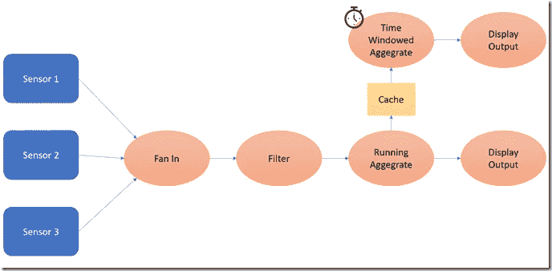
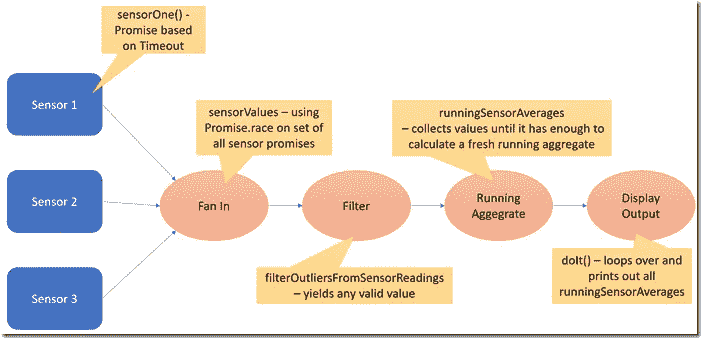
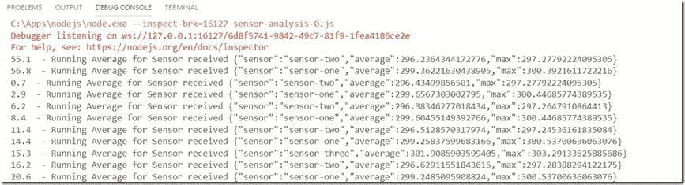
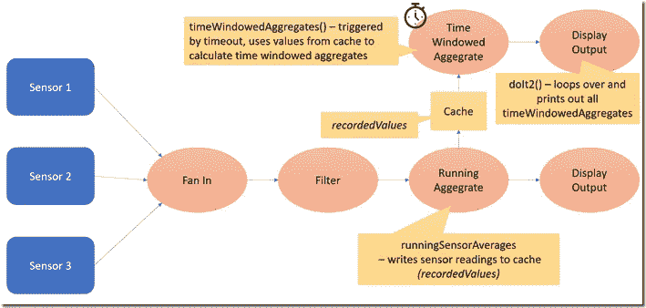
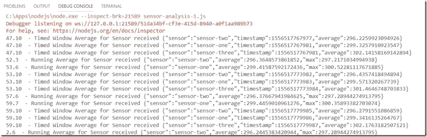

# 使用异步生成器实现运行聚合的 JavaScript 管道

> 原文：<https://medium.com/oracledevs/javascript-pipelining-using-asynchronous-generators-to-implement-running-aggregates-4c848fbdf5e1?source=collection_archive---------1----------------------->



截至 ES 2018(近期浏览器或 Node 10)，JavaScript 支持异步生成器。生成器是返回一组值的函数，一次返回一个值。这些值一旦可用，就可以在调用生成器的代码中进行处理。不需要先等待整个结果集被合成。在结果集很大甚至没有结尾的情况下，这非常方便。一个生成器函数的结果可以输入到另一个也可以是生成器函数的函数中。诸如此类。这使得流水线操作成为可能:一系列的功能一起工作(或多或少是并行的),通过一系列的处理步骤得到每个结果。

随着最近异步生成器的加入，生成结果集的生成器函数可能是异步的——依赖于收集其值的承诺示例。

在这篇文章中，我想展示这一切的美妙之处。我将分享一个简单的 ES 2018/Node 应用程序，它使用承诺异步产生值—由超时触发。三个承诺代表三个温度传感器；在这种情况下，只是简单地生成值。然而，这些承诺也可以从外部源读取值或使用传入事件。每一个承诺，当解决时，产生一个传感器读数。该承诺被包装在一个承诺中，该承诺将“传感器值”写入临时存储( *latestValue* )并将其自身从传感器池中移除——承诺集函数 sensorValues()正在等待使用 Promise.race([…sensorPool])



在异步生成器函数 sensorValues()中，我们在无限循环中等待一个或多个 sensorPromises 进行解析(Promise.race 解析为要解析的承诺集的第一个)。当这种情况发生时，产生*最新值*——当传感器承诺解决时写入。

另一个异步发电机功能——runningSensorAverages——由来自*传感器值*的产量触发(在 await(传感器读数的传感器读数)的循环*中)。生成的值添加到传感器图中当前传感器的值集合中。*刻度*的值增加； *ticks* 统计自上次运行聚合计算以来收到的值的数量。如果*滴答*的值等于*周期*的值(该参数指定在多少个值之后应该计算新的集合)，则使用当前传感器的值集合中的最后*窗口大小*值计算新的集合。产生计算的值(并重置刻度)。*

函数 doIt()接收生成的运行聚合。该函数将生成的值写入控制台——从另一个 *for await* 循环。

结果看起来像这样:



该应用程序的流水线特性可以通过下面一行得到最好的体现:

```
for await (runningAverage of runningSensorAverages(filterOutliersFromSensorReadings( sensorValues()), 15, 10)) {..}
```

来自 sensorValues()的流结果通过管道(一次一个读数)传递给过滤函数，该函数的输出传递给 runningSensorAverages，后者的输出作为 for await 循环中的后续值出现。

# 添加时间窗口聚合

现在，让我们添加时间窗口聚合:每 X 秒产生的平均值。

实现是使用缓存完成的，缓存是由 runningSensorAverages()写入的传感器读数的临时存储。函数 timeWindowedAggregates()由参数 *timeWindow* 指定的一段时间后的超时触发。当函数“醒来”时，它从缓存中读取当前内容，计算并得出平均值。



函数 doIt2()包含一个在生成器 timeWindowedAggregates()上的循环:await for(timeWindowedAggregates 的 timedWindowAggregate(6000))将平均值打印到控制台。

组合输出如下所示:



请注意，所有定时窗口平均值都是同时生成的(在传感器之间不同数量的读数上)，而运行总量是在不同时间生成的(在相同数量的读数上)。

扩展代码库:

# 资源

迭代 Promise.all 的部分结果—【https://agentcooper.io/iterate-promise-all/ 

JavaScript 数组-查找最小值、最大值、总和以及平均值-[https://code burst . io/JavaScript-Arrays-Finding-The-Minimum-Maximum-Sum-Average-Values-f 02 f1 b 0ce 332](https://codeburst.io/javascript-arrays-finding-the-minimum-maximum-sum-average-values-f02f1b0ce332)

移动平均线(维基百科)——[https://en.wikipedia.org/wiki/Moving_average](https://en.wikipedia.org/wiki/Moving_average)

如何让你的 JavaScript 函数休眠—[https://flaviocopes.com/javascript-sleep/](https://flaviocopes.com/javascript-sleep/)

JavaScript-Generator-Yield/Next & Async-Await—[https://code burst . io/JavaScript-Generator-Yield-Next-Async-Await-e 428 b 0 CB 52 e 4](https://codeburst.io/javascript-generator-yield-next-async-await-e428b0cb52e4)

JavaScript 中的异步生成器和管道—[https://dev . to/nested software/asynchronous-Generators-and-Pipelines-in-JavaScript-1h 62](https://dev.to/nestedsoftware/asynchronous-generators-and-pipelines-in-javascript--1h62)

让我们在 JavaScript-[https://medium . freecodecamp . org/let-experiment-with-functional-generators-and-the-pipeline-operator-in-JavaScript-520364 f 97448](https://medium.freecodecamp.org/lets-experiment-with-functional-generators-and-the-pipeline-operator-in-javascript-520364f97448)中试验函数生成器和管道操作符

*原载于 2019 年 4 月 30 日*[*https://technology . amis . nl*](https://technology.amis.nl/2019/04/30/javascript-pipelining-using-asynchronous-generators-to-implement-running-aggregates/)*。*