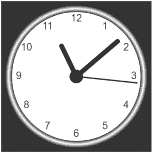
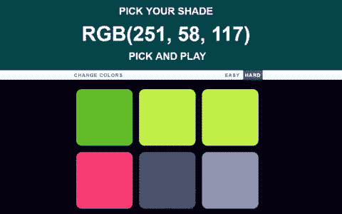

# JavaScript 项目——知道如何构建自己的 Web 应用程序

> 原文：<https://medium.com/edureka/javascript-projects-f718db7dd7d5?source=collection_archive---------2----------------------->


JavaScript Project — Edureka

根据 Hirekind 的一项调查，网站上列出的所有编程相关工作中，约有三分之一要求精通 JavaScript。此外，JavaScript 为 95.1%的活跃网站提供了基础。这是 Web 开发的一个重要部分，在本文中，我们将按以下顺序讨论一些 JavaScript 项目，它们将帮助您自己构建应用程序:

*   JavaScript 职业生涯
*   JavaScript 项目

1.  模拟时钟
2.  挑选你的颜色
3.  待办事项列表
4.  购物车

# JavaScript 职业生涯

在 **2018** 年，印度几乎创造了 **34k** 个 JavaScript 工作岗位。这个数字每天都在增加。JavaScript 是创造大量就业机会的顶级语言之一。

JavaScript 开发人员有很大的发展空间，比如你可以建立自己的作品集网站，在常规的 JavaScript 工作之外做自由职业项目。随着 JavaScript 工作的增长，它可能会成为金融、保险和电信等所有行业的一部分。让我们来看看 JavaScript 中的一些**关键角色**以及他们的薪水:

*   **前端 Web 开发人员** —印度前端开发人员的平均年薪在**400，000** 到**450，000** 之间。
*   **网络应用开发人员** —印度网络开发人员的平均工资是卢比。每年 280727 元。
*   JavaScript 开发人员——对于 JavaScript 开发人员来说，印度的平均年薪是 425863 卢比。
*   网页设计师——在印度，一名用户界面设计师的平均工资在卢比左右。每年 507943 人。
*   **全栈开发人员** —全栈开发人员在印度的平均工资在卢比左右。每年 50 万英镑。

现在你已经了解了职业发展，让我们来看看一些 JavaScript 项目，它们将帮助你更好地理解脚本语言并构建你自己的项目。

# JavaScript 项目

JavaScript 项目分为三个级别- **初级、**和**高级**。我们将讨论项目的不同层次以及 JavaScript 代码是如何工作的。这将帮助您更好地理解脚本语言，并为您提供使用 JavaScript 构建自己的应用程序的想法。所以，让我们从基础的 JavaScript 项目开始。

## 模拟时钟

在第一个项目中，我们将借助 HTML canvas 构建一个简单的模拟时钟。

第一步是创建一个画布。时钟需要一个 HTML 容器:

```
<!DOCTYPE html>
<html>
<body>

<canvas id="canvas" width="400" height="400" style="background-color:#333"></canvas>
<script>
var canvas = document.getElementById("canvas");
var ctx = canvas.getContext("2d");
var radius = canvas.height / 2;
ctx.translate(radius, radius);
radius = radius * 0.90
setInterval(drawClock, 1000);
//drawClock();

function drawFace(ctx, radius) {
var grad;

ctx.beginPath();
ctx.arc(0, 0, radius, 0, 2 * Math.PI);
ctx.fillStyle = 'white';
ctx.fill();

grad = ctx.createRadialGradient(0, 0 ,radius * 0.95, 0, 0, radius * 1.05);
grad.addColorStop(0, '#333');
grad.addColorStop(0.5, 'white');
grad.addColorStop(1, '#333');
ctx.strokeStyle = grad;
ctx.lineWidth = radius*0.1;
ctx.stroke();

ctx.beginPath();
ctx.arc(0, 0, radius * 0.1, 0, 2 * Math.PI);
ctx.fillStyle = '#333';
ctx.fill();
}

function drawNumbers(ctx, radius) {
var ang;
var num;
ctx.font = radius * 0.15 + "px arial";
ctx.textBaseline = "middle";
ctx.textAlign = "center";
for(num = 1; num < 13; num++){
ang = num * Math.PI / 6;
ctx.rotate(ang);
ctx.translate(0, -radius * 0.85);
ctx.rotate(-ang);
ctx.fillText(num.toString(), 0, 0);
ctx.rotate(ang);
ctx.translate(0, radius * 0.85);
ctx.rotate(-ang);
}
}
function drawClock() {
drawFace(ctx, radius);
drawNumbers(ctx, radius);
drawTime(ctx, radius);
}

function drawTime(ctx, radius){
var now = new Date();
var hour = now.getHours();
var minute = now.getMinutes();
var second = now.getSeconds();
//hour
hour = hour%12;
hour = (hour*Math.PI/6)+(minute*Math.PI/(6*60))+(second*Math.PI/(360*60));
drawHand(ctx, hour, radius*0.5, radius*0.07);
//minute
minute = (minute*Math.PI/30)+(second*Math.PI/(30*60));
drawHand(ctx, minute, radius*0.8, radius*0.07);
// second
second = (second*Math.PI/30);
drawHand(ctx, second, radius*0.9, radius*0.02);
}

function drawHand(ctx, pos, length, width) {
ctx.beginPath();
ctx.lineWidth = width;
ctx.lineCap = "round";
ctx.moveTo(0,0);
ctx.rotate(pos);
ctx.lineTo(0, -length);
ctx.stroke();
ctx.rotate(-pos);
}

/*var canvas = document.getElementById("canvas");
var ctx = canvas.getContext("2d");
var radius = canvas.height / 2;
ctx.translate(radius, radius);
radius = radius * 0.90
*/

</script>

</body>
</html>
```

这段 HTML 代码为时钟创建画布，并创建绘制时钟的函数。现在下一步是画钟的表面。现在，我们需要一个 JavaScript 函数来绘制面部:

```
function drawClock() {   //Create a function for drawing the clock face
drawFace(ctx, radius);
}

function drawFace(ctx, radius) {
var grad;

ctx.beginPath();    //Draw the white circle
ctx.arc(0, 0, radius, 0, 2 * Math.PI);
ctx.fillStyle = 'white';
ctx.fill();

grad = ctx.createRadialGradient(0, 0 ,radius * 0.95, 0, 0, radius * 1.05);    //Create a radial gradient
grad.addColorStop(0, '#333');     //Create 3 color stops, corresponding with the inner, middle, and outer edge of the arc
grad.addColorStop(0.5, 'white');
grad.addColorStop(1, '#333');
ctx.strokeStyle = grad;   //Define the gradient as the stroke style of the drawing object
ctx.lineWidth = radius*0.1;   //Define the line width of the drawing object
ctx.stroke();  //Draw the circle

ctx.beginPath();    //Draw the clock center
ctx.arc(0, 0, radius * 0.1, 0, 2 * Math.PI);
ctx.fillStyle = '#333';
ctx.fill();
}
```

一旦你画了钟面，就该添加数字了:

```
function drawClock() {
drawFace(ctx, radius);
drawNumbers(ctx, radius);
}

function drawNumbers(ctx, radius) {
var ang;
var num;
ctx.font = radius * 0.15 + "px arial";    //Set the font size to 15% of the radius
ctx.textBaseline = "middle";    //Set the text alignment to the middle and the center of the print position
ctx.textAlign = "center";
for(num = 1; num < 13; num++){ //Calculate the print position to 85% of the radius, rotated for each number
ang = num * Math.PI / 6;
ctx.rotate(ang);
ctx.translate(0, -radius * 0.85);
ctx.rotate(-ang);
ctx.fillText(num.toString(), 0, 0);
ctx.rotate(ang);
ctx.translate(0, radius * 0.85);
ctx.rotate(-ang);
}
} add the clock hands:
```

现在，在开始计时之前，我们需要添加时钟指针:

```
function drawClock() {
drawFace(ctx, radius);
drawNumbers(ctx, radius);
drawTime(ctx, radius);
}

function drawTime(ctx, radius){
var now = new Date(); //Use Date to get hour, minute, second
var hour = now.getHours();
var minute = now.getMinutes();
var second = now.getSeconds();
//hour
hour = hour%12; //Calculate the angle of the hour hand, and draw it a length, and a width
hour = (hour*Math.PI/6)+(minute*Math.PI/(6*60))+(second*Math.PI/(360*60));
drawHand(ctx, hour, radius*0.5, radius*0.07);
//minute
minute = (minute*Math.PI/30)+(second*Math.PI/(30*60));
drawHand(ctx, minute, radius*0.8, radius*0.07);
// second
second = (second*Math.PI/30);
drawHand(ctx, second, radius*0.9, radius*0.02);
}

function drawHand(ctx, pos, length, width) {
ctx.beginPath();
ctx.lineWidth = width;
ctx.lineCap = "round";
ctx.moveTo(0,0);
ctx.rotate(pos);
ctx.lineTo(0, -length);
ctx.stroke();
ctx.rotate(-pos);
}
```

既然你已经设计好了你的模拟时钟，是时候开始计时了。要启动时钟，每隔一段时间调用 drawClock 函数:

```
var canvas = document.getElementById("canvas");
var ctx = canvas.getContext("2d");
var radius = canvas.height / 2;
ctx.translate(radius, radius);
radius = radius * 0.90
//drawClock();
setInterval(drawClock, 1000);
```

启动时钟你唯一要做的就是每隔一段时间调用 drawClock 函数。至此，我们完成了第一个基础 JavaScript 项目。它将为您提供以下输出:



现在让我们来看看另一个基础级别的项目。

## 挑选你的颜色

这是一个颜色游戏，你将有六个不同颜色的方块。现在，你必须根据每一轮提供的 RGB 值选择正确的颜色。让我们来看看构建这个游戏所需的 JavaScript 函数:

```
var numSquares = 6;
var colors = generateRandomColors(numSquares);
var square = document.querySelectorAll(".square");
var pickedColor = pickColor();
var rgbCode = document.getElementById("rgbCode");
var messageDisplay = document.querySelector("#message");
var h1 = document.querySelector("h1");
var resetButton = document.querySelector("#reset");
var easyBtn = document.querySelector("#easyBtn");
var hardBtn = document.querySelector("#hardBtn");

easyBtn.addEventListener("click", function(){
hardBtn.classList.remove("selected");
easyBtn.classList.add("selected");
numSquares = 3;
colors = generateRandomColors(numSquares);
pickedColor = pickColor();
rgbCode.textContent = pickedColor;
for(var i = 0; i < square.length; i++) {
if (colors[i]) {
square[i].style.background = colors[i];
} else {
square[i].style.display = "none";
}
}
});

hardBtn.addEventListener("click", function(){
easyBtn.classList.remove("selected");
hardBtn.classList.add("selected");
numSquares = 6;
colors = generateRandomColors(numSquares);
pickedColor = pickColor();
rgbCode.textContent = pickedColor;
for(var i = 0; i < square.length; i++) {
square[i].style.background = colors[i];
square[i].style.display = "block";
}
});

resetButton.addEventListener("click", function(){
//generate all new colors
colors = generateRandomColors(numSquares);
//pick a new random color from the array
pickedColor = pickColor();
//change colorDisplay to match picked color
rgbCode.textContent = pickedColor;
this.textContent = "New Color";
messageDisplay.textContent = "";
//change colors of squares
for (var i = 0; i < square.length; i++) {
square[i].style.background = colors[i];
}
h1.style.background = "steelblue";
})

rgbCode.textContent = pickedColor;

for(var i = 0; i < square.length; i++) {
//add initial colors to squares
square[i].style.background = colors[i];
//add click listeners to squares
square[i].addEventListener("click", function() {
//grab color of picked square
var clickedColor = this.style.background;
//compare color to pickedColor
if (clickedColor === pickedColor) {
messageDisplay.textContent = "Good Job!";
resetButton.textContent = "Play Again ?";
changeColors(clickedColor);
h1.style.background = clickedColor;
}else{
this.style.background = "#232323";
messageDisplay.textContent = "Try Again";
}
})
}

function changeColors(color){
//loop through all squares
for (var i = 0; i < square.length; i++) {
//change each color to match given color
square[i].style.background = color;
}

}

function pickColor(){
var random = Math.floor(Math.random() * colors.length)
return colors[random];
}

function generateRandomColors(num){
//make and array
var arr = []
//add num random colors to array
for (var i = 0; i < num; i++) {
arr.push(randomColor())
//get random color and push into array
}
//return that array
return arr;
}

function randomColor(){
//pick a "red" from 0-255
var r = Math.floor(Math.random() * 256)
//pick a "green" from 0-255
var g = Math.floor(Math.random() * 256)
//pick a "blue" from 0-255
var b = Math.floor(Math.random() * 256)

return "rgb(" + r +", " + g + ", " + b +")";
}
```

这些是让你的游戏运行的不同功能。现在，您还可以在 CSS 的帮助下添加样式:

```
body {
background-color: #060111;
margin: 0;
font-family: sans-serif;
font-weight: normal;
text-transform: uppercase;
}

.square {
width: 30%;
background: white;
padding-bottom: 30%;
float: left;
margin: 1.66%;
border-radius: 10%;
transition: background 0.7s;
-webkit-transition: background 0.7s;
-moz-transition: background 0.7s;
}

#container {
margin: 20px auto;
max-width: 600px;
}

h1 {
color: white;
line-height: 1.5;
text-align: center;
background-color: rgb(3, 69, 73);
margin: 0;
padding: 20px 0;
}

#stripe {
background: white;
height: 30px;
text-align: center;
color: black;
}

.selected {
color: white;
background: rgb(5, 153, 146);
}

#rgbCode {
font-size: 200%;
}

button {
border: none;
background: none;
text-transform: uppercase;
font-family: sans-serif;
height: 100%;
font-weight: 700;
color: rgb(5, 153, 146);
letter-spacing: 1px;
font-size: inherit;
transition: all 0.5s;
-webkit-transition: all 0.5s;
-moz-transition: all 0.5s;
outline: none;
}

button:hover{
color: white;
background: rgb(5, 153, 146);
}

#message{
display: inline-block;
width: 20%;
}
```

一旦你完成了游戏的样式化，就该在 HTML 代码中实现这些功能和样式来构建游戏的基本结构了:

```
<head>
<meta charset="utf-8">
<title>Color Game</title>
</head>
<link rel="stylesheet" href="colorgamestyle.css">
<body>
<h1>
Pick your Shade
<br>
<span id="rgbCode">RGB</span>
<br>
Pick and Play
</h1>

<div id="stripe">
<button id="reset">Change Colors</button>
<span id="message"></span>
<button id="easyBtn">Easy</button>
<button class="selected" id ="hardBtn">Hard</button>
</div>

<div id="container">
<div class="square"></div>
<div class="square"></div>
<div class="square"></div>
<div class="square"></div>
<div class="square"></div>
<div class="square"></div>
</div>

<script src="colorgamejs.js" charset="utf-8"></script>

</body>
```

这样，你的游戏就准备好了，你可以根据 RGB 值从方块中选择颜色。上述代码将给出以下输出:



现在您已经有了构建模拟时钟和颜色游戏的想法，让我们继续下一个 JavaScript 项目。

## 待办事项列表

待办事项列表帮助你创建一个要完成的任务列表。您可以在列表中添加一些任务，也可以在任务完成后删除它们。这是一个中级项目。因此，让我们看看如何使用不同的 JavaScript 函数来创建待办事项列表:

```
var enterButton = document.getElementById("enter");
var input = document.getElementById("userInput");
var ul = document.querySelector("ul");
var item = document.getElementsByTagName("li");

function inputLength(){
return input.value.length;
}

function listLength(){
return item.length;
}

function createListElement() {
var li = document.createElement("li"); // creates an element "li"
li.appendChild(document.createTextNode(input.value)); //makes text from input field the li text
ul.appendChild(li); //adds li to ul
input.value = ""; //Reset text input field

//Start Strikethrough
// because it's in the function, it only adds it for new items
function crossOut() {
li.classList.toggle("done");
}

li.addEventListener("click",crossOut);
//End strikethrough

// Start add delete button
var dBtn = document.createElement("button");
dBtn.appendChild(document.createTextNode("X"));
li.appendChild(dBtn);
dBtn.addEventListener("click", deleteListItem);
// End add delete button

//Add class delete (DISPLAY: NONE)
function deleteListItem(){
li.classList.add("delete")
}
//End add class delete
}

function addListAfterClick(){
if (inputLength() > 0) { //makes sure that an empty input field doesn't create a li
createListElement();
}
}

function addListAfterKeypress(event) {
if (inputLength() > 0 && event.which ===13) { //this now looks to see if you hit "enter"/"return"
//the 13 is the enter key's keycode, this could also be display by event.keyCode === 13
createListElement();
}
}

enterButton.addEventListener("click",addListAfterClick);

input.addEventListener("keypress", addListAfterKeypress);
```

下一步是在 CSS 的帮助下将样式特性添加到列表中:

```
body {
background: rgb(8, 221, 210);
text-align: center;
font-family: 'Open Sans', sans-serif;
}

.intro {
margin: 30px 0px;
font-weight: bold;
}

h1 {
color: #ffffff;
text-transform: uppercase;
font-weight: 800;
}

p {
font-weight: 600;
}

#first {
margin-top: 10px;
color: rgb(2, 57, 65);
}

#second {
color: rgb(226, 62, 40);

}

#third {
color: rgb(217, 241, 79);
margin-bottom: 30px;
}

#enter {
border: none;
padding: 15px 25px;
border-radius: 10px;
color: rgb(146, 250, 252);
background-color: rgb(3, 63, 68);
transition: all 0.75s ease;
-webkit-transition: all 0.75s ease;
-moz-transition: all 0.75s ease;
-ms-transition: all 0.75s ease;
-o-transition: all 0.75 ease;
font-weight: normal;
}

#enter:hover{
background-color: rgb(172, 230, 240);
color: rgb(85, 60, 7);
}

ul {
text-align: left;
margin-top: 20px;
}

li {
list-style: none;
padding: 10px 20px;
color: #ffffff;
text-transform: capitalize;
font-weight: 600;
border: 2px solid #94e0ee;
border-radius: 10px;
margin-bottom: 10px;
background: rgb(3, 76, 88);
transition: all 0.75s ease;
-webkit-transition: all 0.5s ease;
-moz-transition: all 0.5s ease;
-ms-transition: all 0.5s ease;
-o-transition: all 0.5 ease;
}

li:hover {
background: rgb(129, 71, 5);
}

li > button {
font-weight: normal;
background: none;
border: none;
float: right;
color: #025f70;
font-weight: 800;
}

input {
border-radius: 5px;
min-width: 65%;
padding: 15px;
border: none;
}

.done {
background: rgb(56, 161, 79) !important;
color: rgb(187, 245, 200);
}

.delete {
display: none;
}
```

既然您已经编写了函数并对它们进行了样式化，那么是时候为待办事项列表创建 HTML 结构了:

```
<link rel="stylesheet" href="todostyle.css">
<body>
<div class="container">
<div class="row">
<div class="intro col-12">
<h1>Work To-Dos</h1>
<div>
<div class="border1"></div>
<div c
</div>
</div>
</div>

<div class="row">
<div class="helpText col-12">
<p id="first">Enter text into the input field to add items to your list.</p>
<p id="second">Click the item to mark it as complete.</p>
<p id="third">Click the "X" to remove the item from your list.</p>
</div>
</div>

<div class="row">
<div class="col-12">
<input id="userInput" type="text" placeholder="New item..." maxlength="27">
<button id="enter"><i class="fas fa-pencil-alt"></i></button>
</div>
</div>

<!-- Empty List -->
<div class="row">
<div class="listItems col-12">
<ul class="col-12 offset-0 col-sm-8 offset-sm-2">
</ul>
</div>
</div>

</div>
<script type="text/javascript" src="todojs.js"></script>
</body>
</html>
```

这样，你的待办事项列表就准备好了，你可以添加一个要完成的任务列表。上述代码将给出以下输出:


现在，您已经了解了不同的基础级和中级项目，让我们继续学习高级 JavaScript 项目，并创建一个购物车，在上面列出您最喜欢的商品。

## 购物车

高级项目是创建一个购物车的项目数量。它将提供每个项目的价格，您也可以从您的购物车中添加或删除这些项目。

第一步是创建我们的 HTML 结构。我们需要一个容器 div，这将是我们的购物车。在容器中，我们将有一个标题和三个项目，包括:

*   两个按钮—删除按钮和收藏按钮
*   产品仿制
*   产品名称和描述
*   调节产品数量的按钮
*   总价

```
<div class="shopping-cart">
<!-- Title -->
<div class="title">
Shopping Bag
<span><pre> Price/item</pre></span>
</div>

<!-- Product #1 -->
<div class="item">
<div class="buttons">
<span class="delete-btn"></span>
<span class="like-btn"></span>
</div>

<div class="image">

</div>

<div class="description">
<span>Daniel Jean</span>
<span>Round neck</span>
<span>Maroon</span>
</div>

<div class="quantity">
<button class="plus-btn" type="button" name="button">

</button>
<input type="text" name="name" value="1">
<button class="minus-btn" type="button" name="button">

</button>
</div>

<div class="total-price">₹750</div>
</div>

<!-- Product #2 -->
<div class="item">
<div class="buttons">
<span class="delete-btn"></span>
<span class="like-btn"></span>
</div>

<div class="image">

</div>

<div class="description">
<span>Maison Jack</span>
<span>Leather Jacket</span>
<span>Black</span>
</div>

<div class="quantity">
<button class="plus-btn" type="button" name="button">

</button>
<input type="text" name="name" value="1">
<button class="minus-btn" type="button" name="button">

</button>
</div>

<div class="total-price">₹3499</div>
</div>

<!-- Product #3 -->
<div class="item">
<div class="buttons">
<span class="delete-btn"></span>
<span class="like-btn"></span>
</div>

<div class="image">

</div>

<div class="description">
<span>Woodland</span>
<span>Sneaker shoes</span>
<span>Brown</span>
</div>

<div class="quantity">
<button class="plus-btn" type="button" name="button">

</button>
<input type="text" name="name" value="1">
<button class="minus-btn" type="button" name="button">

</button>
</div>

<div class="total-price">₹6999</div>
</div>
</div>
```

现在，让我们给我们的身体添加一些风格:

```
* {
box-sizing: border-box;
}

html,
body {
width: 100%;
height: 100%;
padding: 10px;
margin: 0;
background-color: rgb(6, 146, 151);
font-family: 'Roboto', sans-serif;
}
```

现在，是时候给购物车添加尺寸并使其看起来更漂亮了。我们使用的是 flexbox，所以我们将其设置为显示 flex 并生成 flex-direction 列，因为默认情况下 flex-direction 被设置为一行。

```
.shopping-cart {
width: 750px;
height: 423px;
margin: 80px auto;
background: rgb(0, 3, 3);
box-shadow: 1px 2px 3px 0px rgba(0,0,0,0.10);
border-radius: 6px;

display: flex;
flex-direction: column;
}
```

下一步是设计购物车的基本结构:

```
.title {
height: 60px;
border-bottom: 1px solid rgb(108, 201, 224);
padding: 20px 30px;
color: rgb(255, 255, 255);
font-size: 18px;
font-weight: 400;
}

.item {
padding: 20px 30px;
height: 120px;
display: flex;
}

.item:nth-child(3) {
border-top: 1px solid #E1E8EE;
border-bottom: 1px solid #E1E8EE;
}
```

第一个元素是删除和收藏按钮。这里，我们实现了 twitter 心形按钮动画:

```
/* Buttons - Delete and Like */
.buttons {
position: relative;
padding-top: 30px;
margin-right: 60px;
}

.delete-btn {
display: inline-block;
cursor: pointer;
width: 18px;
height: 17px;
background: url("delete-icn.svg") no-repeat center;
margin-right: 20px;
}

.like-btn {
position: absolute;
top: 9px;
left: 15px;
display: inline-block;
background: url('twitter-heart.png');
width: 60px;
height: 60px;
background-size: 2900%;
background-repeat: no-repeat;
cursor: pointer;
}
```

在这一步中，我们将类设置为“is-active ”,以便在单击按钮时使用 jQuery 对其进行动画处理:

```
.is-active {
animation-name: animate;
animation-duration: .8s;
animation-iteration-count: 1;
animation-timing-function: steps(28);
animation-fill-mode: forwards;
}

[@keyframes](http://twitter.com/keyframes) animate {
0% { background-position: left; }
50% { background-position: right; }
100% { background-position: right; }
}
```

下一步是需要 50px 右边距的产品图像:

```
/* Product Image */
.image {
margin-right: 50px;
}

/* Product Description */
.description {
padding-top: 10px;
margin-right: 60px;
width: 115px;
color: antiquewhite
}

.description span {
display: block;
font-size: 14px;
color: antiquewhite
font-weight: 400;
}

.description span:first-child {
margin-bottom: 5px;
}
.description span:last-child {
font-weight: 300;
margin-top: 8px;
color: #86939E;
}
```

之后，我们需要添加一个 quantity 元素，其中有两个按钮用于添加或删除产品数量:

```
/* Product Quantity */
.quantity {
padding-top: 20px;
margin-right: 60px;
}
.quantity input {
-webkit-appearance: none;
border: none;
text-align: center;
width: 32px;
font-size: 16px;
color: #43484D;
font-weight: 300;
}

button[class*=btn] {
width: 30px;
height: 30px;
background-color: #E1E8EE;
border-radius: 6px;
border: none;
cursor: pointer;
}
.minus-btn img {
margin-bottom: 3px;
}
.plus-btn img {
margin-top: 2px;
}
button:focus,
input:focus {
outline:0;
}
```

现在，最后一部分是产品的总价:

```
/* Total Price */
.total-price {
width: 83px;
padding-top: 27px;
text-align: center;
font-size: 16px;
color: antiquewhite;
font-weight: 300;
}
```

最后，为了让您的购物车响应迅速:

```
/* Responsive */
[@media](http://twitter.com/media) (max-width: 800px) {
.shopping-cart {
width: 100%;
height: auto;
overflow: hidden;
}
.item {
height: auto;
flex-wrap: wrap;
justify-content: center;
}
.image img {
width: 50%;
}
.image,
.quantity,
.description {
width: 100%;
text-align: center;
margin: 6px 0;
}
.buttons {
margin-right: 20px;
}
}
```

这一切都是为了设计购物车。现在，我们必须使用 JavaScript 函数来使心脏在我们点击它时具有动画效果:

```
$('.like-btn').on('click', function() {
$(this).toggleClass('is-active');
});
```

最后，让我们使用数量按钮:

```
$('.minus-btn').on('click', function(e) {
e.preventDefault();
var $this = $(this);
var $input = $this.closest('div').find('input');
var value = parseInt($input.val());

if (value >1) {
value = value - 1;
} else {
value = 0;
}

$input.val(value);

});

$('.plus-btn').on('click', function(e) {
e.preventDefault();
var $this = $(this);
var $input = $this.closest('div').find('input');
var value = parseInt($input.val());

if (value < 100) {
value = value + 1;
} else {
value =100;
}

$input.val(value);
});
```

这样，你的购物车就准备好了。您可以在列表中添加或删除项目。上述代码将给出以下输出:


这些是一些 JavaScript 项目。就这样，我们来到了这篇文章的结尾。我希望您理解了项目的不同层次，并了解了如何使用 JavaScript 构建自己的应用程序或项目。

如果你想查看更多关于人工智能、Python、道德黑客等市场最热门技术的文章，你可以参考 Edureka 的官方网站。

请留意本系列中的其他文章，它们将解释 JavaScript 的各个方面。

> 1.[十大 JavaScript 框架](/edureka/top-10-javascript-frameworks-3179f1b5bd41)
> 
> 2.[JQuery 简介](/edureka/jquery-tutorial-for-beginners-679021d74ab4)
> 
> 3. [JSP 面试问答](/edureka/jsp-interview-questions-41b240f9414c)
> 
> 4.[如何搭建一个 JavaScript 计算器？](/edureka/javascript-calculator-47778c7596f3)

*原载于 2019 年 8 月 26 日*[*https://www.edureka.co*](https://www.edureka.co/blog/javascript-projects/)*。*