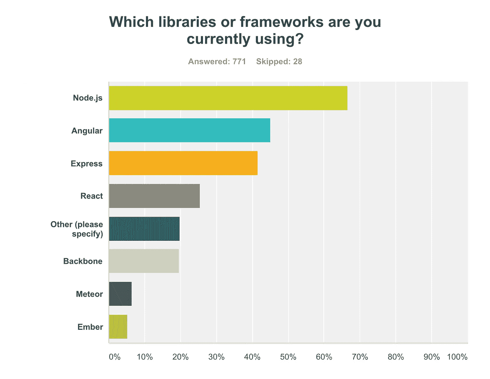
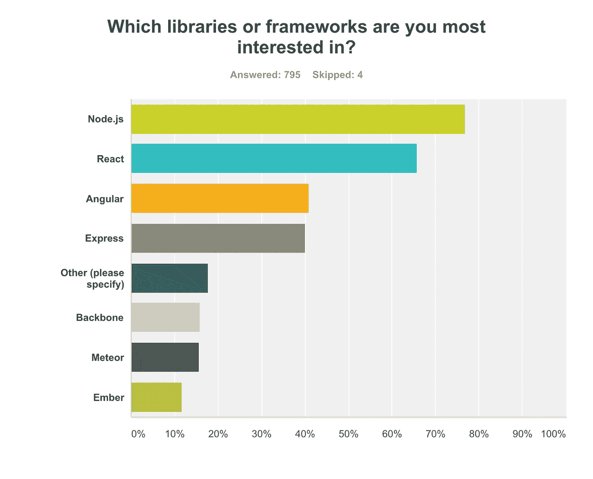
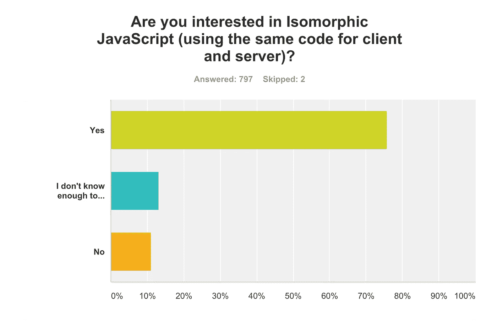
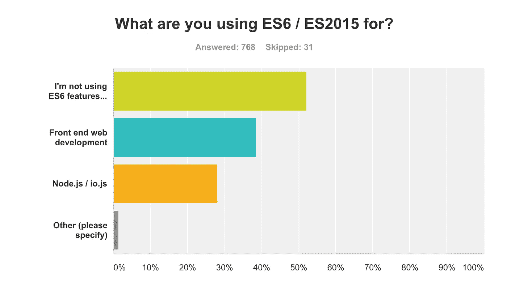
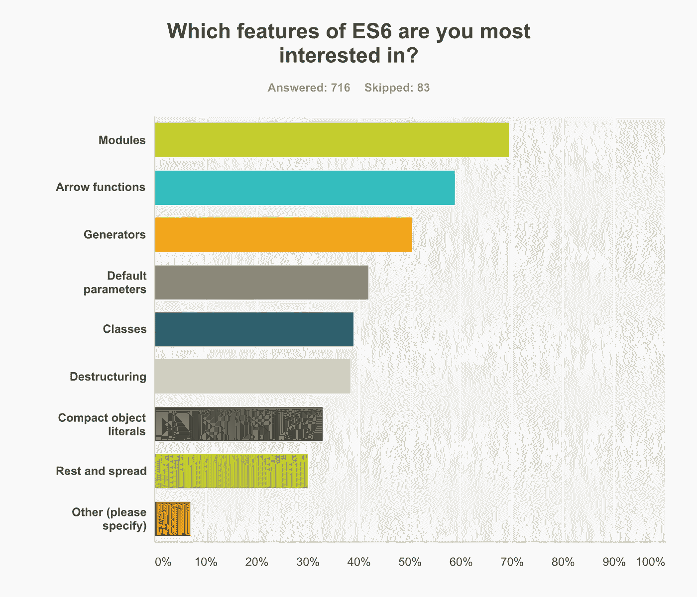

# JavaScript 场景技术调查结果

> 原文：<https://medium.com/javascript-scene/javascript-scene-tech-survey-d2449a529ed?source=collection_archive---------2----------------------->

## 2015 年夏季

今年夏天，JavaScript Scene 通过社交媒体进行了为期几天的 JavaScript 技术调查。只有不到 800 人参加。受访者都在 Twitter、脸书和 Google+等社交媒体上参与 JavaScript 讨论。大多数受访者来自 Twitter。正如承诺的那样，以下是结果:

## 反应正在上升

几乎一半(45%)目前使用**角**，超过一半(66%)对**反应**感兴趣。对 Angular 感兴趣的人*比使用* Angular 的*少，这可能意味着**对 Angular 的使用即将减少。***

**Angular 目前主导着**前端组件库领域，但从这些结果来看， **React 似乎准备在未来几个月内给 Angular 一个机会。**

对于库兴趣问题，值得注意的“其他”回答包括 **Polymer、RxJS、Koa 和 Immutable.js** 。

## 再见 SPAs，你好 Universal(又名同构)JavaScript

> 重要提示:在进行这项调查的这段时间里，一篇广受好评的博文建议我们[将“同构 JavaScript”的名称改为“通用 JavaScript”](/@mjackson/universal-javascript-4761051b7ae9)。
> 
> 我同意，而且我已经把我关于这个主题的书的名字改成了[“用 Node 学习 JavaScript 通用 App 开发，ES6，&React】](https://leanpub.com/learn-javascript-react-nodejs-es6/)。同样，“同构的 Express 样板”现在是[“通用的 React 样板”](https://github.com/ericelliott/universal-react-boilerplate)。

大约四分之三(76%)的人对**同构 JavaScript 感兴趣，**意味着他们希望**在整个堆栈中共享更多代码**。最新的趋势是**在服务器端和客户端都进行渲染**，这与 web 早期最初的**仅服务器端渲染**和最近的**单页面应用(SPA)的仅客户端渲染**形成了对比。随着越来越多的人将 Node 用于他们的 web 服务器层，我们可能正在见证 SPA 时代的终结。

## ES6 已经到了

ES6 规范是新的 JavaScript 标准。随着 Babel 使用的普及，越来越多的人开始在今天的生产中使用 ES6，将许多新功能移植到当前浏览器中运行的代码中。

大约一半的受访者(48%)报告使用 ES6。许多人只在前端使用 ES6，但近 30%的人报告称也在 Node 中使用它。随着越来越多的人接受通用 JavaScript，预计 ES6 和 Node 的使用会增加。

## 包含 ES6 模块

我们问参与者**他们对**ES6 的哪些功能最感兴趣。

受访者似乎很高兴 **ES6 最终为 JavaScript** 带来了规范的模块实现，并对箭头函数和生成器表现出强烈的赞赏。**类没有预期的那样公平，**但那是**可能是选择偏差**(我一直是 *`class`* 实现的直言不讳的批评家)。

# 外卖

ES6、Node 和 React 的未来看起来很光明。任何试图与它们直接竞争的技术都将面临一场艰苦的战斗。ES6 的采用比我们想象的要快得多，这对每个人来说都是一件好事。

这项调查是在[**web assembly**](/javascript-scene/what-is-webassembly-the-dawn-of-a-new-era-61256ec5a8f6)**发布之前进行的，这是一种新的浏览器二进制格式和编译目标**。在下一次调查中，我们将包括关于 wasm 以及 **Polymer、RxJS、Koa 和 Immutable.js** 的问题。

感谢您的参与。我们很高兴再次收到您的来信，很快！

> [学习 JavaScript
> 通用 App 开发
> 用 Node，ES6，& React](https://ericelliottjs.com)

***埃里克·艾略特*** *著有* [*【编程 JavaScript 应用】*](http://pjabook.com) *(奥赖利)，以及* [*【学习 JavaScript 通用 App 开发用节点，ES6，&【React】*](https://leanpub.com/learn-javascript-react-nodejs-es6/)*。他为 Adobe Systems******尊巴健身*******华尔街日报*******【ESPN*******BBC****等顶级录音师贡献了软件经验******

**他大部分时间都在旧金山湾区和世界上最美丽的女人在一起。**