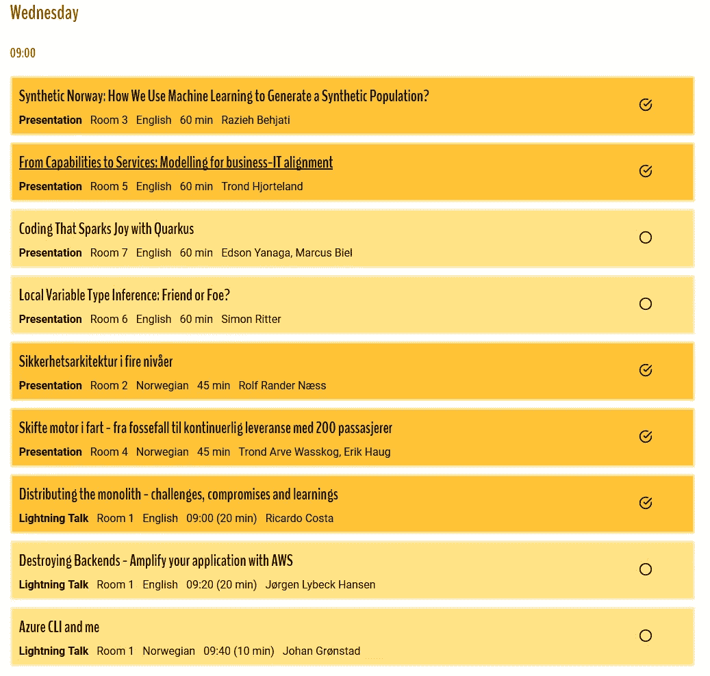

# JavaZone ’19 fra en funksjonell arkitekts perspektiv

> 原文：<https://medium.com/compendium/javazone-19-fra-en-funksjonell-arkitekts-perspektiv-62418971e034?source=collection_archive---------0----------------------->

Når man er på jakt etter relevante konferanser for funksjonelle arkitekter, er muligens ikke JavaZone det mest innlysende valget. Men kanskje det burde vært det?

JavaZone er nemlig ikke bare for Java-programmerere: Selv en funksjonell arkitekt som meg, slet med valgets kvaler når det var tid for å velge neste sesjon. På det verste skulle jeg ønske at jeg kunne vært fem (!!! og det er ikke en gang en overdrivelse!) steder på en gang! :)

Elle-melle, hvilken av disse 5 foredragene har jeg mest lyst på, mon tro?

For at du skal slippe å lide av de samme valgkvalene som meg, har jeg samlet noen av mine favorittforedrag her. Heldigvis blir alle tilgjengelige på video, så selv om du gikk glipp av JavaZone kan du fortsatt få med deg høydepunktene. :)

Nå er det jo ikke alle funksjonelle arkitekter som har et like sterkt forhold til koding. Selv har jeg programmert i mange år før jeg begynte å jobbe funksjonelt, så jeg er fortsatt litt svak for foredrag om hvordan lage god kode. Derfor er utvalget en god blanding av kodenære og kodefrie foredrag.

# Mine favorittforedrag

***Skifte motor i fart — fra fossefall til kontinuerlig leveranse med 200 passasjerer*** av Trond Arve Wasskog og Erik Haug

*En smertelig gjenkjennelig historie om hvordan overgangen fra fossefall til hyppige leveranser kan være. Denne burde være påbudt å se for alle som tror at fossefall er lurt (spoiler alert: it’s not!)*

 [## JavaZone @javazone

### JavaZone 2019, Room 4 - Trond Arve Wasskog & Erik Haug - Skifte motor i fart - fra fossefall til kontinuerlig leveranse…

www.pscp.tv](https://www.pscp.tv/w/1mnxezBPkzNKX) 

***Me, my code and I*** av Rosanne Joosten

*Psykologi + koding = sant! Underholdende og nyttig innblikk i hvordan koden din kan fortelle noe om hva slags person du — eller kollegaen din — er. Som en eks-psykologistudent treffer dette meg rett i hjerteroten. :)*

 [## JavaZone @javazone

### JavaZone (@javazone). JavaZone is a Norwegian Java conference organized in Oslo on September 11th-12th, 2019 for the…

www.pscp.tv](https://www.pscp.tv/w/1LyxBLpZLdPGN) 

***Det er greit å gjøre feil: 20 år med tabber*** av Jan Henrik Gundelsby

*Jeg er veldig svak for skrekkhistorier fra virkeligheten, og alt som kan hjelpe folk til å tørre å ta sjanser (og feile!) er bra! :)*

(NB! Alle lyntaler er i samme video, du må spole til 8:01:25 for å se denne)

 [## JavaZone @javazone

### JavaZone (@javazone). JavaZone is a Norwegian Java conference organized in Oslo on September 11th-12th, 2019 for the…

www.pscp.tv](https://www.pscp.tv/w/1MYGNPRaYepxw) 

***Kodeknekking for spioner*** av Henrik Walker Moe

*Advarsel: Det er fare for at du får lyst til å begynne med kodeknekking etter dette foredraget. Det fikk i alle fall jeg! :)*

 [## JavaZone @javazone

### JavaZone (@javazone). JavaZone is a Norwegian Java conference organized in Oslo on September 11th-12th, 2019 for the…

www.pscp.tv](https://www.pscp.tv/w/1vAGRqPzYdgKl) 

***From initial request, to custom built application in production in 3 weeks*** av Christin Gorman

*Christin Gorman er en utrolig underholdende og engasjert foredragsholder, og det er alltid verd å få med seg foredragene hennes. Dette foredraget er intet unntak.*

 [## JavaZone @javazone

### JavaZone 2019, Room 7 - Christin Gorman - From initial request, to custom built application in production in 3 weeks

www.pscp.tv](https://www.pscp.tv/w/1OyJAeaBAQnJb) 

# Evig eies kun det tapte

Som jeg skrev i begynnelsen, skulle jeg gjerne fått med meg opptil flere parallelle foredrag. Kan ikke noen bare finne opp tidsreiser eller få kloning ut av beta-versjon snart? Det hadde vært ***veldig*** praktisk! :)

Dessverre måtte jeg ta noen harde valg, og her er en del av de foredragene jeg syntest det var mest trist å gå glipp av (aka de som står høyest på min “skal sees etter konferansen”-liste)

***Names and things*** av Einar Høst

*Navngivning er noe av det gøyeste jeg vet, og Einar er en super foredragsholder, så eneste grunnen til at jeg gikk glipp av denne, var at foredragshelten min,* [*Christin Gorman*](https://kranglefant.tumblr.com/) *, holdt foredrag samtidig.*

(NB! Alle lyntalene er i samme video, du må spole til 2:53:48 for å se denne)

 [## JavaZone @javazone

### JavaZone (@javazone). JavaZone is a Norwegian Java conference organized in Oslo on September 11th-12th, 2019 for the…

www.pscp.tv](https://www.pscp.tv/w/1ynJOwvzbDZJR) 

***Software er politikk*** av Audun Fauchald Strand og Truls Jørgensen

*Temaet er spennende, og jeg mistenker at dette er et nyttig foredrag for alle som jobber med offentlige etater. (Og kanskje det ikke hadde vært så dumt om noen politikere hadde sett det, heller? Hvem vet…)*

 [## JavaZone @javazone

### JavaZone (@javazone). JavaZone is a Norwegian Java conference organized in Oslo on September 11th-12th, 2019 for the…

www.pscp.tv](https://www.pscp.tv/w/1mrGmrXlqAwJy) 

***Hacking a cat — Going beyond traditional attack vectors*** av Niall Merrigan

*Flere jeg kjenner har fortalt hvor morsomt dette foredraget var, og siden jeg elsker katter er det lett å tro at de har rett.*

 [## JavaZone @javazone

### JavaZone (@javazone). JavaZone is a Norwegian Java conference organized in Oslo on September 11th-12th, 2019 for the…

www.pscp.tv](https://www.pscp.tv/w/1YqJDnMbrNBKV) 

***How do I help my son?*** av Dennie Declercq og Ivette Marchand

*Denne gikk fullstendig under radaren min, og var ikke på min “må sees”-liste i det hele tatt. Men i følge Twitter, fikk foredraget stående applaus — så da tenker jeg det er vel verdt å få med seg!*

 [## JavaZone @javazone

### JavaZone (@javazone). JavaZone is a Norwegian Java conference organized in Oslo on September 11th-12th, 2019 for the…

www.pscp.tv](https://www.pscp.tv/w/1mnxezBEalQKX) 

# Bonustips

Helt til slutt vil jeg ta meg den frihet å nevne to foredrag som jeg strengt tatt ikke kan bedømme helt objektivt, siden det er Computas-foredragsholdere. Men jeg lar ikke det stoppe meg fra å anbefale dem likevel. :)

***IoT edge to the rescue*** av Rustam Mehmandarov og Tannaz N. Roshandel (fra UiO)

*To veldig flinke (og hyggelige! :) ) folk som deler fra hobbyprosjektet sitt hvor de har lekt seg med IoT edge.*

 [## JavaZone @javazone

### JavaZone (@javazone). JavaZone is a Norwegian Java conference organized in Oslo on September 11th-12th, 2019 for the…

www.pscp.tv](https://www.pscp.tv/w/1eaKbAMwnMVxX) 

***Make your tests tell the story of your domain*** av Mads Opheim og Anne Landro (ja, det er meg, ja)

*Jeg er nok noe inhabil når det gjelder akkurat dette foredraget, så jeg lar bare være å si noe mer om det annet enn å oppfordre alle til å se det. :)*

 [## JavaZone @javazone

### JavaZone 2019, Room 7 - Mads Opheim & Anne Landro - Make your tests tell the story of your domain

www.pscp.tv](https://www.pscp.tv/w/1BdxYepvnyLxX)