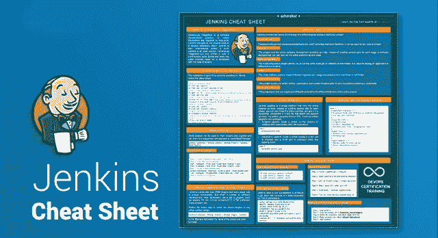
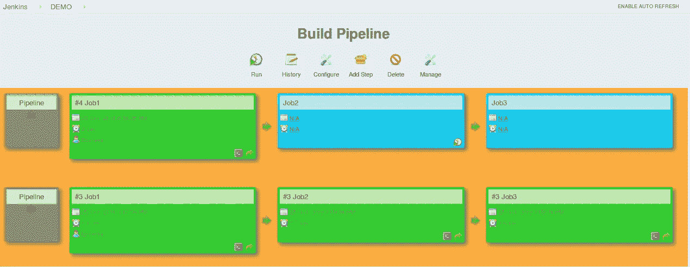
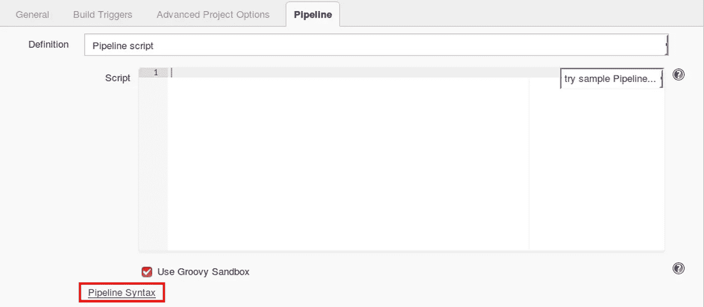
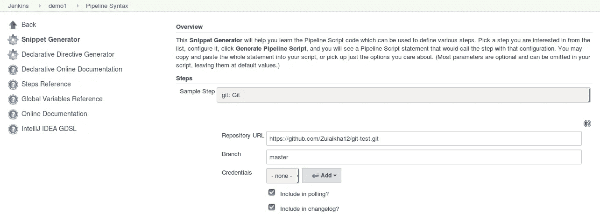
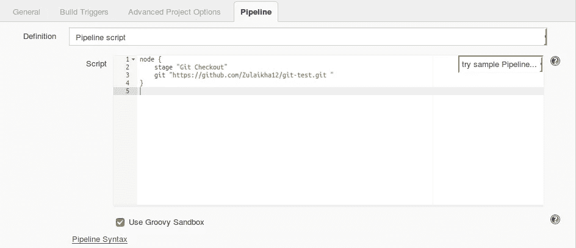

# Jenkins 备忘单—了解 Jenkins 的最佳实践

> 原文：<https://medium.com/edureka/jenkins-cheat-sheet-e0f7e25558a3?source=collection_archive---------0----------------------->



Jenkins Cheat Sheet — Edureka

你是一个想要探索不同工具的开发者吗？如果是的话，那你就来对地方了。 **DevOps 工程师**是全世界需求量最大、薪酬最高的专业人士。考虑到这一点，让我向您介绍最流行的 **DevOps 工具**，Jenkins。这份 **Jenkins** 备忘单是为那些对软件开发过程如何发生有先验知识的初学者准备的。

# 詹金斯小抄


**持续集成**是一种软件开发实践，在这种实践中，开发人员需要频繁地提交对共享存储库中源代码的更改。然后，每次提交都会不断地被拉出&构建。Jenkins 是一个开源的持续集成(CI)工具，用 Java 编写。它不断地拉取、构建和测试开发人员在插件的帮助下提交的任何代码。


# 装置

让我们从安装詹金斯开始。这个安装是特定于在 Ubuntu 上运行的系统的。遵循以下步骤:

```
Step 1: Install Java
$ sudo apt update
$ sudo apt install openjdk-8-jdk

Step 2: Add Jenkins Repository
$ wget -q -O - https://pkg.jenkins.io/debian/jenkins.io.key | sudo apt-key add –

Step 3: Add Jenkins repo to the system
$ sudo sh -c 'echo deb http://pkg.jenkins.io/debian-stable binary/ > /etc/apt/sources.list.d/jenkins.list'

Step 4: Install Jenkins
$ sudo apt update
$ sudo apt install Jenkins

Step 5: Verify installation
$ systemctl status Jenkins

Step 6: Once Jenkins is up and running, access it from the link:
[http://localhost:8080](http://localhost:8080/)
```

# 最常用的 Jenkins 插件

Jenkins 有超过 2000 个插件，每个插件都有独特的功能。但是当涉及到软件开发时，大多数开发者使用一组插件，例如

*   专家
*   饭桶
*   蚂蚁
*   码头工人
*   亚马逊 EC2
*   HTML 发布者
*   复制工件

按照以下步骤安装上述插件或任何其他詹金斯插件。

```
Jenkins Dashboard -> Manage Jenkins -> Manage Plugins -> Available
```

在过滤器文本字段中输入要安装的插件的名称。

# 不同类型的詹金斯工作

Jenkins 提供了从不同类型的工作中进行选择的选项来构建您的项目。

以下是可供您选择的工作类型:

*   **自由式**

自由式生成作业是通用的生成作业，它提供了最大的灵活性。它可以用于任何类型的项目。

*   **管道**

这个项目以代码的形式运行整个软件开发工作流程。现在，您可以将整个工作流作为一个代码运行，而不是为软件开发的每个阶段创建几个作业。

*   **多配置**

多配置项目允许您在不同的环境中运行相同的构建作业。它用于在不同的环境中测试应用程序。

*   **文件夹**

该项目允许用户创建文件夹，以便在一个文件夹或子文件夹中对相似的作业进行组织和分类。

*   **GitHub 组织**

该项目扫描您的整个 GitHub 组织，并为包含 Jenkinsfile 的每个存储库创建管道作业

*   **多分支管道**

此项目类型允许您为同一项目的不同分支实现不同的 Jenkinsfiles。

# 詹金斯管道公司

Jenkins pipeline 是一个将整个*管道作为代码运行的单一平台。现在，您可以对整个工作流进行编码，并将其放入一个 Jenkinsfile 中，而不是为每个阶段构建几个作业。*

Jenkinsfile 是一个文本文件，它将管道存储为代码。它是使用 Groovy DSL *编写的。*它可以基于两种语法编写:

*   **照本宣科的流水线**

代码是在 Jenkins UI 实例上编写的，并包含在节点块中

```
node {
      scripted pipeline code
}
```

*   **声明性管道**

代码在本地写在一个文件中，签入到 SCM 中，并封装在管道块中

```
pipeline {
      declarative pipeline code
}
```

# 构建管道

构建管道可用于将多个作业链接在一起，并按顺序运行它们。让我们看看如何安装构建管道:

```
Jenkins Dashboard -> Manage Jenkins -> Manage Plugins -> Available
```

在过滤器文本字段中输入要安装的插件的名称。

# 构建管道示例

```
Step 1: Create 3 freestyle Jobs (Job1, Job2, Job3)

Step 2: Chain the 3 Jobs together
Job1 -> configure -> Post Build -> Build other projects -> Job2
Job2 -> configure -> Post Build -> Build other projects -> Job3

Step 3: Create a build pipeline view
Jenkins Dashboard -> Add view -> Enter a name -> Build pipeline view -> ok ->
configure -> Pipeline flow -> Select Initial job -> Job1 -> ok

Step 4: Run the Build Pipeline
```



# 管道概念

脚本式和声明式管道共有以下基本原则:

1.  **管道:**包含所有阶段的用户定义块。它是声明性管道语法的关键部分。
2.  **节点:**节点是执行整个工作流的机器。它是脚本化管道语法的关键部分。
3.  代理人:指示 Jenkins 为构建分配一个执行者。它是为整个管道或特定阶段定义的。

**它有以下参数:**

*   *任何*:在任何可用代理上运行管道/阶段
*   *无*:应用于管道的根，表示整个管道没有全局代理&每个阶段必须指定自己的代理
*   *标签*:对带标签的代理执行流水线/阶段。
*   *Docker* :使用 Docker 容器作为流水线或特定阶段的执行环境。

1.  **阶段:**它包含了所有的工作；每个阶段都执行特定的任务。
2.  **步骤:**按顺序执行步骤，执行一个阶段

# Jenkins 管道语法示例

```
node {
     stage(‘SCM checkout’) {
          //Checkout from your SCM(Source Control Management)
          //For eg: Git Checkout
     }
     stage(‘Build’) {
          //Compile code
          //Install dependencies
          //Perform Unit Test, Integration Test
     }
     stage(‘Test’) {
          //Resolve test server dependencies
          //Perform UAT
     }
     stage(‘Deploy’) {
          //Deploy code to prod server
          //Solve dependency issues
     }
}
```

# 创建您的第一个詹金斯管道

在安装完 Jenkins、使用构建管道构建作业并简要讨论了管道概念之后，让我们看看如何创建 Jenkins 管道。

按照以下步骤创建脚本化管道和声明性管道:

```
Step 1: Log into Jenkins and select ‘New Item from the Dashboard'

Step 2: Next, enter a name for your pipeline and select ‘Pipeline project’. Click ‘ok’ to proceed

Step 3: Scroll down to the pipeline and choose if you want a Declarative or Scripted pipeline

Step 4a: If you want a Scripted pipeline, then choose ‘pipeline script’ and start typing your code

Step 4b: If you want a Declarative Pipeline, select ‘Pipeline script from SCM’ and choose your SCM and enter your repository URL

Step 5: Within the Script path is the name of the Jenkinsfile that is going to be accessed from your SCM to run. Finally click on ‘apply’ and ‘save’
```

# 詹金斯提示和技巧

## 启动、停止和重启 Jenkins

按照以下命令，通过 CLI 启动、停止和重启 Jenkins。

```
$ sudo service jenkins restart
$ sudo service jenkins stop
$ sudo service jenkins start
```

## 部署核心插件的定制版本

```
Step 1: Stop Jenkins.

Step 2: Copy the custom HPI to **$Jenkins_Home/plugins**.

Step 3: Delete the previously expanded plugin directory.

Step 4: Make an empty file called **<plugin>.hpi.pinned**.

Step 5: Start Jenkins.
```

## 定期安排构建

Jenkins 使用 Cron 表达式来调度作业。每行包含 5 个字段，由制表符或空格分隔:

```
Syntax: (Minute Hour DOM Month DOW)

MINUTE: Minutes in one hour (0-59)

HOURS: Hours in one day (0-23)

DAYMONTH: Day in a month (1-31)

MONTH: Month in a year (1-12)

DAYWEEK: Day of the week (0-7) where 0 and 7 are sunday

Example: H/2 * * * * (schedule your build for every 2 minutes)
```

试试这个例子:

```
H/2 * * * * (schedules your build for every 2 minutes)
```

# 代码片段生成器

允许用户为脚本化管道中的各个步骤生成代码的工具。让我们看一个例子:

```
Step 1: Create a pipeline job > configure

Step 2: Select pipeline script from pipeline definition

Step 3: Click on Pipeline syntax > snippet generator

Step 4: Step > select Git > enter repo URL

Step 5: Scroll down > Generate pipeline script

Step 6: Copy the script into your pipeline script UI
```



下面是代码片段生成器的图像。您可以从各种步骤中进行选择，并为每个步骤生成一个代码。



下图是脚本化管道用户界面的图像，其中包含代码片段生成器生成的代码



## [**下载詹金斯小抄爱德华卡**](http://bit.ly/2MLg0WS)

如果你想查看更多关于人工智能、Python、道德黑客等市场最热门技术的文章，你可以参考 [Edureka 的官方网站。](https://www.edureka.co/blog/?utm_source=medium&utm_medium=content-link&utm_campaign=jenkins-cheat-sheet)

请留意本系列中的其他文章，它们将解释 DevOps 的各个方面。

> *1。* [*DevOps 教程*](/edureka/devops-tutorial-89363dac9d3f)
> 
> *2。* [*Git 教程*](/edureka/git-tutorial-da652b566ece)
> 
> *3。* [*詹金斯教程*](/edureka/jenkins-tutorial-68110a2b4bb3)
> 
> *4。* [*Docker 教程*](/edureka/docker-tutorial-9a6a6140d917)
> 
> *5。* [*Ansible 教程*](/edureka/ansible-tutorial-9a6794a49b23)
> 
> *6。* [*木偶教程*](/edureka/puppet-tutorial-848861e45cc2)
> 
> *7。* [*厨师教程*](/edureka/chef-tutorial-8205607f4564)
> 
> *8。* [*Nagios 教程*](/edureka/nagios-tutorial-e63e2a744cc8)
> 
> *9。* [*如何编排 DevOps 工具？*](/edureka/devops-tools-56e7d68994af)
> 
> *10。* [*连续交货*](/edureka/continuous-delivery-5ca2358aedd8)
> 
> *11。* [*持续集成*](/edureka/continuous-integration-615325cfeeac)
> 
> *12。* [*连续部署*](/edureka/continuous-deployment-b03df3e3c44c)
> 
> *13。* [*持续交付 vs 持续部署*](/edureka/continuous-delivery-vs-continuous-deployment-5375642865a)
> 
> *14。* [*CI CD 管道*](/edureka/ci-cd-pipeline-5508227b19ca)
> 
> *15。* [*Docker 作曲*](/edureka/docker-compose-containerizing-mean-stack-application-e4516a3c8c89)
> 
> 16。 [*码头工人群*](/edureka/docker-swarm-cluster-of-docker-engines-for-high-availability-40d9662a8df1)
> 
> 17。 [*Docker 联网*](/edureka/docker-networking-1a7d65e89013)
> 
> 18。[](/edureka/ansible-vault-secure-secrets-f5c322779c77)
> 
> **19。*[](/edureka/ansible-roles-78d48578aca1)*
> 
> **20。[*Ansible for AWS*](/edureka/ansible-for-aws-provision-ec2-instance-9308b49daed9)**
> 
> ***21。* [*詹金斯管道*](/edureka/jenkins-pipeline-tutorial-continuous-delivery-75a86936bc92)**
> 
> ***二十二。* [*顶级 Docker 命令*](/edureka/docker-commands-29f7551498a8)**
> 
> ***23。*[*Git vs GitHub*](/edureka/git-vs-github-67c511d09d3e)**
> 
> ***24。* [*顶级 Git 命令*](/edureka/git-commands-with-example-7c5a555d14c)**
> 
> ***25。* [*DevOps 面试问题*](/edureka/devops-interview-questions-e91a4e6ecbf3)**
> 
> ***26。* [*谁是 DevOps 工程师？*](/edureka/devops-engineer-role-481567822e06)**
> 
> ***27。* [*DevOps 生命周期*](/edureka/devops-lifecycle-8412a213a654)**
> 
> ***28。*[*Git Reflog*](/edureka/git-reflog-dc05158c1217)**
> 
> ***29。* [*不可预见的准备*](/edureka/ansible-provisioning-setting-up-lamp-stack-d8549b38dc59)**
> 
> **三十。 [*组织正在寻找的顶尖 DevOps 技能*](/edureka/devops-skills-f6a7614ac1c7)**
> 
> ***三十。* [*瀑布 vs 敏捷*](/edureka/waterfall-vs-agile-991b14509fe8)**
> 
> ***31。* [*Maven 用于构建 Java 应用*](/edureka/maven-tutorial-2e87a4669faf)**
> 
> ***32。* [*Ansible 备忘单*](/edureka/ansible-cheat-sheet-guide-5fe615ad65c0)**
> 
> ***33。* [*Ansible 面试问答*](/edureka/ansible-interview-questions-adf8750be54)**
> 
> **34。 [*50 码头工人面试问题*](/edureka/docker-interview-questions-da0010bedb75)**
> 
> **35。 [*敏捷方法论*](/edureka/what-is-agile-methodology-fe8ad9f0da2f)**
> 
> **36。 [*詹金斯面试问题*](/edureka/jenkins-interview-questions-7bb54bc8c679)**
> 
> ***37。* [*Git 面试问题*](/edureka/git-interview-questions-32fb0f618565)**
> 
> **38。 [*Docker 架构*](/edureka/docker-architecture-be79628e076e)**
> 
> **39。[*devo PS 中使用的 Linux 命令*](/edureka/linux-commands-in-devops-73b5a2bcd007)**
> 
> **40。 [*詹金斯 vs 竹子*](/edureka/jenkins-vs-bamboo-782c6b775cd5)**
> 
> ***41。* [*Nagios 教程*](/edureka/nagios-tutorial-e63e2a744cc8)**
> 
> ***42。* [*Nagios 面试问题*](/edureka/nagios-interview-questions-f3719926cc67)**
> 
> ***43。* [*DevOps 实时场景*](/edureka/jenkins-x-d87c0271af57)**
> 
> ***44。* [*詹金斯和詹金斯 X 的区别*](/edureka/jenkins-vs-bamboo-782c6b775cd5)**
> 
> ***45。*[*Docker for Windows*](/edureka/docker-for-windows-ed971362c1ec)**
> 
> ***46。*[*Git vs Github*](http://git%20vs%20github/)**

***原载于*[*https://www.edureka.co*](https://www.edureka.co/blog/cheatsheets/jenkins-cheat-sheet/)*。***