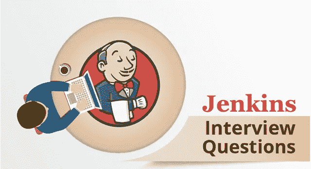
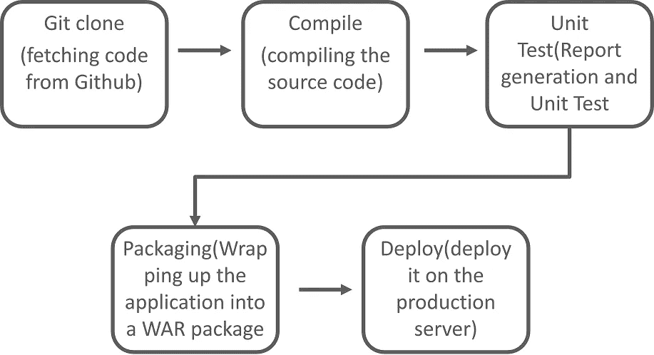
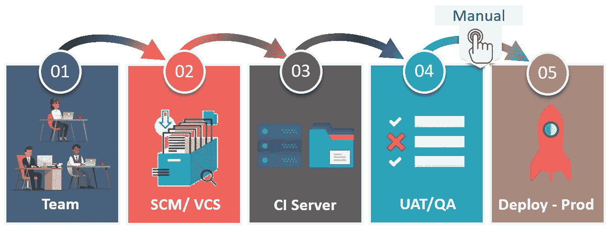
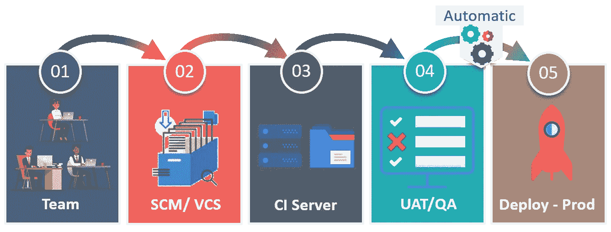

# 2019 年你必须准备的顶级詹金斯面试问题

> 原文：<https://medium.com/edureka/jenkins-interview-questions-7bb54bc8c679?source=collection_archive---------1----------------------->

Jenkins Interview Questions — Edureka

只需提交对 SCR(源代码库)的更改，Jenkins 就可以在插件的帮助下为您自动完成剩下的过程。如果你去参加 DevOps 的工作面试，很有可能会遇到很多 Jenkins 的问题。以下是詹金斯面试中最常被问到的问题。我在做了大量研究并与一些直接参与招聘过程的 DevOps 专家讨论后，收集了这些问题。很想知道更多关于詹金斯的事。

在这篇博客中，我们讨论了大约 50 多个问题，并将它们分为 3 类

*   基本问题
*   中级问题
*   高级问题

# 基本面试问题

## Q1。詹金斯和竹子有什么区别？

## Q2。詹金斯是什么？

Jenkins 是一个用 Java 编写的开源自动化工具，带有为持续集成目的而构建的插件。Jenkins 用于不断构建和测试您的软件项目，使开发人员更容易将更改集成到项目中，并使用户更容易获得新版本。它还允许您通过集成大量的测试和部署技术来持续地交付您的软件。

## Q3。定义詹金斯的过程。

*   首先，开发人员将代码提交给源代码库。同时，Jenkins 服务器会定期检查存储库是否有变化。
*   在提交发生后不久，Jenkins 服务器检测源代码存储库中发生的变化。詹金斯将拉动这些变化，并开始准备一个新的建设。
*   如果构建失败，那么相关的团队将被通知。
*   如果构建成功，那么 Jenkins 在测试服务器中部署构建。
*   测试之后，Jenkins 生成反馈，然后通知开发人员关于构建和测试的结果。
*   它将继续检查源代码库中对源代码所做的更改，并且整个过程继续重复。

## Q4。使用詹金斯有什么好处？

我建议您将 Jenkins 的以下优点包括在内，如果您还记得除了下面提到的几点之外的任何其他优点，您也可以将其包括在内。

*   在集成阶段，您可以缓存构建失败。
*   对于源代码中的每个变更，您都会生成一个自动构建报告通知。
*   为了通知开发人员构建报告的成功或失败，Jenkins 集成了 LDAP 邮件服务器。
*   实现敏捷开发和测试驱动开发的持续集成。
*   通过简单的步骤，您可以自动化 maven 发布项目。
*   在开发环境的早期阶段比在生产环境中更容易跟踪 bug。

## Q5。使用 Jenkins 的前提条件是什么？

这个问题的答案很简单。要使用 Jenkins，您需要:

*   可访问的源代码库，例如 Git 库。
*   登记到储存库中的工作构建脚本，例如 Maven 脚本。

## Q6。哈德森和詹金斯是什么关系？

你可以说哈德森是现在的詹金斯的更早的名字和版本。在一些问题之后，他们将该项目从 Hudson 更名为 Jenkins。

## Q7。提及 Jenkins 中一些有用的插件

下面我提到了一些重要的插件:

*   Maven 2 项目
*   饭桶
*   亚马逊 EC2
*   HTML 发布者
*   复制工件
*   加入
*   绿色的球

我觉得这些插件是最有用的插件，如果你想包括上面没有提到的任何其他插件，你也可以添加，但要确保你先提到上述插件，然后再添加你自己的插件。

我觉得这些插件是最有用的插件，如果你想包括上面没有提到的任何其他插件，你也可以添加，但要确保你先提到上述插件，然后再添加你自己的插件。

## Q8。你如何安装詹金斯？

要安装 Jenkins，您只需遵循以下五个步骤:

1.  安装 Java 版本 8 - Jenkins 是一个基于 Java 的应用程序，因此 Java 是必须的。
2.  **安装 Apache Tomcat 版本 9**——Tomcat 对于部署 Jenkins war 文件是必不可少的。
3.  **下载詹金斯战争文件**——这个战争是必须要安装詹金斯的。
4.  **部署 Jenkins war 文件**——使用 Tomcat 运行 Jenkins 来部署 Jenkins war 文件。
5.  **安装推荐的插件** -安装 Jenkins 推荐的插件列表。

一旦安装完成，您将能够看到詹金斯仪表板。

## Q9。您可以将哪两个组件与 Jenkins 集成在一起？

据我所知，詹金斯的整合有以下可能:

*   版本控制系统，如 SVN 的 GIT。
*   构建像 Apache Maven 这样的工具。

如果你还有其他想法，也要提出来，但要确保在你的回答中包括以上两个部分。

## Q10。Maven 是什么？Maven 与 Jenkins 整合的好处是什么？

Maven 是一个构建管理工具。它使用一个简单的 pom.xml 来配置构建、测试和运行代码所需的所有依赖项。Maven 管理测试项目的整个生命周期。一旦与 Jenkins 集成，maven Webdriver 将高效地构建项目并执行所有测试。

## Q11。提及可以用来手动启动 Jenkins 的命令。

对于这个答案，我建议你按照下面提到的流程进行:
手动打开控制台/命令行来启动 Jenkins，然后转到你的 Jenkins 安装目录。在那里，您可以使用以下命令:

启动詹金斯:**jenkins.exe 启动**停止詹金斯:**jenkins.exe 停止**重启詹金斯:**jenkins.exe 重启**

## Q12。Jenkins 支持哪些配置管理工具？

以下是 Jenkins 支持的一些源代码管理工具:

*   AccuRev
*   CVS
*   破坏
*   饭桶
*   水银的
*   不得已
*   Clearcase
*   雷达跟踪中心（Radar Tracking Centre 的缩写）

## Q13。你将如何定义詹金斯的职位？

**Post** 是一个包含几个可能在管道完成后执行的附加步骤的部分。条件块中所有步骤的执行取决于管道的完成状态。条件块包括以下条件- **改变成功、总是、失败、不稳定和中止。**

## Q14。Jenkins 中的参数是什么？

参数由代理部分支持，它们用于支持各种用例管道。参数在管道的顶级或在单个阶段指令中定义。

## Q15。什么是 Groovy？

来自 Apache 的 Groovy 是一种为 Java 平台设计的语言。它是 Jenkins 的本地脚本语言。基于 Groovy 的插件通过出色的界面增强了 Jenkins，并构建了具有动态和一致性的报告。

# 中级问题

## Q16。如何通过 Jenkins 克隆 Git 存储库？

如果您想通过 Jenkins 克隆一个 Git 存储库，您必须为您的 Jenkins 系统输入电子邮件和用户名。切换到您的作业目录，并为此执行“git config”命令。

## Q17。解释你如何安排詹金斯的工作。

我对这个问题的回答将首先提到如何创建一个 Jenkins 职位。

转到詹金斯首页，选择“新工作”，然后选择“建立一个自由风格的软件项目”。

现在你可以说出这项自由式工作的要素了:

*   可选的 SCM，例如源代码所在的 CVS 或 Subversion。
*   控制 Jenkins 何时执行构建的可选触发器。
*   执行构建的某种构建脚本(ant、maven、shell 脚本、批处理文件等)。)真正的工作发生的地方。
*   从构建中收集信息的可选步骤，例如归档工件和/或记录 javadoc 和测试结果。
*   向其他人/系统通知构建结果的可选步骤，例如发送电子邮件、即时消息、更新问题跟踪器等..

## Q18。如何在 Jenkins 中创建备份和复制文件？

这个问题的答案真的很直接。

要创建备份，您需要做的就是定期备份您的 JENKINS_HOME 目录。这包含所有的构建作业配置、从属节点配置和构建历史。要创建 Jenkins 设置的备份，只需复制此目录。您还可以复制作业目录来克隆或复制作业，或者重命名目录。

## Q19。你如何保护詹金斯？

如果你有任何其他方法可以做到这一点，我下面提到了保护詹金斯的方法:

*   确保全局安全性已打开。
*   检查 Jenkins 是否通过适当的插件与我公司的用户目录集成在一起。
*   确保矩阵/项目矩阵能够微调访问权限。
*   使用自定义版本控制脚本在 Jenkins 中自动设置权限/特权。
*   限制对 Jenkins 数据/文件夹的物理访问。
*   定期在相同的上运行安全审计。

## 问题 20。解释如何部署核心插件的定制版本？

以下是部署核心插件定制版本的步骤:

*   阻止詹金斯。
*   将自定义 HPI 复制到 **$Jenkins_Home/plugins** 。
*   删除之前扩展的插件目录。
*   做一个名为**<plugin>. HPI . pinned**的空文件。
*   开始詹金斯。

## 问题 21。当您在 Jenkins 中看到您的项目的一个不完整的构建时，您会怎么做？

这个问题可能有多种答案，我将以下列方式完成这项任务:

我将打开中断构建的控制台输出，并尝试查看是否有任何文件更改被遗漏。如果我无法通过这种方式找到问题，那么我将清理并更新我的本地工作区，在我的本地上复制问题并尝试解决它。

如果你用不同的方式做，那就在你的回答中提及。

## 问题 22。在 Jenkins 中有哪些不同的方式可以安排构建？

您可以通过以下方式在 Jenkins 中安排构建:

*   由源代码管理提交
*   其他构建完成后
*   可以计划在指定时间运行(crons)
*   手动生成请求

## 问题 23。詹金斯的管道有什么用？

在 Jenkins 中使用 Pipeline 插件来创建 Jenkins Pipeline，它为我们提供了以管道形式一个接一个执行阶段或任务的视图。它模拟了一系列相关的任务。管道帮助团队审查、编辑和迭代任务。管道是持久的，它可以选择停止并等待人类的批准来开始下一个任务。管道是可扩展的，可以并行执行工作。它支持复杂的 CD 要求。

## 问题 24。解释代理、后期处理、Jenkinsfile 等术语

**代理:**它是告诉 Jenkins 以特定的方式和顺序执行流水线的指令。

如果我们必须在一个管道的末端添加一些通知并执行其他任务，那么后分段肯定会在每个管道执行的末端运行。

**Jenkinsfile:** 定义了所有管道定义的文本文件称为 Jenkinsfile。它正在源代码管理存储库中被签入。

## 问题 25。你了解云计算吗？Jenkins 如何适应云计算环境？举例说明。

让我们以 AWS 云服务为例。云计算服务使用 CI/CD 模型，这样它们就可以将自己的工作推给客户，并不断接收反馈。Jenkins 习惯于自动化 CI/CD 管道。例如，许多 Jenkins 插件可用于许多 AWS 服务，如 Amazon EC2 和 ECS。

## 问题 26。什么是 Kubernetes？怎么能把詹金斯和 Kubernetes 融合在一起？

Kubernetes 是一个容器编排工具。使用 Kubernetes，可以创建多个容器实例来实现更高的容错能力。您可以使用 Kubernetes deploy 插件将它与 Jenkins 一起用于持续部署。

## Q27。你对詹金斯进行过自动化测试吗？是怎么做到的？

是的，这很容易做到。自动化测试可以通过 Selenium 或 maven 等工具运行。开发人员可以安排测试运行。Jenkins 显示测试结果，并向开发人员发送报告。

## 问题 28。比方说，你有一个管道。第一份工作成功了，但第二份工作失败了。你下一步应该做什么？

您只需要通过执行“从阶段重新启动”来从失败点重新启动管道。

## 问题 29。詹金斯主目录有什么用？

所有设置、日志和配置都存储在 JENKINS_HOME 目录中。

## Q30。什么是备份插件？为什么用？

这是一个有用的插件，可以备份所有重要的设置和配置，以备将来使用。这在出现故障时很有用，这样我们就不会丢失设置。

## Q31。什么是触发器？举例说明当检测到新的提交时，如何轮询存储库。

触发器用于定义何时以及如何执行管道。

当 Jenkins 与一个配置管理工具集成在一起时，例如 Git，每次提交时都可以轮询存储库。

*   应该首先安装和设置 Git 插件。
*   在此之后，您可以构建一个触发器来指定新的构建何时开始。例如，您可以创建一个作业来轮询存储库，并在提交更改时触发构建。

## Q32。你如何在 Jenkins 中定义构建的参数？

一个构建可以接受几个输入参数来执行。例如，如果您有多个测试套件，但是您只想运行一个。您可以设置一个参数，以便能够决定应该运行哪一个。要在作业中包含参数，您需要在定义参数时指定相同的参数。参数可以是字符串、文件或自定义。

## Q33。配置 Jenkins 节点代理与 Jenkins 主节点通信的方法有哪些？

有两种方法可以启动节点代理-

*   **浏览器** -如果从浏览器启动 Jenkins 节点代理，则会下载一个 JNLP (Java Web Start)文件。该文件在客户机上启动一个新进程来运行作业。
*   **命令行** —要使用命令行启动节点代理，客户端需要可执行的 agent.jar 文件。当这个文件运行时，它只是在客户机上启动一个进程，与 Jenkins 主服务器通信以运行构建作业。

## Q34。Jenkins 如何认证用户？

***有 3 种方式——***

*   默认方式是将用户数据和凭据存储在内部数据库中。
*   将 Jenkins 配置为使用由部署它的应用服务器定义的身份验证机制。
*   将 Jenkins 配置为针对 LDAP 服务器进行身份验证。

## Q35。如何在 Jenkins 中使用第三方工具？

以下是在 Jenkins 中使用第三方工具的步骤。

*   首先，安装第三方软件
*   下载支持第三方工具的插件。
*   在管理控制台中配置第三方工具。
*   然后使用 Jenkins 构建作业中所需的插件。

对于不同的第三方工具，由于配置设置的差异，该过程可能略有不同。

## Q36。詹金斯的管道类型有哪些？

有 3 种类型——

1.  CI CD 渠道(持续集成持续交付)
2.  脚本化管道
3.  声明管道

## Q37。Jenkins 使用什么语法来安排构建作业或 SVN 轮询？

cron 语法。

Cron 语法用五个星号表示，每个星号用一个空格隔开。语法如下—[分钟][小时][一个月中的某一天][月][一周中的某一天]。例如，如果您想为每个星期一晚上 11:59 设置一个 cron，那么应该是 59 11 * * 1

## Q38。DevOps 是什么，詹金斯处于哪个阶段？

DevOps 是一种软件开发实践，它将软件开发(Dev)与 IT 运营(Ops)相结合，通过不断地交付构建、修复、更新和特性，使整个开发生命周期变得更简单、更短。Jenkins 起着至关重要的作用，因为它通过自动化构建、测试和部署过程来帮助集成。

## Q39。你知道其他持续集成工具吗？詹金斯比他们中的任何一个都强吗？

还有许多其他 CI 工具，其中最突出的是

*   团队城市
*   竹子
*   不得已
*   圆形 CI
*   去
*   思想作品
*   完整
*   特拉维斯·CI

还有很多。我们不能说詹金斯是否比他们更好，因为每个人都有自己独特的特点。例如，团队城市提供了伟大的。NET 支持，但是复杂且昂贵，Travis CI 和 Jenkins 一样是免费的，并且有很好的文档。Bamboo 也提供了高效快速的构建，但并不是完全免费的，等等。

## Q40。命名您在 shell 脚本或批处理文件中使用的 Jenkins 环境变量。

在任何 Jenkins 构建作业中，默认情况下都有许多可用的环境变量。一些常用的方法包括:

*   $JOB_NAME
*   $NODE_NAME
*   $工作空间
*   $BUILD_URL
*   $JOB_URL

注意，随着新的 Jenkins 插件的配置，更多的环境变量变得可用。例如，当配置了 Jenkins Git 插件后，新的 Jenkins Git 环境变量，比如$GIT_COMMIT 和$GIT_URL，就可以在脚本中使用了。

## Q41。Jenkins 中的持续集成是什么？

在软件开发中，多个开发人员或团队在同一个 web 应用程序的不同部分工作。所以在这种情况下，你必须通过集成所有模块来执行集成测试。为了做到这一点，每天都要对每一段代码执行一个自动化的过程，这样你所有的代码都能得到测试。这个过程被称为持续集成。

## Q42。你如何使用 Jenkins 实现持续集成？

以下是步骤

*   所有开发人员都将他们的源代码变更提交给共享的 Git 存储库。
*   Jenkins server 以指定的时间间隔检查共享的 Git 存储库，然后将检测到的更改加入到构建中。
*   构建结果和测试结果共享给各自的开发人员
*   构建的应用程序显示在 Selenium 这样的测试服务器上，并运行自动化测试。
*   干净且经过测试的构建被部署到生产服务器上。

## Q43。什么是 DSL 詹金斯？

Jenkins 的“作业 DSL /插件”由两部分组成——首先，领域特定语言(DSL)本身允许用户使用基于 Groovy 的语言来描述作业，其次，Jenkins 插件管理脚本和作为结果创建和维护的 Jenkins 作业的更新。

## Q44。如何在 Jenkins 中创建多分支管道？

多分支管道项目类型使您能够为同一项目的不同分支实现不同的 Jenkinsfiles。在多分支管道项目中，Jenkins 自动发现、管理和执行源代码控制中包含 Jenkinsfile 的分支的管道。

## 问题 45:詹金斯有哪些类型的工作或项目？

詹金斯的工作/项目类型如下

*   自由式项目
*   Maven 项目
*   管道
*   多分支管道
*   外部工作
*   多配置项目
*   Github 组织

## Q46。詹金斯的蓝海是什么？

这是一个以重新思考 Jenkins 的用户体验为目的的项目，通过呈现对开发团队重要的信息来建模和呈现软件交付的过程。这是通过尽可能少的点击完成的，同时仍然保持对 Jenkins 来说是核心的可扩展性。虽然这个项目还处于 alpha 开发阶段，但是 Jenkins 的用户可以通过插件安装 Blue Ocean 和 Jenkins Classic UI

# 高级问题

## Q47。什么是持续测试？

连续测试是您执行自动化测试的过程，作为软件交付管道的一部分。这样做是为了让您尽早获得与软件相关的业务风险的反馈。它包括发展和扩展测试自动化，以应对现代应用程序开发和交付的日益增长的复杂性和速度。

连续测试意味着测试在没有任何中断的情况下持续进行。在持续的开发运维过程中，软件变更是从开发到测试再到部署的连续过程。代码经历了持续的开发、交付、测试和部署。

## Q48。解释如何将 Jenkins 从一台服务器移动或复制到另一台服务器？

我将通过将 jobs 目录从旧服务器复制到新服务器来完成这项任务。有多种方法可以做到这一点，我在下面提到过:

您可以:

*   只需复制相应的作业目录，即可将作业从 Jenkins 的一个安装移动到另一个安装。
*   通过用不同的名称制作作业目录的克隆来制作现有作业的副本。
*   通过重命名目录来重命名现有作业。请注意，如果您更改作业名称，您将需要更改尝试调用重命名作业的任何其他作业。

## Q49。如何将 Git 与 Jenkins 集成在一起？

这些是将 Git 与 Jenkins 集成的步骤

1.  点击 Jenkins 仪表盘上的**管理 Jenkins** 按钮:

2.点击**管理插件。**

3.在插件页面中

*   选择 GIT 插件
*   点击**安装无需重启。**根据您的互联网连接，该插件将需要一些时间来完成下载，并将自动安装。
*   您也可以选择选项**立即下载并在重启后安装。**
*   如果您已经安装了 Git 插件，您将会看到一条“没有可用更新”的消息。

4.安装完插件后，请转到 Jenkins 仪表板上的**管理 Jenkins** 。你会看到你的插件列在其他插件中。

## Q50。如果管理用户将自己锁在管理控制台之外，如何才能暂时关闭 Jenkins 安全性？

JENKINS_HOME 文件夹包含一个名为 config.xml 的文件。当您启用安全性时，该文件包含一个名为 useSecurity 的 xml 元素，该元素将更改为 true。如果您将此设置更改为 false，则下次 Jenkins 重新启动时，安全性将被禁用。

<usesecurity>假</usesecurity>

但是，我们必须明白，禁用安全性应该始终是最后的手段和临时措施。解决身份验证问题后，请确保重新启用 Jenkins security 并重新启动 CI 服务器。

## Q51。你能定义一个连续交付的工作流程吗？

下面的流程图显示了连续交付工作流程。希望有了视觉效果会更容易理解。

## Q52。持续交付和持续部署有什么区别？

**连续交付:(手动部署到生产。不涉及要部署的每个变更。)**

连续交付是一种软件开发实践，在这种实践中，您构建软件的方式使得软件可以在任何时候发布到产品中。通过持续集成开发团队构建的产品，对这些构建的产品运行自动化测试以检测问题，然后将这些文件推送到类似生产的环境中以确保软件在生产中工作，从而实现持续交付。

**持续部署:(自动部署到生产。涉及自动部署每个变更)**

持续部署意味着您所做的每一项更改都要经过管道，如果通过了所有测试，它就会自动部署到生产中。因此，使用这种方法，软件发布的质量完全取决于测试套件的质量，因为您已经自动化了一切。

## Q53。你说管道是代码是什么意思？

**流水线代码**描述了一组功能，允许 Jenkins 用户使用代码定义流水线作业流程，代码存储在源存储库中并进行版本控制。这些功能使 Jenkins 能够发现、管理和运行多个源存储库和分支的作业，消除了手动创建和管理作业的需要。

要使用管道作为代码，项目必须在存储库根目录中包含一个名为`Jenkinsfile`的文件，该文件包含一个“管道脚本”

此外，需要在 Jenkins 中配置一个启用作业:

*   **多分支管道**:自动构建一个*单个*仓库的多个分支
*   **组织文件夹**:扫描一个 **GitHub 组织**或 **Bitbucket 团队**来发现一个组织的存储库，自动为它们创建托管的多分支管道作业

一旦你准备好这些詹金斯面试问题，那么没有人能阻止你得到你梦想的工作。

我希望你喜欢阅读这篇关于 DevOps 技能的文章。如果你想查看更多关于人工智能、Python、道德黑客等市场最热门技术的文章，那么你可以参考 [Edureka 的官方网站。](https://www.edureka.co/blog/?utm_source=medium&utm_medium=content-link&utm_campaign=devops-skills)

请留意本系列中的其他文章，它们将解释 DevOps 的各个方面。

> *1。* [*DevOps 教程*](/edureka/devops-tutorial-89363dac9d3f)
> 
> *2。* [*饭桶教程*](/edureka/git-tutorial-da652b566ece)
> 
> *3。* [*詹金斯教程*](/edureka/jenkins-tutorial-68110a2b4bb3)
> 
> *4。* [*Docker 教程*](/edureka/docker-tutorial-9a6a6140d917)
> 
> *5。* [*Ansible 教程*](/edureka/ansible-tutorial-9a6794a49b23)
> 
> *6。* [*木偶教程*](/edureka/puppet-tutorial-848861e45cc2)
> 
> *7。* [*厨师教程*](/edureka/chef-tutorial-8205607f4564)
> 
> *8。* [*Nagios 教程*](/edureka/nagios-tutorial-e63e2a744cc8)
> 
> *9。* [*如何编排 DevOps 工具？*](/edureka/devops-tools-56e7d68994af)
> 
> 10。 [*连续交货*](/edureka/continuous-delivery-5ca2358aedd8)
> 
> 11。 [*持续集成*](/edureka/continuous-integration-615325cfeeac)
> 
> *12。* [*连续部署*](/edureka/continuous-deployment-b03df3e3c44c)
> 
> *13。* [*连续交付 vs 连续部署*](/edureka/continuous-delivery-vs-continuous-deployment-5375642865a)
> 
> 14。 [*CI CD 管道*](/edureka/ci-cd-pipeline-5508227b19ca)
> 
> 15。 [*Docker 撰写*](/edureka/docker-compose-containerizing-mean-stack-application-e4516a3c8c89)
> 
> 16 岁。 [*码头工人群*](/edureka/docker-swarm-cluster-of-docker-engines-for-high-availability-40d9662a8df1)
> 
> *17。* [*Docker 联网*](/edureka/docker-networking-1a7d65e89013)
> 
> *18。* [*易变拱顶*](/edureka/ansible-vault-secure-secrets-f5c322779c77)
> 
> *19。* [*可能的角色*](/edureka/ansible-roles-78d48578aca1)
> 
> *20。* [*适用于 AWS*](/edureka/ansible-for-aws-provision-ec2-instance-9308b49daed9)
> 
> *21。* [*詹金斯*](/edureka/jenkins-pipeline-tutorial-continuous-delivery-75a86936bc92)
> 
> *22。* [*顶级 Docker 命令*](/edureka/docker-commands-29f7551498a8)
> 
> *23。*T80*Git vs GitHub*
> 
> *24。* [*顶级 Git 命令*](/edureka/git-commands-with-example-7c5a555d14c)
> 
> *25。* [*DevOps 面试问题*](/edureka/devops-interview-questions-e91a4e6ecbf3)
> 
> *26。* [*谁是 DevOps 工程师？*](/edureka/devops-engineer-role-481567822e06)
> 
> *27。* [*DevOps 生命周期*](/edureka/devops-lifecycle-8412a213a654)
> 
> *28。*[*Git Reflog*](/edureka/git-reflog-dc05158c1217)
> 
> *29。* [*可变配置*](/edureka/ansible-provisioning-setting-up-lamp-stack-d8549b38dc59)
> 
> 三十岁。 [*组织寻找的顶尖 DevOps 技能*](/edureka/devops-skills-f6a7614ac1c7)
> 
> *三十。* [*瀑布 vs 敏捷*](/edureka/waterfall-vs-agile-991b14509fe8)
> 
> *31。* [*詹金斯小抄*](/edureka/jenkins-cheat-sheet-e0f7e25558a3)
> 
> 32。
> 
> **33。* [*可答面试问答*](/edureka/ansible-interview-questions-adf8750be54)*
> 
> *34。 [*50 码头工人面试问题*](/edureka/docker-interview-questions-da0010bedb75)*
> 
> **35。* [*敏捷方法论*](/edureka/what-is-agile-methodology-fe8ad9f0da2f)*
> 
> **36。* [*Maven 用于构建 Java 应用*](/edureka/maven-tutorial-2e87a4669faf)*
> 
> **37。* [*Git 面试问题*](/edureka/git-interview-questions-32fb0f618565)*
> 
> **38。* [*Docker 架构*](/edureka/docker-architecture-be79628e076e)*
> 
> **39。*[*devo PS 中使用的 Linux 命令*](/edureka/linux-commands-in-devops-73b5a2bcd007)*
> 
> **40。* [*詹金斯 vs 竹子*](/edureka/jenkins-vs-bamboo-782c6b775cd5)*
> 
> **41。* [*Nagios 教程*](/edureka/nagios-tutorial-e63e2a744cc8)*
> 
> **42。* [*Nagios 面试问题*](/edureka/nagios-interview-questions-f3719926cc67)*
> 
> **43。* [*DevOps 实时场景*](/edureka/jenkins-x-d87c0271af57)*
> 
> **44。* [*詹金斯和詹金斯 X 的区别*](/edureka/jenkins-vs-bamboo-782c6b775cd5)*
> 
> **45。*[*Windows Docker*](/edureka/docker-for-windows-ed971362c1ec)*
> 
> **46。*[*Git vs Github*](http://git%20vs%20github/)*

**原载于 2019 年 8 月 27 日*[*【https://www.edureka.co】*](https://www.edureka.co/blog/interview-questions/jenkins-interview-questions/)*。**