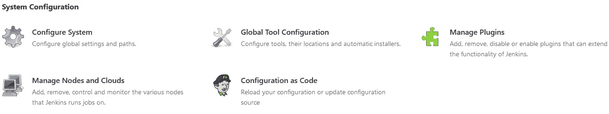
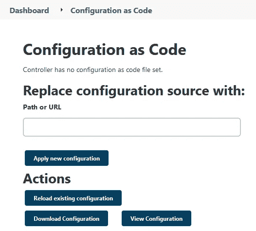
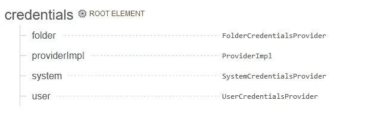
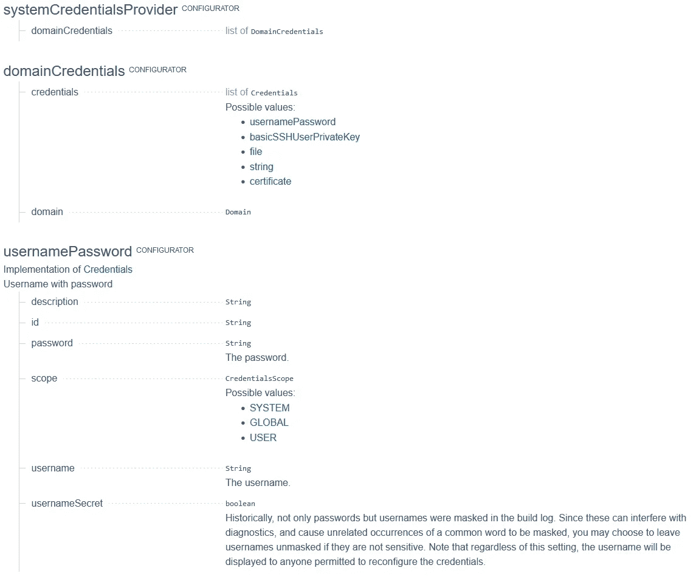

# Jenkins JCasC 初学者

> 原文：<https://medium.com/globant/jenkins-jcasc-for-beginners-819dff6f8bc?source=collection_archive---------0----------------------->


# 詹金斯配置噩梦

如果你已经看过 Jenkins 的配置设置，你可能会同意它可能有点拥挤，因为配置会根据安装的插件及其版本而变化，所以你的配置在不同的 Jenkins 服务器之间可能会有所不同。这可能会导致在臃肿的配置页面中进行更改成为一个可怕的过程。

此外，将 Jenkins 管道作为代码(如果你没有，你应该开始这样做)并拥有一个手动的 Jenkins 配置是没有意义的，因为有所有与之相关的问题；信息丢失、无法轻松复制配置、没有版本控制、缺少变更跟踪等等。应该有更容易的***【devo PS】***的方式去做。那么，让我告诉你，JCasC 正是你所需要的，我在这里向你指出如何使用它。

## 什么是 JCasC

幸运的是，有一个名为 [Jenkins Configuration 的 Jenkins 插件，代码为](https://www.jenkins.io/projects/jcasc/) (JCasC)，它允许我们用一种简单、友好、纯文本的 yaml 语法(取自官方文档)来描述 Jenkins 配置。使用 JCasC，您可以轻松地存储、复制和版本化大量的配置设置，并毫不费力地重新部署您的 Jenkins 服务器。请记住，有些插件可能与 JCasC 不兼容，但这并不意味着它永远不会兼容，每天都有越来越多的插件适应这个插件。

在这篇文章中，我将向你展示如何安装插件，理解文档并找到你需要的配置。通过一些实际的例子，您将能够自动化您的 Jenkins 服务器配置，并将其存储在一个存储库中。

## 安装 JCasC 插件

这部分取决于你如何安装你的 Jenkins 插件，你可以使用 Jenkins UI 中的插件管理器，Jenkins Cli 或者使用 Jenkins Docker 镜像文档中的 [shell 脚本](https://github.com/jenkinsci/docker/blob/master/install-plugins.sh)，你可以在[官方库](https://github.com/jenkinsci/docker/blob/master/README.md)中找到它作为 **install-plugins.sh** 。你可以像一个键值对象一样传递一个带有期望版本的插件列表，这样你就可以控制安装哪个版本以及如何升级插件。这也带来了将插件存储在存储库中并对其进行版本控制的好处。这是一个 plugins.txt 文件的示例:

```
ant:1.3
configuration-as-code:1414.v878271fc496f
git:latest
..
```

一旦你安装了插件，你会在 Jenkins UI 的系统配置下看到 JCasC 部分。在那里您可以设置配置文件的路径来加载 Jenkins 配置。最好将它们存储在同一个文件夹中，并根据配置将文件分开。即一般配置、安全性、节点—云等。



## JCasC 配置文件

该插件使用 **yaml** 文件来存储配置，幸运的是，如果您已经配置了一个 Jenkins，您可以以插件格式加载您的配置并将其存储在您的文件中。这可以通过进入 JCasC 插件配置并选择 ***视图配置*** 选项来完成。请记住，这只是出于指导目的，它可能不会加载所有内容，或者某些配置可能是错误的，这只是作为一个开始模板。另外，尽量只配置你知道的，不要弄乱你不了解的配置，错误的配置文件会破坏你的 Jenkins 实例。



JCasC plugin options

这是一个带有一些基本配置的示例 JCasC 文件，请注意间距/制表符，因为 yaml 格式严重依赖于缩进，所以请坚持使用您最喜欢的格式，并在所有文件中使用它。

```
credentials:
  system:
    domainCredentials:
      - credentials:
          - usernamePassword:
              id: "github-credentials"
              password: "{HASHEDPASSWORD}"
              scope: GLOBAL
              username: "USERNAME"jenkins:
  systemMessage: "Welcome to my Jenkins Instance"
  tool:
    git:
      installations:
        - home: "git"
          name: "Default"
  unclassified:
    globalLibraries:
      libraries:
        - defaultVersion:
          name: "my-shared-library"
          retriever:
            modernSCM:
              scm:
                git:
                  credentialsId: "github-credentials"
                  id: "shared-library-creds"
                  remote: "https://github.com/USERNAME/my-library"
                  traits:
                    - "gitBranchDiscovery"
```

在这一部分中，我们已经设置了 Jenkins 消息、GitHub 凭证(您可能希望避免在纯文本文件中添加秘密)、默认 git 安装和使用凭证从 GitHub 存储库中获取的共享库。这使我们能够通过几个 Jenkins 实例，从一个事实点标准化一些基本的 Jenkins 配置。当您的配置足够成熟时，您可以在几分钟内从 0 到生产启动 Jenkins 服务器，只需复制您已经定义的配置。

## 理解文档

JCasC 文档以两种方式提供，即[入门指南](https://github.com/jenkinsci/configuration-as-code-plugin/blob/master/README.md)和在您的 Jenkins 实例中，我建议首先查看官方文档以了解一些重要的 env 变量配置，一旦您掌握了它的要点，使用您的 Jenkins 上的自行生成的文档，文档将根据您已安装的插件而变化。这是文档外观的一个示例:



JCasC Documentation Root Element

您将看到一些**根元素**类别，这意味着该元素可以在文件中不缩进开始，并且您将看到一些**配置器**元素，它们可以在根元素内部。



JCasC Documentation Configurators

```
credentials:           ----> Root Element
  system:              ----> Configurator
    domainCredentials: ----> Configurator
      - credentials:
          - usernamePassword:
              id: "github-credentials"
              password: "{HASHEDPASSWORD}"
              scope: GLOBAL
              username: "USERNAME"
```

我们可以看到，我们使用一个凭证(根元素)和一些系统(配置器)凭证来定义 github 的用户名和密码。您可以在元素名称旁边查找配置器类型，并在文档中进行搜索，在撰写本文时，文档中的链接不起作用，因此尝试在页面中使用 ctrl+f(MAC OS 中的 cmd+f)进行搜索。

## 结论

如您所见，拥有标准化的 Jenkins 配置、存储、版本控制和清晰的格式有其优势，从头开始配置 Jenkins 实例是一项耗时的任务，该插件和一些脚本可以利用这项任务。复制一个全功能的詹金斯将会更容易，你将会以更自动化的方式完成更少的操作任务。这可以让你减少人性导致的错误，并把一个重要的过程安全地放入你已经使用的工具中(Git & Jenkins)。

## 证明文件

*   [https://www.jenkins.io/projects/jcasc/](https://www.jenkins.io/projects/jcasc/)
*   [https://github . com/Jenkins ci/configuration-as-code-plugin/blob/master/readme . MD](https://github.com/jenkinsci/configuration-as-code-plugin/blob/master/README.md)
*   【https://github.com/jenkinsci/docker/blob/master/README.md 