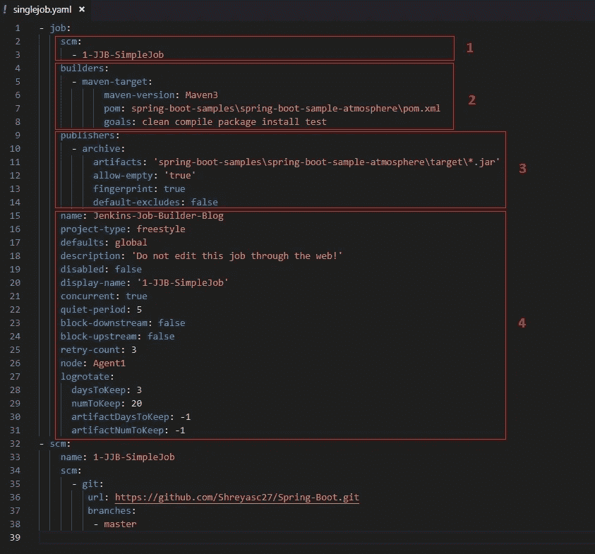
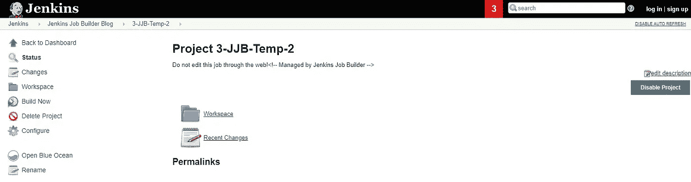

# 詹金斯工作建设者-搭便车指南

> 原文：<https://medium.com/quick-code/jenkins-job-builder-step-by-step-tutorial-f524e6892100?source=collection_archive---------0----------------------->

Clicked on the construction site next to my society in Pune, Maharashtra, India

3 月 16 日，我在 ThoughtWorks VodQA Pune 举办了一场关于 Jenkins——作为代码的管道的研讨会。在那个车间，我对 [Jenkins Job Builder](https://docs.openstack.org/infra/jenkins-job-builder/) 进行了实际操作。研讨会结束后，许多人走到我面前感谢我，特别是感谢我亲自指导 Jenkins Job Builder。在与他们交谈时，我意识到尽管 Jenkins Job Builder 的文档非常详细，但他们的示例逐步指南却不知何故缺失了。这是我写这篇博客的主要动机。

# **先决条件**

1.  [Pip](https://pypi.org/project/pip/)
2.  [Git](https://git-scm.com/)
3.  启动并运行 Jenkins 实例

# 设置 Jenkins 职务生成器

在这里，我们将介绍使用 Jenkins Job Builder 所需的步骤。

**步骤 1** —使用下面的命令克隆存储库

克隆的文件夹结构如下图所示-

Jenkins Job Builder Cloned Repository

**第 2 步** —复制存储库后，导航到文件夹“etc”，其中包含。ini”示例文件。复制粘贴该文件，并将其重命名为“jenkins_job.ini”

**第 3 步** —打开“jenkins_job.ini ”,关注以下快照中标有红星的 3 个参数。

1.  **用户** —詹金斯用户名
2.  **密码** —詹金斯密码
3.  **url** — Jenkins 实例 url

jenkins_jobs.ini

“**用户**”和“**网址**”顾名思义非常简单。但是，出于安全目的的“**密码**”不是纯文本，必须是 API 令牌，可用于进行经过身份验证的 REST Api 或 CLI 调用。

要获取登录用户的 API 令牌，请导航到**Jenkins**>**People**>**Your User**>**Configure**或者直接导航到 URL "[**http://<Your Domain>/User/<Your User>/Configure**](http://localhost:8080/user/shreyas/configure)"在我的情况下将是"[**http://localhost:http**](http://localhost:8080/user/shreyas/configure)

API Token

单击“添加新令牌”，然后单击“生成”，将生成的令牌复制粘贴到“jenkins_jobs.ini”中的密码。

Post generating the Api token

**第四步** —最后，更新的”。ini”文件将如下所示。查看 3 个更新的属性用户、密码、url。

出于本教程的目的，我们将保持其他参数不变。这是使用 Jenkins Job Builder 需要完成的一般配置。

# 编写 Jenkins 作业生成器 Yaml

使用 Jenkins Job Builder 的下一步配置是编写 yaml 文件。Yaml 文件是用于为创建 Jenkins 作业提供配置的文件。我们将会看到两种类型的 yaml

1.  **singlejob.yaml** —根据 yaml 中的配置创建作业
2.  **singlejobtemplate.yaml** —根据作业模板创建作业。可重复用于一次创建多个作业。
3.  **multiplejobtemplate . YAML**—根据作业模板创建多个配置相同的作业。所有的工作都将一次性创造出来。

# 单一工作 Yaml

singlejob.yaml

上述 yaml 由 4 个块组成

***Block 1* : scm** —这对应于我们将在 Jenkins 作业中使用的版本控制及其细节。在上面的例子中，它对应于 Git 版本控制、url 和分支。

**scm** block in the yaml which results in the above configuration in the Jenkins job

***Block 2*:*builders****—*这对应于 Jenkins 作业将要使用的构建管理工具。在上面的例子中，它对应于 maven、它的版本、pom.xml 和 maven 目标。

**builders** block in the yaml which results in the above configuration in the Jenkins job

***Block 3*:publishers**—这对应于将要生成发布的工件。在上面的例子中，它将是出现在路径*spring-boot-samples \ spring-boot-sample-atmosphere \ target 中的任何 jar 文件。*

**publishers** block in the yaml which results in the above configuration in the Jenkins job

***模块 4* :通用作业详细信息** —这对应于 Jenkins 作业常规选项卡中的通用配置详细信息。

**general** configuration of the Jenkins job

**詹金斯创造工作岗位的步骤**—

**步骤 1** —验证配置文件

1.  **詹金斯 _ 乔布斯. ini** 在**等**
2.  **singlejob.yaml** 在**作业**中

**第二步** —执行下面的命令

在上面的命令中需要注意的事情-

1.  **conf** 对应于 Jenkins job builder 要使用的初始化文件，在这种情况下是 **jenkins_job.ini** 存在于 **etc** 文件夹中。
2.  **更新**表示使用**作业**文件夹中的 **singlejob.yaml** 更新 Jenkins 作业。

其他配置参数可以参考[这里的](https://docs.openstack.org/infra/jenkins-job-builder/execution.html#job-builder-section)。

**命令行输出** -

Jenkins job builder command execution logs

**詹金斯创造的工作岗位**

Jenkins job **1-JJB-SimpleJob** created

Click on **1-JJB-SimpleJob**

点击左侧面板中的**配置**查看**1-JJB-简单工作**配置详情。该工作的细节将在**一般，供应链管理，建设者，出版商**以上快照。

# 单一作业模板 Yaml

SingleJobTemplate.yaml

***Block 5*:project—**这对应于这个 yaml 将作为参数的作业的名称。使用这个 yaml，可以创建具有相同配置但不同名称的多个作业。缺点是命令行将不得不运行多次。

**执行**命令-

**命令行输出** -

Jenkins job builder command execution logs

詹金斯创造的工作岗位-

Jenkins job **2-JJB-SimpleJob-Template** created

Click on **2-JJB-SimpleJob-Template**

点击左侧面板中的**配置**，查看 2**-JJB-简单作业-模板**配置详情。工作的细节将在**一般，供应链管理，建设者，出版商**快照以上。

# 多重作业模板 Yaml

MultipleJobTemplate.yaml

***模块 6* :作业模板—** 对应于作业模板的名称，将使用该模板创建下一组作业。使用这个 yaml，只需运行一次命令行，就可以创建配置相同但名称不同的多个作业。

**执行**的命令-

**命令行输出** -

Jenkins job builder command execution logs — 3 Jobs created

**在詹金斯创建的工作** -

Jenkins job **3-JJB-Temp-1, 3-JJB-Temp-2, 3-JJB-Temp-3** created

Click on of the 3 jobs created

点击左侧面板中的**配置**查看**3-JJB-温度-1，3-JJB-温度-2，3-JJB-温度-3** 配置详情。工作的细节将在**一般，供应链管理，建筑商，出版商**以上快照。

Clicked on the construction site next to my society in Pune, Maharashtra, India

# **参考资料**

**上面例子中用到的 jenkins_job.ini** 和 **yamls** 可以在 Git 库[这里](https://github.com/Shreyasc27/JenkinsJobBuilderBlog.git)找到。