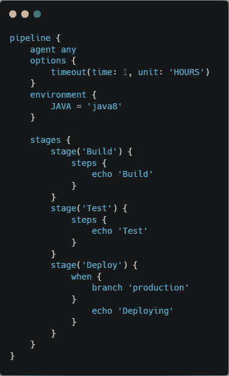
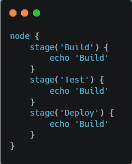

# 詹金斯管道:声明式与脚本式

> 原文：<https://medium.com/globant/jenkins-pipeline-declarative-vs-scripted-21f8688ee16a?source=collection_archive---------1----------------------->

大多数 DevOps 工程师和开发人员在日常活动中都会与 Jenkins 互动。Jenkins 是一个自动化工具，帮助开发人员构建、测试和部署应用程序。如今，人们更喜欢使用 Jenkins 管道来建立构建、测试和部署工作流，而不是自由式工作。Jenkins pipeline 是构建、测试和部署应用程序的最佳推荐方式。

Jenkins 管道有两种类型:声明式和脚本式。在开始开发管道之前，必须意识到两者之间的差异。在这篇博客中，我们将讨论声明式管道和脚本式管道之间的区别。本博客将帮助您根据自己的需求选择合适的管道类型。

在本文中，我们将讨论以下几点:

1.  詹金斯管道公司
2.  声明式与脚本式管道
    2.1。简介
    2.2。灵活性&简单性
    2.3。编程模型
    2.4。局限性
    2.5。与蓝海
    2.6 的融合。功能的
3.  结论
4.  参考

# **1-詹金斯管道**

管道是一系列步骤或作业的集合，这些步骤或作业在序列中相互关联。

Jenkins 支持不同的插件，这些插件有助于实现到 Jenkins 的持续集成和持续交付管道。

CI/CD 管道是一种通过不同的工作站(例如版本控制系统、代码检查、测试用例执行、构建、工件创建、工件存储库和服务器上的部署)从版本控制系统向用户获取源代码的自动化方式。

管道也被称为“代码式部署”。

Jenkins 管道被写入一个名为 Jenkinsfile(您可以使用不同的名称)的文本文件中，该文件可以提交到项目的源代码控制存储库中。

我们可以将不同的工具集集成到 Jenkins 上，以创建 CI 和 CD 管道。

最初创建 Jenkins Pipeline 时，选择 Groovy 作为基础。Jenkins 长期以来一直附带一个嵌入式 Groovy 引擎，为管理员、开发人员和用户等提供高级脚本功能。

Jenkins 是基于 DSL 的，DSL 是领域特定语言。特定领域语言是为解决特定领域问题而开发的语言。

可以使用两种类型的语法来编写管道:声明式和脚本式。

声明式管道和脚本式管道本质上是同一管道子系统。它们是“管道即代码”的持久实现。他们都能够使用插件和共享库。然而，它们的不同之处在于语法和灵活性。

# **2-声明式与脚本式管道**

## **2.1 简介:**

**Declarative:**Declarative 是一种更新更高级的管道代码实现。

**Scripted:** Scripted 是 Jenkins 中第一个也是传统的管道代码实现。它被设计成用 Groovy 构建的通用 DSL(领域特定语言)。

## **2.2 灵活性&简单性:**

**声明性:**Groovy 的学习曲线通常并不适合给定团队的所有成员，因此创建了声明性管道来为创作 Jenkins 管道提供更简单、更有主见的定义良好的语法。

脚本化:脚本化管道是一个全功能的编程环境。脚本管道为 Jenkins 用户提供了巨大的灵活性和可扩展性。

## **2.3 编程模型:**

**声明性:**声明性管道鼓励声明性编程模型。在声明式编程中，你指定你想要什么。你不关心它将如何完成。

**脚本化:**脚本化管道遵循一种更为强制性的编程模型。在命令式编程中，您指定您想要什么以及应该如何做。

## **2.4 限制:**

**声明式**:声明式管道以更严格的预定义结构限制了用户可用的内容，这使得它成为更简单的 CI/CD 管道的理想选择。

**脚本化:**脚本化管道提供的限制非常少，比如结构和语法是 Groovy 自己定义的唯一限制。对于那些有更复杂需求的用户来说，这是一个理想的选择。

## **2.5 融入蓝海:**

**声明性:**声明性管道可以与 Blue Ocean 集成(Blue Ocean 是 Jenkins 的一种新的用户体验，基于可个性化的现代设计，允许用户以图形方式创建、可视化和调试 CI/CD 管道)。

**脚本化:**脚本化管道不支持蓝海集成。

## **2.6 功能:**

## **代码验证:**

**声明式:**声明式管道支持代码验证。代码验证在执行任何阶段之前完成。因此，如果管道中有任何语法错误或打字错误，用户将在执行开始时得到一个错误。这可能会节省我们很多时间。

**脚本化:**脚本化管道在执行阶段之前不支持任何类型的代码验证。它将在执行特定步骤时抛出一个错误，该错误有语法错误或打字错误。

## **从阶段重新启动:**

**声明性:**声明性管道支持从失败阶段重启。它使用先前构建的工作区来确定失败的阶段，并从失败的阶段开始执行。这可能会节省我们的时间和精力。

**脚本化:**脚本化管道不支持“从阶段重新启动”选项。

## **选项块:**

**声明性:**声明性管道支持选项块。在声明性管道中，选项与管道逻辑分离，可以放在阶段之前。使用 options 指令，我们可以在管道本身中配置特定于管道的选项。

**脚本化:**脚本化管道不支持选项块，但不同的选项(如属性)可用于管道逻辑。

## **跳过阶段:**

**声明性:**在声明性管道中，可以使用“When”块跳过阶段。如果不满足条件，则“When”块跳过整个阶段。

**脚本化:**在脚本化管道中，不能完全跳过阶段。可以使用 If 语句跳过阶段内部的逻辑，但是执行将通过管道中的每个阶段。

## **环境块:**

**声明性:**声明性管道支持环境块。环境块帮助定义全局变量并将凭证加载到管道中。

**脚本化:**脚本化管道不支持环境块，但是你可以使用 Groovy 以不同的方式定义全局变量和使用凭证。

## **交叉功能支持:**

**声明性:**我们可以将脚本化管道块集成到“脚本”步骤内的声明性管道中。

**脚本化:**特定于声明性管道的块不能在脚本化管道中使用。

**语法:**

**声明性:**

**照本宣科:**

# **3-结论:**

声明式管道和脚本式管道都是构建部署管道的好方法，但如今，声明式管道是编写管道的更好方法。您可以在使用脚本步骤的声明性管道中利用脚本管道的优势，但反之则不然。

# **4-参考:**

[https://www.jenkins.io/doc/book/pipeline/](https://www.jenkins.io/doc/book/pipeline/)