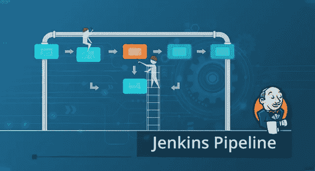
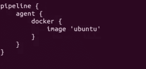
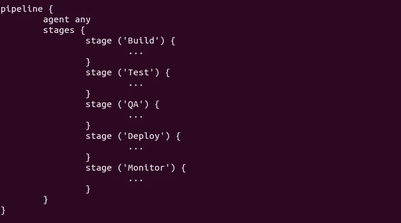
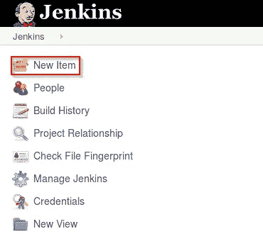
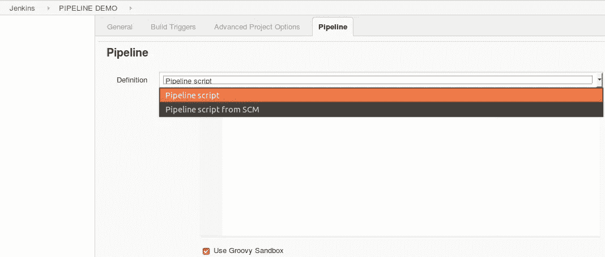
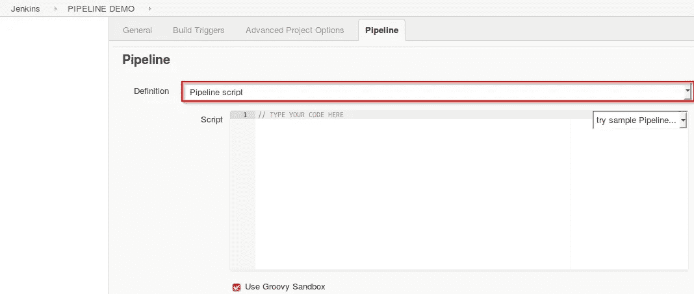
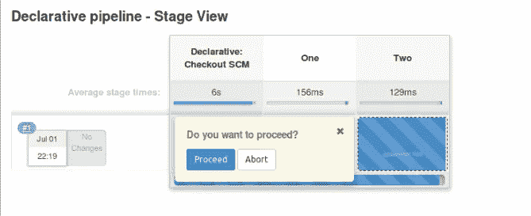
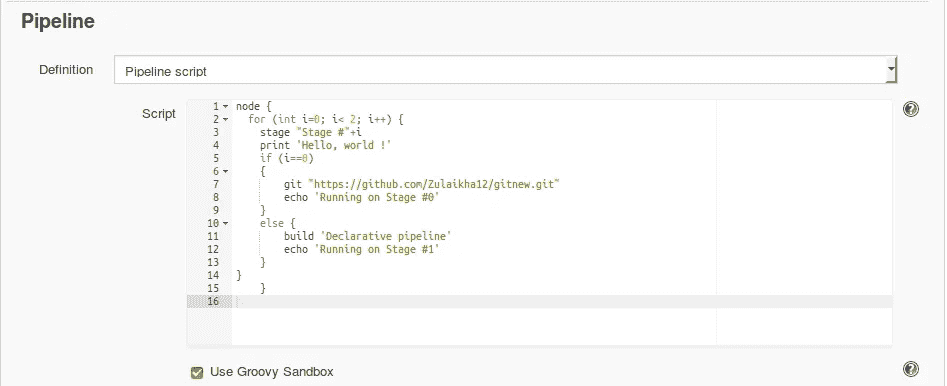
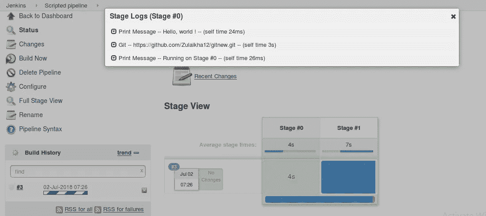
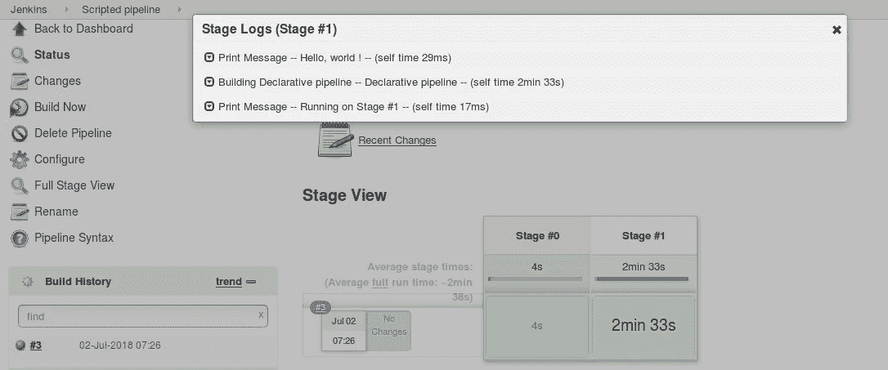

# 詹金斯管道综合指南

> 原文：<https://medium.com/edureka/jenkins-pipeline-tutorial-continuous-delivery-75a86936bc92?source=collection_archive---------0----------------------->



Jenkins Pipeline — Edureka

与 Expedia，Autodesk，UnitedHealth Group，Boeing 等巨头合作。利用詹金斯进行连续交付管道，可以解读出*连续交付* ***&*** *詹金斯技能*的需求。你有没有想过为什么詹金斯如此受欢迎，尤其是在最近几年？它受欢迎的主要因素之一是 **Jenkins pipeline** ，如果你正在寻找一个简单的 Jenkins pipeline 教程，这个博客是你的首选。Jenkins pipeline 是一个连续的交付管道，它将软件工作流作为代码来执行。

下面是本文涉及的主题列表:

*   什么是詹金斯管道？
*   什么是 Jenkinsfile？
*   管道概念
*   创建您的第一个詹金斯管道
*   声明性管道演示
*   脚本化管道演示

我们都知道 Jenkins 已经被证明是实施[持续集成](https://www.edureka.co/blog/continuous-integration?utm_source=medium&utm_medium=content-link&utm_campaign=jenkins-pipeline-tutorial-continuous-delivery)、持续测试和持续部署以生产高质量软件的专家。谈到**连续交付**，詹金斯使用了一种叫做詹金斯管道的功能。为了理解为什么要引入 Jenkins pipeline，我们必须理解什么是持续交付，以及为什么它很重要。


简而言之，持续交付就是始终发布软件的能力。这是一种确保软件始终处于**生产就绪状态**的做法。

这是什么意思？这意味着每次对代码或基础设施进行更改时，软件团队必须以这样一种方式工作，即使用各种自动化工具快速构建和测试这些更改，然后将构建交付生产。

通过加快交付过程，开发团队将有更多的时间来实现任何所需的**反馈**。这个过程，以更快的速度将软件从构建到生产状态，是通过实现持续集成和持续交付来实现的。

持续交付确保了软件的构建、测试和发布更加频繁。它降低了增量软件发布的成本、时间和风险。为了实现连续交付，Jenkins 引入了一项名为 Jenkins pipeline 的新功能。本文将帮助您理解 Jenkins 管道的重要性。

# 什么是詹金斯管道？

管道是通过使用自动化工具将软件从版本控制带到最终用户手中的作业的集合。这是一个用于在我们的软件开发工作流程中整合持续交付的特性。

多年来，已经有多个 Jenkins pipeline 版本，包括 Jenkins 构建流、Jenkins 构建管道插件、Jenkins 工作流等。这些插件的关键特性是什么？

*   它们以管道的形式将多个 Jenkins 作业表示为一个完整的工作流。
*   这些管道是做什么的？这些管道是詹金斯作业的**集合**，它们以特定的顺序相互触发。

我举个例子来解释一下。假设我正在 Jenkins 上开发一个小应用程序，我想构建、测试和部署它。为此，我将分配 3 个作业来执行每个流程。因此，job1 负责构建，job2 负责执行测试，job3 负责部署。我可以使用 Jenkins 构建管道插件来执行这项任务。在创建了三个作业并将它们按顺序链接起来之后，构建插件将把这些作业作为一个管道来运行。

此图显示了在管道中同时运行的所有 3 个作业的视图。


这种方法对于部署小型应用程序非常有效。但是，当复杂的管道中有几个过程(构建、测试、单元测试、集成测试、预部署、部署、监控)运行数百个作业时，会发生什么呢？

这种复杂管道的维护成本是巨大的，并且随着工艺数量的增加而增加。构建和管理如此大量的作业也变得很乏味。为了解决这个问题，引入了一个名为**詹金斯管道项目**的新功能。

这个管道的关键特性是通过代码定义整个部署流程。这是什么意思？这意味着 Jenkins 定义的所有标准作业都是作为一个完整的脚本手动编写的，它们可以存储在版本控制系统中。它基本上遵循代码为的**管道原则。现在，您可以对整个工作流进行编码，并将其放在一个 **Jenkinsfile** 中，而不是为每个阶段构建几个作业。以下是您应该使用 Jenkins 管道的原因列表。**

## 詹金斯管道优势

*   它通过使用 **Groovy DSL** (领域特定语言)将简单到复杂的管道建模为代码
*   代码存储在一个名为 Jenkinsfile 的文本文件中，该文件可以**签入 SCM** (源代码管理)
*   通过将**用户输入**整合到管道中来改进用户界面
*   就 Jenkins 主服务器的计划外重启而言，它是耐用的
*   它可以从保存的**检查点**重新启动
*   它通过合并条件循环、fork 或 join 操作来支持复杂的管道，并允许并行执行任务
*   它可以与其他几个插件集成

# 什么是 Jenkinsfile？

Jenkinsfile 是一个文本文件，它将整个工作流存储为代码，并且可以将其签入到本地系统的 SCM 中。这有什么好处？这使得开发人员能够在任何时候访问、编辑和检查代码。

Jenkinsfile 是使用 Groovy DSL 编写的，它可以通过 text/groovy 编辑器或 Jenkins 实例上的配置页面来创建。它基于两种语法编写，即:

*   **声明式管道语法**
*   **脚本化管道语法**

声明性管道是一个相对较新的特性，它将管道作为代码概念来支持。它使管道代码更容易阅读和编写。这段代码写在一个 Jenkinsfile 中，它可以被签入到一个源代码控制管理系统中，比如 [Git。](https://www.edureka.co/blog/git-tutorial?utm_source=medium&utm_medium=content-link&utm_campaign=jenkins-pipeline-tutorial-continuous-delivery)

然而，脚本管道是编写代码的传统方式。在这个管道中，Jenkinsfile 是在 Jenkins UI 实例上编写的**。虽然这两个管道都基于 groovy DSL，但是脚本管道使用更严格的基于 groovy 的语法，因为它是第一个建立在 groovy 基础上的管道。因为这个 Groovy 脚本通常不是所有用户都想要的，所以引入了声明性管道来提供更简单和更多可选的 Groovy 语法。**

声明性管道在标记为“管道”的块中定义，而脚本化管道在“**节点**中定义。这将在下面用一个例子来解释。

# 管道概念

## 管道

这是一个用户定义的模块，包含所有流程，如构建、测试、部署等。它是 Jenkinsfile 中所有阶段的集合。所有阶段和步骤都在该块中定义。它是声明性管道语法的关键块。


## 结节

节点是执行整个工作流的机器。它是脚本化管道语法的关键部分。


声明式管道和脚本式管道都有各种通用的强制部分，例如必须在管道中定义的阶段、代理和步骤。这些解释如下:

## 代理人

代理是一个指令，它可以仅使用一个 Jenkins 实例运行多个构建。该特性有助于将工作负载分配给不同的代理，并在一个 Jenkins 实例中执行多个项目。它指示 Jenkins**为构建分配一个执行者**。

可以为整个管道指定单个代理，也可以分配特定的代理来执行管道中的每个阶段。代理使用的几个参数是:

## **任何**

在任何可用的代理上运行管道/阶段。

## **无**

此参数应用于管道的根，它表示整个管道没有全局代理，每个阶段都必须指定自己的代理。

## **标签**

对标记的代理执行管道/阶段。

## **码头工人**

此参数使用 docker 容器作为管道或特定阶段的执行环境。在下面的例子中，我使用 docker 来获取一个 ubuntu 图片。这个映像现在可以用作运行多个命令的执行环境。



## 阶段

该块包含所有需要执行的工作。这项工作是以阶段的形式规定的。该指令中可以有多个阶段。每个阶段都执行特定的任务。在下面的例子中，我创建了多个阶段，每个阶段执行一个特定的任务。



## 步伐

可以在一个阶段块中定义一系列步骤。这些步骤按顺序执行以执行一个阶段。steps 指令中必须至少有一个步骤。在下面的例子中，我在构建阶段实现了一个 echo 命令。该命令作为“构建”阶段的一部分执行。


现在您已经熟悉了基本的管道概念，让我们从如何创建 Jenkins 管道开始。

# 创建你的第一个詹金斯管道。

**第 1 步**:登录 Jenkins，从仪表板中选择“新项目”。



**步骤 2** :接下来，输入管道的名称，并选择“管道”项目。单击“确定”继续。


**步骤 3** :向下滚动到管道，选择您想要声明式管道还是脚本式管道。



**步骤 4a** :如果你想要一个脚本化的管道，那么选择“管道脚本”并开始输入你的代码。



**步骤 4b** :如果您想要一个声明性管道，则选择“来自 SCM 的管道脚本”并选择您的 SCM。在我的例子中，我将在整个演示中使用 Git。输入您的存储库 URL。


**步骤 5** :脚本路径中是 Jenkinsfile 的名称，将从您的 SCM 访问该文件并运行。最后点击“应用”和“保存”。您已经成功创建了第一个 Jenkins 管道。


现在您已经知道了如何创建管道，让我们开始演示吧。

# 声明性管道演示

演示的第一部分展示了声明性管道的工作方式。参考上面的“创建您的第一个 Jenkins 管道”开始。让我从解释我在 Jenkinsfile 中编写的代码开始演示。

因为这是一个声明性的管道，所以我在本地将代码写在一个名为‘Jenkins file’的文件中，然后将这个文件推送到我的全局 git 存储库中。在执行“声明性管道”演示时，将从我的 git 存储库中访问该文件。下面是构建管道以运行多个阶段的简单演示，每个阶段执行一个特定的任务。

*   通过在管道块中编写代码来定义声明性管道。在这个块中，我用标签‘any’定义了一个代理。这意味着管道在任何可用的执行器上运行。
*   接下来，我创建了四个阶段，每个阶段执行一个简单的任务。
*   第一阶段执行一个简单的 echo 命令，该命令在“步骤”块中指定。
*   第二阶段执行输入指令。该指令允许**在一个阶段提示用户输入**。它显示一条消息并等待用户输入。如果输入被批准，那么该阶段将触发进一步的部署。
*   在这个演示中，一个简单的输入信息“你想继续吗？”已显示。在接收到用户输入时，流水线要么继续执行，要么中止。


*   第三阶段运行带有“not”标签的“when”指令。该指令允许您根据“when”循环中定义的条件来执行一个步骤。如果满足条件，将执行相应的阶段。必须在阶段级别定义它。
*   在这个演示中，我使用了“not”标签。当嵌套条件为**假**时，该标签执行一个阶段。因此，当“分支为主”为假时，执行以下步骤中的 echo 命令。


```
pipeline {
         agent any
         stages {
                 stage('One') {
                 steps {
                     echo 'Hi, this is Zulaikha from edureka'
                 }
                 }
                 stage('Two') {
                 steps {
                    input('Do you want to proceed?')
                 }
                 }
                 stage('Three') {
                 when {
                       not {
                            branch "master"
                       }
                 }
                 steps {
                       echo "Hello"
                 }
                 }
                 stage('Four') {
                 parallel { 
                            stage('Unit Test') {
                           steps {
                                echo "Running the unit test..."
                           }
                           }
                            stage('Integration test') {
                              agent {
                                    docker {
                                            reuseNode true
                                            image 'ubuntu'
                                           }
                                    }
                              steps {
                                echo "Running the integration test..."
                              }
                           }
                           }
                           }
              }
}
```

*   第四阶段运行一个并行指令。该指令允许您并行运行嵌套阶段。在这里，我并行运行两个嵌套的阶段，即“单元测试”和“集成测试”。在集成测试阶段，我定义了一个特定于阶段的 docker 代理。该 docker 代理将执行“集成测试”阶段。
*   在该阶段中有两个命令。 **reuseNode** 是一个布尔值，当返回 true 时，docker 容器将在管道顶层指定的代理上运行，在这种情况下，顶层指定的代理是‘any ’,这意味着容器将在任何可用的节点上执行。默认情况下，该布尔值返回 false。
*   使用并行指令时有一些限制:

1.  一个阶段可以有一个并行或步进程序块，**，但不能同时有两个**
2.  在一个并行指令中，不能嵌套另一个并行指令
3.  如果阶段具有并行指令，则不能定义“代理”或“工具”指令

现在我已经解释了代码，让我们运行管道。下面的截图是管道的结果。在下图中，管道等待用户输入，单击“继续”，执行恢复。



# 脚本化管道演示

为了让您对脚本管道有一个基本的了解，让我们执行一个简单的代码。我将运行以下脚本。



```
node {**for** (i=0; i<2; i++) {stage "Stage #"+iprint 'Hello, world !'**if** (i==0){git "[https://github.com/Zulaikha12/gitnew.git](https://github.com/Zulaikha12/gitnew.git)"echo 'Running on Stage #0'}**else** {build 'Declarative pipeline'echo 'Running on Stage #1'}}}
```

在上面的代码中，我定义了一个“节点”块，并在其中运行以下代码:

*   条件“for”循环。该 for 循环用于创建 2 个阶段，即阶段#0 和阶段#1。一旦创建了阶段，它们就会打印“hello world！”消息
*   接下来，我将定义一个简单的“if else”语句。如果‘I’的值等于零，那么阶段#0 将执行以下命令(git 和 echo)。“git”命令用于克隆指定的 git 目录，echo 命令只显示指定的消息
*   当“I”不等于零时，执行 else 语句。因此，阶段#1 将运行 else 块中的命令。“build”命令只是运行指定的作业，在这种情况下，它运行我们之前在演示中创建的“声明性管道”。一旦完成作业的执行，它就运行 echo 命令

现在我已经解释了代码，让我们运行管道。以下屏幕截图是脚本化管道的结果。

1.  显示了阶段#0 的结果



2.显示了阶段#1 的日志，并开始构建“声明性管道”


3.“声明性管道”作业的执行。


4.结果。



我希望这篇文章能帮助您理解脚本化和声明性管道的基础。如果你想查看更多关于人工智能、Python、道德黑客等市场最热门技术的文章，你可以参考 Edureka 的官方网站。

请留意本系列中的其他文章，它们将解释 DevOps 的各个方面。

> *1。* [*DevOps 教程*](/edureka/devops-tutorial-89363dac9d3f)
> 
> *2。* [*Git 教程*](/edureka/git-tutorial-da652b566ece)
> 
> *3。* [*詹金斯教程*](/edureka/jenkins-tutorial-68110a2b4bb3)
> 
> *4。* [*码头工人教程*](/edureka/docker-tutorial-9a6a6140d917)
> 
> *5。* [*Ansible 教程*](/edureka/ansible-tutorial-9a6794a49b23)
> 
> *6。* [*木偶教程*](/edureka/puppet-tutorial-848861e45cc2)
> 
> *7。* [*厨师教程*](/edureka/chef-tutorial-8205607f4564)
> 
> *8。* [*Nagios 教程*](/edureka/nagios-tutorial-e63e2a744cc8)
> 
> *9。* [*如何编排 DevOps 工具？*](/edureka/devops-tools-56e7d68994af)
> 
> *10。* [*连续交货*](/edureka/continuous-delivery-5ca2358aedd8)
> 
> *11。* [*持续集成*](/edureka/continuous-integration-615325cfeeac)
> 
> 12。 [*连续部署*](/edureka/continuous-deployment-b03df3e3c44c)
> 
> *13。* [*持续交付 vs 持续部署*](/edureka/continuous-delivery-vs-continuous-deployment-5375642865a)
> 
> *14。* [*CI CD 管道*](/edureka/ci-cd-pipeline-5508227b19ca)
> 
> 15。 [*码头工人撰写*](/edureka/docker-compose-containerizing-mean-stack-application-e4516a3c8c89)
> 
> 16。 [*码头工人群*](/edureka/docker-swarm-cluster-of-docker-engines-for-high-availability-40d9662a8df1)
> 
> 17。 [*Docker 联网*](/edureka/docker-networking-1a7d65e89013)
> 
> *18。* [*可担任的角色*](/edureka/ansible-roles-78d48578aca1)
> 
> *19。* [*易变拱顶*](/edureka/ansible-vault-secure-secrets-f5c322779c77)
> 
> 20。 [*适用于 AWS*](/edureka/ansible-for-aws-provision-ec2-instance-9308b49daed9)
> 
> *21。* [*顶级 Git 命令*](/edureka/git-commands-with-example-7c5a555d14c)
> 
> *22。* [*顶级 Docker 命令*](/edureka/docker-commands-29f7551498a8)
> 
> *23。*[*Git vs GitHub*](/edureka/git-vs-github-67c511d09d3e)
> 
> *24。* [*DevOps 面试问题*](/edureka/devops-interview-questions-e91a4e6ecbf3)
> 
> *25。* [*谁是 DevOps 工程师？*](/edureka/devops-engineer-role-481567822e06)
> 
> *26。* [*DevOps 生命周期*](/edureka/devops-lifecycle-8412a213a654)
> 
> *27。*[*Git ref log*](/edureka/git-reflog-dc05158c1217)
> 
> *28。* [*可变配置*](/edureka/ansible-provisioning-setting-up-lamp-stack-d8549b38dc59)
> 
> *29。* [*组织正在寻找的顶尖 DevOps 技能*](/edureka/devops-skills-f6a7614ac1c7)
> 
> 三十岁。 [*瀑布 vs 敏捷*](/edureka/waterfall-vs-agile-991b14509fe8)
> 
> 31。 [*Maven 用于构建 Java 应用*](/edureka/maven-tutorial-2e87a4669faf)
> 
> *32。* [*詹金斯备忘单*](/edureka/jenkins-cheat-sheet-e0f7e25558a3)
> 
> *33。* [*Ansible 小抄*](/edureka/ansible-cheat-sheet-guide-5fe615ad65c0)
> 
> 34。 [*Ansible 面试问答*](/edureka/ansible-interview-questions-adf8750be54)
> 
> *三十五。* [*50 码头工人面试问题*](/edureka/docker-interview-questions-da0010bedb75)
> 
> 36。 [*敏捷方法论*](/edureka/what-is-agile-methodology-fe8ad9f0da2f)
> 
> *37。* [*詹金斯面试问题*](/edureka/jenkins-interview-questions-7bb54bc8c679)
> 
> *38。* [*Git 面试问题*](/edureka/git-interview-questions-32fb0f618565)
> 
> 39。 [*Docker 架构*](/edureka/docker-architecture-be79628e076e)
> 
> *40。*[*devo PS 中使用的 Linux 命令*](/edureka/linux-commands-in-devops-73b5a2bcd007)
> 
> *41。* [*詹金斯 vs 竹子*](/edureka/jenkins-vs-bamboo-782c6b775cd5)
> 
> *42。* [*Nagios 面试问题*](/edureka/nagios-interview-questions-f3719926cc67)
> 
> *43。* [*DevOps 实时场景*](/edureka/jenkins-x-d87c0271af57)
> 
> *44。* [*詹金斯和詹金斯 X 的区别*](/edureka/jenkins-vs-bamboo-782c6b775cd5)
> 
> *45。*[*Docker for Windows*](/edureka/docker-for-windows-ed971362c1ec)
> 
> *46。*[*Git vs Github*](http://git%20vs%20github/)

*原载于 2018 年 7 月 11 日*[*https://www.edureka.co*](https://www.edureka.co/blog/jenkins-pipeline-tutorial-continuous-delivery)*。*