# Jenkins 使用 OKTA、SAML 和授权策略保护身份验证。

> 原文：<https://medium.com/globant/jenkins-secured-authentication-with-okta-saml-and-authorization-strategy-bc8408fd8d?source=collection_archive---------0----------------------->

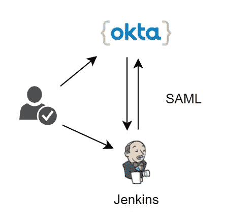

当访问公共或私有应用程序时，大多数 IT/云工程师的顾虑都与安全性有关。因此，身份验证过程必须尽可能安全。现在，当我们谈论 CI/CD(尤其是 Jenkins)时，我们可以探索市场上可用的安全登录方法和服务。

在这里，我们将介绍与使用 Okta 安全登录 Jenkins 相关的每个步骤。

[**什么是 OKTA？**](https://www.youtube.com/watch?v=c0r1Rlv3E2Q)

Okta 是一个旨在遵守安全认证协议和单点登录功能的平台，它通过帮助组织、客户和客户端集成现有目录(如 AWS、Azure、GCP、Slack 等)来提供一致的单点登录体验。

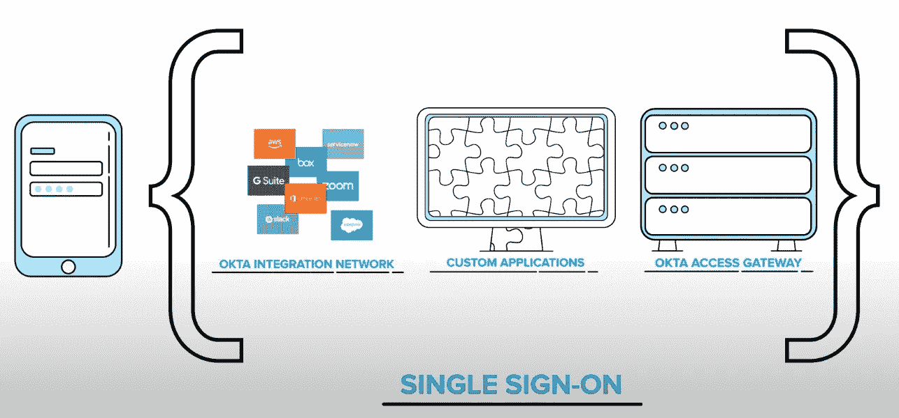

# 秘诀

*   一个 Okta 账户。
*   詹金斯的例子。
*   詹金斯[安装了 SAML 插件](https://plugins.jenkins.io/saml)。
*   Jenkins [安装了基于角色的授权策略](https://plugins.jenkins.io/role-strategy)插件。

# 步骤:

# 在奥克塔

转到贵组织的管理仪表板 URL[https://your-organization.okta.com/admin/dashboard](https://vrio-admin.okta.com/admin/dashboard)。

从左侧菜单中选择**应用**，从中间屏幕点击**浏览应用目录**按钮，并在搜索框中输入 **Jenkins** 。您可以在那里添加 Jenkins 应用程序。

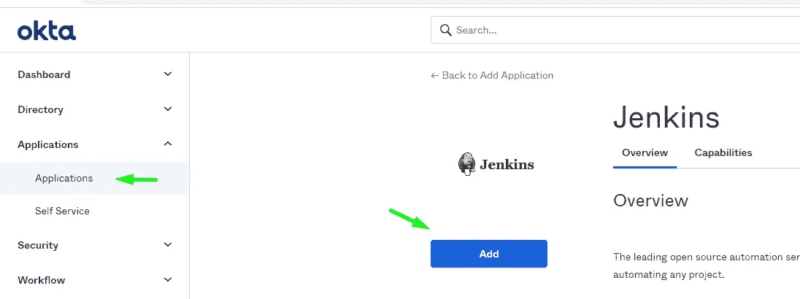

2.设置 OKTA 应用程序:

在**应用标签**中:为您的 Jenkins 提供一个友好的命名约定。

在**基本网址**中:提供你的 https://my-organization.my-domain.com:8888 的 HTTPS·詹金斯网址[。](https://myjenkins.my-domain.com:8888)

***注意*** *:虽然 OKTA 允许你设置一个 HTTP 协议，但不建议这样做。如果您需要在您的 Jenkins 实例中配置 SSL，请参考以下指南(*[*re f1*](https://devopscube.com/configure-ssl-jenkins/)*，*[*re F2*](https://gist.github.com/geraldvillorente/26acf3a351643c618125)*)。*

*如果你想在****AWS****中配置一个* ***自管理 SSL 服务*** *你可以参考下面的 EC2 实例指南:*

[*为 EC2*](https://aws.amazon.com/premiumsupport/knowledge-center/configure-acm-certificates-ec2/) 托管的网站配置 ACM 证书

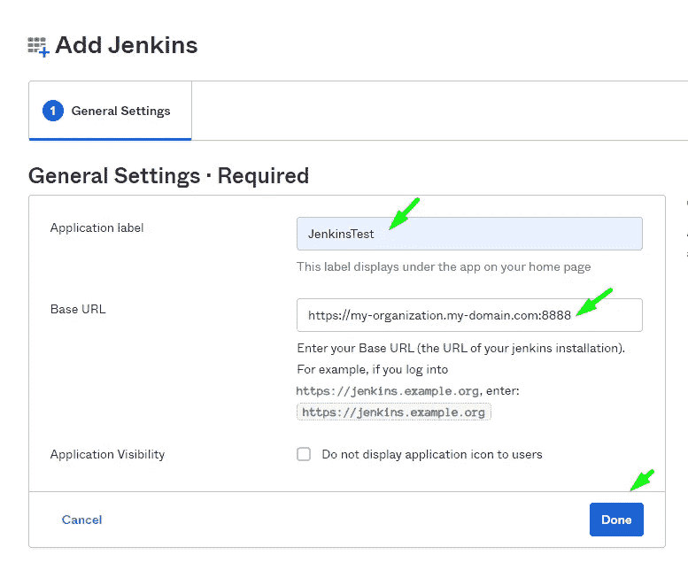

3.设置 OKTA 组:

从左侧菜单中选择**目录**、**组、**，然后点击屏幕中央的**添加** **组**按钮。

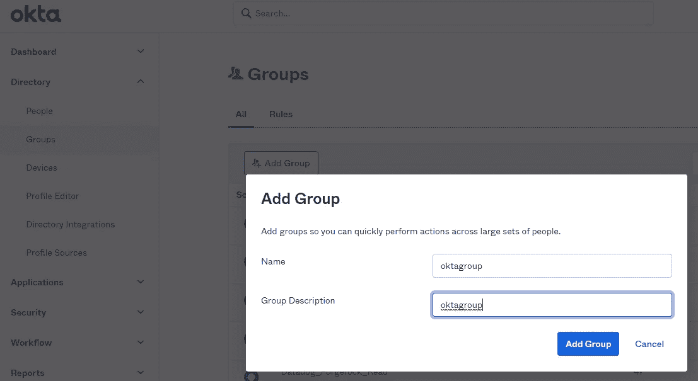

选择您的小组，然后点击**管理人员**按钮。在那里，添加您希望有权访问您的 Jenkins 安装的个人，然后单击**保存**按钮。

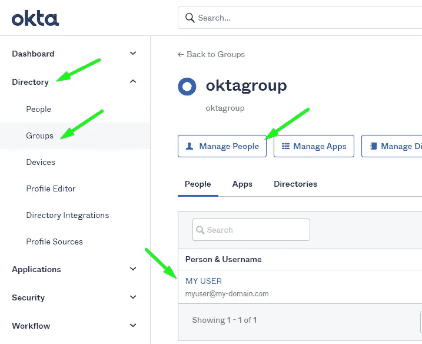

4.设置 OKTA 应用程序:

从左侧菜单中，选择**应用**、**应用、**然后点击 Jenkins 应用。然后，点击选项卡上的**标志，并点击**编辑**高亮显示的文本。**

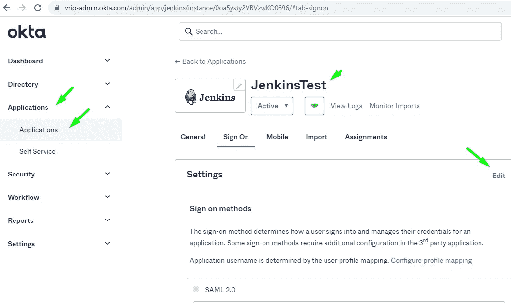

配置 SAML 2.0 属性:

在**默认继电器状态**:留空。

在**禁用强制认证**中:默认(勾选)

在**配置的 SAML 属性**中:

*   分组:选择**匹配正则表达式**和添加图案**。***

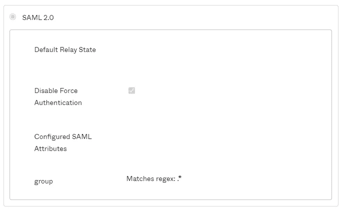

点击**查看设置说明**按钮，这将在**新标签**中打开 **OKTA 导轨**，保持其打开状态，因为在下一步中将需要其中生成的值。

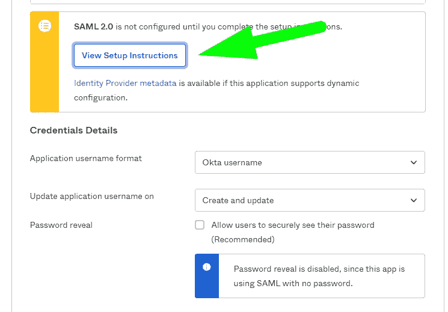

**中的**凭证详情:**中的
申请用户名格式** : Okta 用户名
中的**更新申请用户名于:**创建并更新

向下滚动到底部并点击**保存**按钮。

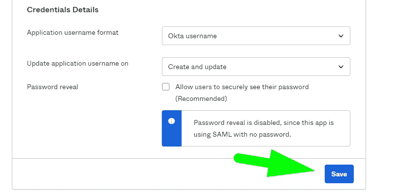

# 在詹金斯

***相关说明:***

*在对 SAML 模块进行任何修改之前，强烈建议***备份 Jenkins 的****config . XML****文件。在大多数 Linux 发行版中，这个文件可以在下面的路径中找到:**

```
**/var/lib/jenkins/config.xml**
```

****回滚****

**如果事情没有按预期进行，恢复您备份的****config . XML****文件，并重新启动您的 Jenkins 安装。此外，确保****config . XML****文件具有适当的权限，如下所示:**

```
*-rw-r--r-- 1 jenkins jenkins Nov 5 16:20 /var/lib/jenkins/config.xml*
```

****解锁你的詹金斯实例****

**以防您不小心忘记备份 Jenkins 的****config . XML****文件，并因此发现被锁定在 Jenkins 安装之外。您可以通过在 ssh 控制台中执行下面一行来恢复访问:**

```
*sed -i 's/<useSecurity>true<\/useSecurity>/<useSecurity>false<\/useSecurity>/g' /var/lib/jenkins/config.xml*
```

**在执行* *这一行****由于此命令将禁用 Jenkins 中的全局认证，任何具有您的安装 URL 的人都将以管理员权限进入。****

****执行上述命令后，进入* ***重新启动 Jenkins*** *安装，使这些更改生效。然后，转到您的* ***管理面板*** *并再次设置安全，值得一提的是，这个过程应该作为最后的手段来应用。****

1.  ***转到**管理詹金斯** > **配置全局安全性**:***

***返回上一步打开的选项卡**查看设置说明。**向下滚动到指南中的 **IdP 元数据**，复制其值并将信息粘贴到您的 Jenkins **SAML 2.0 IdP 元数据**字段 **:*****

***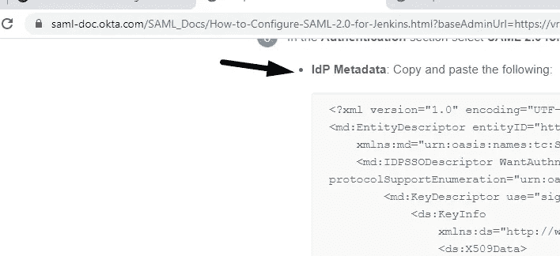******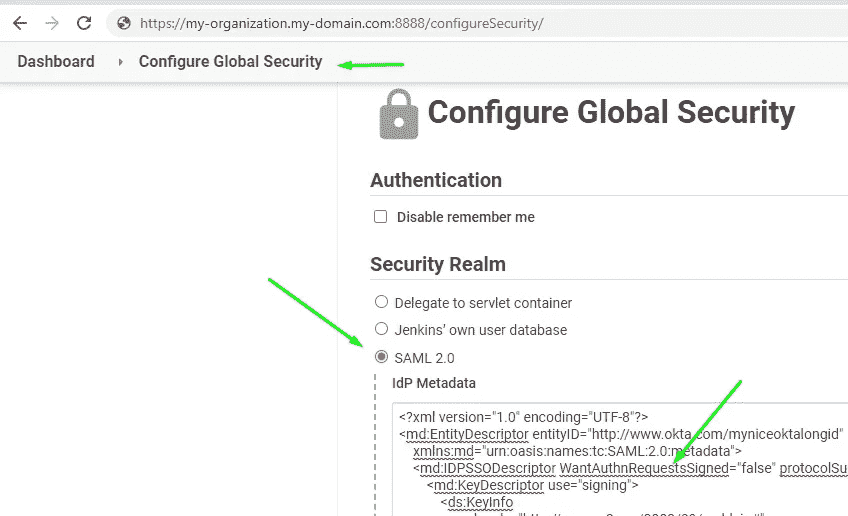***

***通过从指南中的 **IdP 元数据 URL 字段**复制值，并将其粘贴到您的 Jenkins **IdP 元数据 URL 字段，对过程重复相同的步骤。*****

***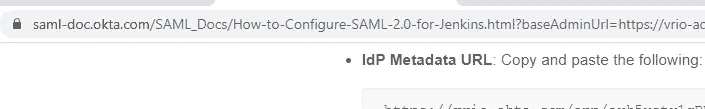******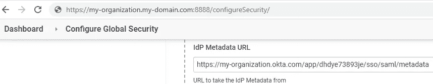***

***在**显示名称属性**中:显示名称***

***在**组属性:**组***

***在**用户名属性**中:用户名***

***在**电子邮件属性**中:电子邮件***

***在**用户名大小写转换**中:无***

***在**数据绑定方法**中:HTTP-Redirect***

***在**注销 URL** 中:复制并粘贴 OKTA G **向导中的值。*****

***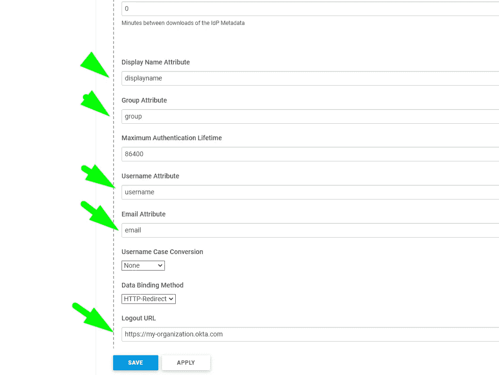***

***2.转到**管理詹金斯** > **管理和分配角色** >
**分配角色**:***

***在**添加**的用户/组中:输入之前创建的 okta **组(oktagroup)** 。然后点击**添加**按钮:***

***在**全局角色**表中:勾选**管理**角色。然后点击**保存**按钮。***

****注意:此处****okta group****被授予现有的* ***admin*** *角色权限，用于测试目的，但是，您必须设置单独的角色以符合您组织的需求。具体请参见* [*基于角色的授权策略*](https://plugins.jenkins.io/role-strategy/) *插件指南。****

***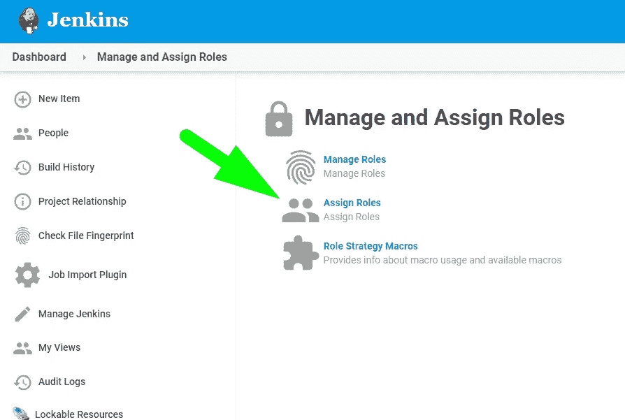******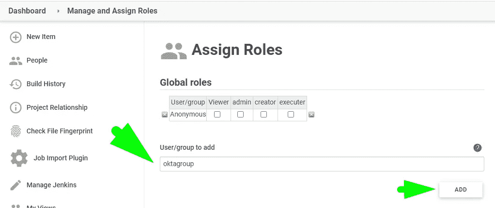******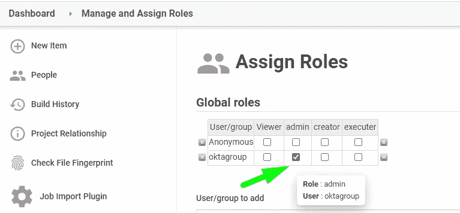******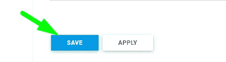***

***注销并重新登录到您的 Jenkins 安装。***

# ***验证访问***

***登录回你的詹金斯网址。将重定向到您的 OKTA 组织:***

***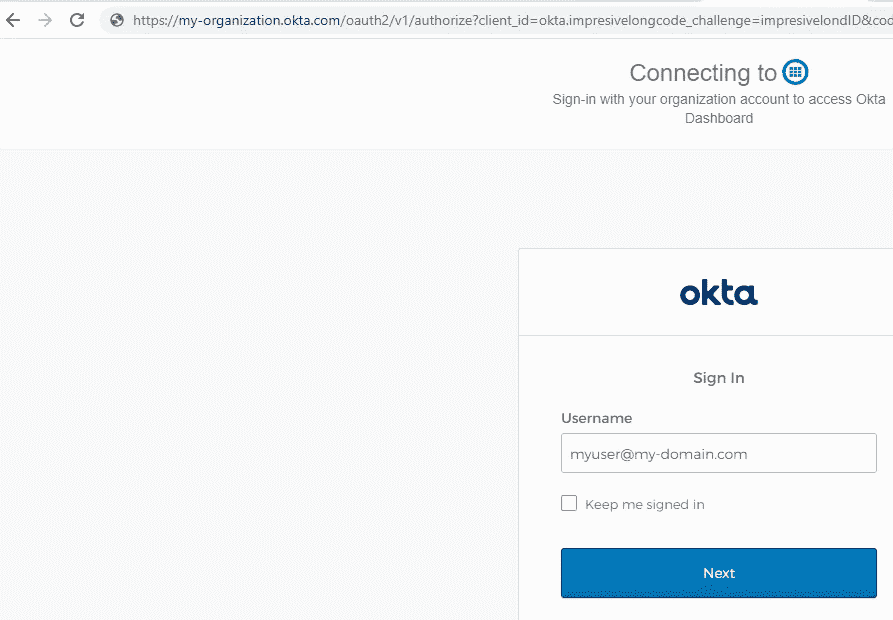***

***OKTA 身份验证完成后，您将被重定向回 Jenkins，用户 SSO 身份验证已经获得批准，可以访问该实例。***

***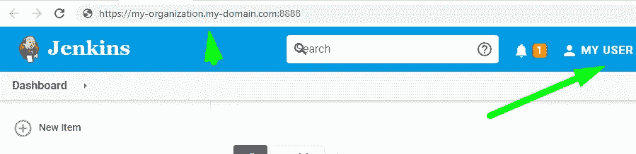***

***让我们在詹金斯那边检查一下我们的用户***

***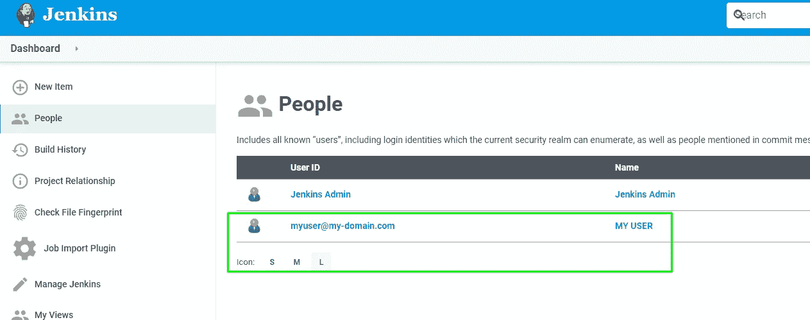******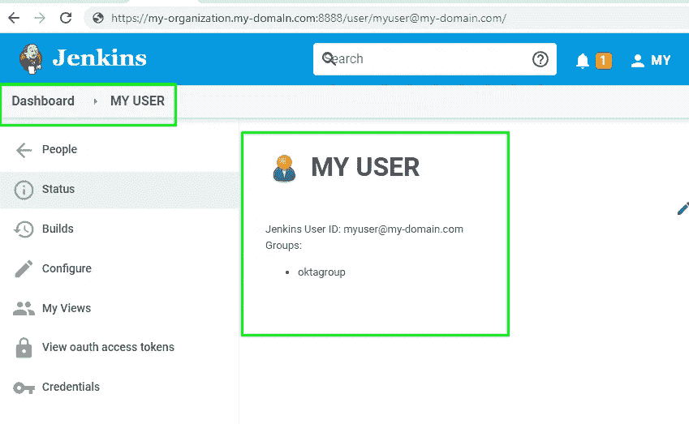***

# ***结论:***

*   ***从 OKTA SAML 2.0 到 Jenkins 的安全访问很容易设置。***
*   ***OKTA 中的组可以很容易地与 Jenkins 实例组匹配。***
*   ***基于角色的授权策略插件和 OKTA 集成一起工作。***
*   ***非常需要 Jenkins 端的 HTTPS 协议来遵守安全通信。***

# ***参考***

***[奥克塔与詹金斯的整合](https://www.okta.com/integrations/jenkins/#capabilities)***

***[秋田频道](https://www.youtube.com/user/OktaInc/playlists)***

***[如何在 Jenkins 服务器上配置 SSL](https://devopscube.com/configure-ssl-jenkins/)***

***[AWS 证书管理器文档(SSL 自管理)](https://aws.amazon.com/certificate-manager/faqs/)***

***[詹金斯插件安装](https://www.jenkins.io/doc/book/managing/plugins/)***

******

***Visit us at [https://www.globant.com/studio/cloud-ops](https://www.globant.com/studio/cloud-ops)***