# Jenkins 教程——使用 Jenkins 进行持续集成

> 原文：<https://medium.com/edureka/jenkins-tutorial-68110a2b4bb3?source=collection_archive---------0----------------------->

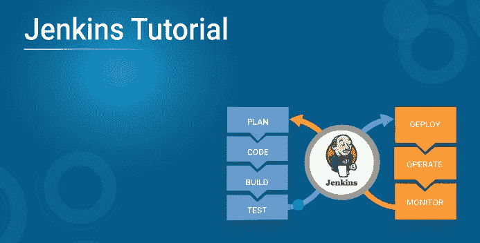

Jenkins Tutorial — Edureka

持续集成是 DevOps 的组成部分，Jenkins 是最著名的持续集成工具。在本文中，我将重点介绍 Jenkins 架构和 Jenkins 构建管道，同时我将向您展示如何在 Jenkins 中创建构建。

在我们继续这篇文章之前，关于 Jenkins 的一些关键要点如下:

*   Jenkins 用于在插件的帮助下集成所有 DevOps 阶段。
*   常用的 Jenkins 插件有 Git、Amazon EC2、Maven 2 project、HTML publisher 等。
*   Jenkins 拥有超过 1000 个插件和 147，000 个活跃安装，在全球拥有超过 100 万用户。
*   通过持续集成，在源代码中所做的每一个更改都是构建好的。它还执行其他功能，这取决于用于持续集成的工具。
*   诺基亚从每夜构建转向持续集成。
*   持续集成之前的过程有许多缺陷。结果，不仅软件交付缓慢，而且软件质量也没有达到标准。开发人员也很难定位和修复漏洞。
*   与 Jenkins 的持续集成通过为源代码中的每一处变更持续触发构建和测试来克服这些缺点。

现在是了解詹金斯建筑的正确时机。

# 詹金斯建筑

您可以参考下图来了解 Jenkins 独立架构。

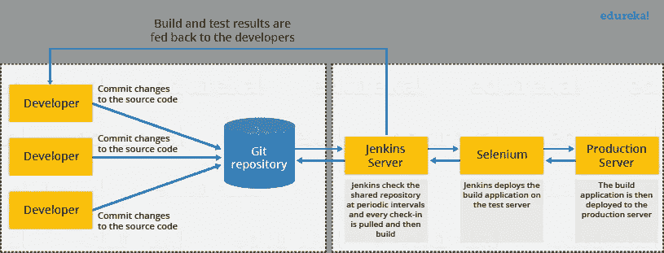

Jenkins Standalone Architecture - Jenkins Tutorial

这一台 Jenkins 服务器不足以满足某些要求，例如:

*   有时您可能需要几个不同的环境来测试您的构建。这不能由单个 Jenkins 服务器来完成。
*   如果定期构建更大更重的项目，那么单个 Jenkins 服务器无法简单地处理全部负载。

为了解决上述需求，引入了 Jenkins 分布式体系结构。

# 詹金斯分布式体系结构

Jenkins 使用主从架构来管理分布式构建。在这种体系结构中，主机和从机通过 TCP/IP 协议进行通信。

**詹金斯大师**

你的主服务器是主服务器。主人的工作是处理:

*   计划生成作业。
*   将构建分派到从属服务器进行实际执行。
*   监控从机(可能根据需要使它们联机和脱机)。
*   记录和展示构建结果。
*   Jenkins 的主实例也可以直接执行构建作业。

# 詹金斯奴隶

从机是在远程机器上运行的 Java 可执行文件。以下是詹金斯奴隶的特征:

*   它侦听来自 Jenkins 主实例的请求。
*   从机可以运行在多种操作系统上。
*   从机的工作是按照要求去做，包括执行主机分派的构建任务。
*   你可以配置一个项目总是在一个特定的从属机器或特定类型的从属机器上运行，或者简单地让 Jenkins 挑选下一个可用的从属机器。

下图不言自明。它由一个管理三个 Jenkins 从机的 Jenkins 主机组成。

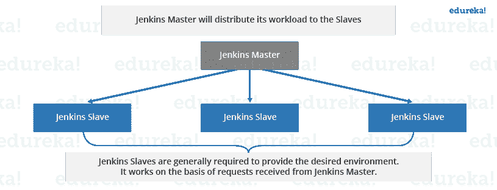

Jenkins Master-Slave - Jenkins Tutorial

现在让我们看一个例子，在这个例子中，Jenkins 被用于在不同的环境中进行测试，比如 Ubuntu、MAC、Windows 等等。

下图表示同样的情况:

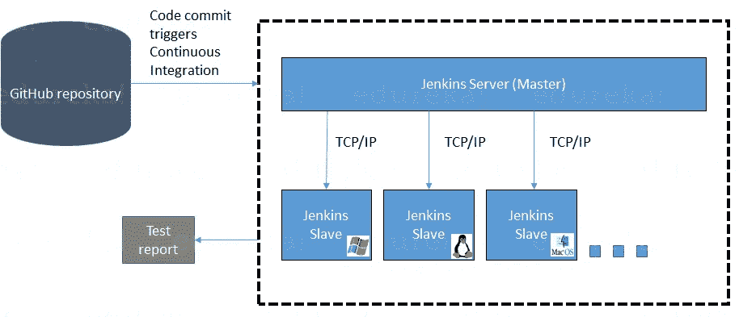

Distributed Testing - Jenkins Tutorial

上图中执行了以下功能:

*   Jenkins 定期检查 Git 存储库，查看源代码中是否有任何更改。
*   每个构建都需要不同的测试环境，这对于单个 Jenkins 服务器来说是不可能的。为了在不同的环境中执行测试，Jenkins 使用了各种从设备，如图所示。
*   Jenkins Master 请求这些从设备执行测试并生成测试报告。

# 詹金斯建立管道

它用于了解 Jenkins 当前正在执行哪个任务。通常几个不同的变更是由几个开发人员同时进行的，所以知道哪个变更正在被测试，哪个变更在队列中，或者哪个构建被破坏是很有用的。这就是管道发挥作用的地方。Jenkins Pipeline 给你一个测试进展的概览。在构建管道中，构建作为一个整体被分成几个部分，例如单元测试、验收测试、打包、报告和部署阶段。管道阶段可以串行或并行执行，如果一个阶段成功，它会自动进入下一个阶段(因此得名“管道”)。下图显示了多重构建管道的样子。

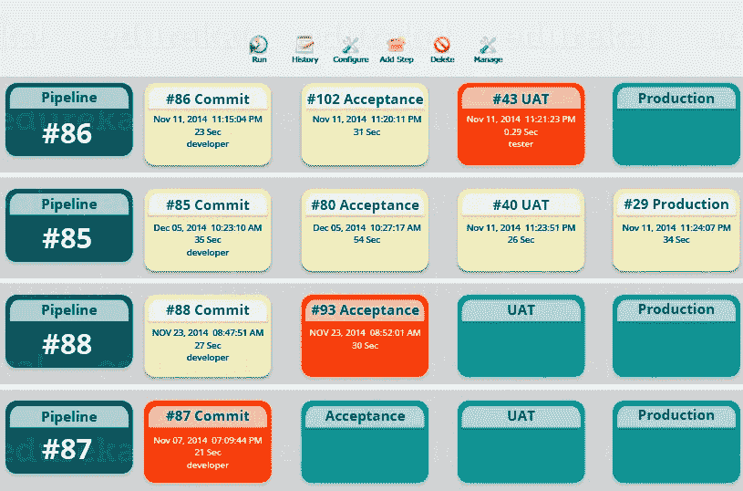

Jenkins Build Pipeline - Jenkins Tutorial

希望你已经理解了理论概念。现在，让我们享受动手的乐趣。

我将在詹金斯创造一个新的工作，这是一个**自由式项目**。然而，还有 3 个选项可用。让我们来看看詹金斯的建筑工作类型。

## **自由式项目:**

自由式生成作业是通用的生成作业，它提供了最大的灵活性。自由式构建作业是最灵活和可配置的选项，可用于任何类型的项目。它的设置相对简单，我们在这里配置的许多选项也会出现在其他构建工作中。

## **多配置作业:**

“多配置项目”(也称为“矩阵项目”)允许您在不同的环境中运行相同的构建作业。它用于在不同的环境中测试应用程序，使用不同的数据库，甚至在不同的构建机器上。

## **监控外部作业:**

“Monitor an external job”构建作业让您可以监视非交互式进程，例如 cron 作业。

## **Maven 项目:**

“maven2/3 项目”是一个专门针对 maven 项目的构建工作。Jenkins 了解 Maven pom 文件和项目结构，可以使用从 pom 文件中收集的信息来减少设置项目所需的工作。

**步骤 1:** 从 Jenkins 界面主页，选择**新项目。**

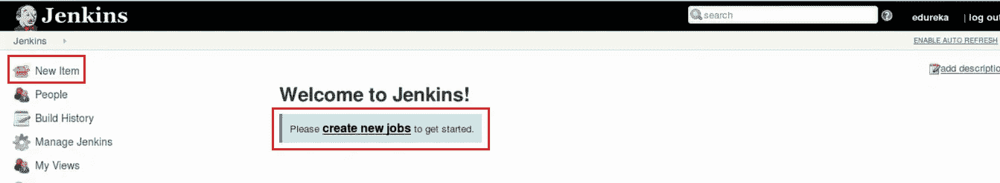

**第二步:**输入姓名，选择**自由泳项目**。

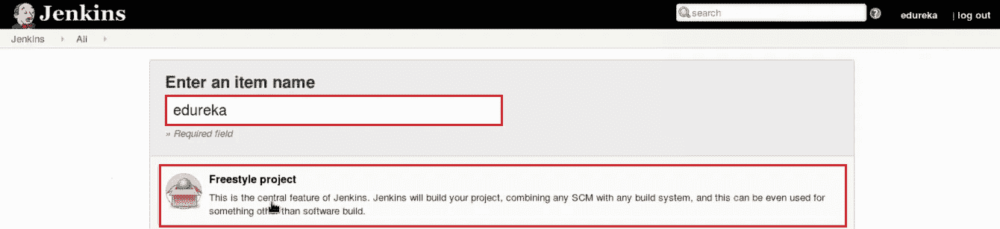

**步骤 3:** 下一页是您指定作业配置的地方。您将很快观察到，当您创建新项目时，有许多设置可用。在这个配置页面上，您还可以选择**添加构建步骤**来执行额外的操作，比如运行脚本。我将执行一个 shell 脚本。

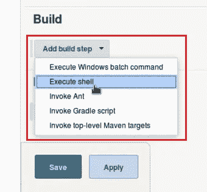

这将为您提供一个文本框，您可以在其中添加您需要的任何命令。您可以使用脚本来运行各种任务，如服务器维护、版本控制、读取系统设置等。我将使用这一部分来运行一个简单的脚本。

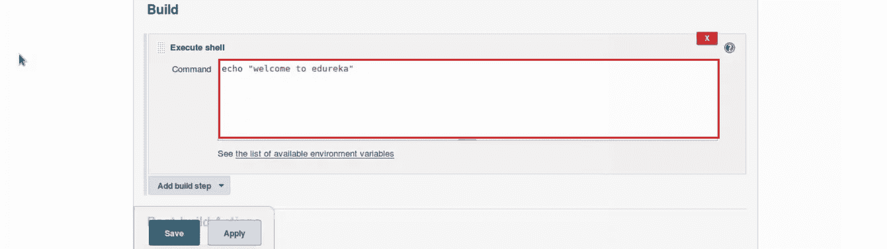

**步骤 4:** 保存项目，您将被带到一个项目概述页面。在这里，您可以看到有关该项目的信息，包括它的建造历史。

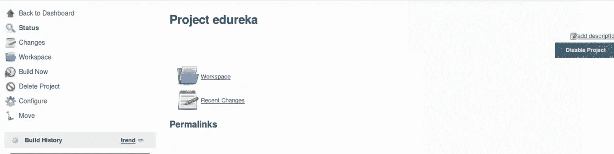

**步骤 5:** 点击左侧的**立即构建**开始构建。

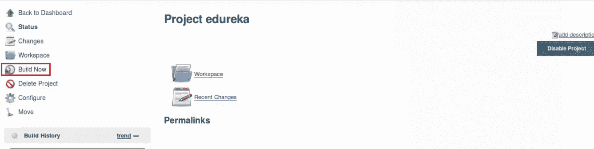

**步骤 6:** 要查看更多信息，在 build history 区域点击这个构建，然后你会被带到一个包含这个构建信息的页面。

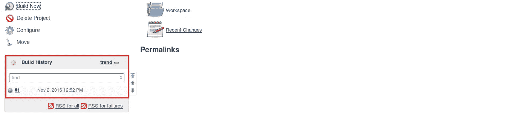

**步骤 7:** 该页面上的**控制台输出**链接对于详细检查作业结果特别有用。

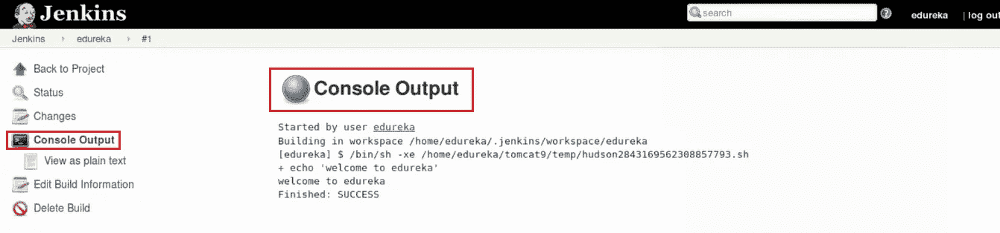

第 8 步:如果你回到 Jenkins 家，你会看到所有项目及其信息的概述，包括状态。

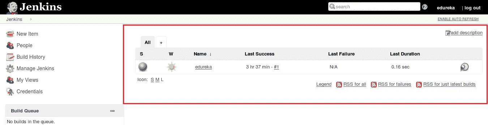

构建的状态以两种方式表示，一种是天气图标，另一种是彩球。天气图标特别有用，因为它在一个图像中显示了多个构件的记录。

正如你在上面的图片中看到的，太阳代表我所有的构建都是成功的。球的*颜色*给了我们特定构建的状态，在上面的图像中，球的颜色是蓝色，这意味着这个特定的构建是成功的。

所以这就结束了这个关于詹金斯的博客教程。如果你想查看更多关于人工智能、Python、道德黑客等市场最热门技术的文章，那么你可以参考 [Edureka 的官方网站。](https://www.edureka.co/blog/?utm_source=medium&utm_medium=content-link&utm_campaign=jenkins-tutorial)

请留意本系列中的其他文章，它们将解释 DevOps 的各个方面。

> *1。* [*DevOps 教程*](/edureka/devops-tutorial-89363dac9d3f)
> 
> *2。* [*Git 教程*](/edureka/git-tutorial-da652b566ece)
> 
> *3。* [*码头工人教程*](/edureka/docker-tutorial-9a6a6140d917)
> 
> *4。* [*Ansible 教程*](/edureka/ansible-tutorial-9a6794a49b23)
> 
> *5。* [*木偶教程*](/edureka/puppet-tutorial-848861e45cc2)
> 
> *6。* [*厨师教程*](/edureka/chef-tutorial-8205607f4564)
> 
> 7。 [*Nagios 教程*](/edureka/nagios-tutorial-e63e2a744cc8)
> 
> *8。* [*如何编排 DevOps 工具？*](/edureka/devops-tools-56e7d68994af)
> 
> *9。* [*连续交货*](/edureka/continuous-delivery-5ca2358aedd8)
> 
> *10。* [*持续集成*](/edureka/continuous-integration-615325cfeeac)
> 
> *11。* [*连续部署*](/edureka/continuous-deployment-b03df3e3c44c)
> 
> *12。* [*持续交付 vs 持续部署*](/edureka/continuous-delivery-vs-continuous-deployment-5375642865a)
> 
> *13。* [*CI CD 管道*](/edureka/ci-cd-pipeline-5508227b19ca)
> 
> *14。* [*Docker 作曲*](/edureka/docker-compose-containerizing-mean-stack-application-e4516a3c8c89)
> 
> *15。* [*码头工人群*](/edureka/docker-swarm-cluster-of-docker-engines-for-high-availability-40d9662a8df1)
> 
> *16。* [*Docker 联网*](/edureka/docker-networking-1a7d65e89013)
> 
> *17。* [*可担任的角色*](/edureka/ansible-roles-78d48578aca1)
> 
> *18。*
> 
> **19。* [*适用于 AWS*](/edureka/ansible-for-aws-provision-ec2-instance-9308b49daed9)*
> 
> **20。* [*詹金斯管道*](/edureka/jenkins-pipeline-tutorial-continuous-delivery-75a86936bc92)*
> 
> **21。* [*顶级 Git 命令*](/edureka/git-commands-with-example-7c5a555d14c)*
> 
> **22。* [*顶级停靠命令*](/edureka/docker-commands-29f7551498a8)*
> 
> *23。[*Git vs GitHub*](/edureka/git-vs-github-67c511d09d3e)*
> 
> **24。* [*DevOps 面试问题*](/edureka/devops-interview-questions-e91a4e6ecbf3)*
> 
> **25。* [*谁是 DevOps 工程师？*](/edureka/devops-engineer-role-481567822e06)*
> 
> *26。 [*DevOps 生命周期*](/edureka/devops-lifecycle-8412a213a654)*
> 
> **27。*[*Git ref log*](/edureka/git-reflog-dc05158c1217)*
> 
> *28。*
> 
> ***29。* [*组织正在寻找的顶尖 DevOps 技能*](/edureka/devops-skills-f6a7614ac1c7)**
> 
> **30。 [*瀑布 vs 敏捷*](/edureka/waterfall-vs-agile-991b14509fe8)**
> 
> ***31。* [*Maven 用于构建 Java 应用*](/edureka/maven-tutorial-2e87a4669faf)**
> 
> ***32。* [*詹金斯小抄*](/edureka/jenkins-cheat-sheet-e0f7e25558a3)**
> 
> ***33。* [*Ansible 备忘单*](/edureka/ansible-cheat-sheet-guide-5fe615ad65c0)**
> 
> ***34。* [*Ansible 面试问答*](/edureka/ansible-interview-questions-adf8750be54)**
> 
> ***35。* [*50 码头工人面试问题*](/edureka/docker-interview-questions-da0010bedb75)**
> 
> ***36。* [*敏捷方法论*](/edureka/what-is-agile-methodology-fe8ad9f0da2f)**
> 
> ***37。* [*詹金斯面试问题*](/edureka/jenkins-interview-questions-7bb54bc8c679)**
> 
> ***38。* [*Git 面试题*](/edureka/git-interview-questions-32fb0f618565)**
> 
> ***39。* [*Docker 架构*](/edureka/docker-architecture-be79628e076e)**
> 
> ***40。*[*devo PS 中使用的 Linux 命令*](/edureka/linux-commands-in-devops-73b5a2bcd007)**
> 
> **41。 [*詹金斯 vs 竹子*](/edureka/jenkins-vs-bamboo-782c6b775cd5)**
> 
> **42。 [*Nagios 面试问题*](/edureka/nagios-interview-questions-f3719926cc67)**
> 
> ***43。* [*DevOps 实时场景*](/edureka/jenkins-x-d87c0271af57)**
> 
> ***44。* [*詹金斯和詹金斯 X 的区别*](/edureka/jenkins-vs-bamboo-782c6b775cd5)**
> 
> **45。[*Windows Docker*](/edureka/docker-for-windows-ed971362c1ec)**
> 
> **46。[*Git vs Github*](http://git%20vs%20github/)**

***原载于 2016 年 11 月 7 日 www.edureka.co**[*。*](https://www.edureka.co/blog/jenkins-tutorial/)***