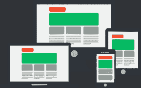

# Jenkins vs Bamboo —选择哪种 CI/CD 工具？

> 原文：<https://medium.com/edureka/jenkins-vs-bamboo-782c6b775cd5?source=collection_archive---------0----------------------->

Jenkins vs Bamboo — Edureka

**Jenkins** 和 **Bamboo** 是领先的自动化服务器，带有为**持续集成**而构建的插件。因此，在您的 DevOps 生命周期中使用它们之前，您必须了解它们到底是什么以及它们是如何工作的。要理解这一点，请阅读这篇关于 Jenkins 和 Bamboo 之间可用性对峙的文章。

本文涵盖的主题如下:

*   詹金斯是什么？
*   竹子是什么？
*   詹金斯和竹子的区别

1.  流行
2.  许可条款
3.  起源
4.  易于设置
5.  方便用户的
6.  证明文件
7.  平台依赖性
8.  支持
9.  插件支持
10.  和睦相处

*   你应该选择哪种 CI/CD 工具？

之前，我们看看詹金斯和竹子之间的差异，让我们了解詹金斯和竹子的基础知识。

# 詹金斯是什么？

Jenkins 是当今市场上最受欢迎的工具之一，是为持续集成目的而构建的。Jenkins 用 Java 编写，用于构建和测试软件项目，并使开发人员能够轻松地将所需的更改集成到项目中。该工具还旨在通过集成大量测试和部署软件来持续交付软件。

通过使用 Jenkins，从初创公司到高速发展的公司都可以通过自动化来加速软件开发过程。此外，Jenkins 集成了不同种类的开发生命周期过程，如构建、文档、测试、打包、登台、部署、静态分析等等。它提供了各种插件，允许集成各种 DevOps 阶段。例如，如果你想使用一个特定的工具，那么你只需要为这个特定的工具安装所需的插件。

参考下图，了解 Jenkins 在各个开发运维阶段的角色:

接下来，在这篇关于詹金斯 vs 竹子的文章中，让我们了解一下竹子的基本知识。

# 竹子是什么？

Bamboo 是用于持续集成的自动化服务器。该工具由 Atlassian 于 2007 年开发，允许开发人员自动构建、记录、集成、测试源代码，并为应用部署做准备。它具有使用各种工具的灵活性，易于使用的图形用户界面，并允许开发人员使用 **CI/ CD 方法。**

使用 Bamboo，您可以确保高质量和高状态，获得对发布实现的端到端可见性，并将最大的时间花在编写代码上，而不是集成各种软件。它还提供了内置的部署支持、强大的构建代理管理、自动合并和内置的 Git 分支工作流。

在 Bamboo 中，我们必须创建*计划*，然后使用 GUI 设置*阶段*、*作业、*和*任务*。参考下文。

下表简要总结了 Jenkins 与 Bamboo 之间的差异。本文后面会提供详细的解释。

# 詹金斯 vs 竹子

在这场 Jenkins vs Bamboo 的对决中，我将基于以下理由对这两种工具进行比较:

1.  流行
2.  许可条款
3.  起源
4.  易于设置
5.  方便用户的
6.  证明文件
7.  平台依赖性
8.  支持
9.  插件支持
10.  和睦相处

# 詹金斯 vs 竹子:受欢迎程度

在根据受欢迎程度比较这些工具时， **Jenkins 无疑赢得了比赛，并且比 Bamboo** 更受欢迎。Jenkins 的发布比 Bamboo 早得多，它立即开始在组织中流行起来。

此外，如果你看看这些工具目前的谷歌趋势，你会清楚地观察到詹金斯在竞争中遥遥领先。Jenkins 继续主导建立**连续输送管道**的解决方案，因为它拥有超过 **165，000 个活跃安装**。

# 詹金斯 vs 竹子:许可条款

**Jenkins 是一个开源工具**，而 **Bamboo 是一个商业/授权工具**。Jenkins 有一个全球开发社区，但是 Bamboo 有自己的专门开发团队。因此，在 DevOps 领域工作的任何个人或专业人士都可以去下载 Jenkins。

然而，要使用 Bamboo，你可以下载 30 天的免费版本。之后，你必须购买许可证，要么是 10 美元的**许可证**许可证**提供 10 个工作**无限的本地代理，没有远程代理，要么是 1270 美元的**许可证**许可证**提供无限的工作和本地代理**。这里，记住你的计划越多，你需要的代理人就越多。否则，你将冒创建一个过程并减慢该过程的风险。

# 詹金斯 vs 竹子:起源

嗯，这两个工具的起源都是编程语言— **Java** 。Jenkins 是由 Kohsuke Kawaguchi 在 2004 年开发的 Hudson 项目，并于 2005 年在 java.net 首次发布。

类似地，在开发 Bamboo 时，Atlassian 决定使用简单的基于 Java 的计划描述语言，以确保语法检查、代码自动完成、验证代码以及运行离线测试。在 Bamboo 中，你可以用任何一种 JVM 语言编写你的代码，包括类似 Java 的 Groovy、Scala 或 Kotlin。不要担心，如果您不熟悉 Java，这两个工具将在可用文档的帮助下直接引导您进入工作环境。

# 詹金斯 vs 竹子:易于设置

这两个工具都很容易安装和配置。只需动动手指，就可以对它们进行配置。然而，如果我们仍然必须从它们中选择一个，那么我会说，Jenkins 是突出的，因为如果已经安装了 Java 和 Apache Tomcat，它可以在 3 个步骤中完成。你要**从官网下载詹金斯战争文件**，**部署战争文件**，然后**安装需要/建议的插件**。

然而，要设置 Bamboo，与 Jenkins 相比，您需要更多的步骤。在这里，安装 Java 并创建一个专门的用户来运行 Bamboo 之后，你必须遵循下面的步骤:

*   下载竹子
*   创建安装目录
*   创建主目录
*   开始竹子
*   配置竹子

# 詹金斯 vs 竹子:用户友好

当谈到用户友好性时，詹金斯不是一个自信的捍卫者。这是因为 **Bamboo 的用户友好方式**简洁直观。因此，每次添加新任务时，它都会在整个计划的构建和部署状态中提供适当的指导。

但是，对于 Jenkins 来说，这个工具完全基于功能。所以，如果你想让 Jenkins 平台更直观，那么你需要做更多的工作。然而，我要说这些给开发者留下了定制、创建的空间，允许开发者从各种插件中进行选择。

# 詹金斯 vs 竹子:文档

Jenkins 和 Bamboo **他们都有很棒的在线文档**，为客户提供在寻求帮助之前研究和找到解决方案的选项。

在本文档中，您将找到与工具相关的所有信息，如如何安装、先决条件、执行任务的步骤、命令等。文档还提供了各种教程来帮助您更好地获得该工具的实践经验。

# 詹金斯 vs Bamboo:平台依赖性

Jenkins 和 Bamboo 在各种平台上工作，可以与各种工具集成。以下是 Jenkins 和 Bamboo 可以使用的不同操作系统和浏览器。

***詹金斯:***

*   适用于 Windows、Ubuntu、RedHat、MacOS 等操作系统。
*   它可以在谷歌 Chrome、Mozilla Firefox 和 Internet Explorer 等浏览器上使用。

***竹子:***

*   适用于 Windows、Linux、Solaris 等操作系统
*   它可以在谷歌 Chrome、Mozilla Firefox、Safari 和 Edge 等浏览器上使用。

# 詹金斯 vs 竹子:支持

**Jenkins 为使用 Jenkins 时遇到问题的用户提供全球社区支持**。但是 Bamboo 为特许客户提供了巨大的专业支持。它还提供了详细的在线文档。

除此之外，竹子还得到了亚特兰蒂斯社会的支持。因此，我对这一点的看法是，他们都提供支持。然而，我要说的是，它完全是从用户的角度来看待这些工具所提供的帮助。

# 詹金斯 vs 竹子:插件支持

Jenkins 主导了这一领域，并提供了超过 1000 个插件，这些插件使 Jenkins 能够与任何工具集成，如 T2 Git、Maven 2 project、亚马逊 EC2、HTML publisher T3。这些插件使用户能够在整个连续交付过程中提供最佳解决方案。即使一个插件不存在，你也可以把它编码并分享给社区。

但是，竹子在这里不是一个自信的防守者。Bamboo **在 Atlassian 环境**中有大约 100 个插件，因为大多数功能都是在 Bamboo marketplace 中构建的。此外，与 Jenkins 的工具相比，这个工具很容易与 JIRA 和 Bitbucket 集成。

# 詹金斯 vs 竹子:兼容性

请参考以下基于兼容性的工具比较:

既然你已经熟悉了 Jenkins 和 Bamboo 的本质，那么在下一部分，我将处理你脑海中的主要问题。

# 你应该选择哪种 CI/CD 工具？

正如我已经提到的，这两个工具在 DevOps 领域都很突出，并且非常重要。所以，你可以选择这两个中的任何一个。但是在选择工具之前，您需要考虑几个重要的方面，例如:

*   工具提供的支持和管理
*   用户界面和集成支持
*   独立系统和大型软件系统等系统类型

简而言之，我认为选择哪种工具取决于您在 DevOps 生命周期中的需求。所以，在詹金斯和竹子之间选择一个之前，这些是你必须记住的相关参数。我希望你发现这篇文章信息丰富。

如果你想查看更多关于人工智能、Python、道德黑客等市场最热门技术的文章，你可以参考 Edureka 的官方网站。

请留意本系列中的其他文章，它们将解释 DevOps 的各个方面。

> *1。* [*DevOps 教程*](/edureka/devops-tutorial-89363dac9d3f)
> 
> *2。* [*Git 教程*](/edureka/git-tutorial-da652b566ece)
> 
> *3。* [*詹金斯教程*](/edureka/jenkins-tutorial-68110a2b4bb3)
> 
> *4。* [*Docker 教程*](/edureka/docker-tutorial-9a6a6140d917)
> 
> *5。* [*Ansible 教程*](/edureka/ansible-tutorial-9a6794a49b23)
> 
> *6。* [*傀儡教程*](/edureka/puppet-tutorial-848861e45cc2)
> 
> *7。* [*厨师教程*](/edureka/chef-tutorial-8205607f4564)
> 
> *8。* [*Nagios 教程*](/edureka/nagios-tutorial-e63e2a744cc8)
> 
> 9。 [*如何编排 DevOps 工具？*](/edureka/devops-tools-56e7d68994af)
> 
> *10。* [*连续交货*](/edureka/continuous-delivery-5ca2358aedd8)
> 
> *11。* [*持续集成*](/edureka/continuous-integration-615325cfeeac)
> 
> *12。* [*连续部署*](/edureka/continuous-deployment-b03df3e3c44c)
> 
> *13。* [*连续交付 vs 连续部署*](/edureka/continuous-delivery-vs-continuous-deployment-5375642865a)
> 
> *14。* [*CI CD 管道*](/edureka/ci-cd-pipeline-5508227b19ca)
> 
> *15。* [*Docker 作曲*](/edureka/docker-compose-containerizing-mean-stack-application-e4516a3c8c89)
> 
> *16。* [*码头工人群*](/edureka/docker-swarm-cluster-of-docker-engines-for-high-availability-40d9662a8df1)
> 
> *17。* [*Docker 联网*](/edureka/docker-networking-1a7d65e89013)
> 
> *18。* [*天穹*](/edureka/ansible-vault-secure-secrets-f5c322779c77)
> 
> *19。* [*可担任的角色*](/edureka/ansible-roles-78d48578aca1)
> 
> *20。* [*适用于 AWS*](/edureka/ansible-for-aws-provision-ec2-instance-9308b49daed9)
> 
> *21。* [*詹金斯管道*](/edureka/jenkins-pipeline-tutorial-continuous-delivery-75a86936bc92)
> 
> *22。* [*顶级 Docker 命令*](/edureka/docker-commands-29f7551498a8)
> 
> *23。*[*Git vs GitHub*](/edureka/git-vs-github-67c511d09d3e)
> 
> *24。* [*顶级 Git 命令*](/edureka/git-commands-with-example-7c5a555d14c)
> 
> 25。 [*DevOps 面试问题*](/edureka/devops-interview-questions-e91a4e6ecbf3)
> 
> *26。* [*谁是 DevOps 工程师？*](/edureka/devops-engineer-role-481567822e06)
> 
> *27。* [*DevOps 生命周期*](/edureka/devops-lifecycle-8412a213a654)
> 
> 28。[*Git Reflog*](/edureka/git-reflog-dc05158c1217)
> 
> *29。* [*不可预见的准备*](/edureka/ansible-provisioning-setting-up-lamp-stack-d8549b38dc59)
> 
> 三十。 [*组织正在寻找的顶尖 DevOps 技能*](/edureka/devops-skills-f6a7614ac1c7)
> 
> *30。* [*瀑布 vs 敏捷*](/edureka/waterfall-vs-agile-991b14509fe8)
> 
> *31。* [*詹金斯小抄*](/edureka/jenkins-cheat-sheet-e0f7e25558a3)
> 
> *32。* [*易答备忘单*](/edureka/ansible-cheat-sheet-guide-5fe615ad65c0)
> 
> *33。* [*Ansible 面试问答*](/edureka/ansible-interview-questions-adf8750be54)
> 
> *34。* [*50 码头工人面试问题*](/edureka/docker-interview-questions-da0010bedb75)
> 
> *35。* [*敏捷方法论*](/edureka/what-is-agile-methodology-fe8ad9f0da2f)
> 
> *36。* [*詹金斯面试问题*](/edureka/jenkins-interview-questions-7bb54bc8c679)
> 
> *37。* [*Git 面试问题*](/edureka/git-interview-questions-32fb0f618565)
> 
> *38。* [*Docker 架构*](/edureka/docker-architecture-be79628e076e)
> 
> *39。*[*devo PS 中使用的 Linux 命令*](/edureka/linux-commands-in-devops-73b5a2bcd007)
> 
> *40。* [*Maven 用于构建 Java 应用*](/edureka/maven-tutorial-2e87a4669faf)
> 
> *41。* [*Nagios 教程*](/edureka/nagios-tutorial-e63e2a744cc8)
> 
> *42。* [*Nagios 面试题*](/edureka/nagios-interview-questions-f3719926cc67)
> 
> 43。 [*DevOps 实时场景*](/edureka/jenkins-x-d87c0271af57)
> 
> *44。* [*詹金斯和詹金斯 X 的区别*](/edureka/jenkins-vs-bamboo-782c6b775cd5)
> 
> *45。*[*Windows Docker*](/edureka/docker-for-windows-ed971362c1ec)
> 
> 46。[*Git vs Github*](http://git%20vs%20github/)

*原载于 2019 年 11 月 14 日*[*https://www.edureka.co*](https://www.edureka.co/blog/jenkins-vs-bamboo)*。*