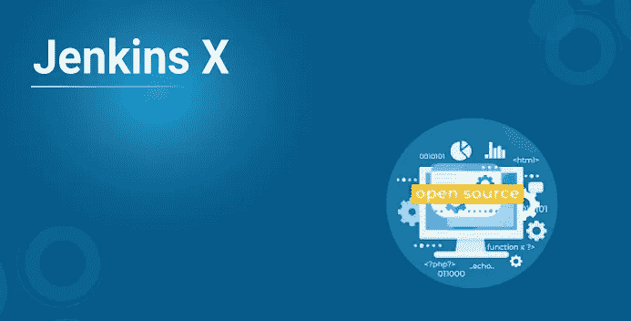
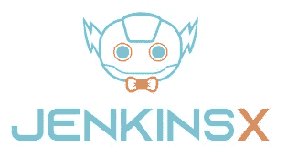
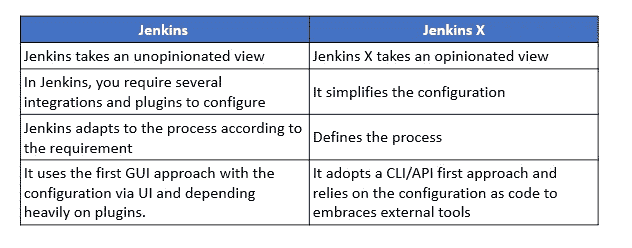
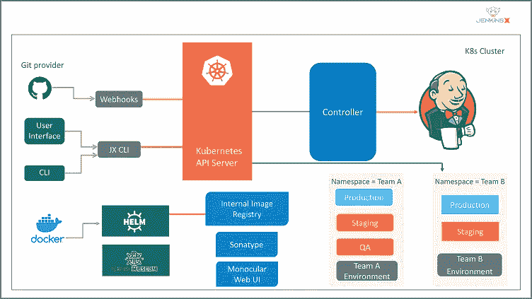

# 詹金斯 X 是什么，和詹金斯有什么不同？

> 原文：<https://medium.com/edureka/jenkins-x-d87c0271af57?source=collection_archive---------0----------------------->



Jenkins 是最著名的持续集成工具之一，也是 DevOps 不可或缺的一部分，经常用于集成各种 ***DevOps 阶段*** 。随着詹金斯的成功，一个新版本的詹金斯最近被称为詹金斯 X (JX)。它向 Kubernetes 提供持续集成、自动化测试和持续交付。通过这篇文章，我将为您提供对 Jenkins X 的全面了解，我们将涉及的主题如下:

*   詹金斯 X 是什么？
*   詹金斯 Vs 詹金斯 X
*   詹金斯 X 的特点
*   詹金斯 X 是如何工作的？
*   安装 Jenkins X

让我们从第一个话题开始。

# 詹金斯 X 是什么？



Jenkins X 由 James strach an(Groovy，Apache Camel 的创造者)于 2018 年 3 月首次推出。它从一开始就被设计成一个云原生的、只支持 Kubernetes 的应用程序，不仅支持 CI/CD，而且使使用 Kubernetes 变得尽可能简单。只需一个命令，您就可以创建一个 Kubernetes 集群，安装管理应用程序所需的所有工具。您还可以创建构建和部署管道，并将您的应用程序部署到各种环境中。

Jenkins 被描述为一个 *"* ***可扩展自动化服务器*** *"* ，它通过插件被配置为一个持续集成服务器、一个持续部署中心或一个工具，以自动化任何软件任务。JX 提供了 Jenkins 的具体配置，这意味着你不需要知道建立 CI/CD 管道需要哪些插件。它还向 Kubernetes 部署了许多应用程序，以支持构建 docker 容器、将容器存储在 docker 注册表中以及将其部署到 Kubernetes。

# 詹金斯 Vs 詹金斯 X



# 詹金斯 X 的特点

## **自动化 CI /CD:**

Jenkins X 提供了一个时髦的 jx 命令行工具，它允许 Jenkins X 安装在现有的或新的 Kubernetes 集群中，导入项目，并引导新的应用程序。此外，Jenkins X 会自动为项目创建管道。

## **通过 GitOps 进行环境宣传:**

Jenkins X 允许为开发、试运行和生产等创建不同的虚拟环境。使用 Kubernetes 名称空间。每个环境都有其特定的配置，即存储在 Git 存储库中的版本化应用程序和配置列表。如果您遵循 GitOps 实践，您可以在这些环境之间自动升级新版本的应用程序。此外，您还可以手动将代码从一个环境提升到另一个环境，并根据需要更改或配置新的环境。

## **扩展:**

很有可能为 Jenkins X 创建扩展。扩展不过是在 CI/CD 过程中特定时间运行的代码。您还可以通过扩展提供代码，该代码在安装、卸载扩展时以及在每个管道之前和之后运行。

## **无服务器詹金斯:**

您可以只在需要的时候运行 Jenkins，而不是运行 Jenkins web 应用程序，后者会持续消耗大量 CPU 和内存资源。在过去的一年中，Jenkins 社区创建了一个版本的 Jenkins，它可以通过命令行运行经典的 Jenkins 管道，其配置由代码定义，而不是通常的 HTML 表单。

## **预览环境:**

虽然可以手动创建预览环境，但是 Jenkins X 会为每个拉请求自动创建预览环境。这提供了一个在合并之前查看更改效果的机会。此外，Jenkins X 在 Pull 请求中添加了一条注释，并为团队成员提供了预览链接。

# 詹金斯 X 是如何工作的？



1.  开发人员将变更提交并推送到项目的 Git 存储库。
2.  JX 得到通知，并在 Docker 映像中运行项目的管道。这包括项目的语言和支持框架。
3.  项目管道构建、测试并将项目的舵图推送到海图博物馆，将其 Docker 图像推送到注册中心。
4.  项目管道创建一个 PR，其中包含将项目添加到试运行环境所需的更改。
5.  Jenkins X 自动将 PR 合并到 Master。
6.  Jenkins X 得到通知并运行登台管道。
7.  staging pipeline 运行 Helm，后者部署环境，从海图博物馆提取 Helm 海图，从 Docker 注册表提取 Docker 图像。Kubernetes 创建项目的资源，通常是 pod、服务和入口。

现在你已经了解了 Jenkins X 的架构，让我们看看如何安装 Jenkins X。

# 安装詹金斯 X

在这一节中，我将向您展示如何在 Linux 和 Windows 操作系统上安装 Jenkins X。

## 1.Linux 操作系统

要在 Linux 上安装 JX，下载`.tar`文件，并将其解压缩到可以运行`jx`命令的目录中。

1.  使用`curl`下载`jx`二进制归档文件，并通过管道(`|`)将压缩后的归档文件传送到`tar`命令:

```
curl -L "https://github.com/jenkins-x/jx/releases/download/$(curl --silent https://api.github.com/repos/jenkins-x/jx/releases/latest | jq -r '.tag_name')/jx-linux-amd64.tar.gz" | tar xzv "jx"
```

或者，如果您没有安装`jq`:

```
curl -L "https://github.com/jenkins-x/jx/releases/download/$(curl --silent "https://github.com/jenkins-x/jx/releases/latest" | sed 's#.*tag/(.*)\".*#1#')/jx-linux-amd64.tar.gz" | tar xzv "jx"
```

2.通过使用`mv`命令将`jx`二进制文件移动到可执行文件路径中的某个位置来安装它:

3.运行`jx --version`以确保你处于最新的稳定版本

## 2.Windows 操作系统

可以通过 Chocolatey 安装在 Windows 上。这是一个第三方包管理系统，为本地 Jenkins X 安装和升级提供了方便的一步命令。

使用管理外壳安装 Chocolatey 软件包管理系统:

1.  右键菜单:开始[命令提示符(Admin)]。
2.  在 shell 提示符下，执行`powershell.exethe` 命令下载并安装`choco`二进制文件，并设置安装路径，以便可以执行该二进制文件:

```
@"%SystemRoot%System32WindowsPowerShellv1.0powershell.exe" -NoProfile -InputFormat None -ExecutionPolicy Bypass -Command "iex ((New-Object 
System.Net.WebClient).DownloadString('https://chocolatey.org/install.ps1'))" && SET "PATH=%PATH%;%ALLUSERSPROFILE%chocolateybin"
```

3.使用巧克力安装 JX:

`choco install jenkins-x`

您可以使用 Chocolatey 更新至 Jenkins X 的最新版本:

`choco upgrade jenkins-x`

*   如果您使用 scoop，则有一个可用的清单。

—安装`jx`二进制运行:

`scoop install jx`

—升级`jx`二进制运行:

`scoop update jx`

这就是安装过程的全部内容。

如果你想查看更多关于人工智能、Python、道德黑客等市场最热门技术的文章，那么你可以参考 [Edureka 的官方网站。](https://www.edureka.co/blog/?utm_source=medium&utm_medium=content-link&utm_campaign=jenkins-x)

请留意本系列中的其他文章，它们将解释 DevOps 的各个方面。

> *1。* [*DevOps 教程*](/edureka/devops-tutorial-89363dac9d3f)
> 
> *2。* [*饭桶教程*](/edureka/git-tutorial-da652b566ece)
> 
> *3。* [*詹金斯教程*](/edureka/jenkins-tutorial-68110a2b4bb3)
> 
> *4。* [*Docker 教程*](/edureka/docker-tutorial-9a6a6140d917)
> 
> *5。* [*Ansible 教程*](/edureka/ansible-tutorial-9a6794a49b23)
> 
> *6。* [*木偶教程*](/edureka/puppet-tutorial-848861e45cc2)
> 
> *7。* [*厨师教程*](/edureka/chef-tutorial-8205607f4564)
> 
> *8。* [*Nagios 教程*](/edureka/nagios-tutorial-e63e2a744cc8)
> 
> *9。* [*如何编排 DevOps 工具？*](/edureka/devops-tools-56e7d68994af)
> 
> *10。* [*连续交货*](/edureka/continuous-delivery-5ca2358aedd8)
> 
> *11。* [*持续集成*](/edureka/continuous-integration-615325cfeeac)
> 
> 12。 [*连续部署*](/edureka/continuous-deployment-b03df3e3c44c)
> 
> *13。* [*持续交付 vs 持续部署*](/edureka/continuous-delivery-vs-continuous-deployment-5375642865a)
> 
> *14。* [*CI CD 管道*](/edureka/ci-cd-pipeline-5508227b19ca)
> 
> 15。 [*码头工人撰写*](/edureka/docker-compose-containerizing-mean-stack-application-e4516a3c8c89)
> 
> 16。 [*码头工人群*](/edureka/docker-swarm-cluster-of-docker-engines-for-high-availability-40d9662a8df1)
> 
> 17。 [*Docker 联网*](/edureka/docker-networking-1a7d65e89013)
> 
> *18。*[](/edureka/ansible-vault-secure-secrets-f5c322779c77)
> 
> **19。* [*可能的角色*](/edureka/ansible-roles-78d48578aca1)*
> 
> *20。 [*适用于 AWS*](/edureka/ansible-for-aws-provision-ec2-instance-9308b49daed9)*
> 
> **21。* [*詹金斯*](/edureka/jenkins-pipeline-tutorial-continuous-delivery-75a86936bc92)*
> 
> **22。* [*顶级 Docker 命令*](/edureka/docker-commands-29f7551498a8)*
> 
> **23。*[*Git vs GitHub*](/edureka/git-vs-github-67c511d09d3e)*
> 
> **24。* [*顶级 Git 命令*](/edureka/git-commands-with-example-7c5a555d14c)*
> 
> **25。* [*DevOps 面试问题*](/edureka/devops-interview-questions-e91a4e6ecbf3)*
> 
> **26。* [*谁是 DevOps 工程师？*](/edureka/devops-engineer-role-481567822e06)*
> 
> **27。* [*DevOps 生命周期*](/edureka/devops-lifecycle-8412a213a654)*
> 
> **28。*[*Git Reflog*](/edureka/git-reflog-dc05158c1217)*
> 
> **29。*[](/edureka/ansible-provisioning-setting-up-lamp-stack-d8549b38dc59)*
> 
> **三十岁。 [*组织正在寻找的顶尖 DevOps 技能*](/edureka/devops-skills-f6a7614ac1c7)**
> 
> **三十岁。 [*瀑布 vs 敏捷*](/edureka/waterfall-vs-agile-991b14509fe8)**
> 
> ***31。* [*詹金斯备忘单*](/edureka/jenkins-cheat-sheet-e0f7e25558a3)**
> 
> ***32。* [*Ansible 小抄*](/edureka/ansible-cheat-sheet-guide-5fe615ad65c0)**
> 
> **33。 [*Ansible 面试问答*](/edureka/ansible-interview-questions-adf8750be54)**
> 
> ***三十四。* [*50 码头工人面试问题*](/edureka/docker-interview-questions-da0010bedb75)**
> 
> **35。 [*敏捷方法论*](/edureka/what-is-agile-methodology-fe8ad9f0da2f)**
> 
> ***36。* [*詹金斯面试问题*](/edureka/jenkins-interview-questions-7bb54bc8c679)**
> 
> ***37。* [*Git 面试问题*](/edureka/git-interview-questions-32fb0f618565)**
> 
> **38。 [*Maven 用于构建 Java 应用*](/edureka/maven-tutorial-2e87a4669faf)**
> 
> ***39。*[*devo PS 中使用的 Linux 命令*](/edureka/linux-commands-in-devops-73b5a2bcd007)**
> 
> ***40。* [*詹金斯 vs 竹子*](/edureka/jenkins-vs-bamboo-782c6b775cd5)**
> 
> ***41。* [*Nagios 教程*](/edureka/nagios-tutorial-e63e2a744cc8)**
> 
> ***42。* [*Nagios 面试问题*](/edureka/nagios-interview-questions-f3719926cc67)**
> 
> ***43。* [*DevOps 实时场景*](/edureka/jenkins-x-d87c0271af57)**
> 
> ***44。* [*詹金斯和詹金斯 X 的区别*](/edureka/jenkins-vs-bamboo-782c6b775cd5)**
> 
> ***45。*[*Windows Docker*](/edureka/docker-for-windows-ed971362c1ec)**
> 
> ***46。*[*Git vs Github*](http://git%20vs%20github/)**

***原载于 2019 年 12 月 16 日*[*【https://www.edureka.co】*](https://www.edureka.co/blog/jenkins-x/)*。***