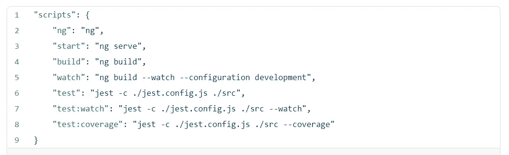
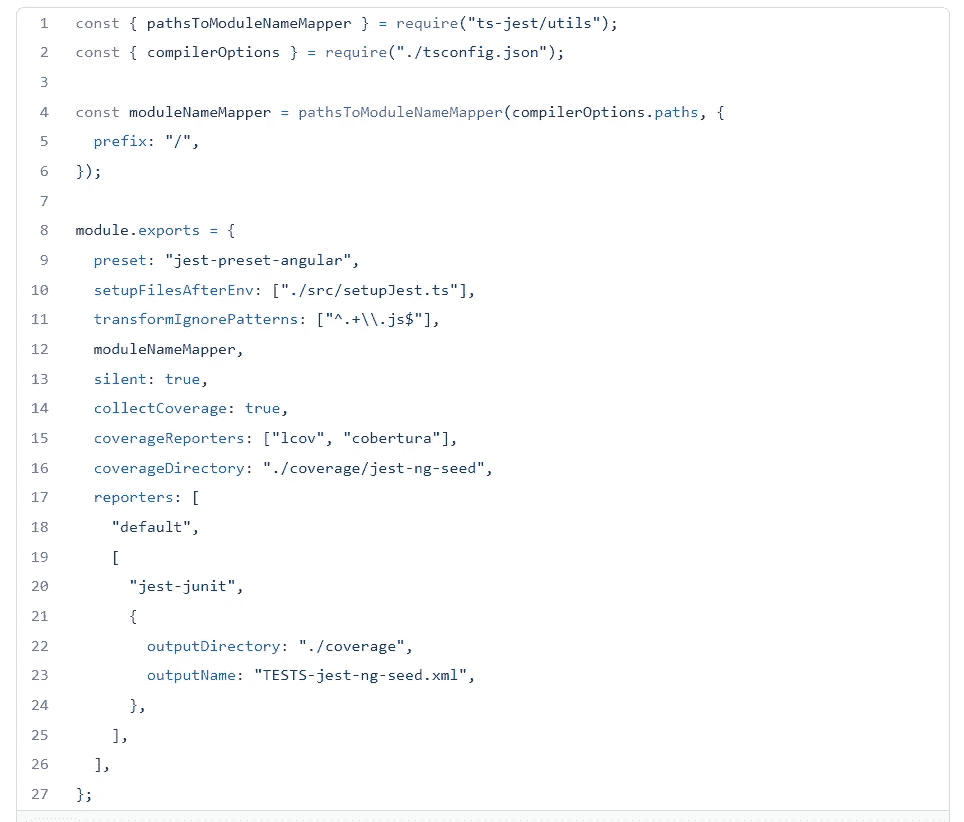
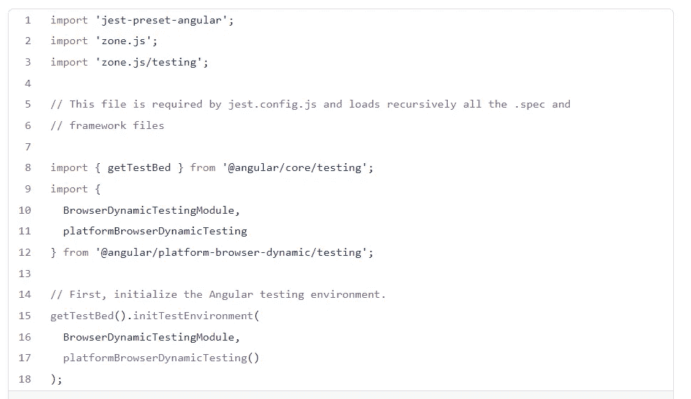
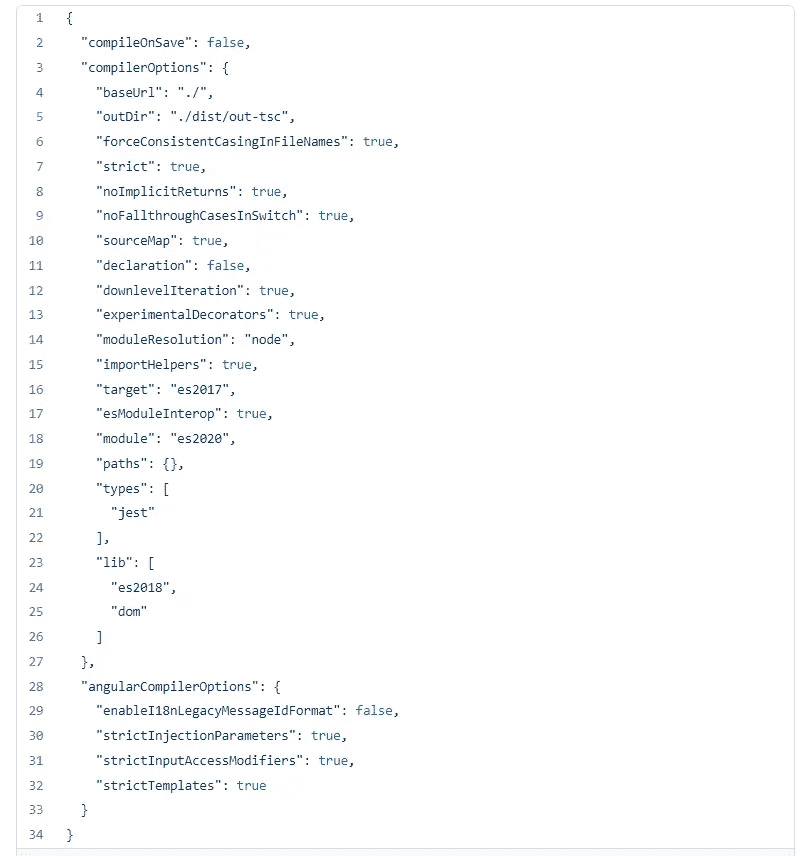
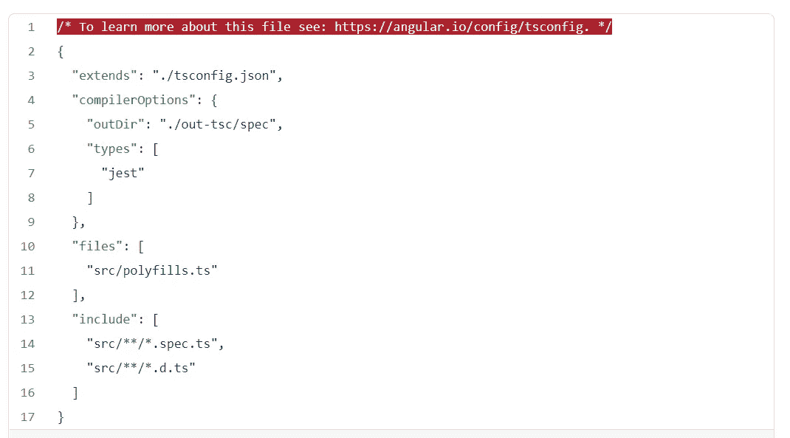
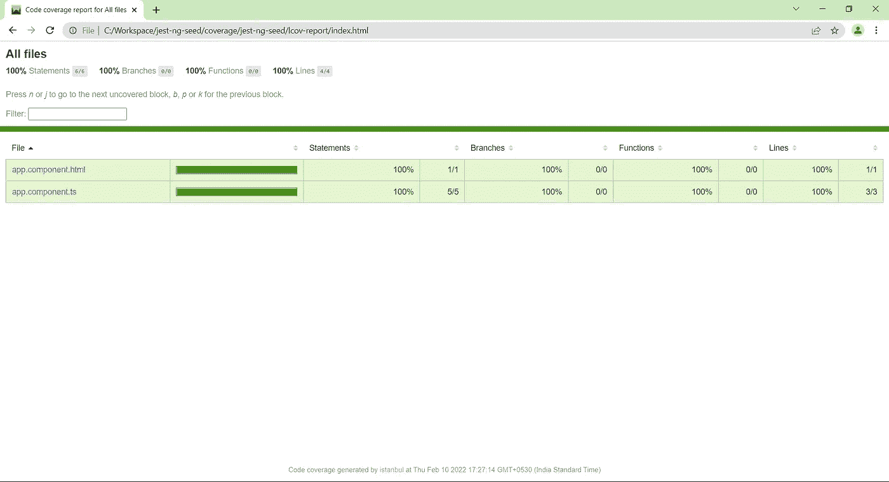

# Jest 与 Angular 12 集成

> 原文：<https://medium.com/globant/jest-integration-with-angular-12-8965ee1d8c94?source=collection_archive---------2----------------------->


Photo by [Caspar Camille Rubin](https://unsplash.com/@casparrubin?utm_source=medium&utm_medium=referral) on [Unsplash](https://unsplash.com?utm_source=medium&utm_medium=referral)

开始吧！

默认情况下，Angular 使用 jasmine 和 karma 进行单元测试。在这里，我们尝试将 jest 与 angular 项目集成起来进行轻量级单元测试。

# 1.管理依赖关系

*   首先，卸载所有与 karma 相关的 devDependencies。您可以使用下面的命令卸载这些 devDependencies。

```
npm uninstall karma karma-chrome-launcher karma-coverage karma-jasmine karma-jasmine-html-reporter
```

*   然后安装 jest 相关的 devDependencies，如下所示。

```
npm install jest @types/jest jest-junit jest-preset-angular ts-jest — save-dev
```

# 2.移除和更新 jsons

*   从 angular.json 中移除测试对象
*   更新 package.json 中的脚本部分，如下所示



package.json

# 3.删除和更新配置文件

*   从项目的根级别删除 karma.conf.js
*   在项目的根级别创建并更新 jest.config.js



jest.config.js

*   从 src 目录中删除 test.ts
*   在 src 目录中创建并更新 setupJest.ts



setupJest.ts

# 4.移除并更新 tsconfig jsons

*   如下所示更新 tsconfig.json



tsconfig.json

*   如下所示更新 tsconfig.spec.json



tsconfig.spec.json

# 4.运行并检查单元测试

*   在终端中运行以下脚本进行检查

> npm 运行测试

*   运行下面的脚本，在观察模式下测试您的更改

> npm 运行测试:观察

*   运行下面的脚本来查看单个组件的覆盖范围以及完整的应用程序

> npm 运行测试:覆盖率

注意:在项目的根层次，覆盖率目录将被创建，如果我们在浏览器中打开 index.html，我们可以看到完整应用程序的代码覆盖率。(路径:jest-ng-seed/coverage/jest-ng-seed/lcov-report/index . html)



Code coverage sample

请在下面的 GitHub 链接中找到上述代码片段和名为 jest-ng-seed 的种子项目。

[](https://github.com/AbhijeetGiram/jest-ng-seed) [## GitHub—AbhijeetGiram/Jest-ng-seed:Jest 与使用 angular 的 angular 应用程序集成…

### 此项目是使用 Angular CLI 版本 12.1.2 生成的。为开发服务器运行 ng serve。导航到…

github.com](https://github.com/AbhijeetGiram/jest-ng-seed) 

# 摘要

我们已经通过一个名为 jest-ng-seed 的种子项目详细探讨了 jest 与 Angular 12 的集成。

编码快乐！！