# JET 4.1.0 复合—列出项目操作和定义的加载

> 原文：<https://medium.com/oracledevs/jet-4-1-0-composite-list-item-action-and-defferred-loading-aba4ff0cfc3a?source=collection_archive---------1----------------------->

我正在回顾 JET 4.1.0 的特性，并决定构建一个简单的复合组件。想分享一下我学到的一些物品。复合组件带有可折叠的 UI 和操作链接，它实现了列表项，可以在任何类型的父 UI 容器中呈现:

展开项目时，会显示更多信息:

一旦用户点击打开链接，就会进行 JS 调用，并在后台打印当前项目的密钥:

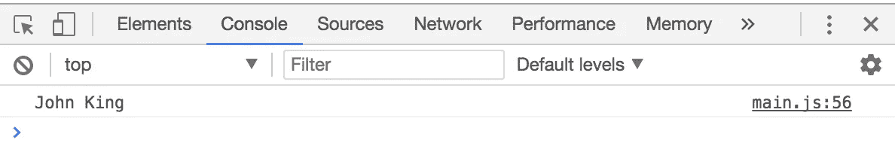

让我们来看看组件元数据。我使用了几个属性和一个事件。通过事件，我们可以在复合组件外部调用 JS 方法，这非常有用:

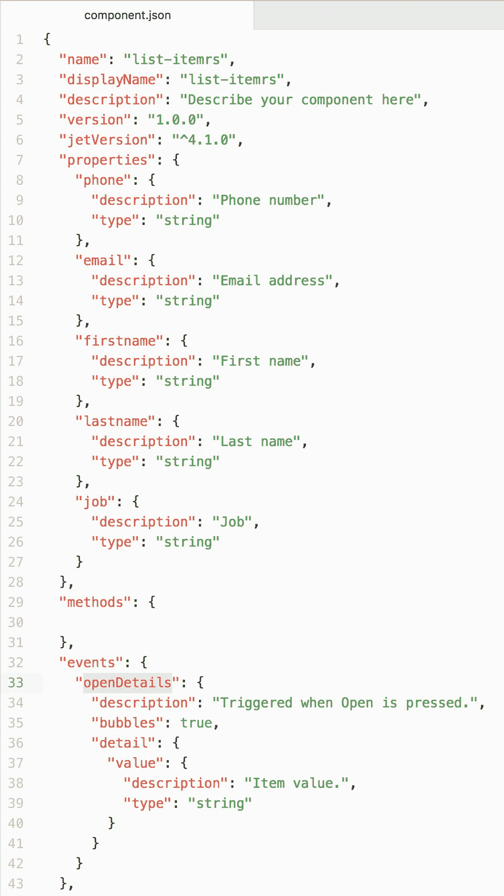

如何使用该事件？看看复合 HTML 实现，click 是由 JS 方法处理的，里面的函数事件将被初始化:

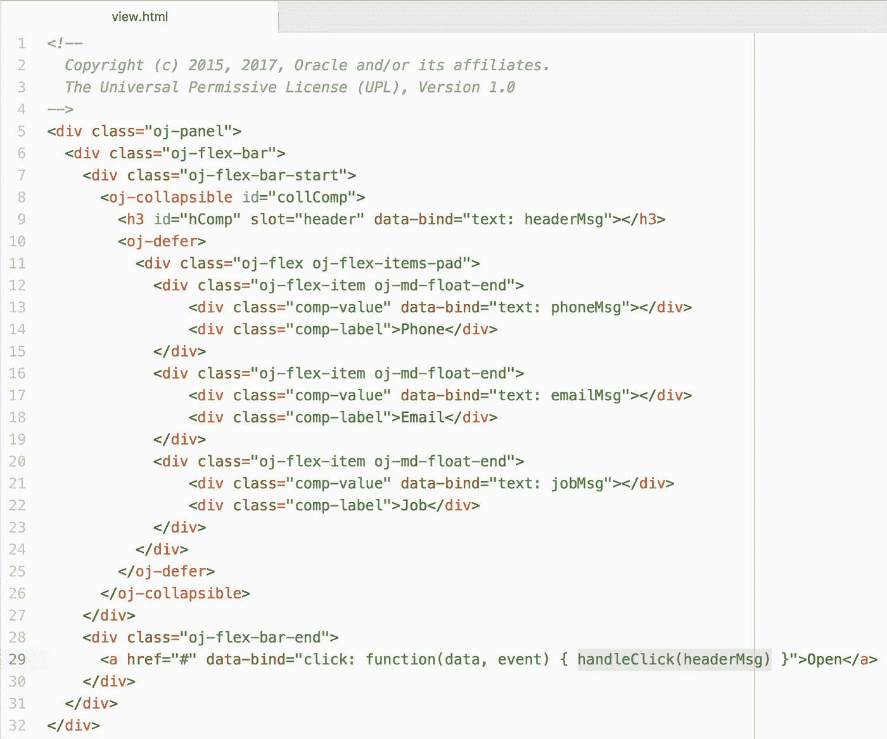

还有一件有趣的事情——我使用 JET Defer 功能，在项目展开时呈现 HTML 可扩展内容。这允许通过延迟加载来最小化客户端负载，在显示内容时呈现内容:

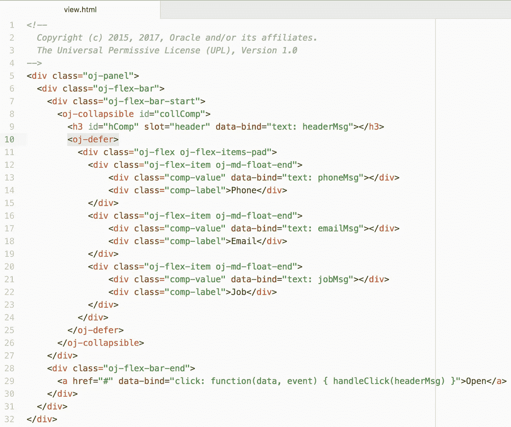

JS 方法，它处理 click-create 事件。这将允许在复合组件之外执行事件实现方法。语法看起来非常类似于 ADF 服务器侦听器调用:

事件的命名很重要。如果事件名是 openDetails，那么确保使用 on-open-details 作为复合组件接口中事件处理程序的属性名。在这里，我定义了事件触发时要调用的外部方法:

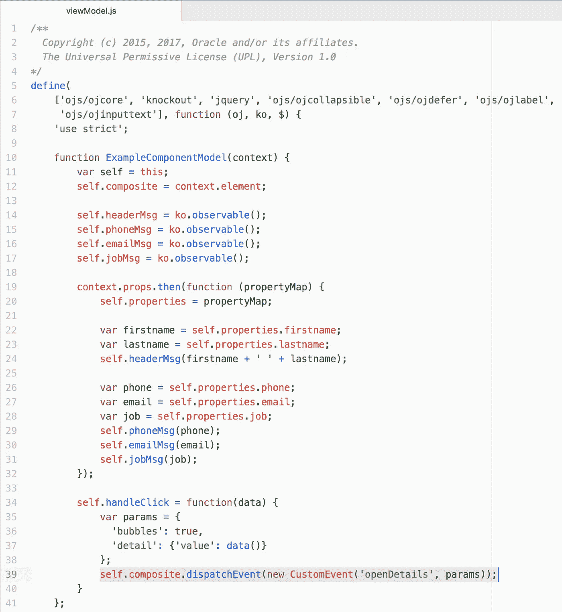

以下是主视图模块中事件监听器 JS 方法的代码:

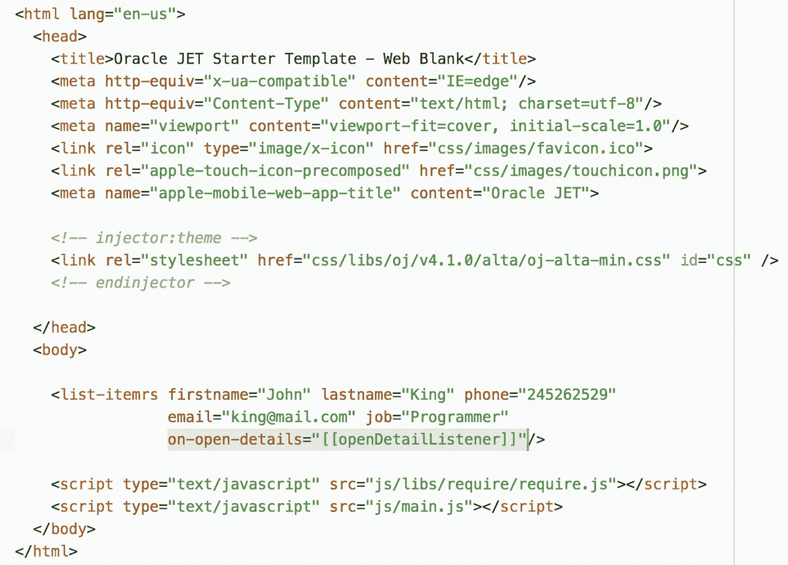

让我们看看 JET Defer 在运行时是如何工作的。这是来自 JET 运行应用程序的源代码，最初呈现列表项时，没有扩展块的内容，它只包含 JET 延迟块:

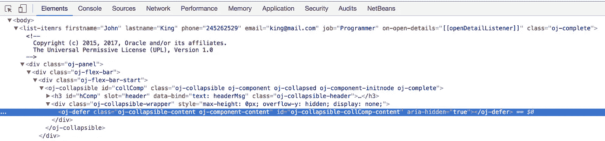

展开后:

内容在源代码中呈现。这被称为延迟加载，这个概念可以提高性能，特别是对于大的列表(或者标签，等等)。)，当呈现大量内容时:

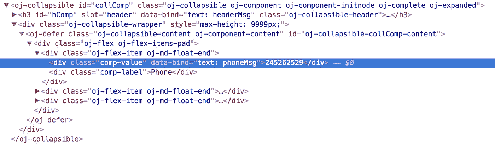

现在很少有人提示如何用 OJET 工具创建 JET 复合材料。运行类似命令:

*sudo ojet 创建组件列表-itemrs*

这将创建具有给定名称的 JET 组合。为了能够从索引页运行 JET Composite，请将 applyBindings 添加到 main.js require 块:

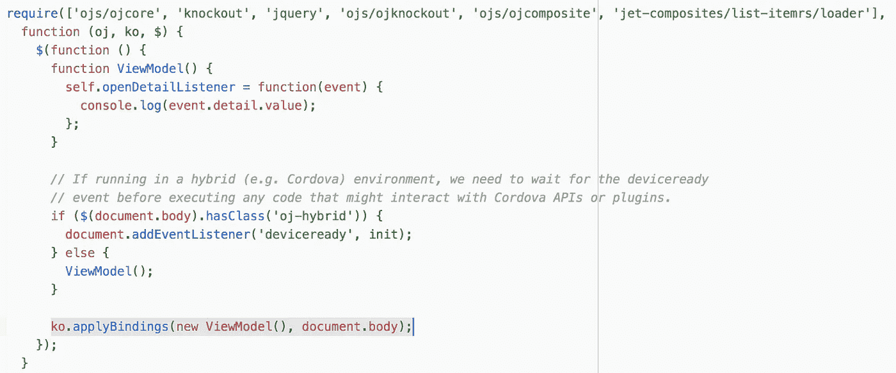

不要忘记添加 JET 复合模块和实际的复合加载器:

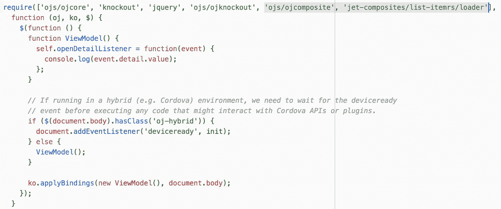

最后，将您自己的 JET 复合标记添加到 index.html:

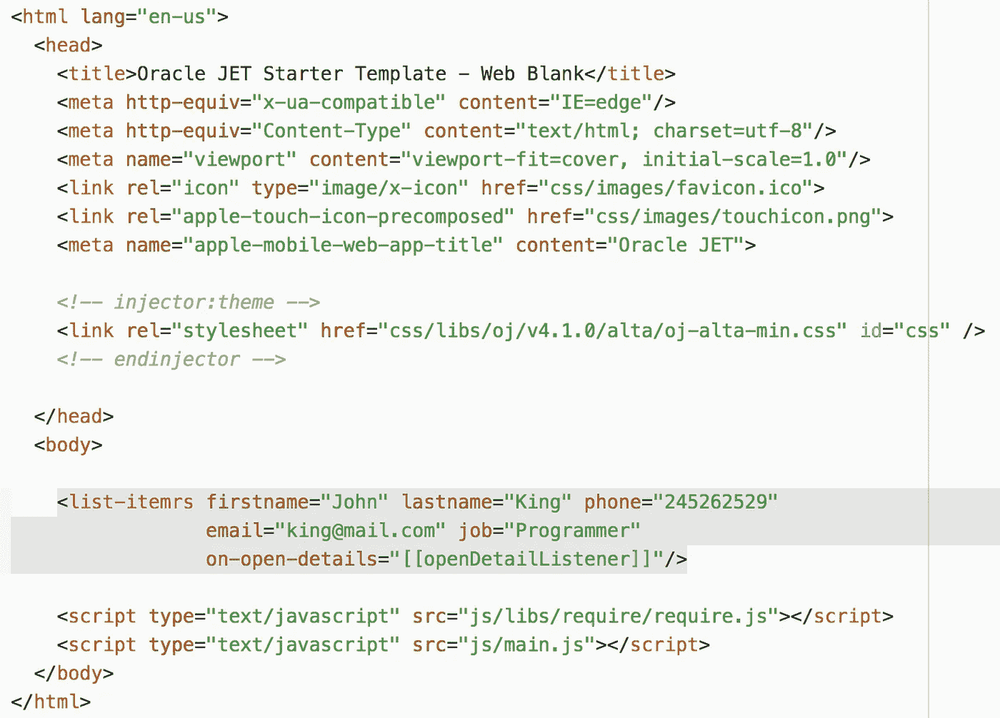

可以在 GitHub 存储库中访问示例代码(运行 ojet restore)——[列表-itemrs](https://github.com/abaranovskis-redsamurai/list-itemrs) 。

*原载于 2017 年 11 月 27 日*[*andrejusb.blogspot.com*](http://andrejusb.blogspot.lt/2017/11/jet-410-composite-component-list-item.html)*。*