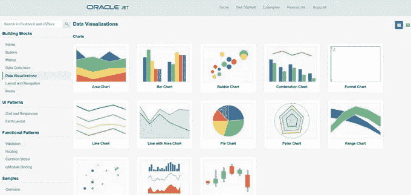

# 在 Oracle JET 上构建钩子

> 原文：<https://medium.com/oracledevs/jet-build-hooks-a2b8b006606c?source=collection_archive---------1----------------------->

我喜欢 JET 的原因是因为我们可以用它免费得到一些东西。在我看来，这些免费的东西中有一部分包括了被严重低估的构建工具。



Oracle JET Data Visualization Components

因此，当我开始考虑如何挂接“后处理”事件时，比如说，丑化和压缩我的 override.css，我有点困惑。

我开始误入歧途，试图绑定到我们用来发布的命令(serve 命令)。我这样做是因为我想要 JET 附带的所有好的丑陋、压缩的东西，再加上我最后的自定义动作。

现在，如果您尝试扩展 serve 命令，问题就来了。你不能这样做，因为服务行动永远不会结束，因为它忙于托管您的网站！

因此，我忽略的一个明显的事情是，构建选项实际上做了所有丑陋的事情，也压缩了东西，它没有试图为你的应用服务。

这意味着我终于可以正确地连接到 JET 构建工具，并在 JET 完成构建后压缩我的 override.css。

你是怎么做到的？简单:

编辑脚手架应用程序附带的 Gruntfile.js，并注册一个新任务:

```
grunt.registerTask("**cm-build**","build for chef market", function (buildType) {

console.info("running Jasons super duper release task")if (buildType == "release" ){
    //do some cool stuff here for a normal build
 } else {
    //do some cool stuff here for a normal build
})
```

并确保我们在已经预先定义的运行中调用新任务:

```
grunt.task.run([`oraclejet-build:${buildType}`,**`cm-build:${buildType}`**]);
```

注意，我的 cm-build 任务接受 build type——我们用它来确定是否传递了 release。这让我们很好地了解了如何运行这项任务:

```
grunt build:release
```

构建类型被设置为发布，或者如果我们做一个普通的、简单的构建，它是未定义的。这意味着在我们的任务中，我们可以确定它是否是一个发布版本。

所以，这里的要点是:你可以使用构建来发布；你不必依赖发球！

——杰森·斯卡费::[格里菲斯·韦特](http://www.griffiths-waite.co.uk)