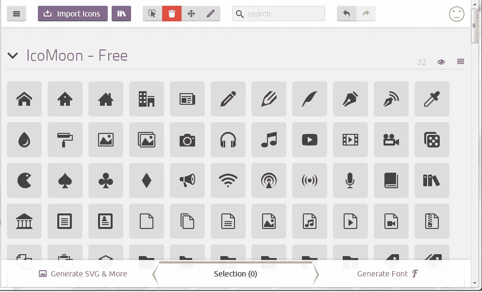
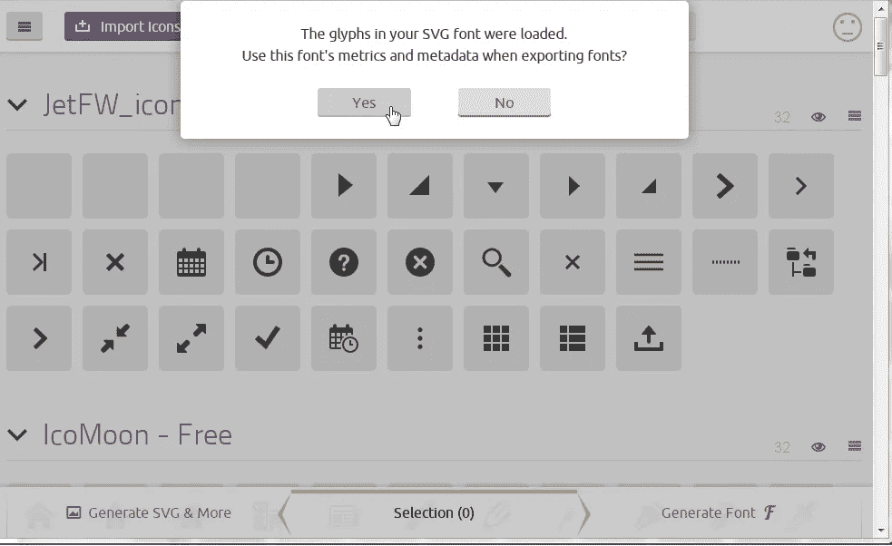
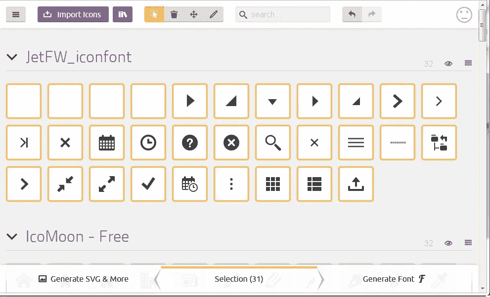

# JET 图标和您的自定义 SVG

> 原文：<https://medium.com/oracledevs/jet-icons-and-your-custom-svgs-475d2f44875b?source=collection_archive---------1----------------------->

将您的图标与[Oracle Javascript Extension Toolkit](http://oraclejet.org)的字体文件结合起来进行优化。

# 序文

我喜欢夏令营。我特别喜欢甲骨文夏令营，在那里新技术专家聚集在一起，分享想法和技巧。

在一次午餐休息时间与 [Geertjan Wielenga](https://twitter.com/geertjanw?lang=en) 交谈时，他向我介绍了他的一位课程参与者正在研究的一项有用的技术:将 SVG 注入一个字体文件(即. woff 文件)。

因为我热爱优化，几乎到了对我有害的地步，所以我决定把这个做得更深入一点。

我目前有一个网站是在一个基本的基础设施上。我是认真的。因此，通过减少对服务器的请求来获得优化，让我的精力更加充沛。

我将一些 SVG 作为图片加载到 HTML 中，这导致了大量的请求被创建；一个页面上的图标越多，应用程序就越聊天。

但是，如果您可以将这些图像放入一个. woff 文件中作为一个文件(和一个请求)会怎么样呢？更好的是，如果你可以连接到预定义的喷射。woff 文件，并从那里提供图像…

# 寻找喷气机。woff 字体文件

在你的 JET 应用程序中，你可能已经注意到你的根目录下有一个名为*主题*的文件夹。在 *src* 中也可能有一个*主题*文件夹，但是暂时忽略它。

据我所知， */themes* 是构建的准备区域。这在构建时被复制到 */web* 目录中。

因此，在 */themes* 中，我们有一个命名的主题目录。默认情况下，你会得到*阿尔塔。这是 css 的地盘。这里也有一个名为 *fonts* 的目录。这就是 JET 默认的地方。woff 文件寿命*

> CSS 文件:/themes/alta/web/alta.css
> 
> 字体文件:/themes/alta/web/fonts/JetFW _ icon font . woff

主题 css 文件加载到。woff 文件，这意味着我们可以在它的位置创建一个新的。但是，我们必须小心，因为我们不想删除 JET 默认的箭头和其他小图标。

# 用 IcoMoon 构建新字体

现在我们知道了主题字体在哪里，我们可以使用 IcoMoon 中的一个简洁的小应用程序开始挑选我们希望在新字体中使用的图标。

IcoMoon.io 的真正好处是你也可以上传字体。不幸的是，你只能上传 SVG 字体，而不是. woff。

因此，出于 **Oracle JET 3.2** 的目的，我已经手动保存了 JET。woff 文件，并使用 FontForge 作为 SVG 来导出它。

> 这是喷气式飞机。作为 SVG 文件的 woff:[https://nofile.io/f/Cob2g3Rw16E/JetFW_iconfont.svg](https://nofile.io/f/Cob2g3Rw16E/JetFW_iconfont.svg)

现在只需前往 IcoMoon 并开始选择您的自定义字体。

# 使用 IcoMoon

您将看到一个类似于以下内容的屏幕:



首先，点击顶部的“导入图标”(紫色按钮)上传我上面提供的 JET 字体文件，并从中选择所有内容



Say ‘Yes’ to this so we keep the same content slots…so nothing breaks!



Select all the JET icons

现在，您可以用同样的方式添加自己的 SVG 文件，或者通过单击“导入图标”旁边的“书籍”图标从 IcoMoons 库中选择一些文件。令人惊讶的字体真棒包括在这里！

完成后，单击“生成字体”以获得包含您的。woff，。svg 文件和 CSS 如何使用它。

对于本教程，我们将只使用. woff。

# 安装您的新字体

1.  进入你的***/themes/alta/web/fonts***目录，将下载的 icomoon.woff 文件移入其中
2.  编辑 alta.css 和 alta.min.css(或您的自定义主题，如果您有的话)以用 ***字体/icomoon.woff*** 替换 ***字体/JetFW_iconfont.woff***
3.  构建和测试

您应该会看到 icomoon.woff 正在使用开发工具下载到浏览器的网络选项卡中。

# 使用你的新字体

这就是 style.css 在 zip 中派上用场的地方。

我实际上是在我的新字体中用字体牛逼图标来代替图标。举个例子，我有这个:

我可以换成:

> my-icomoon-icon "/ >

在 CSS 中，我将正确的类从 style.css 复制到 override.css 中:

```
.**my-icomoon-icon**:before {
   content: “\e900”;
}
```

如果你对此感到困惑，那么我的建议是:

1.  始终使用:before 前缀

2.确保字体系列是正确的。如果您完全遵循 alta.css 的更改，则使用以下内容在 override.css 中设置字体系列:

字体系列:“Alta 图标字体”；

3.如果你在纠结什么图标是什么数字，那就用 FontForge。

# 外卖食品

您可以通过提供一个单个服务来显著减少请求的数量。woff 文件。更改主题 css 和 min.css，使其指向一个新的*字体文件。*

*传输 1…10…100 张图像的 1 个文件！*

*——杰森·斯卡费::[格里菲斯·韦特](http://www.griffiths-waite.co.uk)*