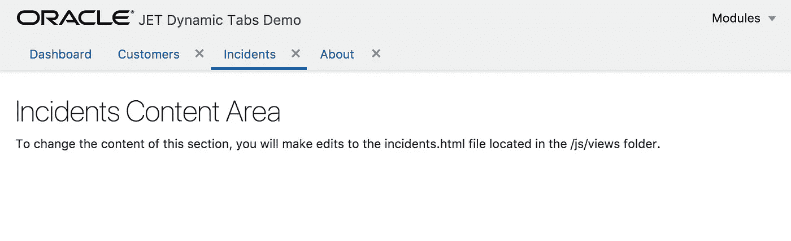

# 带有动态选项卡实现的 JET UI 外壳

> 原文：<https://medium.com/oracledevs/jet-ui-shell-with-dynamic-tabs-implementation-9d58939cabdc?source=collection_archive---------0----------------------->

我将描述并提供示例代码——如何在 Oracle JET 中实现动态选项卡。这对于模块加载很有用，默认的 JET 模板带有静态标签——这对于模块数量较少的应用程序来说是可以的。当菜单结构更复杂时，当从菜单中选择模块时，动态加载每个模块的标签是有意义的。这使得用户可以专注于他正在工作的模块，就像你的网页浏览器中的标签一样。

动态标签只是视觉占位符，我使用 JET 路由器加载模块，并保持标签选择同步。这种方法有多种好处——模块加载遵循路由器的标准 JET 实现，从视觉上看，我们使用标签加载了模块。当依赖于 JET 路由器时，使用 JET 实现动态 UI 外壳标签变得非常简单。在这篇文章中，我将描述如何:1。添加新选项卡并选择模块 2。从菜单中选择现有选项卡/通过单击选项卡本身并选择模块 3。移除选项卡并选择下一个可用模块仪表板模块是默认模块，它在应用程序访问后加载，我们不允许移除它。其他模块可从菜单列表中访问:

打开多个菜单项，标签显示在下面。让我们看看制表符删除是如何工作的。如果我删除*事件*选项卡:

右侧的下一个选项卡将被选为当前选项卡:

如果移除未选中的标签页— *客户*，当前标签页将保持选中状态:

如果右边没有页签，在移除当前页签左右的*时，会选择左边的第一个页签:*

实现部分—在本例中，菜单列表是用 JET 菜单组件实现的(在实际应用中，您可能会使用更复杂的菜单结构，可能是分层的):

动态标签解决方案基于 JET 标签栏组件，具有可移除选项(您可以在 JET Cookbook — [添加/移除](http://www.oracle.com/webfolder/technetwork/jet/jetCookbook.html?component=tabbar&demo=tbaddremovetabs)标签示例中尝试):

应用程序定义选项卡和变量数组来跟踪当前模块:

一旦加载了菜单项，我们首先检查它是否已经打开。如果是—我们打开它，而不是打开同一个标签两次。选项卡阵列用新项目更新，JET 路由器导航到当前模块，这是模块显示的方式，没有其他神奇之处:

当用户选择选项卡时，当前模块通过 JET 路由器加载:

标签移除在*删除*方法中处理。这里的计算已经完成，在当前标签移除后，哪个标签应该被聚焦。从选项卡阵列中删除项目，并更新 JET 路由器状态:

示例 JET 代码可以在我的 [GitHub](https://github.com/abaranovskis-redsamurai/dynamictabsjet) 库中找到。

*原载于 2017 年 12 月 27 日*[*【andrejusb.blogspot.com】*](https://andrejusb.blogspot.lt/2017/12/jet-ui-shell-with-dynamic-tabs.html)*。*