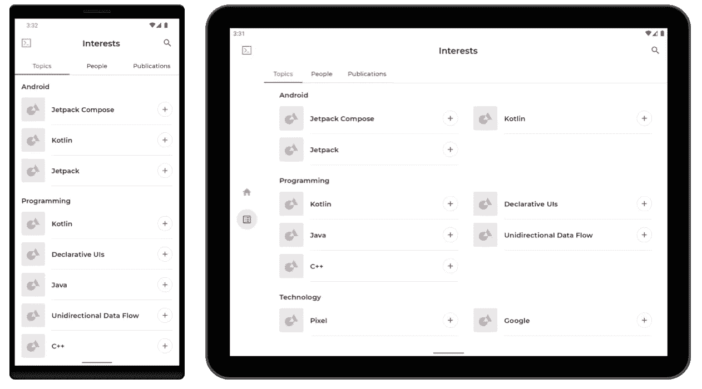
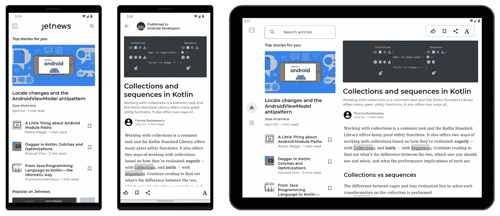
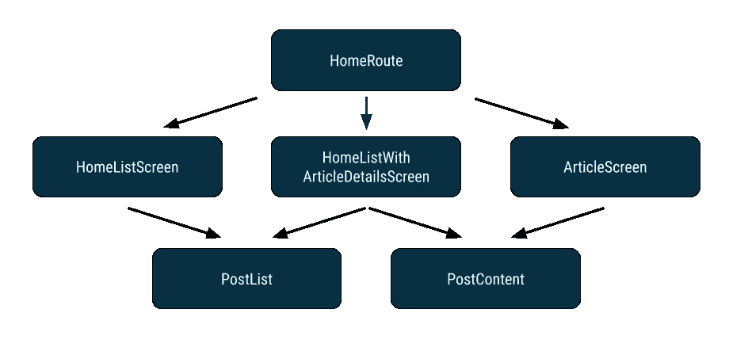
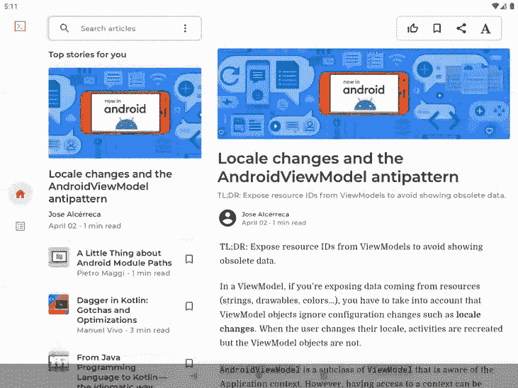
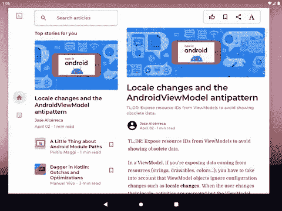

# 每个屏幕的 Jetnews

> 原文：<https://medium.com/androiddevelopers/jetnews-for-every-screen-4d8e7927752?source=collection_archive---------4----------------------->

我们最近更新了 [Jetnews](https://github.com/android/compose-samples/tree/main/JetNews) 以增强其在所有移动设备上的行为，无论大小。我们将带您了解我们的**设计和开发流程**，以便您可以了解**使用 Jetpack Compose** 构建针对所有屏幕优化的应用程序的理念和相关实现步骤，包括如何构建列表/细节布局。如果你是 Compose 新手，看一看[developer.android.com](https://developer.android.com/jetpack/compose)上的优秀指南，因为这篇文章假设我们在改进现有的 Compose 应用程序时对 Compose 有基本的理解。

在我们为所有屏幕进行优化之前，Jetnews 发现自己的情况可能会被当今的许多应用程序所共享。从最初的设计到实施和测试，我们的主要目标是为传统的纵向手机显示屏打造出色的体验。这是可以理解的，但是[日益多样化的设备](https://android-developers.googleblog.com/2021/10/12L-preview-large-screens.html)挑战了这种专注。在平板电脑、可折叠设备和 Chrome 操作系统中，现在有超过 2 . 5 亿台活跃的大屏幕设备运行 Android。

# 改进对所有屏幕尺寸的支持

Jetnews 已经支持“传统的”移动屏幕，因此很容易将我们所有的变化描述为“增加大屏幕支持”虽然这是真的，但它忽略了拥有**自适应 UI** 的意义。让我们后退一步，尝试重新构建我们想要为应用程序创建和维护的最终结果。

用户的设备是他们进入数字世界的唯一个人门户。作为一个应用开发者，我们应该让用户以他们喜欢的方向和配置运行应用。具体来说，用户给我们的应用程序一个窗口:屏幕上的一个特定部分，我们可以在那里显示交互式 UI。大多数情况下，这是整个设备屏幕，但也不是必须如此。如果用户想横向或纵向使用手机，或者分屏使用多个应用程序，他们应该能够做到。

一个应用程序的窗口可能会以多种方式改变。举几个例子来说，[分屏支持](https://developer.android.com/guide/topics/large-screens/multi-window-support)、带有内部和外部显示屏的可折叠设备以及 Chrome OS 上可调整大小的窗口都会影响应用程序的窗口。试图单独考虑支持每个场景可能会令人畏缩，但是有一个框架可以大大简化这项任务。

所有这些场景之间的共同点是你的应用程序可用的**屏幕大小，这是在用户给你的空间中显示你的应用程序 UI 的最相关的信息。这是方法`Display.getSize()`和`Display.getRealSize()` [被弃用](https://developer.android.com/about/versions/12/deprecations#display-api-deprecations)并被替换为`[WindowMetricsCalculator.computeCurrentWindowMetrics()](https://developer.android.com/reference/androidx/window/layout/WindowMetricsCalculator#computeCurrentWindowMetrics(android.app.Activity))`的主要原因。例如，如果你的应用程序在平板电脑上以分屏模式运行，它不应该试图显示“平板电脑 UI”，除非它实际上有足够的空间。**

这是我们改造 Jetnews 时的心态:

> 给定我们可用的屏幕空间，我们如何才能最好地向用户显示描述应用程序状态的内容？

# 创建代表屏幕大小的状态

为了创建一个适合窗口大小的 UI，我们希望基于由`[WindowMetricsCalculator.computeCurrentWindowMetrics](https://developer.android.com/reference/androidx/window/layout/WindowMetricsCalculator#computeCurrentWindowMetrics(android.app.Activity))`返回的窗口度量来执行逻辑。此外，每当这个计算值发生变化时，我们都需要调整 UI。因为配置更改会更新窗口大小，所以每当发生配置更改时，我们都需要再次计算当前窗口度量。为此，我们构建了`rememberWindowSize()`(很快将由一个构建素材库自己提供！):

每当配置改变时，`rememberWindowSize()`将重组并返回新窗口度量的当前`Size`。读取该大小的每个 UI 都将自动重组和更新。

这种方法与 Compose 的声明性[心智模型](https://developer.android.com/jetpack/compose/mental-model)完美契合。我们不是试图使用一个`onWindowSizeChanged`回调或者将变化公开为一个可观察的`Flow`，而是将窗口的大小缩小为一个简单的可观察状态。我们现在可以像 Compose 中的任何其他状态一样使用这个状态，将它与应用程序中的其他状态结合起来，以声明的方式指定向用户显示的 UI。

> 将窗口大小转换成可观察状态

现在我们有了原始的窗口大小，我们想把它变成一个有意义的值，作为布局决策的基础。由于原始窗口大小可以采用宽度和高度的任意组合，我们将希望使用断点来将所有的`Size`对象分组到一小组桶中。

为此，我们将使用[材质窗口尺寸等级](https://m3.material.io/foundations/adaptive-design/large-screens/overview)规范，该规范根据屏幕宽度将窗口尺寸分为 3 个不同的等级:紧凑、中等和扩展。这三个类允许根据常见场景自然地考虑窗口大小，这可以在我们的设计中引用。

有了所有这些管道，决定显示哪些元素只是检查当前窗口大小类的问题。例如，在 Jetnews 中，当窗口尺寸扩大时，我们希望用一个导航条替换导航抽屉。

我们通过在窗口尺寸扩大时禁用抽屉，并添加一个导航条来实现这一点:

在兴趣屏幕上，我们还想根据屏幕是否展开来更改选项卡行的样式，因此我们可以再次使用`isExpandedScreen`来切换要显示的内容:

Equal sized tabs on Compact and Medium screens, and left-aligned tabs on Expanded screens

使用 Compose，完全基于可用空间交换 UI 元素是很简单的。通过状态提升，我们还可以根据屏幕大小保留这些 UI 变体之间的公共状态，我们很快就会看到这一点。

# 列表详细信息视图的返工导航

在我们的改变之前，文章列表和文章细节列表总是分别显示在不同的导航路径上。这在较小的屏幕上工作得很好，但在较宽的屏幕上，我们可以通过使用[列表细节视图](https://m3.material.io/foundations/adaptive-design/foldables/compositions)来同时显示文章列表和选定的文章，从而利用额外的空间。

From left to right: list only, detail only, both list and detail

因为这影响了应用程序在屏幕层面的设计，这种变化也将影响应用程序的导航结构。

起初看起来最直接的方法是根据屏幕大小的变化进行导航。如果我们在文章详细信息屏幕上，然后旋转设备以获得更多的水平空间，那么我们可能会导航到列表屏幕以显示列表和详细信息。

然而，这种方法很快就显示出一些缺点。如果我们将设备旋转回来，用户会希望回到旋转设备之前的位置。为了实现这一点，我们需要知道我们在旋转之前正在查看细节屏幕，如果是这种情况，有条件地导航回细节屏幕，将该状态存储在导航图之外的某个地方。

沿着这条路走下去，与单向数据流的想法背道而驰，在单向数据流中，尽可能避免来自状态的副作用。我们可能会看到一些视觉假象(为单个帧显示的目的地)，因为我们将无法决定导航，直到我们第一次组合屏幕[导致重组循环](https://developer.android.com/jetpack/compose/phases#recomp-loop)。

> *避免尺寸变化时的副作用(如调用 navigate)*

一个更好的方法是后退一步，调整我们的导航图，以避免因尺寸变化而需要导航。以前，我们在两个不同的导航路线上有我们的列表和细节屏幕。如果我们把它们结合起来，让它们都显示在同一条路径上，我们可以用一个条件语句替换整个屏幕，就像我们已经为导航栏和选项卡行所做的那样。该结构如下所示:

Composable call hierarchy for HomeRoute

我们现在想要 3 种情况，而不是像任务栏那样简单的`if`语句:我们有足够的空间来显示列表和细节，或者如果没有，我们想要单独显示列表或细节。在代码中，看起来如下所示:

传统上，每条导航路线都与特定屏幕一对一配对，因此每个屏幕总是显示在不同的路线上，每条路线都显示特定的屏幕。然而，这里我们打破了正常的配对。现在，在同一条回家路线上，我们可以选择显示三个屏幕中的一个，而不是总是只显示一个。为了控制这种逻辑，我们定义了`HomeRoute`来切换我们显示的全尺寸“屏幕”,这是基于正常的条件逻辑，即屏幕是否被扩展，以及文章当前是否是打开的。这些屏幕组件中的每一个仍然负责显示填充所有可用空间的 UI，这种分层避免了每个屏幕需要知道它在导航图中的确切位置。

为了在只显示细节屏幕时获得我们按下后退按钮时的原始导航行为，我们还包含了一个将`isArticleOpen`设置为`false`的`BackHandler`。这有效地提供了一种导航形式，而无需实际直接使用导航库。

通过在一条路径内控制文章和细节导航，无论我们如何折叠、翻转、调整大小或旋转我们的设备，我们都可以保持 backstack 稳定，并且我们始终可以完全控制屏幕的状态。

将两条导航路线合并成一条的结果是将每条路线的`ViewModel`也合并成一条。没关系。合并后的`ViewModel`会更大，但是我们也不必把所有的逻辑都放进去。正如在 Compose 中的[管理状态中所探讨的，我们可以使用不同级别的状态持有者的组合来避免让一个大对象负责每条路径上的每一个状态。](https://developer.android.com/jetpack/compose/state#managing-state)

# 通过屏幕尺寸的变化来保持用户的状态

无论何时屏幕尺寸发生变化，无论是由于方向变化、折叠或展开设备，还是调整窗口大小，都可以由于配置变化而重新创建一个`Activity`。即使你没有为不同的屏幕尺寸改变任何用户界面，确保状态被正确处理将避免用户丢失他们的工作或他们在你的应用中的位置的糟糕体验。

> *旋转、缩放和折叠时保留用户状态和当前任务*

我们的两个主要工具是`[rememberSaveable](https://developer.android.com/jetpack/compose/state#restore-ui-state)`和[架构组件 ViewModel](https://developer.android.com/topic/libraries/architecture/viewmodel) 以及 [SavedState 模块](https://developer.android.com/topic/libraries/architecture/viewmodel-savedstate)，它们通过活动重建和进程死亡来保存状态。许多内置的 Compose 组件已经在内部使用了`rememberSaveable`，比如`rememberLazyListState`和`rememberDrawerState`。

一旦我们根据屏幕大小切换组件，我们还希望保留这些不同组件中的状态，即使它们当前不可见。

例如，我们希望保留列表和文章的滚动状态，即使由于大小的变化，它们可能并不总是可见的。这保留了用户的位置，即使他们折叠或旋转他们的设备。

Saving the user’s scroll state on the detail view, even when it is hidden

通过将列表和细节滚动状态提升到`HomeRoute`的级别，用户的滚动状态被保留，尽管有多种方式来显示该状态。

# 添加抛光处理

基于这个新的导航基础并利用提升状态，我们可以更容易地添加额外的行为，为用户提供更好的体验。

当列表和文章屏幕都可见时，用户可能正在通读一篇文章，或者他们可能正在浏览列表以阅读下一篇文章。如果他们折叠他们的设备，或者以其他方式导致应用程序调整到我们只有空间显示一个或另一个的程度，我们应该记住用户最后交互的是哪个。

Preserving the last-interacted-with panel when resizing the app

我们可以创建一个修饰符，在用户与可组合组件交互时通知我们，允许我们在用户与应用程序进行任何交互时更新一些状态:

使用这个修饰符，当列表和细节都显示时，我们可以跟踪用户最后与哪个窗格交互，并且如果我们只能显示列表或细节，更新文章是否应该打开:

# 拥抱所有屏幕尺寸

有了所有这些变化，Jetnews 在大屏幕上比以往任何时候都工作得更好，在小屏幕上也是如此。确保用户的状态得到保留，并根据可用的屏幕尺寸智能地显示内容，将在传统手机上的纵向和横向之间切换时带来更好的用户体验，同时也为可折叠和大屏幕设备上的差异化体验奠定了坚实的基础。

Compose 的理念是围绕将状态转换成 UI 而构建的，因此将可用屏幕大小视为一种状态打开了许多令人兴奋的大门和独特的体验。当您迁移组件、屏幕或整个应用进行合成，或者从头开始构建新应用时，我们希望您牢记这些原则，以帮助更轻松地支持每个用户的设备。

您可以下载示例，并在 GitHub 上查看改进的 Jetnews 实现[。你可以在【developers.android.com】的](https://github.com/android/compose-samples/tree/main/JetNews) [Material Design 3](https://m3.material.io/) 网站上找到更多关于规范布局和大屏幕的设计指导，也可以在[的](https://developer.android.com/large-screens)上看到更多关于两种视图和合成的响应式 ui 的信息。