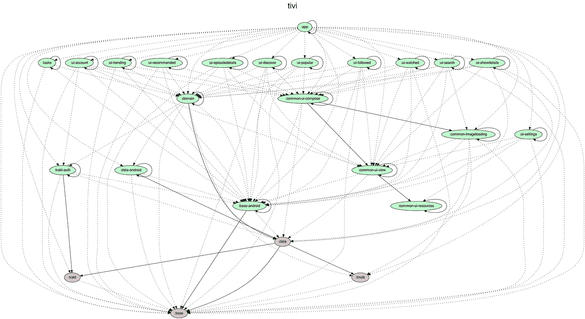
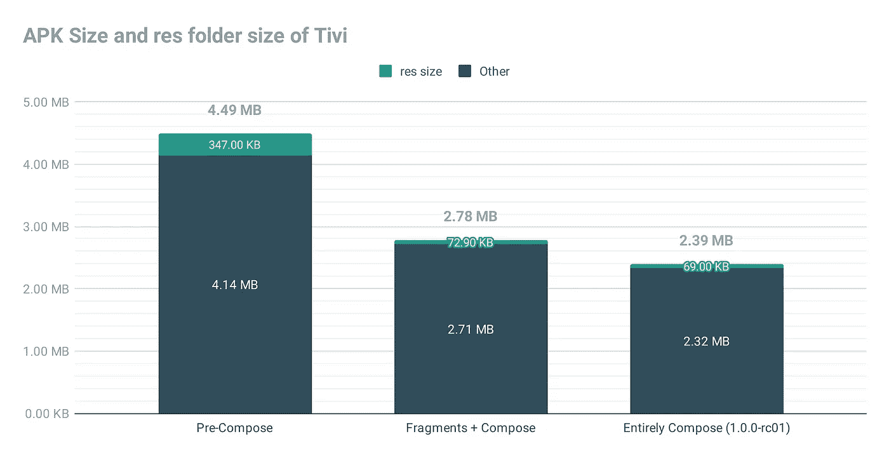
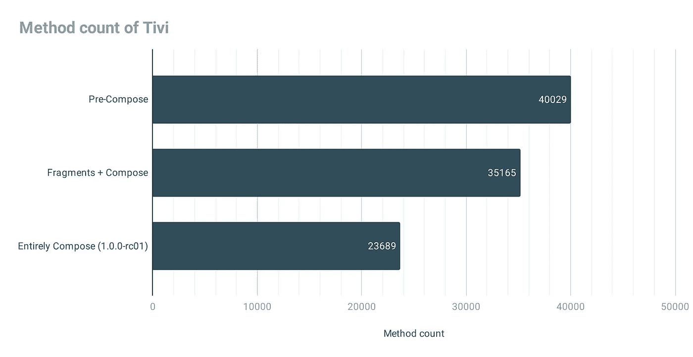
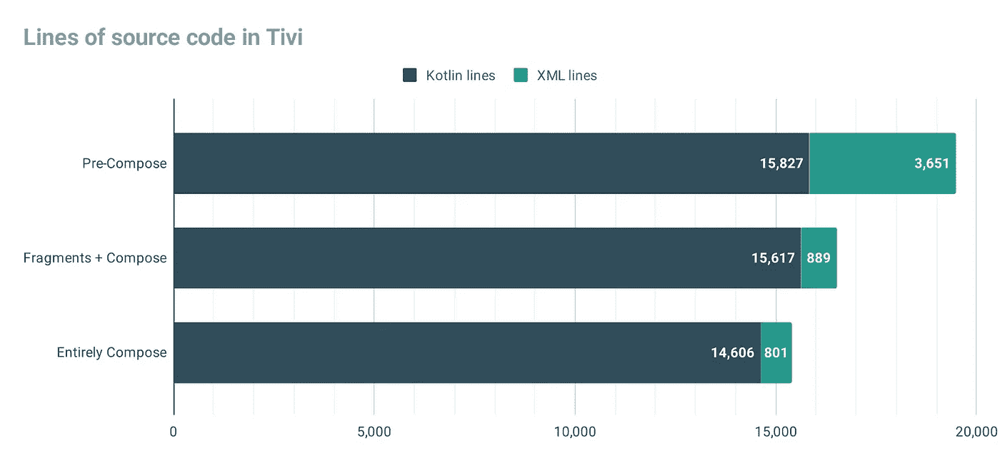
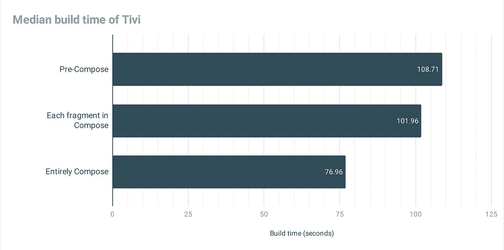

# Jetpack 撰写-之前和之后

> 原文：<https://medium.com/androiddevelopers/jetpack-compose-before-and-after-8b43ba0b7d4f?source=collection_archive---------0----------------------->


## 将 Tivi 示例应用程序迁移到 Jetpack Compose 后，构建速度、APK 大小和源代码行数是如何变化的

***此帖子自首次发布以来已经更新，新增了 Jetpack Compose 1 . 0 . 0–rc01 的更新统计数据。*** *如果你想看这篇帖子的原版，请看* [*这里*](https://web.archive.org/web/20210226105855/https://medium.com/androiddevelopers/jetpack-compose-before-and-after-8b43ba0b7d4f) *。*

2020 年，我开始慢慢地将 [Tivi](https://tivi.app/) 中的 UI 移植到 [Jetpack Compose](https://developer.android.com/jetpack/compose) 中，大约 12 个月后，这项任务已经完成。🎉

在这篇博文中，我们将回顾并比较一些关键指标，看看 Compose 在 APK 大小、构建速度和代码行数方面的表现如何。

# 该应用程序

在我深入到编写方面之前，让我快速描述一下这个应用程序。

Tivi 是高度模块化的，每个 UI“屏幕”都在它自己的 Gradle 模块中(名为`ui-$NAME`)。这些屏幕中的每一个都在一个`[Fragment](https://developer.android.com/guide/fragments)`中实现，然后使用主`app`模块中的 [AndroidX 导航](https://developer.android.com/guide/navigation)拼凑在一起。为了让你对结构有一个概念，这里有一个应用程序模块的图表:



Graph of Tivi’s module structure. Generated using [Jake Wharton](https://twitter.com/JakeWharton)’s handy [Gradle task](https://github.com/JakeWharton/SdkSearch/blob/master/gradle/projectDependencyGraph.gradle)

由于导航图是使用[深度链接 URIs](https://developer.android.com/guide/navigation/navigation-deep-link) 实现的，确保了解耦，所以大多数片段彼此并不了解。也许更重要的是，它还允许独立的模块编译，这有助于构建并行性。

*注:Tivi 的模块结构无论如何都不是完美的。UI 模块(在顶部)对基本模块(在底部)的依赖太多。理想情况下，每一层都应该分开。让我继续努力。*

在我开始迁移到 Compose 之前，Tivi 使用了所有酷的🌈用户界面💫Android 开发者可用的东西:[数据绑定](https://developer.android.com/topic/libraries/data-binding)、[环氧](https://github.com/airbnb/epoxy)、[材质设计组件](http://material.io/develop/android/)、 [Insetter DBX](https://github.com/chrisbanes/insetter) 、 [MotionLayout](https://developer.android.com/training/constraint-layout/motionlayout) 不一而足。但不幸的是，大多数都有构建成本，因为它们使用了注释处理。

# 迁移过程

前面我提到我们刚刚完成了迁移的“第一阶段”,我这么说是什么意思呢？这个应用程序看起来几乎和我 2020 年 2 月开始使用时一样。

该应用的模块化特性意味着迁移本身可以一部分一部分地完成，这正是过去 11 个月发生的事情，涵盖了 [46 个拉请求](https://github.com/chrisbanes/tivi/pulls?q=compose)。

我从一个简单的画面开始:[剧集详情](https://github.com/chrisbanes/tivi/pull/544)，然后迁移了 S [如何详情](https://github.com/chrisbanes/tivi/pull/583)，然后'[发现](https://github.com/chrisbanes/tivi/pull/692)，然后'[搜索](https://github.com/chrisbanes/tivi/pull/711)，然后'[跟着显示](https://github.com/chrisbanes/tivi/pull/720)等等。随着最近添加了对 Compose 的 Paging3 支持，我可以迁移最终的屏幕:“列表”网格:

Video showing the Tivi app, before and after the migration

迁移的第一阶段导致应用程序使用[片段](https://developer.android.com/guide/fragments)和[导航](https://developer.android.com/guide/navigation/navigation-getting-started)，每个片段的 UI 通过 Jetpack Compose 实现。

第二个(也是最后一个)阶段是从片段中迁移出来，直接使用[导航组合组件](https://developer.android.com/jetpack/compose/navigation)。这在本 PR 中完成:

[](https://github.com/chrisbanes/tivi/pull/761) [## 迁移到由 chrisbanes Pull Request # 761 chrisbanes/tivi 编写导航

### 这个 PR 从 Tivi*中移除(几乎)所有片段，并迁移所有内容以构成导航。没有…

github.com](https://github.com/chrisbanes/tivi/pull/761) 

> 对我来说，Compose 是 Android 上 UI 开发的未来是显而易见的。

那么，让我们来看一些指标…📊

# 韵律学

对于下面的每个指标，我们将比较三个不同版本的应用程序:

1.  **预合成。**这是[提交](https://github.com/chrisbanes/tivi/commit/07ac27d9e7cba0eef76ef44cc9551261e2b3f9db) *之前*我在 2020 年 2 月登陆了第一个为 Tivi 添加撰写支持的 PR。
2.  **片段+构成。**这基于标志着迁移第一阶段结束的[提交](https://github.com/chrisbanes/tivi/commit/8f4d9c05aeb6ed092d9fe49a3335c8c56cfb7f03)。我后来分支并更新了它，使用 Jetpack Compose 1.0.0-beta05、AGP 7.0.0-alpha14、Gradle 7.0 和 Kotlin 1.4.32，以便直接比较。
3.  **完全构成。**这是使用当前的树顶 main [提交](https://github.com/chrisbanes/tivi/commit/eb1283881454fd34004c1eff0162d6781b0efbd1)。Tivi 完全基于 Compose(使用 *1.0.0-rc01)* ，app 中没有片段。

# APK 尺寸🗜

你的用户最关心的指标:APK 尺寸。

以下结果是在[资源缩减](https://developer.android.com/studio/build/shrink-code#shrink-resources)启用的情况下，使用 [APK 分析仪](https://developer.android.com/studio/build/apk-analyzer)测得的缩小的`release` APK(使用 R8)的结果。



Chart showing APK size of Tivi



Chart showing method count of Tivi

## 关于这些数字的一些注释:

*   我们使用从 [APK 分析器](https://developer.android.com/studio/build/apk-analyzer)报告的“APK 文件大小”(不是下载大小)。

## APK 粒度分析

当比较调整后的值与“预合成”时，我们看到使用 Compose 时，APK 大小减少了 **46%** ，方法数量减少了 **17%** 。🤯

> 当使用 Compose 时，我们看到 APK 大小减少了 **41%** ，方法数量减少了 **17%**

这个数字显示了当你需要保留所有的`View`类时，缩小工具能有多大的帮助，以防在布局文件中使用它们。

# 代码行📜

现在，我知道在比较软件项目时，计算源代码行数并不是一个特别有用的统计数据，但是它确实提供了对事物如何变化的洞察。

对于这个测试，我使用了 [**时钟**](https://github.com/AlDanial/cloc) 工具，使用以下命令来排除任何构建、生成和配置文件:

```
cloc . --exclude-dir=build,.idea,schemas
```



Chart showing lines of source code in Tivi

`cloc`工具内置了对忽略注释的支持(虽然我没有验证这一点)，所以上面的结果是针对实际的“代码”的。不出所料，XML 行数减少了*非常大的幅度: **76%** 。拜拜布局文件、样式、主题和许多其他 XML 文件。👋*

同样有趣的是，科特林的线路总数也下降了。我的工作理论是，我们现在在应用程序中有更少的样板文件，我们能够删除许多视图助手和实用程序代码。见[这个 PR](https://github.com/chrisbanes/tivi/pull/713) 去掉了我这些年写的近**3000**行:

[](https://github.com/chrisbanes/tivi/pull/713) [## 通过 chrisbanes pull request # 713 chrisbanes/tivi 删除旧代码🗑️的负载

### GitHub 是超过 5000 万开发人员的家园，他们一起工作来托管和审查代码、管理项目和构建…

github.com](https://github.com/chrisbanes/tivi/pull/713) 

# 构建速度⏳

构建速度是开发人员非常关心的一个指标。在开始这个过程之前，我有一种感觉，去掉许多注释处理器将有助于提高构建速度，但我不确定提高多少。

## 测试设置

在我继续之前，知道我是如何测量下面的数字是很重要的。当 Chris Horner 在不同的 CPU 上测量[构建时间时，我使用了与](https://chrishorner.codes/post/cpu-build-comparison/)[类似的设置。](https://twitter.com/chris_h_codes)

我测试的机器是联想 P920，内存为 192GB，CPU 为*非常快*的 [Xeon Gold 6154](https://www.intel.co.uk/content/www/uk/en/products/processors/xeon/scalable/gold-processors/gold-6154.html) 。不用说，这台机器不是典型的开发人员设置，所以为了使测试更加真实，我将 CPU 固定在它的最低时钟频率:

```
# Use performance governor to allow tweaking of max freq
sudo cpupower frequency-set -g performance
# Set max frequency to CPU minimum: 1.2GHz
sudo cpupower frequency-set -u 1.2GHz
```

为了启动所有的远程藏物缓存，我运行了`./gradlew assembleDebug`。

为了运行测试，我在一个循环中运行了以下命令 5 次:

```
 ./gradlew --profile \
           --offline \
           --rerun-tasks \
           --max-workers=4 \
           assembleDebug
```

> `--max-workers`不是绝对必要的，但是默认情况下，Gradle 将使用该 CPU 上所有的 64 个“内核”。限制为 4 个更类似于典型的笔记本电脑 CPU。

## 结果

使用每个生成的配置文件报告的“总构建时间”值，您可以看到下面的测试结果。



Chart showing median build time of Tivi

这个结果让我很惊讶，因为“完全合成”的时间比“合成中的每个片段”快 **25 秒**。🤔

感谢伊万·加夫里洛维奇(Ivan gavrilovi)找出原因，这与作曲无关。“完全合成”是使用最新版本的匕首/剑柄，它使用了 Android Gradle Plugin 7.0 中的新 ASM API。该应用程序的其他版本使用的是旧版本的剑柄，它使用了不同的机制，导致下载时间为*slow www。*

退一步说，当你想到 Kotlin 编译器&composite 编译器插件现在为我们做的一切，比如位置记忆和细粒度重组，构建时间的 **29%** **减少**是惊人的。更多信息请参见 [Leland](/@intelligibabble) 这篇文章:

[](/androiddevelopers/understanding-jetpack-compose-part-1-of-2-ca316fe39050) [## 了解 Jetpack 编写—第 1 部分，共 2 部分

### 使用合成构建更好的用户界面

medium.com](/androiddevelopers/understanding-jetpack-compose-part-1-of-2-ca316fe39050) 

# 警告

以上所有结果都有一些警告:

## 特写作品

虽然在过去的 11 个月里，我没有在 Tivi 上进行任何主要的新功能工作，但我也没有特别限制自己。我做了一些改变，这些改变并不关注迁移，而且可能会扭曲结果。

## 依赖性更新

在 11 个月的迁移过程中，有许多依赖性更新。大多数依赖项更新是运行时库依赖项，因此很可能会影响 APK 大小指标。

我还更新了[grade le](https://gradle.org/)(从`6.0.1`到`7.1.1`)、[Android grade le 插件](https://developer.android.com/studio/releases/gradle-plugin) ( `3.6.0`到`7.1.0-alpha02`)和 [Kotlin](https://kotlinlang.org/) ( `1.3.61`到`1.5.10`)，这些都对构建速度有很大的影响。

## 作曲在测试版

显而易见的一个。Compose 目前处于测试阶段，因此所有结果都来自正在开发中的即时快照*。一旦它在今年晚些时候达到 1.0，重新运行这些测试并观察是否有任何差异将是很有趣的。*

# *摘要*

*如果我们看结果和警告，我们不应该做太多的判断，因为我们不是在比较苹果🍎敬苹果🍏；这更像是比较苹果🍎它们稍微甜一点的表亲，梨🍐。*

*除了水果类比，我认为对我来说最大的收获是 Compose 将对大多数开发人员指标产生积极(或中性)的影响。考虑到这一点，加上 Compose 极大地提高了开发人员的工作效率，对我来说，Compose 是 Android UI 开发的未来是显而易见的。*