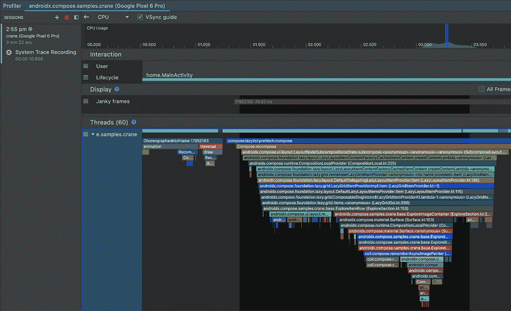
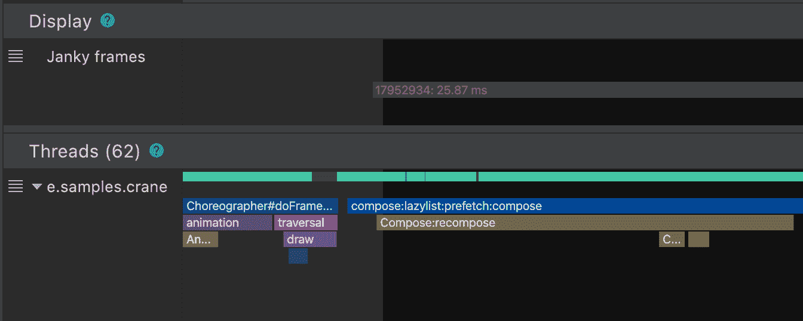
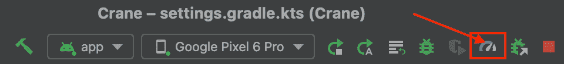
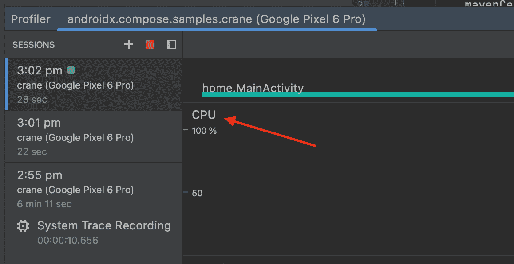
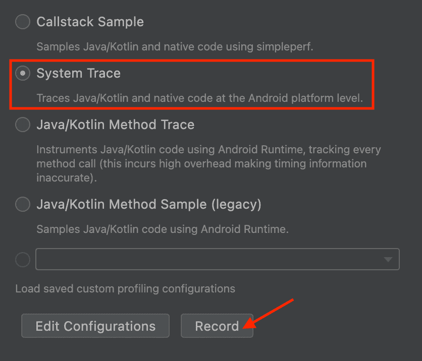
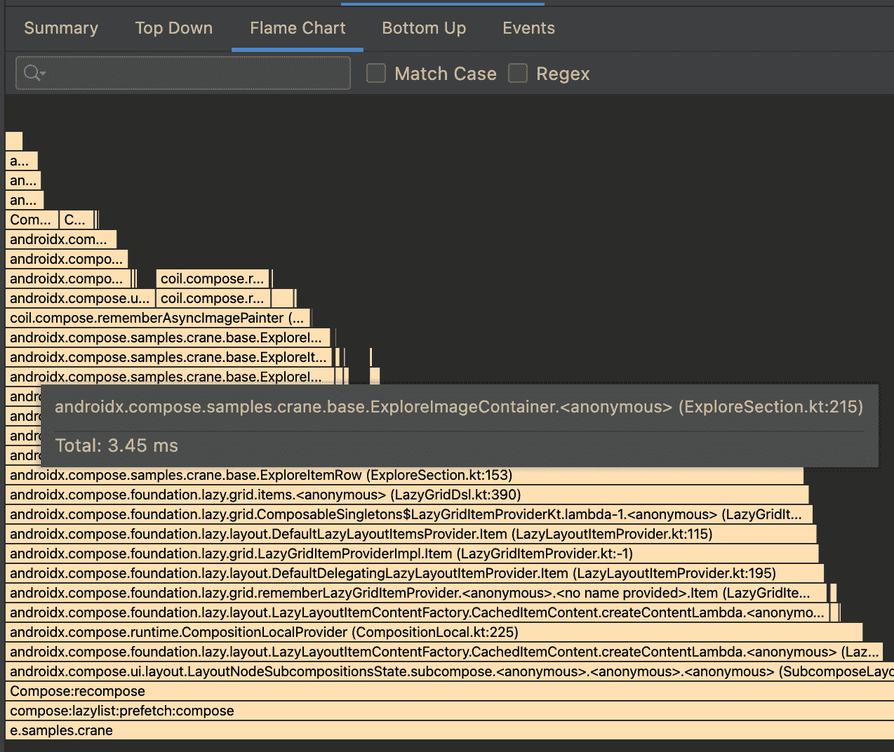

# Jetpack 撰写撰写跟踪

> 原文：<https://medium.com/androiddevelopers/jetpack-compose-composition-tracing-9ec2b3aea535?source=collection_archive---------0----------------------->

今天，我们推出了第一个 alpha Compose composite Tracing，这是一个新功能，允许在 Android Studio Flamingo 系统跟踪分析器中显示 Jetpack Compose 可组合函数。它提供了系统跟踪的低侵入性，方法跟踪组合中的细节层次。这对于检查您的 Compose 应用程序的性能并找出您的应用程序可能无法如您所愿执行的原因非常有用。

以前，系统跟踪只会为您显示每帧一个用于重组的块，但它不会告诉您实际上正在重组哪些组件。这些信息已经可以通过方法跟踪获得，但是方法跟踪可能会非常麻烦，并且会显著影响应用程序的性能。现在，您可以在系统跟踪中看到您的所有组件，没有这个问题，并找到任何比您预期的时间更长的组件！下面是它的预览图:

Composables in the system trace

以防不清楚这提供了多少额外的细节，下面是没有启用合成跟踪时的样子:

System trace without composition tracing

# 设置合成跟踪

要在项目中尝试重组跟踪，您必须至少更新到以下版本。

*   安卓工作室火烈鸟金丝雀 1
*   撰写用户界面:1.3.0-beta01
*   编译编译器:1.3.0

运行跟踪的设备或模拟器也必须至少为 API 级别 30。

此外，您将需要在撰写运行时跟踪上添加一个新的依赖项:

`implementation("androidx.compose.runtime:runtime-tracing:1.0.0-alpha01")`

有了这种依赖性，当您进行包含重组的系统跟踪时，您将自动看到可组合的函数。

# 进行系统跟踪

要进行系统跟踪并查看新的重组跟踪的运行情况，首先要打开分析器

单击 CPU 时间线

将您的应用导航至您想要追踪的 UI，然后选择**系统追踪**和**记录**

使用您的应用程序进行重组并停止录制。一旦跟踪被处理并出现，您现在应该能够在重组跟踪中看到 composables。您可以使用键盘和鼠标来缩放和平移轨迹；如果您不熟悉跟踪导航，请参见[文档](https://developer.android.com/studio/profile/record-traces#ui-shortcuts)。

您还可以在火焰图中看到组件以及文件和行号。

# 警告

## APK 规模开销

虽然我们的目标是尽可能减少该功能的开销，但由于 Compose 编译器跟踪嵌入 APK 中的字符串，Compose 应用程序的 APK 大小有所增加。如果您的应用程序不经常使用 Compose，这可能相对较小，而对于完全合成的应用程序，这可能较大。这些都是不模糊的，所以它们可以出现在跟踪工具中，如上所示。从 1.3.0 版本开始，Compose 编译器将它们注入所有应用程序。

通过添加以下 proguard 规则，可以在生产版本中删除这些内容:

这些功能可能会在未来发生变化，但任何变化都会在撰写[发行说明](https://developer.android.com/jetpack/androidx/releases/compose-compiler)中提及。

请注意，保留它们，虽然会产生一些 APK 大小的成本，但可以保证被分析的 APK 与应用程序用户运行的是同一个。

## 精确计时

为了进行准确的分析，就像任何性能测试一样，您需要根据[https://developer . Android . com/studio/profile # profile able-apps](https://developer.android.com/studio/profile#profileable-apps)制作应用`profileable` / `non-debuggable`

# 反馈

我们希望听到您对此功能的反馈，您发现的任何问题以及您的任何请求。您可以通过[问题跟踪器向我们发送反馈。](https://issuetracker.google.com/issues/new?component=898851&template=1458540)