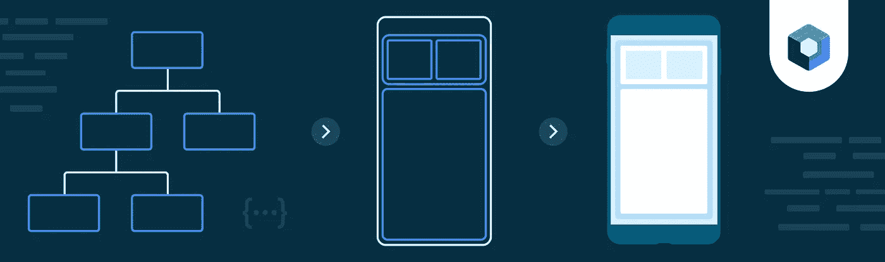
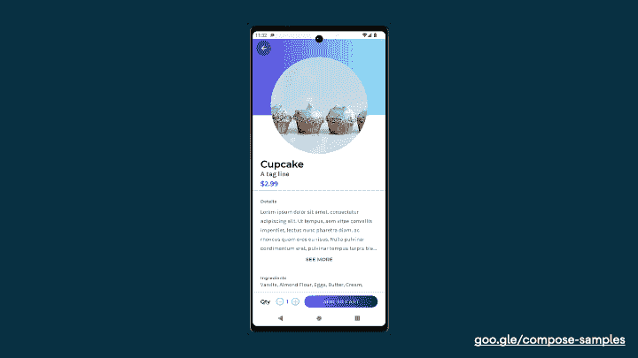
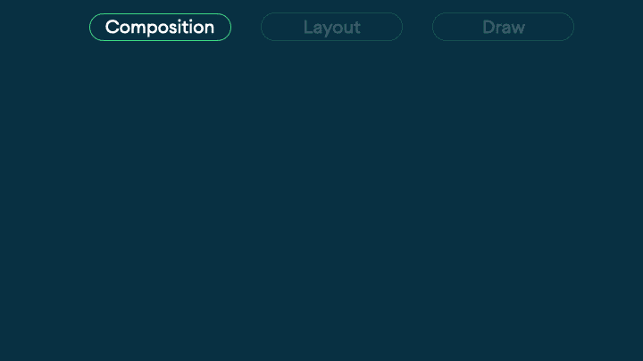
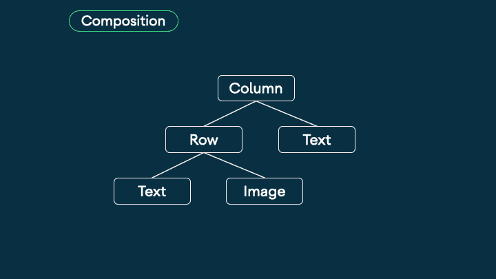
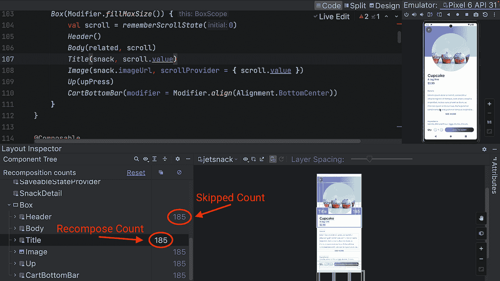
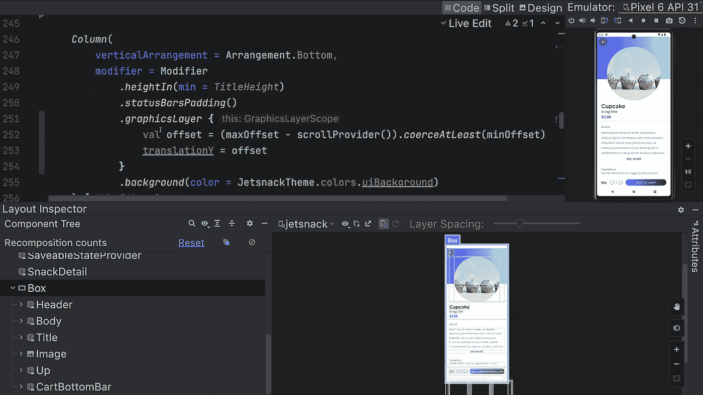

# Jetpack 合成:调试重组

> 原文：<https://medium.com/androiddevelopers/jetpack-compose-debugging-recomposition-bfcf4a6f8d37?source=collection_archive---------0----------------------->

在这篇文章中，我想向你展示我是如何在 [Jetsnack](https://github.com/android/compose-samples/tree/main/Jetsnack) 中发现一个性能问题的，以及我是如何在 Jetpack Compose 中调试和修复它的。如果你愿意的话，这篇文章也可以以视频的形式发布。

Jetpack Compose: Debugging Recomposition

让我们从查看 Jetsnack 示例开始。

详细信息屏幕有一个奇特的折叠工具栏效果，当我们向上滚动时，内容会向上移动并调整大小，当我们向下滚动时，内容会返回到开始时的状态。

Jetsnack details screen — Collapsing toolbar

我们有报告称，在低端设备上，当它滚动时会显得很笨拙。所以，让我们来看看为什么会这样。

# 撰写阶段摘要

在我们开始调试之前，让我们快速回顾一下调试这个问题所需的一些知识。记住作曲有 3 个[阶段](https://developer.android.com/jetpack/compose/phases):

1.  **构图**通过构建一棵可组合的树来决定要显示什么。
2.  布局获取那棵树，并计算出它们将在屏幕上显示的位置。
3.  **绘图**然后将组件绘制到屏幕上。

The three phases of Compose

这是最酷的部分:如果一个阶段中没有状态改变，Compose 可以完全跳过这个阶段。所以不需要仅仅为了重新布局屏幕而重新排版。如果我们可以避免改变我们的合成树，Compose 将完全跳过合成阶段，这将导致性能的提高。

这就是为什么我们的 performance [文档](https://developer.android.com/jetpack/compose/performance#defer-reads)声明，“在使用频繁变化的状态 时， ***更喜欢 lambda 修饰符”。使用 lambdas 可以将工作推迟到以后的阶段，并且可以跳过合成。***

# 使用 lambda 修改器

为什么使用 lambda 修改器意味着我们可以跳过合成？让我们回到合成树看看。

Lambdas changing the composition tree

组合树也是由应用于组合的任何修饰符构建的。

修饰符实际上是不可变的对象。当翻译随着用户向上滚动而改变时，修饰符被重建，旧的被移除，新的被添加到合成树。每次失调改变时都会发生这种情况。因为合成树已经改变，所以发生了重组。

所以请记住，**你不应该仅仅为了重新布局一个屏幕而重新构图**，尤其是在滚动的时候，这将导致抖动的画面。每当你看到不必要的重组，想想如何将工作转移到后面的阶段。

# 修复 Jetsnack 的滚动性能问题

现在我们已经讨论了理论，我们可以深入到 Jetsnack 中的实际问题。

使用 Android Studio 中的布局检查器，我们可以看到可组合函数的[重组和跳过计数](https://developer.android.com/jetpack/compose/tooling#recomposition-counts)。如果我们去 Jetsnack 的详情页，上下滚动，可以看到标题 composable 正在大量重新合成。很可能在每一帧上😨

*注意:如果你升级到 Android Studio Electric Eel，你还可以在布局检查器中看到可组合重新组合时的高亮显示。*

Layout inspector showing recomposition happening

如果我们看一下 [SnackDetail](https://github.com/android/compose-samples/blob/main/Jetsnack/app/src/main/java/com/example/jetsnack/ui/snackdetail/SnackDetail.kt#L95) composable:

我们可以看到标题读取当前滚动值。这意味着每当滚动改变时，这个可组合的将不得不被重新组合。

现在看标题 composable。

它获取滚动值并计算一个偏移量，然后在 [graphicsLayer](https://developer.android.com/reference/kotlin/androidx/compose/ui/graphics/package-summary#(androidx.compose.ui.Modifier).graphicsLayer(kotlin.Float,kotlin.Float,kotlin.Float,kotlin.Float,kotlin.Float,kotlin.Float,kotlin.Float,kotlin.Float,kotlin.Float,kotlin.Float,androidx.compose.ui.graphics.TransformOrigin,androidx.compose.ui.graphics.Shape,kotlin.Boolean,androidx.compose.ui.graphics.RenderEffect,androidx.compose.ui.graphics.Color,androidx.compose.ui.graphics.Color)) 修改器中使用该偏移量来实现屏幕上的平移。

我们可以采取的第一步是推迟将滚动值读入标题 composable。我们可以通过将滚动参数转换为 lambda 来实现这一点。

这将推迟状态的读取，并且至少将重组的范围限制在标题 composable 上。这很好，但我们可以做得更好！

正如我们现在所知道的，当在一个频繁变化的状态中传递时，我们应该首选 lambda 修饰符。我们的滚动值绝对算经常变化！

`graphicsLayer`有一个 [lambda 版本](https://developer.android.com/reference/kotlin/androidx/compose/ui/graphics/package-summary#(androidx.compose.ui.Modifier).graphicsLayer(kotlin.Function1))我们可以切换到。如果我们使用它，我们可以将状态的读取推迟到绘制阶段，这意味着可以完全跳过合成。但是仅仅切换到 lambda 修改器是不够的。由于滚动状态仍然在 lambda 之外读取以计算偏移量，我们仍然需要重新组合。

为了将读取完全推迟到绘制阶段，我们还需要将读取移动到 graphicsLayer {}修改器中。我们将把偏移量的计算移到 lambda 内部，如下所示。

既然我们的合成状态只在 graphicsLayer 修饰符内部被读取，我们已经推迟了在合成之外的读取，可以跳过合成。

如果我们重新运行应用程序并打开布局检查器，我们可以看到构图已被完全跳过。没有对单个组件的重新组合甚至跳过。

Layout inspector showing no recomposition

就是这样！这个问题现在解决了，我们已经实现了相同的折叠工具栏效果，而没有使用重组。

有关更多 Jetpack Compose 性能提示，请参见我们的[性能文档](http://goo.gle/compose-performance)。