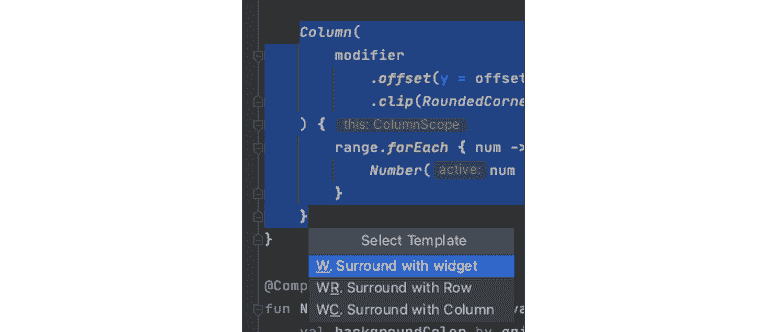

# Jetpack Compose:第一印象和学习资源

> 原文：<https://blog.kotlin-academy.com/jetpack-compose-first-impressions-and-learning-resources-4101bff9f04?source=collection_archive---------0----------------------->

Android 目前的 UI 工具包已经超过 10 年了…如果你以前听说过，一定要阻止我😉

众所周知，Jetpack Compose 是 Android UI 开发的热门新事物。它的承诺是通过消除旧视图系统和 XML 布局的所有痛点来拯救我们。

***流现在提供了*** [***Jetpack 缀聊 SDK***](https://getstream.io/chat/sdk/compose/) ***。查看*** [***撰写聊天消息教程***](https://getstream.io/chat/compose/tutorial/) ***，今天就试试吧！***

在经历了许多预览版之后，它在一周前进入了测试阶段。这里是目前使用 Compose 的情况，以及一些了解它的最佳位置。

# 好人

首先，作曲是*激动人心的*。它使许多基本的 UI 工作变得非常简单，您可以用 Kotlin 编写所有的工作，利用该语言的所有强大功能！这些 API 在 Android Studio 中具有很强的可发现性，因为所有这些都只是 Kotlin 代码，您可以通过代码补全来访问。这使得开始真正容易。

Kotlin 的类型安全在 Compose 中也创造了奇迹。没有传入`dp`值而不是像素，或者混淆了垂直和水平对齐选项。一切都是强类型的，编译器会保护你不犯很多很多错误。

Compose 的声明式风格和状态管理也很棒。基于状态写下你想要出现的东西，不仅清晰明了，也是在视图系统有问题的状态管理之后的一种祝福。

考虑到开发和营销 Compose 所付出的努力，它几乎肯定是 Android UI 开发的未来。也就是说，XML 系统可能永远不会完全消失。就像 Java 到 Kotlin 的转变一样，新标准真正开始生效还需要几年时间，我们偶尔还会发现自己在与来自时代之前*的代码进行交互。*

所以…尽快加入，只是不要期望所有的旧系统会在一夜之间消失。我当然仍然建议今天开始 Android 开发的人学习旧的基于 XML 的系统——除非他们非常确定他们永远不会在现有的项目中工作。

Jetpack Compose 还附带了一些很酷的 Android Studio 工具。Flutter 用户可能已经熟悉了方便的*环绕和*快捷方式，可以让你在一个新的小部件中包装代码，现在 Studio 中也出现了同样的功能。

选择一些代码，用调用*(windows 上的 Ctrl+Alt+J，macOS 上的⌥⌘J)，然后按 r 键选择`Row`，c 键选择`Column`，或者 w 键选择任意小部件。*

另一个快速提示:创建一个新的 Composable 会立即向它添加一个参数列表和一个主体，然后将光标放在它的参数列表中，让您立即添加修饰符和其他参数。

如果您不想添加任何参数，您可以点击`Tab`快速跳转到定义其内容。

# 坏事

现在，让我们看看不好的部分，继续工具主题。要运行 Compose，你必须运行 Android Studio 的最新金丝雀版本。这个版本有…一些问题。

从我几天的个人经历来看:

*   IDE 预览(这对于 Compose 来说是一个非常好的特性)有时根本无法加载，或者不会随着更改而更新(即使在重新构建之后)。重新运行完整的应用程序或者只是在设备上部署一个`@Preview`比使用 IDE 预览功能要快得多。
*   运行合成应用程序时，调试器从未连接到模拟器或物理设备。仍然没有解决这个问题，虽然我听说其他人有更大的成功。
*   Logcat 在运行应用程序时不会显示应用程序名称，因此很难过滤当前应用程序的日志。
*   当在 ide 的工具窗口中运行模拟器时，模拟器选项卡偶尔不会出现在 Studio 的预览版本中。我曾经在一个稳定的 Android 工作室的另一个项目中使用模拟器标签，但最终我放弃了，转而在一个单独的窗口中使用模拟器。
*   有时 Studio 完全冻结了，它的进程必须被终止并重新启动。这种情况大约一天发生一次。

我从其他人那里听到了一些类似的轶事，包括与其他项目相比，使用 Compose 时过度使用资源。这些问题偶尔可以通过重启、使缓存失效、重启 adb 以及类似的“常规”调试实践来解决。

使用 Jetpack Compose 的另一个痛点是，暂时查找如何做事情有点漫无目的。例如，当你登陆 StackOverflow 关于它的问题时，你经常会发现回答说“这是在 dev11 中如何做的”，或者“这是 alpha3 中的新 API”，但是这些 API 都不会出现在当前的测试版本中。

当然，一方面，Compose 经历了许多迭代，并且他们不害怕改变和发展 API，这很好——这就是预览版的目的。

另一方面，对于试图在最新的 Compose 版本上构建东西的开发人员来说，这是一种有点不愉快的体验。值得庆幸的是，随着时间的推移，这种情况自然会得到改善，但我们必须等待一段时间，以获得足够多的新的、最新的答案。

# 资源

既然 StackOverflow 还不会成为你学习作曲的最好朋友，你还能去哪里？

首先，有谷歌的官方资源，这是一个不错的开始:

*   到目前为止，他们最好的资源是书面文档页面— [从这里开始](https://developer.android.com/jetpack/compose/documentation)。其中包括许多有助于在 Compose 中进行设计的解释和代码片段，还涉及到更高级的主题，如导航、架构和与现有代码的互操作。
*   在#AndroidShow 品牌下，也有许多关于 Compose 的视频内容。我建议跳过其中的大部分，尤其是直播和问答部分——它们并不是真正以开发者为中心的，并且包含大量的宣传和营销。
    然而，包含很多价值的是他们关于 Compose 特性的截屏(也包含在书面文档的部分中)。你可以在这个 YouTube 播放列表中找到这些[。](https://www.youtube.com/playlist?list=PLWz5rJ2EKKc8fZY3smX9CPx9Y_O80ycAd)
*   如果你是作曲新手，那么 [Beta 概述视频](https://www.youtube.com/watch?v=Ef1xKWjA9E8)也值得一看。对于更长形式的介绍性内容，去年的这些视频都非常有用: [Jetpack Compose](https://www.youtube.com/watch?v=U5BwfqBpiWU&) 、 [Thinking in Compose](https://www.youtube.com/watch?v=SMOhl9RK0BA) 、 [Compose by example](https://www.youtube.com/watch?v=DDd6IOlH3io) 和 [Compose for existing apps](https://www.youtube.com/watch?v=PjQdFmiDgwk) 。
*   对于动手实践，看看 Google 的 [Compose Pathway](https://developer.android.com/courses/pathways/compose) ，其中包括视频、文章和代码实验室。这在某些部分涉及到重要的细节——随意跳过你不感兴趣的东西，立即深入学习，否则要花很长时间才能看完。
    我还发现这里的一些 codelabs 已经过时了(还没有使用 beta1 APIs)，所以准备好修改一下提供的代码片段，或者调试一下依赖关系。再说一遍，这是很快就会改进的东西。

如果你喜欢阅读， [RayWenderlich 团队的 Jetpack Compose book](https://www.raywenderlich.com/books/jetpack-compose-by-tutorials/v1.0) 中有非常扎实、专业的内容，为你提供了一个完整的入门之旅:对 Compose 的基本 UI 构建块以及多个示例应用程序的良好探索。(这个还是有点过时，因为它的样本用的是 alpha10。祈祷它很快得到修订。)

对于更长形式的视频解释、指导和演示，菲利普·巴比奇的[探索喷气背包组合](https://www.youtube.com/watch?v=2n2mtNfg25s)和[高级喷气背包组合](https://www.youtube.com/watch?v=eL3G1Basx1o)都很棒。

为了找到如何执行基本操作的快速片段， [Compose Academy 网站](https://compose.academy/)可以派上用场。

最后，自己探索 Compose 也是了解它的好方法。您使用的所有 API 都只是 Kotlin 代码，因此通过代码补全进行探索，并在 Android Studio 中跳转到底层实现来读取源代码是非常容易的。大多数组合 API 的代码内文档也非常优秀。

# 结论

你准备好迎接 Jetpack Compose 了吗？我们知道我们是，你可以期待我们很快会有更多的内容，包括我们的 [Android 聊天 SDK](https://getstream.io/chat/sdk/android/) 。

发推文给我们 [@getstream_io](https://twitter.com/getstream_io) ，告诉我们你对 Compose 的看法，以及你认为学习它最有用的方法！

*最初发布于*[*https://getstream . io*](https://getstream.io/blog/jetpack-compose-impressions-resources/)*。*

# 点击👏说“谢谢！”并帮助他人找到这篇文章。

了解卡帕头最新的重大新闻。学院，[订阅时事通讯](https://kotlin-academy.us17.list-manage.com/subscribe?u=5d3a48e1893758cb5be5c2919&id=d2ba84960a)，[观察 Twitter](https://twitter.com/ktdotacademy) 并在媒体上关注我们。

如果您需要 Kotlin 工作室，请查看我们如何帮助您: [kt.academy](https://kt.academy/) 。

