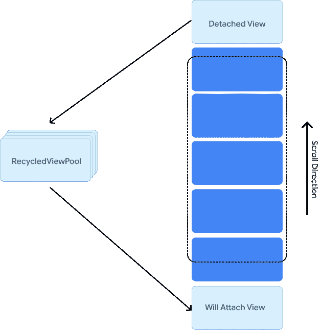

# Jetpack 撰写互操作:在 RecyclerView 中使用撰写

> 原文：<https://medium.com/androiddevelopers/jetpack-compose-interop-using-compose-in-a-recyclerview-569c7ec7a583?source=collection_archive---------1----------------------->


**TL；博士**

*   `RecyclerView 1.3.0-alpha02`和`Compose UI 1.2.0-beta02`带来了 RecyclerView 中组件的开箱即用的高性能使用——不需要额外的代码！
*   如果您之前已经在 RecyclerView 中实现了我们的编写指南，那么现在您应该删除这段代码。

在你的代码库中引入增量合成意味着你可以结束在`RecyclerView`中使用组件作为项目的情况。在组合 UI 版本`1.2.0-beta02`之前，当视图从窗口分离时，`ComposeView`的底层组合被处理。然而，在`RecyclerView`的上下文中，当项目移出/移出屏幕时，它们不断地从窗口分离/附着。不得不重复处理和重新创建组合的开销很大，并且会影响性能，尤其是在快速浏览列表时。


Compose used as items in a RecyclerView

从 Compose UI 版本 1.2.0-beta02 和 RecyclerView 版本 1.3.0-alpha02 开始，库使用的视图合成策略发生了变化:当视图从窗口中分离时，**合成现在会被自动处理**，除非 **它是池容器的一部分，**如 RecyclerView。因此，当 ComposeView 被用作 RecyclerView 中的一个项目时，composables 不再被释放，而是被重用。这种行为变化意味着您不需要做任何工作来正确处理这个问题。如果您已经实现了前面的指南，那么您应该在更新到最新的库之后删除它，因为它将覆盖改进的默认行为。

您的实现应该是这样的:

在这篇文章中，我将介绍为什么推荐以前的指南的背景，以及为什么我们建议您在使用上述版本(或更高版本)的 RecyclerView 和 Compose 时更新您的实现，以获得更好的滚动性能并简化您的代码。

# 了解前面的默认合成策略:DisposeOnDetachedFromWindow

一个`ComposeView`的`[ViewCompositionStrategy](https://developer.android.com/reference/kotlin/androidx/compose/ui/platform/ViewCompositionStrategy)`决定了什么时候应该释放底层组合。在 Compose UI 的`1.2.0-beta02`版本之前，这个值被配置为`**DisposeOnDetachedFromWindow**`，每当视图从窗口分离时，它将释放组合。视上下文而定，视图可能会从窗口中分离出来，这种情况有多种，但通常情况下，这种情况会在底层容器离开屏幕或即将被销毁时发生。虽然这是您在大多数情况下想要的行为，但是在视图经常被分离并重新附加到窗口的情况下，例如在`RecyclerView`中，这种策略是次优的。频繁地处理和重新创建组合会损害滚动性能，尤其是在快速浏览列表时。



Attached/detached views in RecyclerView

为了减轻这一点，`ComposeView`当底层视图被回收时，而不是当它从窗口分离时，可以通过处理来改善组合处理(注意，这仍然不是理想的情况，我们将在后面看到)。我们可以通过覆盖`RecyclerView.Adapter`类中的`onViewRecycled(ViewHolder)`方法来监听这个事件。根据该方法的[文档](https://developer.android.com/reference/androidx/recyclerview/widget/RecyclerView.Adapter#onViewRecycled(VH))，当出现以下情况时，基础视图将被回收:

> “…一个循环视图。LayoutManager 决定不再需要将其附加到其父 RecyclerView。这可能是因为它已不可见，或者一组缓存视图仍由附加到父 RecyclerView 的视图表示。如果项目视图绑定了大型或昂贵的数据，如大型位图，这可能是释放这些资源的好地方。

在`onViewRecycled(ViewHolder)`中，我们可以调用`ComposeView`上的`disposeComposition()`方法。这相当于前面指南的第一部分(如果您使用的是前面提到的 Compose 和`RecyclerView`版本，则不再推荐):

此外，为了防止视图分离时`ComposeView`被释放，我们必须设置一个不同的`ViewCompositionStrategy`。具体来说，我们必须将它设置为`DisposeOnViewTreeLifecycleDestroyed`，这样当底层生命周期所有者被销毁时，组合将被处理掉。

随着这些改变，当一个项目视图分离时，`ComposeView’s`组合将不再被自动处理。所以，当你滚动列表时，我们应该能够看到`ComposeView`项被减少了。为了验证这一点，让我们假设一个`RecyclerView`中的每一项都由一个`ItemRow`可组合表示:


RecyclerView containing ItemRows

当一个`ItemRow`被排版时，一个`DisposableEffect`也进入排版，当它进入时被用作打印机制，然后离开排版。在这种设置下，滚动会产生以下日志语句:

```
16:06:12.840 5619-5619/com.google.samples.app.rv D/ItemRow: ItemRow 0 composed16:06:12.970 5619-5619/com.google.samples.app.rv D/ItemRow: ItemRow 1 composed16:06:13.047 5619-5619/com.google.samples.app.rv D/ItemRow: ItemRow 2 composed16:06:13.119 5619-5619/com.google.samples.app.rv D/ItemRow: ItemRow 3 composed16:06:13.196 5619-5619/com.google.samples.app.rv D/ItemRow: ItemRow 4 composed16:06:17.922 5619-5619/com.google.samples.app.rv D/ItemRow: ItemRow 5 composed16:06:19.033 5619-5619/com.google.samples.app.rv D/ItemRow: ItemRow 6 composed16:06:20.781 5619-5619/com.google.samples.app.rv D/ItemRow: ItemRow 7 composed16:06:20.909 5619-5619/com.google.samples.app.rv D/ItemRow: ItemRow 0 **DISPOSED**16:06:23.482 5619-5619/com.google.samples.app.rv D/ItemRow: ItemRow 8 composed16:06:23.527 5619-5619/com.google.samples.app.rv D/ItemRow: ItemRow 1 **DISPOSED**16:06:23.678 5619-5619/com.google.samples.app.rv D/ItemRow: ItemRow 9 composed16:06:23.752 5619-5619/com.google.samples.app.rv D/ItemRow: ItemRow 2 **DISPOSED**
```

这里我们可以看到，由于容器`ComposeView`被回收，索引为 0、1 和 2 的`ItemRow’s`成分被处置。

虽然这些变化肯定是一种改进，但更好的行为应该是这样的:

> 当新数据被重新绑定到
> 
> 适配器。此外，只有在可能的情况下才应该处理组合
> 
> 请确保不会再次使用“撰写视图”。

利用当前的解决方案，当组合物应该被处理时，它们也可能不被处理。具体来说，如果`RecyclerView`从窗口分离，但是包含的活动/片段生命周期仍然是活动的，则组合将不会被处置，导致组合尽管不再被需要但仍然是活动的。

以前可用的 API 没有办法绕过这些限制，这需要修改 Compose 和`RecyclerView`来改进这些行为。

# 了解新的默认合成策略:DisposeOnDetachedFromWindowOrReleasedFromPool

为了支持在合适的时间处理组合，引入了新的策略`[ViewCompositionStrategy.DisposeOnDetachedFromWindowOrReleasedFromPool](https://developer.android.com/reference/kotlin/androidx/compose/ui/platform/ViewCompositionStrategy.DisposeOnDetachedFromWindowOrReleasedFromPool)` ，并从组合 UI 的版本`1.2.0-beta02`开始，将其设置为`ComposeView`的新[默认](https://developer.android.com/reference/kotlin/androidx/compose/ui/platform/ViewCompositionStrategy.Companion#Default()) `ViewCompositionStrategy` 。根据文件:

> 当视图从窗口分离时，组合将被自动处理，除非它是[池容器](https://developer.android.com/reference/kotlin/androidx/customview/poolingcontainer/package-summary#(android.view.View).isPoolingContainer())的一部分，如 RecyclerView。当不在池容器中时，其行为与[DisposeOnDetachedFromWindow](https://developer.android.com/reference/kotlin/androidx/compose/ui/platform/ViewCompositionStrategy.DisposeOnDetachedFromWindow)完全相同。

这个新策略的行为与之前的默认策略完全一样；然而，它阻止了在`RecyclerView`的上下文中处理分离的视图，而这正是我们想要的。这引入了池容器的概念，当一个项应该释放它所拥有的任何资源时，池容器使通过项回收的类型能够进行通信。池容器的概念是在一个新的工件([androidx . custom view . pooling container](https://developer.android.com/reference/kotlin/androidx/customview/poolingcontainer/package-summary#(android.view.View).isPoolingContainer()))中实现的，组合 UI 和`RecyclerView`都依赖于这个工件。通过该构件提供的接口，`RecyclerView`可以在组合应该被优化处理时与组合进行通信，使得不再需要在`onViewRecycled(ViewHolder)`中手动处理组合。相反，当项目视图被丢弃时(例如，当`RecycledViewPool`已经满了时)或者当`RecyclerView`从窗口分离时，组合将被处置。这种实现比在`onViewRecycled(ViewHolder)`中处理组合更有效，因为它拥有更多关于`RecyclerView’s`项目生命周期的信息，从而减少了不必要的处理。

有了这个新的视图组合策略，使用相同的`ItemRow`组件作为`RecyclerView`中的项目，我们可以看到，当滚动列表时，组合不再被处理:

```
16:17:27.699 6406-6406/com.google.samples.app.rv D/ItemRow: ItemRow 0 composed16:17:27.796 6406-6406/com.google.samples.app.rv D/ItemRow: ItemRow 1 composed16:17:27.850 6406-6406/com.google.samples.app.rv D/ItemRow: ItemRow 2 composed16:17:27.909 6406-6406/com.google.samples.app.rv D/ItemRow: ItemRow 3 composed16:17:27.961 6406-6406/com.google.samples.app.rv D/ItemRow: ItemRow 4 composed16:17:31.747 6406-6406/com.google.samples.app.rv D/ItemRow: ItemRow 5 composed16:17:31.897 6406-6406/com.google.samples.app.rv D/ItemRow: ItemRow 6 composed16:17:32.313 6406-6406/com.google.samples.app.rv D/ItemRow: ItemRow 7 composed16:17:33.061 6406-6406/com.google.samples.app.rv D/ItemRow: ItemRow 8 composed
```

# 记忆状态

回收物品时，组合保持活动状态。这意味着即使在绑定新数据时，任何内部记忆的状态也将被记忆。例如，在类似 ItemRow 的 RecyclerView 中有一个 LazyRow 的场景中，当视图被回收时，滚动位置会被记住。在下面的屏幕截图中，注意第 1 行的滚动位置如何影响第 10 行的滚动位置。


LazyRow scroll state remembered across item views.

要防止这种行为，您有两种选择。

选项 1:如果可能，您应该**将任何特定于项目的状态提升到适配器**中。例如，`LazyRows`的`RecyclerView`可能有一个适配器，如下所示:

这个适配器的`onBindViewHolder`方法创建了`LazyListState`并将其设置在`AbstractComposeView`子类中。使用`mutableStateOf`将它存储在一个委托属性中，以确保`LazyRow`总是具有正确的状态。

如果你不能提升状态，那么有一个更简单的方法。

选项 2: **将任何具有** `**remembered**` **状态的内容包装在一个** `**key**`中，传递一个(或多个)唯一标识该项的值(如果您的列表顺序从未改变，该位置将起作用)。当值改变时，这将导致键中的所有内容被完全重新创建，而没有任何现有的`remember` ed 状态。你应该只对你的 UI 中有`remember` ed 状态的部分这样做，因为这会导致重新创建组合的相关部分的性能损失。此外，这意味着当项目再次滚动到视图中时，您想要恢复的任何状态(例如`LazyRow` s 的滚动位置)将在项目被回收时丢失。

对于这种方法，ItemRow 组件类似于:

# 分离项目的重新组合

尽管被分离，组合物仍将保持活性。这意味着响应状态更改的重新组合(如动画)将继续运行。这可能会影响滚动性能，因此请确保在项目离开屏幕时停止活动动画。

例如，假设您正在使用`[Animatable](https://developer.android.com/jetpack/compose/animation#animatable)` API 来制作`RecyclerView`项目的背景色动画。您可以将`Animatable`对象提升到项目视图，并在适配器`[onViewDetachedFromWindow(ViewHolder)](https://developer.android.com/reference/androidx/recyclerview/widget/RecyclerView.Adapter#onViewDetachedFromWindow(VH))`方法中调用`stop()`，如下所示:

# 摘要

为了利用在`RecyclerView`中使用 Compose 的改进，将您的依赖项至少更新到`RecyclerView`版本`1.3.0-alpha02` **和** Compose UI 版本`1.2.0-beta02`。如果您之前遵循了我们的指导，**请确保在视图被回收时也删除显式的** `**disposeComposition()**` **调用，以及将** `**ViewCompositionStrategy**` **设置为** `**DisposeOnViewTreeLifecycleDestroyed**`的代码。如果您在此过程中遇到任何问题，您可以在我们的公共[问题跟踪器](https://issuetracker.google.com/issues/new?component=612128)中提出问题。

还没有将您现有的基于视图的应用程序迁移到 Compose 并想了解更多信息吗？查看[迁移到 Jetpack Compose](https://developer.android.com/codelabs/jetpack-compose-migration#0) Codelab 和 [Sunflower](https://github.com/android/sunflower) 示例应用程序，它们显示了视图和 Compose 同时使用。

如果你有任何问题，欢迎在这个帖子上留下你的评论。同时，快乐写作！

*以下帖子是与* [*瑞安·门特利*](https://twitter.com/ryanmentley) *合作撰写的。感谢* [*弗洛里纳*](/@florina.muntenescu)*[*丽贝卡·弗兰克斯*](/@riggaroo)*[*新美乐股份公司·斯托亚诺维奇*](/@anomisSi) *的点评。***