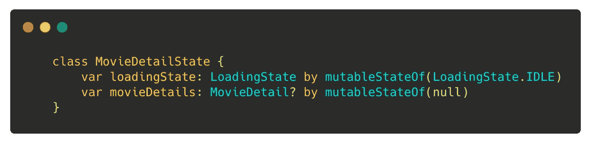
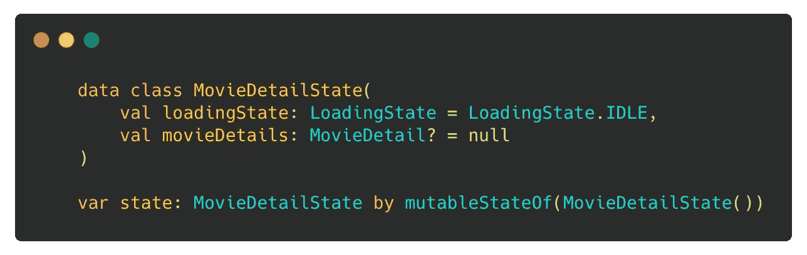
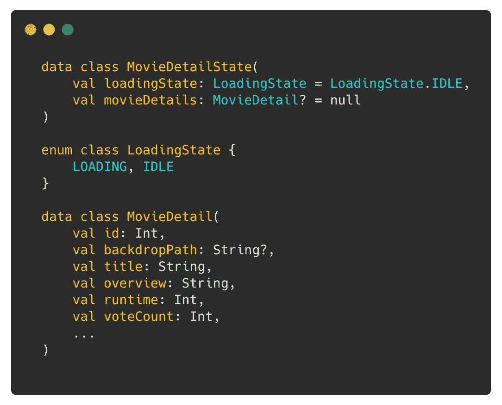
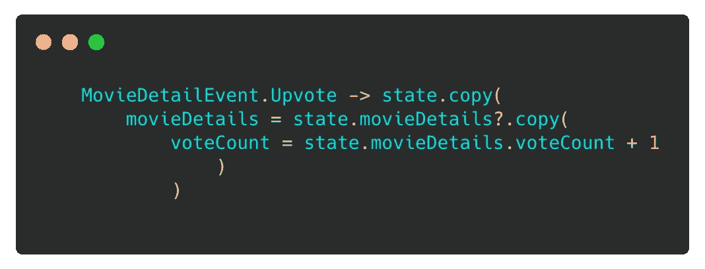
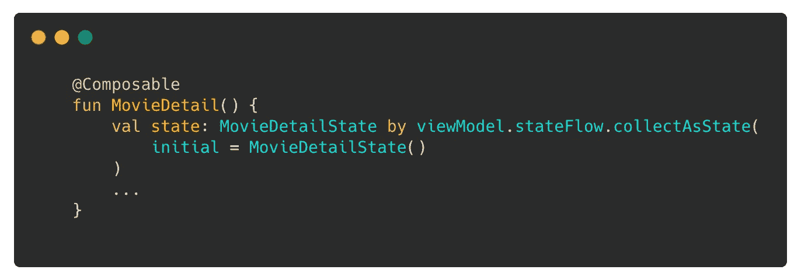
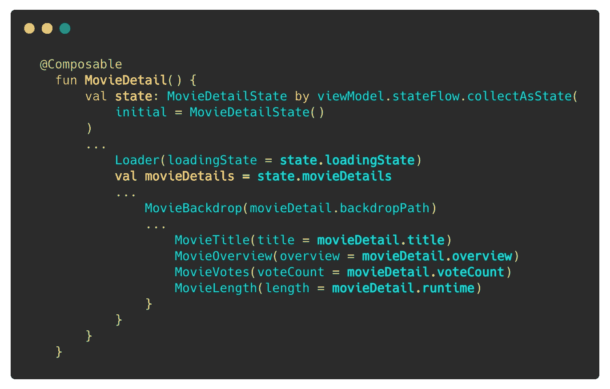

# jetpack Compose:MVI 之谜的缺失部分？

> 原文：<https://medium.com/google-developer-experts/jetpack-compose-missing-piece-to-the-mvi-puzzle-44c0e60b571?source=collection_archive---------0----------------------->

Photo by [Dewang Gupta](https://unsplash.com/@dewang?utm_source=unsplash&utm_medium=referral&utm_content=creditCopyText) on [Unsplash](https://unsplash.com/@dewang?utm_source=unsplash&utm_medium=referral&utm_content=creditCopyText)

当我第一次开始探索 Jetpack compose 时，我看到了许多将屏幕状态建模为可变属性组合的例子:

state as a combination of mutable properties

在使用模型视图意图(MVI)模式几年后，作为 MVI 模式的坚定信徒，在查看可变状态对象后，我脑海中最迫切的问题是:

> " MVI 甚至有可能与喷气背包组成？"

然后，我偶然发现了一些代码示例、文章，甚至是关于 MVI 与 Compose 的谈话。我们可以公开单个状态对象，并在我们的可组合函数中使用`mutableStateOf`来消费它，而不是公开多个可变状态:

Immutable State Object

看起来棒极了！但是，后来我开始怀疑:

> "所以，MVI 确实用 Jetpack Compose 工作，但是它工作得好吗？"

遵循 MVI 的原则，这意味着我们的屏幕状态应该是不可变的，也就是说，每次我们改变状态对象的任何属性时，都会创建一个新的对象，并将其分配给我们的状态属性。然后，更多的问题出现在我的脑海里:

*   如果只有一个局部视图状态发生了变异，那么重组怎么办？
*   不可变状态和用 Jetpack Compose 分离可变属性一样好吗？
*   作曲是为 MVI 创作的吗？

如果你和我一样，也在寻找上述问题的答案，或者只是想知道 MVI 是否适合 Jetpack compose。希望这篇文章能帮你得到答案。

# TL；速度三角形定位法(dead reckoning)

简短的回答是肯定的，MVI 工作得很好，甚至比我预期的还要好。但是，请继续阅读更长的答案。

# 与 MVI 的和解

基于我们的`MovieDetailState`示例，这是我们简单的`MovieDetailState`:

MovideDetailState, full code [here](https://github.com/ragdroid/Clayground/blob/main/shared/src/commonMain/kotlin/com/ragdroid/clayground/shared/ui/moviedetail/MovieDetailState.kt#L18)

我不打算在这个屏幕上详细介绍 MVI 是如何实现的，但是如果你像我一样喜欢复杂的东西，可以在这里随意查看我的 GitHub 示例项目: [Clayground](https://github.com/ragdroid/Clayground)

# 用例:投票支持一部电影

每当用户打算执行一个动作，例如，**投票赞成一部电影**，我们触发一个 intent : `MovieDetailEvent`，这个事件导致视图的状态改变:`voteCount ~> voteCount + 1`。对于这个例子，我们只是将投票计数增加到 1，但是根据用例的不同，我们可能需要将这个值与数据库或服务器保持同步(这不是本文所要求的)。

注:*我们是按照从***`*Event*`*`*SideEffect*`*`*Model*`*`*ViewEffect*`*`*Update…*`*的命名约定。事件可以引发副作用，只有事件可以更新我们的状态模型。副作用会引发事件。*******

****

**MVI Update: Upvote, full code [here](https://github.com/ragdroid/Clayground/blob/main/shared/src/commonMain/kotlin/com/ragdroid/clayground/shared/ui/moviedetail/MovieDetailState.kt#L49)**

**如前所述，根据 MVI 的原则，状态对象应该是不可变的。因此，如上所示，为了增加`voteCount`，我们创建了状态对象的副本，并将`voteCount`增加到 1。**

**这个新状态在我们的视图模型中显示为`Flow`，可以在我们的`@Composable`函数中收集:**

****

## **状态<moviedetailstate></moviedetailstate>**

**`[collectAsState()](https://developer.android.com/reference/kotlin/androidx/compose/runtime/package-summary#(kotlinx.coroutines.flow.StateFlow).collectAsState(kotlin.coroutines.CoroutineContext))`方法返回一个`State<MovieDetailState>`对象或者说是一个`SnapshotMutableState`。这个`State`对象负责为我们订阅这个`MovieDetail` `@Composable`的状态更新(读和写)。默认情况下，变异策略被指定为`[structuralEqualityPolicy()](https://developer.android.com/reference/kotlin/androidx/compose/runtime/package-summary#structuralEqualityPolicy())`，即设置状态值为结构上相等的值(==)不被视为变更。状态对象的任何其他变化都会导致当前的可组合对象重新组合。这是因为`SnapshotMutableState`向状态添加了读和写观察器，只要有变化，Compose 就可以调用相应的`RecomposeScope`来重组当前的可组合对象。**

**不仅如此，`SnapshotMutableState` object 还利用`Snapshot`系统来处理写事务和冲突。你可以在 Zach Klippenstein 的这篇关于快照系统的博客文章中读到更多的细节。**

**所以，回到我们的`Upvote`动作，它导致我们的`stateFlow`发出一个新的状态对象，结果导致我们的`@Composable MovieDetail()`重新组合。让我们看看我们的`@Composable MovieDetail()`:**

****

**MovieDetail Composable function, full code [here](https://github.com/ragdroid/Clayground/blob/main/app/src/main/java/com/ragdroid/clayground/moviedetail/MovieDetailActivity.kt#L143)**

**我们的`MovieDetail`可组合调用一些其他的可组合函数，如`MovieBackdrop()`、`MovieVotes()`等。来装饰各种电影道具。问题是，`MovieDetail` composable 由于其状态改变而重新组合会导致其所有子 composable 重新组合吗？**

**答案是否定的！。Compose 使用间隙缓冲区构建的[槽表](/androiddevelopers/under-the-hood-of-jetpack-compose-part-2-of-2-37b2c20c6cdd)在内部智能地处理这个问题。Compose 将可组合函数的参数存储在 slot 表中，然后可以根据这些参数在窗口小部件树中的位置，将这些参数与以前的组合值进行比较，从而 Compose 可以[跳过对一个可组合函数的重新组合](https://developer.android.com/jetpack/compose/lifecycle#skipping)，如果它的所有输入参数都是稳定的并且没有改变。**

## **[稳定型](https://github.com/androidx/androidx/blob/androidx-main/compose/docs/compose-api-guidelines.md#stable-types)**

**Compose 公开了两个注释，即`@Stable`和`@Immutable`，将输入参数和函数类型标记为稳定。这有助于智能重组中的组合运行时，即跳过输入类型稳定且值不变的可组合函数的重组。更多信息[点击这里](https://developer.android.com/jetpack/compose/lifecycle#skipping)。**

**Compose 编译器可以推断某些类型的稳定性，如原始不可变类型、函数类型，并在默认情况下将它们视为稳定的。对于其他类型，如接口等。对于编译器不能推断出稳定性的，如果我们可以保证它们的稳定性，我们可以显式地将它们标记为稳定的，通过`@Stable`即**

*   **`a.equals().b`应该总是返回相同的值**
*   **公共属性中更改应该通知撰写器进行更改**
*   **公共财产也应该是稳定的**

**或者如`@Immutable`即一旦实例化，它们的属性将永远不会改变**

****小心**:“权力越大，责任越大”，所以要小心使用`@Stable`和`@Immutable`。[编写 API 指南](https://github.com/androidx/androidx/blob/androidx-main/compose/docs/compose-api-guidelines.md#stable-types)很好地解释了这一点。**

**输入参数的稳定性对我们很重要，因为如果合成运行时不能推断输入的稳定性，它将总是认为输入是不稳定的，并重新合成这样的可合成函数。在探索过程中，我遇到了一个密封类的陷阱。**

## **作为可组合函数的输入参数类型的密封类**

**通常，如果密封类是在一个支持组合的梯度模块中定义的，组合编译器插件可以推断出它们的稳定性。但是，如果您的状态包含一个在非组合模块中定义的密封类，则无法推断它的稳定性。这是需要注意的事情。我在这里为此提交了一个 bug:[https://issuetracker.google.com/issues/191068806](https://issuetracker.google.com/issues/191068806)**

**因此，在我们的例子中，遵循智能重组，唯一可重组的应该是`MovieVotes() :`**

****

**MovieDetail composable function, full code [here](https://github.com/ragdroid/Clayground/blob/main/app/src/main/java/com/ragdroid/clayground/moviedetail/MovieDetailActivity.kt#L143)**

**这是因为唯一改变的输入是`movieDetail.voteCount`。其他组件可以重用，您可以通过[记录重新组合的次数](https://github.com/chrisbanes/tivi/blob/main/common-ui-compose/src/main/java/app/tivi/common/compose/Debug.kt)来验证这一点。**

## **撰写指南**

**如果我们在使用 compose 时遵循一些简单的准则，那么 Compose 只会通过只重组我们的部件树的所需部分来帮助我们。这些准则是:**

*   **[状态提升](https://developer.android.com/jetpack/compose/state#state-hoisting):从可组合函数外部传递状态，使可组合函数无状态的模式，**
*   **通过传递 lambdas 而不是可变的状态属性来保持可组合函数的纯净和无副作用，**
*   **使用`key` composables 或使用`key` s 的内置支持来实现`LazyColumn`等可组合功能。帮助在[智能重组](https://developer.android.com/jetpack/compose/lifecycle#add-info-smart-recomposition)中构建运行时。**
*   **通过将你的模型标记为`[@Stable](https://developer.android.com/jetpack/compose/lifecycle#skipping)`或`@Immutable`来帮助编译插件，只要能保证稳定性。**
*   **只向可组合的传递稳定且所需数据量最少的数据**
*   **遵循单向流动(UDF)模式**

# **jetpack Compose:MVI 之谜的缺失部分？**

**既然我们已经回答了“MVI 与 Compose 配合得好吗？”是的，效果很好，让我们进入下一部分。这个答案在某种程度上把我们引向了这样一个方向，即 Compose 实际上可能是我们的 MVI 难题中缺失的一块。**

**为了理解这一点，让我们谈谈 MVI 来自哪里。Android 中的 MVI 或模型视图意图模式深受 web 框架的启发，如 [Cycle.js](https://cycle.js.org/) 和 [redux](https://redux.js.org/) 。在网络世界里，有了[虚拟 DOM](https://www.codecademy.com/articles/react-virtual-dom)，框架处理不同的东西，只改变 DOM 中需要的部分，而不是重新呈现整个 DOM。**

**对于 MVI 来说，如果 Android 有类似的东西就好了，即自动计算变化的差异，并只重新呈现变化的部分。我经常听到这个问题，即“如何通过我们的`render()` 函数用 MVI 有效地执行部分状态更新”。到目前为止，我们只对`RecyclerView`和`DiffUtil`做了适当的区分。否则，总是由开发人员通过使用我们自己的不同实现来有效地呈现状态对象，从而正确地处理部分状态更新。MVI 确实为我们解决了国家管理问题，但观点方面总是不合适。正如 [Ragunath Jawahar](https://medium.com/u/a1e155b14711?source=post_page-----44c0e60b571--------------------------------) 所指出的，人们试图通过围绕它创建库来解决这个问题，在某种程度上就像 Spotify 的 [diffuser](https://github.com/spotify/diffuser) 一样。理想情况下，如果框架本身能够只处理在我们的状态模型中发生变化的部分的无效，从而只导致视图子树对我们无效，这不是很好吗？**

**Jetpack Compose 来了！**

**它可以通过只重组部件树的一部分来为我们处理部分状态更新，因此它似乎是我们的 MVI 难题中缺少的一块。我不确定与 Android View 系统相比，它目前的表现如何，比如基准测试等等。我们都知道，它目前正在开发中，预计今年某个时候会变得稳定。但是，到目前为止，MVI 在 Android 中的未来看起来很有希望。**

**感谢这些人以这样或那样的方式帮助我， [Ritesh Gupta](https://medium.com/u/c224d46d0025?source=post_page-----44c0e60b571--------------------------------) ， [Ragunath Jawahar](https://medium.com/u/a1e155b14711?source=post_page-----44c0e60b571--------------------------------) ， [Rebecca Franks](https://medium.com/u/3f9b9c30bec7?source=post_page-----44c0e60b571--------------------------------) 和 [Vinay Gaba](https://medium.com/u/9aefb667816f?source=post_page-----44c0e60b571--------------------------------) 。**

**如果你觉得有些东西可以用更好的方式表达或者没有意义，请在评论中告诉我。感谢阅读。**

**你可以在这里找到 GitHub 示例项目: [Clayground](https://github.com/ragdroid/Clayground)**