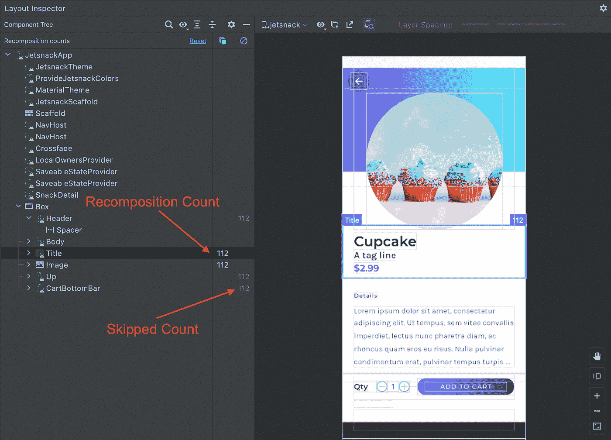

# 喷气背包撰写稳定性解释

> 原文：<https://medium.com/androiddevelopers/jetpack-compose-stability-explained-79c10db270c8?source=collection_archive---------1----------------------->


你有没有测量过你的可组合程序的性能，发现它重新组合的代码比你预期的要多？我以为 Compose 的意思是当状态没有改变时智能地跳过可组合文件？“你可能会问。或者在阅读 Compose 代码时，您可能会看到用`[@Stable](https://developer.android.com/reference/kotlin/androidx/compose/runtime/Stable)`或`[@Immutable](https://developer.android.com/reference/kotlin/androidx/compose/runtime/Immutable)`标注的类，并想知道这些是什么意思？这些概念可以用组合稳定性来解释。在这篇博文中，我们将看看 Compose stability 实际上意味着什么，如何调试它，以及你是否应该担心它。

# TL/DR

这是一个大帖子！这是 TL/DR。

*   Compose 决定了你的组件的每个参数的稳定性，以确定在重组过程中是否可以跳过它。
*   如果您注意到您的可组合组件没有被跳过**并且导致了性能问题**，您应该首先检查不稳定的明显原因，比如`var`参数。
*   您可以使用[编译器报告](https://github.com/androidx/androidx/blob/androidx-main/compose/compiler/design/compiler-metrics.md)来确定您的类的稳定性。
*   像`List`、`Set`和`Map`这样的集合类总是被确定为不稳定的，因为不能保证它们是不可变的。您可以使用 [Kotlinx 不可变集合](https://github.com/Kotlin/kotlinx.collections.immutable)来代替，或者将您的类注释为`@Immutable`或`@Stable`。
*   来自没有运行 Compose 编译器的模块的类总是被确定为不稳定的。在 compose runtime 上添加一个依赖项，并在您的模块中将它们标记为稳定的，或者如果需要，将这些类包装在 UI 模型类中。
*   每个可组合的都应该是可跳过的吗？号码

# 什么是重组？

在我们讨论稳定性之前，让我们快速回顾一下重组的定义:

> "*重组是在输入改变时再次调用可组合函数的过程。当函数的输入改变时，就会发生这种情况。当 Compose 基于新的输入重新组合时，它只调用* ***可能*** *已经改变的函数或 lambdas，而跳过其余的。通过跳过所有没有改变参数的函数或 lambdas，Compose 可以高效地重新组合。*

注意这里的关键字——“可能是”。当快照状态改变时，Compose 将触发重组，并跳过任何未改变的组件。重要的是，只有当 Compose 可以 ***确定*** 没有一个可组合的参数被更新时，一个可组合的才会被跳过。否则，如果 Compose **和*不能确定，那么*和**将会在它的父 Compose 被重组时**总是**被重组。如果 Compose 不这样做，将导致很难诊断重组不触发的错误。正确且性能稍差比不正确但速度稍快要好得多。

让我们用一个显示联系信息的`Row`的例子:

# 使用不可变对象

首先，假设我们将`Contact`类定义为一个不可变的数据类，因此如果不创建一个新对象，它就不能被更改:

```
data class Contact(val name: String, val number: String)
```

当点击切换按钮时，我们改变选择的状态。这将触发 Compose 来评估`ContactRow`中的代码是否应该重新编写。当涉及到`ContactDetails` composable 时，Compose 将跳过对它的重新编写。这是因为它可以看到没有一个参数，在这个例子中是`contact`，发生了变化。`ToggleButton`另一方面，输入已经改变，因此它被正确地重组。

# 使用可变对象

如果我们的联系类是这样定义的呢？

```
data class Contact(**var** name: String, **var** number: String)
```

现在我们的`Contact`类不再是不可变的，它的属性可以在 Compose 不知道的情况下被改变。Compose 将不再跳过`ContactDetails` composable，因为这个类现在被认为是“不稳定的”(更多细节在下面)。因此，每当`selected`改变时，`ContactRow`也会重新组合。

# 在 Compose 编译器中实现

现在我们知道了 Compose 试图确定的理论，让我们看看它在实践中是如何发生的。

首先，来自 Compose 文档的一些定义( [1](https://github.com/androidx/androidx/blob/androidx-main/compose/compiler/design/compiler-metrics.md#functions-that-are-restartable-but-not-skippable) 、 [2](https://github.com/androidx/androidx/blob/androidx-main/compose/docs/compose-api-guidelines.md#stable-types) )。

功能可以是可跳过的和/或可重启的:

> **Skippable** —在重新组合期间调用时，如果所有参数都等于它们以前的值，compose 能够跳过该函数。
> 
> **可重新启动的** —这个函数作为一个“作用域”,在这里可以开始重新组合(换句话说，这个函数可以作为一个入口点，Compose 可以在这里开始重新执行代码，以便在状态改变后重新组合)。

类型可以是不可变的或稳定的:

> **不可变** —表示一种类型，其中任何属性的值在对象被构造后都不会改变，并且所有方法都是引用透明的。所有的原始类型(`String`、`Int`、`Float`等)都被认为是不可变的。
> 
> **稳定** —表示可变的类型，但是当任何公共属性或方法行为产生与先前调用不同的结果时，将通知合成运行时。

当 Compose 编译器在您的代码上运行时，它会查看每个函数和类型，并标记任何匹配这些定义的函数和类型。Compose 查看传递给 composable 的类型，以确定该 composable 的可跳过性。值得注意的是，参数不必是不可变的，只要 Compose 运行时被告知所有的更改，它们就可以是可变的。对于大多数类型来说，这是一个不切实际的契约，但是 Compose 提供了支持这个契约的可变类，比如`[MutableState](https://developer.android.com/reference/kotlin/androidx/compose/runtime/MutableState)`、`[SnapshotStateMap](https://developer.android.com/reference/kotlin/androidx/compose/runtime/snapshots/SnapshotStateMap)`/`[List](https://kotlinlang.org/api/latest/jvm/stdlib/kotlin.collections/-list/)`/等等。因此，为您的可变属性使用这些类型将允许您的类支持`@Stable`的契约。实际上，这看起来会像下面这样

当组合状态改变时，组合在树中读取这些状态对象的所有点上方寻找最近的可重启函数。理想情况下，这将是重新运行最小可能代码的直接祖先。重组在这里重新开始。当重新执行代码时，如果参数没有改变，任何可跳过的函数都将被跳过。让我们再来看一下前面的例子

这里，当`selected`改变时，离实际读取状态最近的“可重启”功能/组合范围是`ContactRow`。您可能想知道为什么`Row`没有被选为最近的可重启 scope？`Row`(以及许多其他基础组件，如`Column`和`Box`)实际上是一个[内联函数](https://kotlinlang.org/docs/inline-functions.html)，**内联函数不是可重启的作用域**，因为它们在编译后实际上并不是最终的函数。所以`ContactRow`是下一个最高的作用域，因此`ContactRow`重新执行。它看到的第一个可组合对象是`Row`，正如已经详述的，这不是一个可重启的作用域，这也意味着它是不可跳过的，并且总是在重组时重新执行。下一个可组合的是`ContactDetails`，`ContactDetails`已经被标记为 skippable，因为`Contact`类已经被推断为不可变的，所以由 Compose 编译器添加的生成代码检查是否有任何可组合的参数已经改变。由于`contact`保持不变，跳过`ContactDetails`。接下来，`ToggleButton`。`ToggleButton`是可跳过的，但在这种情况下没关系，它的一个参数`selected`已经改变，因此它被重新执行。这就把我们带到了可重启函数/作用域的末尾，重组也结束了。


The steps of recomposition.

此时您可能会想，“这真的很复杂！为什么我需要知道这些？!"答案是，大多数时候你不应该这么做。我们的目标是让编译器优化您自然编写的代码，以提高效率。跳过可组合函数是实现这一点的一个重要因素，但它也需要 100%安全，否则会导致很难诊断错误。由于这个原因，对于要被跳过的函数的要求是强烈的。我们正在努力改进编译器对可跳过性的推断，但总会有编译器无法解决的情况。了解在这种情况下跳过函数是如何工作的可以帮助您提高性能，但是只有在稳定性导致性能问题的情况下才应该考虑这样做。如果可组合组件是轻量级的，或者它本身只包含可跳过的可组合组件，那么不可跳过的可组合组件可能没有任何效果。

# 调试稳定性

你如何知道你的组件是否被忽略了？你可以在[布局检查器](https://developer.android.com/jetpack/compose/tooling#layout-inspector)里看到！Android Studio Dolphin 在布局检查器中包含了对 Compose 的支持，它还会显示你的 composables 被重组和跳过的次数。



Recomposition counts in the Layout Inspector.

那么，如果您看到您的可组合组件没有被跳过，即使它的参数都没有改变，您会怎么做呢？最简单的方法是检查它的定义，看看它的参数中是否有明显可变的。你传入的是一个带有`var`属性的类型还是一个带有已知不稳定类型的`val`属性的类型？如果你是，那么这个组合将永远不会被跳过！

但是当你找不到任何明显的错误时，你会怎么做呢？

# 撰写编译器报告

compose 编译器可以输出其稳定性推断的结果以供检查。使用这个输出，您可以确定哪些组件是可跳过的，哪些是不可跳过的。这篇文章总结了如何使用这些报告，但是关于这些报告的详细信息，请参见[技术文档](https://github.com/androidx/androidx/blob/androidx-main/compose/compiler/design/compiler-metrics.md)。

> **⚠️警告:**只有当您确实遇到与稳定性相关的性能问题时，才应该使用这种技术。试图让你的整个 UI 可以跳过是不成熟的优化，可能会导致将来的维护困难。在优化稳定性之前，请确保您遵循我们的[最佳作曲性能实践](http://goo.gle/compose-performance)。

缺省情况下，编译器编译器报告是不启用的。它们通过一个编译器标志启用，[确切的设置](https://github.com/androidx/androidx/blob/androidx-main/compose/compiler/design/compiler-metrics.md#enabling-metrics)根据你的项目不同而不同，但是对于大多数项目，你可以将下面的脚本粘贴到你的根`build.gradle`文件中。

(这些 gradle 助手的灵感来自于 [Chris Banes](http://twitter.com/chrisbanes) 和他在 [Composable metrics](https://chris.banes.dev/composable-metrics/) 上的精彩帖子)

要调试组件的稳定性，可以按如下方式运行任务:

```
./gradlew assembleRelease -PcomposeCompilerReports=true
```

> ⚠️ **警告:** **确保总是在发布版本上运行它，以确保结果准确。**

此任务将输出三个文件。(包括来自 [Jetsnack](https://github.com/android/compose-samples/tree/master/Jetsnack) 的示例输出)

**<modulename>-classes . txt—**该模块中类的稳定性报告。[样品](https://gist.github.com/bentrengrove/9b823045a160d8a5d986bb4b31106245)。

**<modulename>-composables . txt**—关于该模块中组件的可重启性和可跳过性的报告。[样](https://gist.github.com/bentrengrove/a8ee3716a7df136144041134575f5fcb)。

**<modulename>-composables . csv**—上述文本文件的 CSV 版本，用于导入电子表格或通过脚本进行处理。[样品](https://gist.github.com/bentrengrove/2beb1b2993f68f61a7ba3ed91a1c75c9)。

如果您转而运行`composeCompilerMetrics`任务，您将获得项目中可组装组件数量的总体统计数据以及其他类似信息。这不在本文讨论范围之内，因为它对调试没什么用。

打开`composables.txt`文件，你会看到该模块的所有可组合函数，每个函数都标有是否可重启、可跳过以及参数的稳定性。这里有一个来自 [Jetsnack](https://github.com/android/compose-samples/tree/master/Jetsnack) 的假想例子，这是一个编写示例应用程序。

```
restartable skippable scheme(“[androidx.compose.ui.UiComposable]”) fun SnackCollection( stable snackCollection: SnackCollection stable onSnackClick: Function1<Long, Unit> stable modifier: Modifier? = @static Companion stable index: Int = @static 0 stable highlight: Boolean = @static true)
```

这个`SnackCollection`组件是完全可重启的、可跳过的和稳定的。如果可能的话，这通常是你想要的，尽管远不是强制性的(更多细节在文章末尾)。

然而，让我们看看另一个例子。

```
restartable scheme(“[androidx.compose.ui.UiComposable]”) fun HighlightedSnacks( stable index: Int **unstable** snacks: List<Snack> stable onSnackClick: Function1<Long, Unit> stable modifier: Modifier? = @static Companion)
```

`HighlightedSnacks` composable 是不可跳过的——在重组过程中任何时候调用它，它也会重组，即使它的参数都没有改变。

这是由不稳定参数`snacks`造成的。

现在我们可以切换到`*classes.txt*`文件来检查`Snack`的稳定性。

```
unstable class Snack { stable val id: Long stable val name: String stable val imageUrl: String stable val price: Long stable val tagline: String **unstable** val tags: Set<String> <runtime stability> = Unstable}
```

作为参考，这是`Snack`的声明方式

零食不稳定。它具有最稳定的参数，但是标签集被认为是不稳定的。但这是为什么呢？`Set`看似不可改变，其实不是`MutableSet`。

不幸的是，`Set`(以及`List`和其他标准集合类，稍后将详细介绍)在 Kotlin 中被定义为接口，这意味着底层实现仍然是可变的。例如，你可以写

```
val set: Set<String> = mutableSetOf(“foo”)
```

变量是常量，它声明的类型不是可变的，但是它的实现仍然是*可变的。Compose 编译器不能确定这个类的不变性，因为它只看到声明的类型，因此声明它是不稳定的。现在让我们来看看如何使它稳定。*

# 稳定不稳定因素

当面对一个导致性能问题的不稳定的类时，尝试使它稳定是一个好主意。首先要做的就是让这个类完全不可变。

> **不可变** —表示一种类型，其中任何属性的值在对象被构造后都不会改变，并且所有方法都是引用透明的。所有的原始类型(`String`、`Int`、`Float`等)都被认为是不可变的。

换句话说，使所有的`var`属性`val`，以及所有那些属性成为不可变类型。

如果这是不可能的，那么您将不得不对任何可变属性使用 Compose state。

> **稳定的** —表示可变的类型，但是如果并且当任何公共属性或方法行为将产生与先前调用不同的结果时，将通知合成运行时。

这意味着在实践中，任何可变属性都应该由组合状态支持，例如`mutableStateOf(…)`。

回到`Snack`的例子，这个类看起来是不可变的，那么我们如何修复它呢？

你可以有多种选择。

# Kotlinx 不可变集合

Compose 编译器 1.2 版支持 [Kotlinx 不可变集合](https://github.com/Kotlin/kotlinx.collections.immutable)。这些集合保证是不可变的，并且将由编译器推断出来。这个库仍然处于 alpha 阶段，所以预计它的 API 可能会有变化。您应该评估这对于您的项目是否可以接受。

将`tags`声明转换为下面的声明使得`Snack`类变得稳定。

```
val tags: ImmutableSet<String> = persistentSetOf()
```

# 用稳定或不可变进行注释

基于上面的规则，类也可以用`@Stable`或`@Immutable`来注释。

> **⚠️警告:需要注意的是，这是一份遵循相应规则的合同注释。它不会让一个类自己成为不可变的/稳定的。错误地注释类可能会导致重组中断。**

注释一个类是覆盖编译器推断出的关于你的类的东西，这样它就类似于[！！科特林的操作员](https://kotlinlang.org/docs/null-safety.html#the-operator)。您应该非常小心地使用这些注释，因为覆盖编译器行为可能会导致不可预见的错误。如果没有注释也能使你的类稳定，你应该努力通过这种方式达到稳定。

对`Snack`示例的注释如下:

无论选择哪种方法，`Snack`类都被认为是稳定的。

然而，回到`HighlightedSnacks`可组合的部分，`HighlightedSnacks`仍然没有被标记为可跳过:

```
unstable snacks: List<Snack>
```

当涉及集合类型时，参数面临与类相同的问题，`**List**` **总是被确定为不稳定的，即使它是稳定类型的集合。**

您也不能将单个参数标记为稳定的，也不能将可组合参数注释为总是可跳过的。那么你能做什么呢？同样，有多条前进的道路。

使用 kotlinx 不可变集合，而不是`List`。

如果您不能使用不可变集合，那么在最简单的情况下，您可以将列表包装在一个带注释的稳定类中，以便为 Compose 编译器将其标记为不可变。不过，根据您的需求，您很可能希望为此创建一个通用的包装器。

然后，您可以将它用作可组合文件中的参数类型。

采用这两种方法中的任何一种后，`HighlightedSnacks` composable 现在既是可跳过的，也是可重启的。

```
restartable skippable scheme(“[androidx.compose.ui.UiComposable]”) fun HighlightedSnacks( stable index: Int stable snacks: ImmutableList<Snack> stable onSnackClick: Function1<Long, Unit> stable modifier: Modifier? = @static Companion)
```

`HighlightedSnacks`现在当它的输入没有变化时会跳过重组。

# 多个模块

您可能遇到的另一个常见问题与多模块体系结构有关。如果一个类引用的所有非基元类型要么被显式标记为稳定，要么在一个也是用 Compose 编译器构建的模块中，则 Compose 编译器只能推断该类是否稳定。如果你的数据层在一个独立于 UI 层的模块中，[这是推荐的方法](https://developer.android.com/topic/architecture)，这可能是你会遇到的一个问题。要解决这个问题，您可以:

*   在您的数据层模块上启用 Compose 编译器，或者在适当的地方用`@Stable`或`@Immutable`标记您的类。
*   这将涉及到向数据层添加一个组合依赖项，但是它只是组合运行时的依赖项，而不是组合 UI 的依赖项。
*   将数据层类包装在 UI 模块中特定于 UI 的包装类中。

除非使用 Compose 编译器，否则外部库也会出现同样的问题。

这是一个已知的限制，我们目前正在研究多模块架构和外部库的更好的解决方案。

# 每个可组合的都应该是可跳过的吗？

**号**

追求应用程序中每个组件的完全可跳过性是一种不成熟的优化。可跳过实际上[增加了一点开销](/androiddevelopers/under-the-hood-of-jetpack-compose-part-2-of-2-37b2c20c6cdd)，这可能不值得，如果您确定可重启的开销大于它的价值，您甚至可以将您的 composable 注释为[不可重启的](https://developer.android.com/reference/kotlin/androidx/compose/runtime/NonRestartableComposable)。在许多其他情况下，可跳过并没有任何真正的好处，只会导致代码难以维护。例如:

*   不常重组或根本不重组的可组合词。
*   本身只调用可跳过的可组合组件的可组合组件。

# 摘要

这篇博文提供了很多信息，让我们总结一下。

*   Compose 决定了你的组件的每个参数的稳定性，以确定在重组过程中是否可以跳过它。
*   如果您注意到您的 composable 没有被跳过**并且导致了性能问题**，您应该首先检查不稳定的明显原因，比如 var 参数。
*   您可以使用[编译器报告](https://github.com/androidx/androidx/blob/androidx-main/compose/compiler/design/compiler-metrics.md)来确定您的类的稳定性。
*   像`List`、`Set`和`Map`这样的集合类总是被确定为不稳定的，因为不能保证它们是不可变的。您可以使用 [Kotlinx 不可变集合](https://github.com/Kotlin/kotlinx.collections.immutable)来代替，或者将您的类注释为`@Immutable`或`@Stable`。
*   来自没有运行 Compose 编译器的模块的类总是被确定为不稳定的。在 compose runtime 上添加一个依赖项，并在您的模块中将它们标记为稳定的，或者如果需要，将这些类包装在 UI 模型类中。
*   每个可组合的都应该是可跳过的吗？号码

要了解更多关于编写性能的调试技巧，请查看我们的[最佳实践指南](http://goo.gle/compose-performance)和 [I/O 对话](https://www.youtube.com/watch?v=EOQB8PTLkpY)。