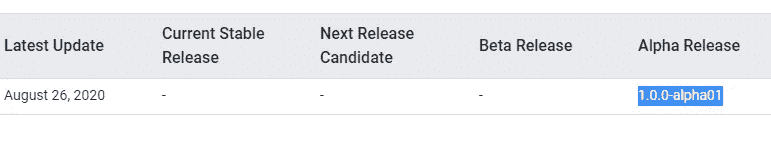
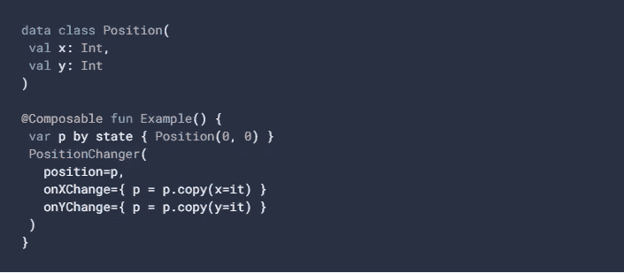
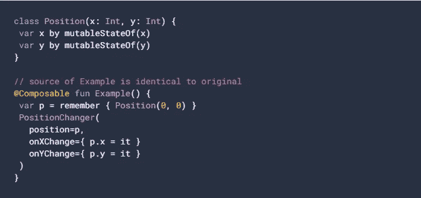
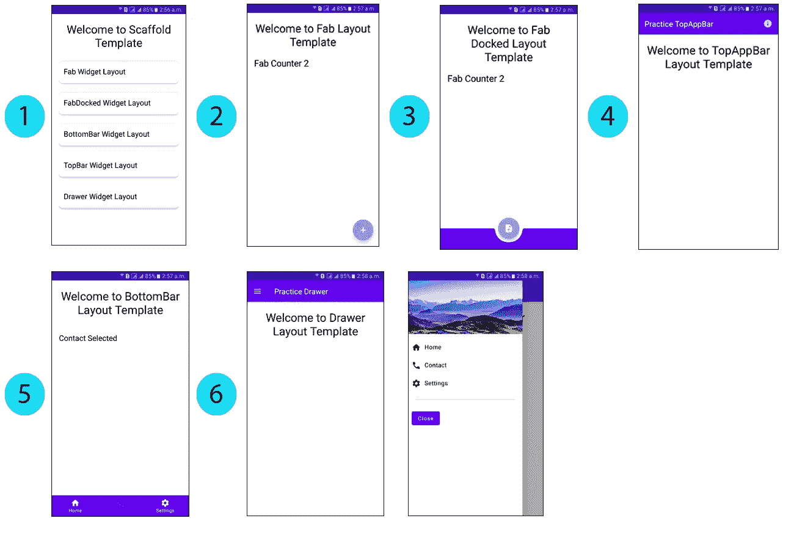

# JetPack 撰写🏹—国家管理

> 原文：<https://blog.kotlin-academy.com/jetpack-compose-state-management-73ec3f6c74a5?source=collection_archive---------0----------------------->

它指的是在与文本字段、按钮、单选按钮等小部件交互时管理用户界面的状态。

Jetpack compose [official](https://developer.android.com/jetpack/compose)

> 社区参与

 [## Android 趋势# 20-2020 年 9 月 8 日- Dor Moshe 的博客

### 订阅时事通讯，享受每周学习新知识的最新动态。

dormoshe.io](https://dormoshe.io/newsletters/ag/android/20?utm_source=twitter&utm_campaign=twitter)  [## 科特林周刊#213

### 你好 Kotliners。我们希望你有时间玩 Kotlin 1.4，我们已经在我们的项目中做了一些，它…

us12.campaign-archive.com](https://us12.campaign-archive.com/?u=f39692e245b94f7fb693b6d82&id=2ed61dc1a3) 

Android 中的状态管理是一个复杂的概念，要知道原因，你必须首先理解 Android 的架构设计，并了解为什么它是管理状态的关键要求。[马塞尼特斯](https://medium.com/u/989153264392?source=post_page-----73ec3f6c74a5--------------------------------)条[条**条*条*条**条](https://medium.com/@marcelorbenites/managing-state-in-android-f4d042646521)条**条*条*条**条定义了这种状态的最佳描述:

> 状态是连接/订阅一个或多个小部件的对象，包含数据，并渴望根据该数据更新小部件。如果数据发生任何变化，它会通知它所连接的所有小部件。状态的值在运行时被改变。

在 jetpack compose 中，状态管理的概念与 **Observable** 模式相同，即如果订阅的对象发生任何变化，它会自动触发其所有依赖对象。

除了上述概念之外，jetpack compose 还有一些功能上的变化，即当状态/对象值更新时，订阅的 **@ composable function(s)用新数据重新组合**本身，并且不影响或更新整个 UI。

根据状态管理文档，jetpack 使用两种方式组成支持状态:

*   记住{ mutableStateOf(…) }
*   易变状态

**Current working environment**

> 过去，我们使用`***@Model***`注释，但是在 `[*0.1.0-dev12*](https://developer.android.com/jetpack/androidx/releases/compose#0.1.0-dev12)*.*`中[被弃用，然后在](https://developer.android.com/jetpack/androidx/releases/compose#0.1.0-dev12) `[*0.1.0-dev16*](https://android-review.googlesource.com/c/platform/frameworks/support/+/1375120)*.*`中`*state{}*`注释[被弃用](https://android-review.googlesource.com/c/platform/frameworks/support/+/1375120)

我们来详细讨论一下:

# 记住{ mutableStateOf(…) }

> **是**的延伸版`***State<OriginalClass>***`

state approach

这种方法与我们在`state`中所做的一样，我们看到的唯一变化是`calling.`让我们看看可组合团队是怎么说的:

> 将状态 composable 标记为 deprecated，并提倡直接使用 remember { mutableStateOf(…) }，以便更清楚地理解 Compose 状态管理 API 表面。这减少了整个 API 表面和状态管理的概念数量，并匹配了类属性委托的“by mutableStateOf()”模式。

在这个概念中，对象在实现变异的同一个范围内被初始化。最好的初始化可能是在`@compose function`内部。它也遵循相同的 Kotlin 对象分层模式，像传递对另一个函数的引用一样。现在，你有一个场景，你想要改变在作用域之外初始化的对象，那么下一个方法`**mutableStateOf**` 是有用的。

如何使用 remember { mutableStateOf(…) }方法

# 易变状态

> `***mutableStateOf***` **和财产委托人**

mutableStateOf approach

**mutableStateOf** API 允许我们在类外创建 MutableState 实例。在这种方法中，**每个属性都是单独观察的，所以您在重构后看到的重组可能会更窄**。🤔

简而言之，它表示每个属性上的读写操作都由 compose 监视，如果有任何属性更改，compose 就会触发观察到该属性的所有组合索引。它还给出了`execution`的 value 属性。

参见下面定义的例子中的`mutableStateOf`的整体概念:

Use of mutableStateOf example

如果你想得到更多的澄清，那么请到我的`Scaffold`教程:

 [## AliAzaz/实践复合示例

### 在本教程中，我们将详细学习 Scaffold 的根项目。本教程可能会稍微长一点，所以请继续…

github.com](https://github.com/AliAzaz/PracticeComposeExamples/tree/ScaffoldItemsViewTemplate) 

## 脚手架的输出是:

Scaffold output

我希望这篇文章有助于回答关于 Jetpack Compose 状态管理的基本问题，并探索其背后的好处。在 Twitter 上关注我，了解更多更新:

 [## 阿里·阿扎兹·阿拉姆

### 阿里·阿扎兹·阿拉姆的最新推文(@AliAzazAlam1)。阿库·🇵🇰.企业家👱🏻‍♂️安卓应用开发者📱开源…

twitter.com](https://twitter.com/AliAzazAlam1) 

感谢您花时间阅读这篇文章。如果你喜欢它，请分享！

在我的社交网站上与我联系，在 [***中***](https://medium.com/@ali.azaz.alam) ，[***Github***](https://github.com/aliazaz)***，*** 和[***LinkedIn***](https://linkedin.com/in/aliazazalam)上成为我的朋友。

# 点击👏说“谢谢！”并帮助他人找到这篇文章。

了解卡帕头最新的重大新闻。书院，[订阅时事通讯](https://kotlin-academy.us17.list-manage.com/subscribe?u=5d3a48e1893758cb5be5c2919&id=d2ba84960a)，[观察推特](https://twitter.com/ktdotacademy)，关注我们中媒。

如果您需要 Kotlin 工作室，请查看我们如何帮助您: [kt.academy](https://kt.academy/) 。

