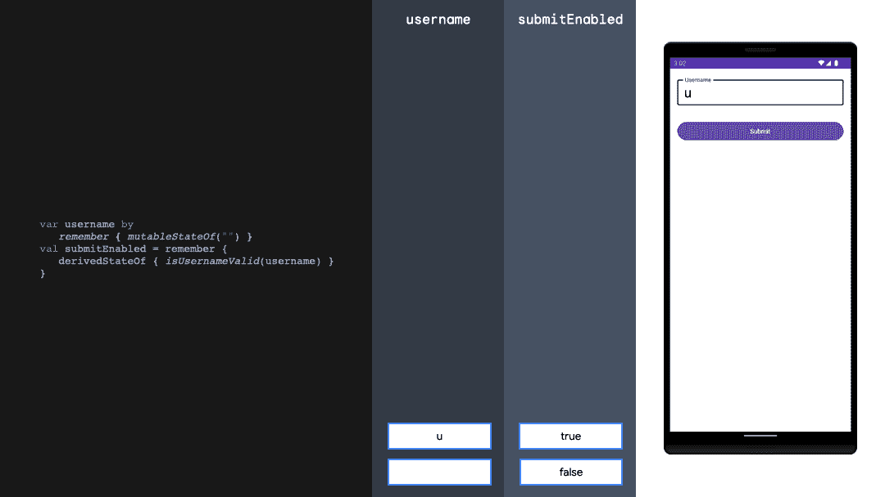

# Jetpack Compose —何时应该使用 derivedStateOf？

> 原文：<https://medium.com/androiddevelopers/jetpack-compose-when-should-i-use-derivedstateof-63ce7954c11b?source=collection_archive---------0----------------------->

我们看到的一个常见问题是，何时何地使用这个 API 才是正确的？

这个问题的答案是`**derivedStateOf {}**` **应该在你的状态或者按键变化超过你想要更新 UI** 的时候使用。或者换句话说，`derivedStateOf`就像`distinctUntilChanged`来自[科特林流](https://developer.android.com/kotlin/flow)或者其他类似的反应式框架。记住，当 Composables [读取的 compose 状态对象改变时，compose](https://developer.android.com/jetpack/compose/mental-model#recomposition) 会重新组合。`derivedStateOf`允许你创建一个新的状态对象，只根据你的需要改变。

让我们看一个例子。这里我们有一个用户名字段和一个按钮，当用户名有效时启用。

Initial state of username and submitEnabled

一开始是空的，所以我们的状态是假的。现在，当用户开始输入时，我们的状态会正确更新，我们的按钮会变为启用状态。

但问题是，当我们的用户不停地输入时，我们就不必要地一遍又一遍地向按钮发送状态。

State updates after the user continues typing

这就是`derivedStateOf`的用武之地。我们的状态变化超过了我们更新 UI 的需要，因此`derivedStateOf`可以用于减少重新组合的次数。

Updating the code to use `derivedStateOf`

让我们再看一遍同一个例子，看看有什么不同。

State updates with derivedStateOf

用户开始输入，但是这次我们的用户名状态是唯一改变的。提交状态保持不变。当然，如果我们的用户名无效。我们的派生状态再次正确更新。

这个例子有点过于简单了。在真实的应用程序中，Compose 最有可能[跳过 submit composable 的重组](https://developer.android.com/jetpack/compose/mental-model#recomposition)，因为它的输入参数没有改变。

事实是，你需要`derivedStateOf`的情况少之又少。但是当你找到一个案例时，它在最小化重组方面非常有效。

> **始终记住，输入参数和输出结果之间的变化量需要有差异，这样** `**derivedStateOf**` **才有意义。**

何时可以使用它的一些例子(不详尽):

*   观察滚动是否超过阈值(scrollPosition > 0)
*   列表中的项目大于阈值(项目> 0)
*   表单验证如上(username.isValid())

# 常见问题

现在，我们来看看其他一些关于`derivedStateOf`的常见问题。

# derivedStateOf 一定要被记住吗？

如果它在一个可组合的函数中，是的。`derivedStateOf`就像`[mutableStateOf](https://developer.android.com/reference/kotlin/androidx/compose/runtime/package-summary#mutableStateOf(kotlin.Any,androidx.compose.runtime.SnapshotMutationPolicy))`或者其他任何需要重组才能存活的物体。如果你在一个可组合的函数中使用它，那么它应该被包装在一个`[remember](https://developer.android.com/reference/kotlin/androidx/compose/runtime/package-summary#remember(kotlin.Any,kotlin.Any,kotlin.Any,kotlin.Function0))`中，否则它将在每次重组时被重新分配。

# remember(key)和 derivedStateOf 有什么区别？

记住每个状态的按键和`derivedStateOf`乍一看似乎很相似。

`remember(key)`和`derivedStateOf`的区别在于重组的量。`**derivedStateOf {}**` **当你的状态或按键变化超过你想要更新 UI 的时候使用。**

例如，只有当用户滚动了`LazyColumn`时才启用按钮。

`val isEnabled = lazyListState.firstVisibileItemIndex > 0`

`firstVisibleItemIndex`会随着用户滚动而改变 0、1、2 等，并在每次改变时使读者重新编写。我们只关心它是否大于 0。我们拥有的输入量和我们需要的输出量是不同的，所以这里使用`derivedStateOf`来缓冲不必要的重组。

`val isEnabled = remember {
derivedStateOf { lazyListState.firstVisibleItemIndex > 0 }
}`

现在，假设我们有一个昂贵的函数，它用一个参数为我们计算一些东西。我们希望我们的 UI 在该函数的输出改变的任何时候重新组合(重要的是，该函数也是[幂等的](https://en.wikipedia.org/wiki/Idempotence))。我们在这里使用 remember with a key，**，因为我们的 UI 需要随着键的变化而更新**。也就是说，我们有相同数量的输入和输出。

`val output = remember(input) { expensiveCalculation(input) }`

# 我需要同时使用 remember(键)和 derivedStateOf 吗？什么时候需要这个？

这就是事情变得有点棘手的地方。`derivedStateOf`只能在读取撰写状态对象时更新。当派生状态被创建时，在`derivedStateOf`中读取的任何其他变量将捕获该变量的初始值。如果您需要在计算中使用这些变量，那么您可以将它们作为 remember 函数的关键字。这个概念用一个例子就容易理解多了。让我们以之前的`isEnabled`为例，将其扩展为也有一个何时启用按钮的阈值，而不是 0。

这里我们有一个按钮，当列表滚动超过一个阈值时启用。我们正确地使用了`derivedStateOf`来移除额外的重组，但是有一个微妙的错误。如果 threshold 参数发生变化，我们的`derivedStateOf`不会考虑新值，因为它会在创建任何不是 compose state 对象的变量时捕获初始值。由于 threshold 是一个`Int`，无论传递给我们的 composable 的第一个值是什么，都将被捕获并用于此后的计算。`ScrollToTopButton`仍然会重组，因为它的输入已经改变，但是记住重组时没有任何键缓存，它不会用新值重新初始化`derivedStateOf`。

我们可以通过查看代码的输出来了解这一点。起初一切正常。

但是随后 threshold 的一个新值`(5)`被传入我们的 composable。

即使我们的`scrollPosition`小于`threshold`，但是`isEnabled`仍然被设置为`true`。

此处的修复是添加 threshold 作为 remember 键，这将在阈值改变时重新初始化我们的`derivedStateOf`状态。

现在我们可以看到，当阈值改变时，`isEnabled`状态会正确更新。

# 我需要使用 derivedStateOf 将多个状态组合在一起吗？

如果你有多个状态组合在一起产生一个结果，那么你可能希望在其中一个改变的时候发生重组。

以一个表单为例，它接受名和姓，并显示全名。

这里，由于我们的输出和输入变化一样多，derivedStateOf 没有做任何事情，只是产生了一点开销。derivedStateOf 对异步更新也没有帮助，Compose [状态快照系统](https://dev.to/zachklipp/introduction-to-the-compose-snapshot-system-19cn)正在单独处理这个问题，这里的这些调用是同步的。

在这种情况下，根本不需要额外的派生状态对象。

# 结论

总而言之，记住 derivedStateOf 是在你的状态或者键**变化超过你想要更新 UI 的时候使用的。**如果投入量与产出量相比没有差异，就不需要使用。