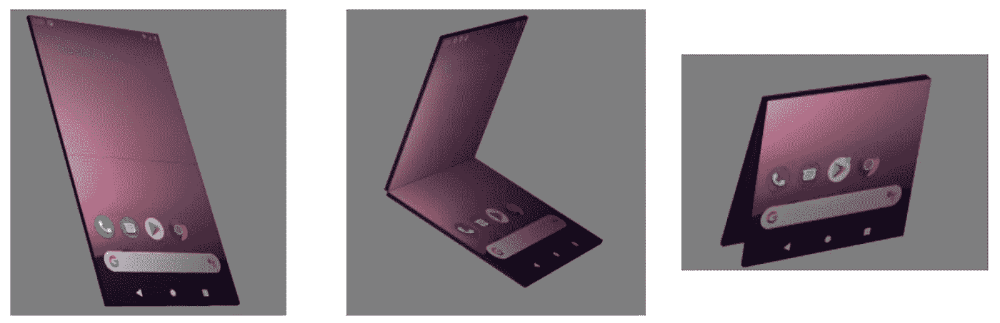

# Jetpack WindowManager 更新

> 原文：<https://medium.com/androiddevelopers/jetpack-windowmanager-updates-8bee061aa2fb?source=collection_archive---------5----------------------->


Image by [Gus Winkelman](http://guswinkelman.com/)

由肯尼斯·福特和皮埃特罗·马吉发布

我们很高兴地宣布 Jetpack WindowManager 库的 alpha02 版本。Jetpack WindowManager 库可以帮助您构建能够识别折叠和铰链等新设备功能的应用程序，因此您可以利用以前不存在的新可能性。当我们开发这个库的时候，我们已经考虑到了你的反馈，并且我们在 alpha 中继续迭代 API 来提供一个更干净和更完整的 API 表面。我们也一直在关注 WindowManager 空间中可以提供更多功能的不同领域，我们很高兴地宣布，我们正在引入 WindowMetrics，以允许您从 Android 4.1 (API 级别 16)开始使用这些[新的 Android 11 API](https://developer.android.com/reference/kotlin/android/view/WindowMetrics)。

在初始版本发布后，我们花了很多时间来审查您的反馈，并且在此版本中我们做了许多更改。请继续阅读，了解有关这些更新的更多信息！

## 创建窗口管理器

现在有一个简单的构造函数，它带有一个指向可视实体上下文的参数(就像当前的活动一样):

最初的[构造函数](https://developer.android.com/reference/androidx/window/WindowManager#WindowManager(android.content.Context,%20androidx.window.WindowBackend))仍然可用，但是现在已经废弃了。

当您想要使用自定义 WindowBackend 在常规设备或仿真器上模拟可折叠设备时，可以在您的测试中使用这个原始构造函数。您可以在[更新示例](https://github.com/android/user-interface-samples/tree/main/WindowManager)中找到参考实现。

虽然在这个版本中，您的应用程序仍然可以传递一个空引用作为 WindowBackend，但我们计划在将来使 WindowBackend 引用成为一个必需的参数，从而消除了这种反对意见，以促进它用于测试目的。

## 添加了显示功能，DeviceState 已弃用

另一个主要变化是弃用了`DeviceState`类以及用它来通知应用程序的回调。这种弃用是为了转向更通用的 API，允许系统返回关于所有可用于您的应用程序的`DisplayFeature`实例的信息，而不是定义一个整体的设备状态。我们计划在这个库的未来版本中移除`DeviceState`类。

alpha02 版本引入了一个新的`DisplayFeature`类，它有一个更新的回调契约，在`DisplayFeature`发生变化时通知您的应用程序。您可以使用以下方法注册/取消注册回调:

`WindowLayoutInfo`包含位于窗口内的`[DisplayFeature](https://developer.android.com/reference/androidx/window/DisplayFeature)`的实例列表。

`FoldingFeature`类实现了`DisplayFeature`接口，它包含了关于这些类型特性的信息:

```
TYPE_FOLDTYPE_HINGE
```

以及它们可能的折叠状态:



The possible Display Feature states: Flat, Half-opened, and Flipped respectively

注意`DeviceState`姿势`POSTURE_UNKNOWN`和`POSTURE_CLOSED`没有等效状态。

要访问新状态，您可以使用返回给注册回调的`FoldingFeature`信息:

您可以在[示例](https://github.com/android/user-interface-samples/tree/main/WindowManager)中找到如何使用该信息的示例。

## 更好的回拨注册

我们还改进了上面显示的回调 API 的健壮性。在以前版本的库中，如果应用程序在窗口可用之前注册了一个回调，这个操作会抛出一个异常。

在 Alpha02 中，我们改变了这种行为。只要对您的架构有意义，您就可以注册这些回调；当窗口变为可用时，库将发送初始的`WindowLayoutInfo`。

## R8 规则

我们向库 R8 配置中添加了“保持”规则，以维护由于内部模块组织结构而可能被剥离的方法和类。这些规则会自动合并到最终的应用程序 R8 配置中，以避免 alpha01 出现的崩溃。

# 窗口度量

由于历史上的命名惯例和不同的窗口管理器状态，很难在 Android 中获得当前窗口大小的信息。Android 11 中一些方法的弃用，如`Display#getSize`和`Display#getMetrics`，以及新 API 中窗口大小的使用，凸显了在可折叠设备上从全屏转向多窗口和自适应界面的上升趋势。为了缓解这种过渡，我们在 Android 11 中添加了[window metrics API](https://developer.android.com/reference/android/view/WindowMetrics)。

`WindowMetrics`让您轻松查询有关当前窗口状态和当前系统状态下最大窗口大小的信息，所有这些都在第一次布局之前完成。例如，像 Surface Duo 这样的设备有一个默认配置，应用程序在一个屏幕上启动，但可以通过铰链扩展到两个屏幕。在默认状态下，“getMaximumWindowMetrics”会报告应用程序所在屏幕的边界。当应用程序移动到跨越状态时，API 返回反映新状态的边界。在 onCreate 期间尽早提供这一点，它提供了您的活动可能需要的信息，以便尽早执行计算或做出决策，这样您就可以在第一时间选择正确的布局。

API 结果不包括关于系统插件的信息，如状态栏或导航栏，因为在我们支持的所有 Android 版本的第一次布局通过之前，这些值不可用。Chris Banes 的博客文章是关于使用 [ViewCompat](https://developer.android.com/reference/androidx/core/view/ViewCompat) 获取系统插件信息的很好的资源。这些边界也不会对布局膨胀时可能发生的布局参数的任何变化做出反应。

如前所述，要访问这些 API，您需要获得 WindowManager 对象的一个实例。

从这里，您现在可以访问[window metrics API](https://developer.android.com/reference/kotlin/androidx/window/WindowMetrics)，并且可以轻松访问当前窗口大小以及最大值的信息。

在通货膨胀之前，这些信息可以用来做出布局选择的一个例子是，如果你的应用程序在手机和平板电脑上有非常不同的布局或导航模式。如果你认为你的用户可能会被一个不和谐的改变弄糊涂，你可能会希望选择那些部分是不变的，而不管当前的窗口大小。在选择要展开的布局之前，您可以在这里使用最大窗口度量。

虽然 Android 11 平台 API 包括一个在 onCreate 期间获取 insets 的 API，但我们没有将它带到 Jetpack WindowManager 库中，因为我们希望了解开发人员在这一领域会发现什么有用。在第一次布局之前，请让我们知道您是否有想要的值，或者使编程布局更容易的抽象。

我们希望，让这些 API 对旧版本的 Android 可用，可以让你构建能够响应窗口大小变化的应用，并帮助你从上面提到的一些过时的 API 中迁移出来。

# 保持联络

我们希望您能对这些 API 提出反馈，尤其是您认为缺少的或者会让您的开发工作变得更容易的东西。我们知道有一些我们可能没有想到的用例，所以请在[公共跟踪器](https://issuetracker.google.com/issues/new?component=840395&template=1412556)上提交错误或功能请求。