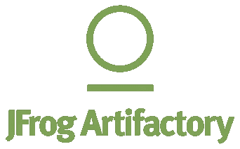
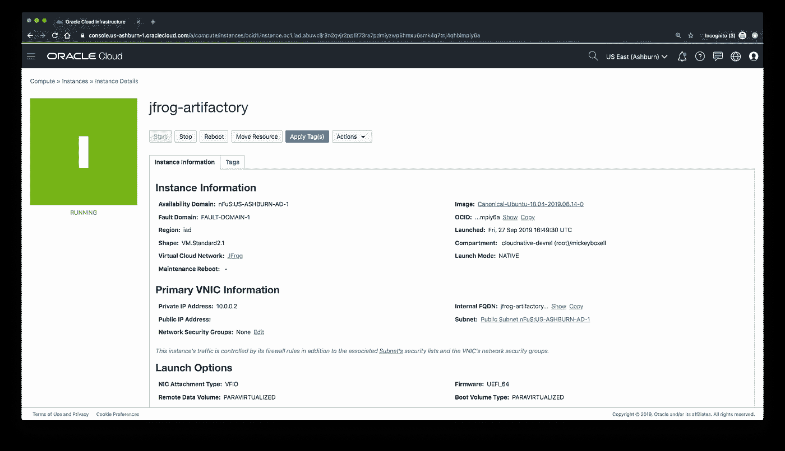
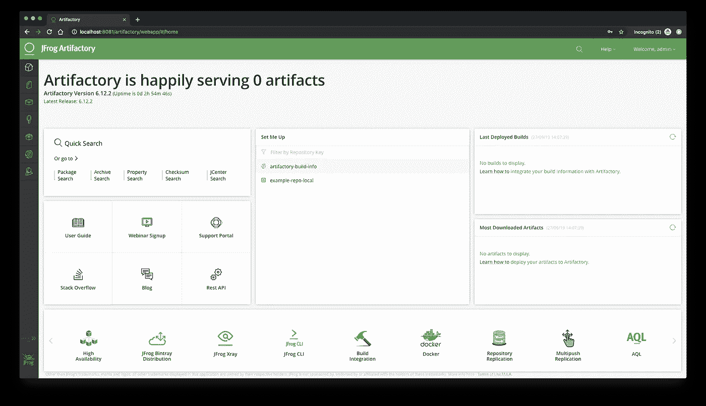

# JFrog Artifactory 和 Oracle 云

> 原文：<https://medium.com/oracledevs/jfrog-artifactory-and-oracle-cloud-ac2a6e18a2ad?source=collection_archive---------5----------------------->


Artifacts

# 概观

如今，为了在市场上保持竞争力，公司发布软件的速度比以往任何时候都快。要求分布的团队以高速率产生更新和特性提出了新的操作挑战，这为系统漏洞的出现创造了机会。这种复杂性还会导致测试问题，并且通常会减慢软件发布的速度。防止这些问题的一个方法是使用一个通用的存储库来禁止开发人员选择他们自己的软件版本，并使用来自不同来源的工件。

一个这样的工具，JFrog Artifactory，对大规模共享库和第三方组件很有用。Artifactory 在整个软件发布周期中集中控制、存储和管理二进制文件。它很容易与各种构建工具和编码语言集成，并为用户提供了用可搜索元数据标记库的能力，以提高速度、安全性和质量。Artifactory Pro 提供了所有这些功能，而 Artifactory 的企业版可以安装以获得高可用性，包括用于包安全扫描的 x 射线，以及用于实时集中控制您的环境的 Mission Control。



JFrog Artifactory

# 虚拟机安装

参考[官方工厂安装指南](https://www.jfrog.com/confluence/display/RTF/Installing+Artifactory)了解工厂安装过程的更多详细步骤。

我选择在[Oracle Cloud infra structure](http://oracle.com/cloud/)上安装 Artifactory，这是一个现代化的第二代云，专为帮助企业安全运行最苛刻的工作负载而构建和优化。对于这个测试，我使用了 Oracle VM。标准 1.8 实例形状，超过了 [Artifactory 系统要求](https://www.jfrog.com/confluence/display/RTF/System+Requirements)。我为这个实例提供了一个公共 IP 地址。我选择了 x64 位 Canonical-Ubuntu-18.04 映像，因为这是 Artifactory 支持的最新 Ubuntu 版本。 [JFrog 系统需求页面](https://www.jfrog.com/confluence/display/RTF/System+Requirements)包含关于技术先决条件的附加信息。



Artifactory virtual machine

配置虚拟机后，确保您安装了 JDK 8 或更高版本，并且您的`JAVA_HOME`环境变量设置为 JDK 安装。为此，我用`sudo apt update`更新了我的包列表，并用`apt install default-jre`安装了 JDK。接下来，我用`vi ~/.bashrc`更新了我的`$JAVA_HOME`，并在文件末尾添加了以下内容:

```
export JAVA_HOME=/usr/bin/java
export PATH=$JAVA_HOME/bin:$PATH
```

我选择安装 [Artifactory 作为 Docker 容器](https://www.jfrog.com/confluence/display/RTF/Installing+with+Docker)。或者，您可以[手动安装 Artifactory](https://www.jfrog.com/confluence/display/RTF/Installing+on+Linux+Solaris+or+Mac+OS#InstallingonLinuxSolarisorMacOS-ManualInstallation)或[使用 Docker Compose](https://www.jfrog.com/confluence/display/RTF/Installing+with+Docker#InstallingwithDocker-UsingDockerCompose) 在多个容器中安装 Artifactory。

我按照 Ubuntu 上安装 Docker 引擎的官方[文档把 Docker 安装到虚拟机上](https://docs.docker.com/install/linux/docker-ce/ubuntu/)。这样做之后，我提取了 Artifactory Pro Docker 映像`docker pull docker.bintray.io/jfrog/artifactory-pro:latest`，然后在容器`docker run --name artifactory -d -p 8081:8081 docker.bintray.io/jfrog/artifactory-pro:latest`中运行该映像。

在本例中，您创建了一个名为 volume 的 docker，并将其传递给容器。默认情况下，命名卷是一个位于`*/var/lib/docker/volumes/<name>*`下的本地目录，但是可以设置为在其他位置工作。更多详情，请参考 [Docker 卷](https://docs.docker.com/engine/reference/commandline/volume_create/)的 Docker 文档。

下面的示例创建了一个名为卷的 Docker，名为 **artifactory_data** ，并将其挂载到 artifactory 容器的**/var/opt/jfrog/arti factory:**下

`$ docker volume create --name artifactory5_data`

`$ docker run --name artifactory-pro -d -v artifactory5_data:/var/opt/jfrog/artifactory -p 8081:8081` `docker.bintray.io/jfrog/artifactory-pro:latest`

在这种情况下，即使容器被停止和删除，卷仍然存在，并且可以使用上面的`docker run`命令附加到一个新的正在运行的容器。

运行`docker ps`以验证容器正在运行:

```
$ docker ps
CONTAINER ID        IMAGE                                            COMMAND                  CREATED             STATUS              PORTS                    NAMES
c5146646a363        docker.bintray.io/jfrog/artifactory-pro:latest   "/entrypoint-artifac…"   2 days ago          Up 2 days           0.0.0.0:8081->8081/tcp   artifactory
```

Artifactory 通过端口 8081 提供流量。安装完成后，您可以通过导航到[http://【IP 地址】:8081/Artifactory/web app/#/home](http://150.136.221.17:8081/artifactory/webapp/#/home)连接到 Artifactory 控制台



JFrog Artifactory dashboard

# Kubernetes 集群安装

除了将 JFrog Artifactory 安装到 Oracle 云虚拟机上，您还可以选择将其安装到用于 Kubernetes 的 [Oracle 容器引擎](https://docs.cloud.oracle.com/iaas/Content/ContEng/Concepts/contengoverview.htm)上。面向 Kubernetes 的容器引擎是一项标准、一致、开发人员友好、容器原生且企业就绪的托管 Kubernetes 服务，用于运行具有 Oracle 云基础设施的控制、安全性和可预测性能的高可用性集群。有关在 Kubernetes 集群上安装 Artifactory 的更多信息，请参考 JFrog 文档的[在 Kubernetes 上安装](https://www.jfrog.com/confluence/display/RTF/Installing+on+Kubernetes)部分。

安装是通过 Helm 完成的，Helm 是一个用于 Kubernetes 应用程序的包管理工具。在[舵毂](https://hub.helm.sh/)上有许多选项可用，包括[默认工厂图表](https://hub.helm.sh/charts/jfrog/artifactory)和[为高可用性设计的图表](https://hub.helm.sh/charts/jfrog/artifactory-ha)。此图表将部署 arti factory-Pro/arti factory-Edge(或 OSS/CE，如果设置了自定义映像),以及使用 stable/postgresql 图表的 PostgreSQL 数据库和 Nginx 服务器。它还提供了交换底层数据库、部署小型/中型/大型安装、使用入口公开 Artifactory 以及其他可选修改的说明。

本指南将假设您有一个版本高于 1.8 的 Kubernetes 集群，并且安装了[Helm](https://helm.sh/docs/)。

安装 JFrog 舵图的第一步是将 [JFrog 舵库](https://charts.jfrog.io/)添加到您的舵客户端。为此，请运行:

```
helm repo add jfrog [https://charts.jfrog.io](https://charts.jfrog.io)
```

要安装发布名称为`artifactory`的图表:

```
helm install --name artifactory jfrog/artifactory
```

安装完成后，您将看到一个提示，要求您获取 Artifactory URL 和默认凭据:

```
1\. Get the Artifactory URL by running these commands:NOTE: It may take a few minutes for the LoadBalancer IP to be available.
         You can watch the status of the service by running 'kubectl get svc -w artifactory-nginx'
   export SERVICE_IP=$(kubectl get svc --namespace default artifactory-nginx -o jsonpath='{.status.loadBalancer.ingress[0].ip}')
   echo [http://$SERVICE_IP/](http://$SERVICE_IP/)2\. Open Artifactory in your browser
   Default credential for Artifactory:
   user: admin
   password: password
```

舵毂上的 [Artifactory 图表文档提供了更新部署、指定资源限制和配置存储的附加信息。](https://hub.helm.sh/charts/jfrog/artifactory)

# 后续步骤

在虚拟机或 Kubernetes 集群上安装 Artifactory 后，下一步是配置。按照在任何平台上配置 Artifactory 的步骤进行操作。您可以获得 Artifactory 的 [30 天免费试用和 Oracle Cloud Infrastructure](https://jfrog.com/artifactory/free-trial/) 的[免费试用。更多信息可在](https://www.oracle.com/cloud/free/)[工厂入门页面](https://www.jfrog.com/confluence/display/RTF/Getting+Started)上找到。