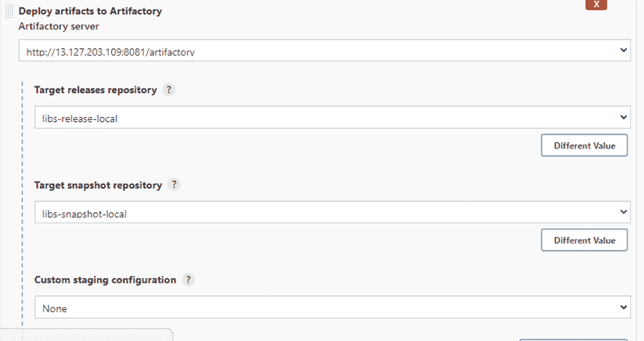

# Jfrog Artifactory 与 CI/CD Jenkins 的集成

> 原文：<https://medium.com/globant/jfrog-artifactory-integration-with-ci-cd-jenkins-5c5228471642?source=collection_archive---------0----------------------->

# **简介**

JFrog Artifactory 是一个通用的 DevOps 解决方案，通过应用交付过程提供二进制文件和工件的端到端自动化和管理，从而提高整个开发生态系统的生产率。它允许自由选择，支持 25 个以上的软件构建包，跨所有主要的 CI/CD 平台和您已经使用的 DevOps 工具。Artifactory 可以作为 Kubernetes 和 Docker 注册表，并带有完整的 CLI 和 REST APIs，可根据您的生态系统进行定制。工件存储库管理您的端到端工件生命周期，并支持不同的软件包管理系统，同时为您的 CI/CD 工作流提供一致性。工件存储库既是构建所需工件的来源，也是部署构建过程中生成的工件的目标。

# **典型的 Jfrog 用例**

Jfrog artifactory 用于通用 DevOps 解决方案，通过应用交付流程提供二进制文件和工件的端到端自动化和管理，从而提高整个开发生态系统的生产率。一些例子是:

[https://jfrog . com/use case/contained-continuous-deployment-meso sphere-dcos-jfrog-artifactory-Jenkins/](https://jfrog.com/usecase/containerized-continuous-deployment-mesosphere-dcos-jfrog-artifactory-jenkins/)

[https://jfrog . com/use case/automated-distribution-open-source-private-components-jfrog-bin tray/](https://jfrog.com/usecase/automated-distribution-open-source-private-components-jfrog-bintray/)

# **本文涵盖了以下几点**

1.  先决条件
2.  EC2 实例上的 Jfrog 安装
3.  在 jfrog 中创建 Maven 资源库
4.  将 Artifactory 与 Jenkins 整合
5.  摘要
6.  参考

## 1.先决条件

*   Jfrog 支持 Linux/Docker/Debian/Helm/Windows 平台。
*   在网络安全组中打开端口 8081 和 8082
*   公共 Ip
*   詹金斯

## 2.EC2 实例上的 Jfrog 安装

按照以下步骤在 Ec2 实例上安装 Jfrog:

以 root 用户身份打开终端/控制台登录，并在 Linux 上安装 Java

# yum 安装 java-1.8* -y

在 Linux 上安装 Jfrog 并下载 zip 包

# wget[https://releases . jfrog . io/arti factory/bin tray-arti factory/org/arti factory/OSS/jfrog-arti factory-OSS/6 . 17 . 4/jfrog-arti factory-OSS-6 . 17 . 4 . zip](https://releases.jfrog.io/artifactory/bintray-artifactory/org/artifactory/oss/jfrog-artifactory-oss/6.17.4/jfrog-artifactory-oss-6.17.4.zip%20%0d)

解压缩文件

#解压缩 jfrog-arti factory-OSS-6 . 17 . 4 . zip

使用下面的命令启动 jfrog

# cd artifactory-oss-6.17.4/bin/

# ./artifactory.sh start

要从浏览器访问 Jfrog artifactory，我们需要 Ec2 实例的公共 ip 地址。

http:// <public_ip_address>:8081</public_ip_address>

默认情况下，用户名和密码将分别为“admin”和“password”

登录后，您将看到 Jfrog Artifactory 设置向导，如下图所示。

现在，您可以通过单击 next 来设置 jfrog artifactory。您可以设置新的管理员密码，如下图所示。

## **3。在 Jfrog** 中创建 Maven 仓库

Maven 中的存储库包含不同类型的构建工件和依赖项。您可以创建存储库(例如)，我正在创建一个 maven 存储库，如下图所示。

每当您创建一个存储库时，jfrog 默认会创建另外五个存储库。存储库分为 3 种类型。

本地存储库
远程存储库
虚拟存储库

## **4。将 Artifactory 与 Jenkins 整合**

您现在可以登录到 Jenkins 实例。在下面路径**管理詹金斯- >詹金斯插件- >可用- > artifactory** 的帮助下安装 Artifactory 插件。

您需要借助以下路径在**系统配置**中添加 **Jfrog URL &部署者凭证**:管理 Jenkins - >系统配置- > JFrog 平台实例。

您可以创建一个带有全新安装目标的简单 maven 项目。

构建后部分选择**将工件部署到 Artifactory** 。在此操作中，所有工件都部署在 Jfrog artifactory 上。默认情况下，artifactory 服务器 URL 可从系统中获得。您需要添加目标发布库、目标快照库。

在 jfrog Artifactory 端，最初两个本地存储库都是空的，如下图所示。

作业完成后，您将获得 Artifactory 构建信息，如下图所示。

早期库-快照为空。现在，该作业作为工件部署在 jfrog Artifactory 上。

Jfrog Artifactory 维护每个已部署工件的版本。

## 5.摘要

通过本文，我们能够为 JFrog artifactory 设置所有必需的先决条件，并将其与 Jenkins 管道集成。如果您从未使用过 JFrog artifactory，并且正在寻找更多的实践经验，那么 JFrog 站点上的最佳实践是有用的。

## 6.参考

[https://www . JFROG . com/confluence/display/JFROG/on boarding+最佳+实践%3A+JFrog+Artifactory](https://www.jfrog.com/confluence/display/JFROG/Onboarding+Best+Practices%3A+JFrog+Artifactory)

[https://www . JFROG . com/confluence/display/JFROG/JFROG+Artifactory](https://www.jfrog.com/confluence/display/JFROG/JFrog+Artifactory)

[https://jfrog . com/knowledge-base/what-is-a-artifact-repository/](https://jfrog.com/knowledge-base/what-is-an-artifact-repository/)

对于 Artifactory OSS 的最新版本[从这里下载](https://jfrog.com/open-source/)

对于 Artifactory OSS 的旧版本[从这里下载](https://jfrog.bintray.com/artifactory/)

对于 Artifactory Pro 的最新版本[从这里下载]([https://jfrog.com/artifactory/](https://jfrog.com/artifactory/))