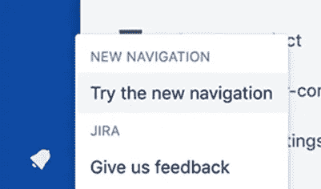
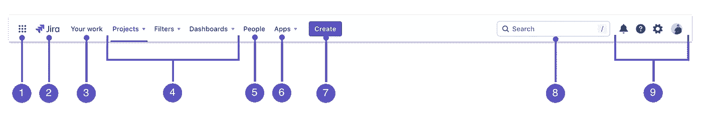

# Jira Cloud — ny navigasjon tilgjengelig

> 原文：<https://medium.com/compendium/jira-cloud-ny-navigasjon-7fabb6b7378f?source=collection_archive---------2----------------------->

**Atlassian har lyttet til sine brukere, som har meldt at dagens navigasjon ikke er spesielt godt likt, og at den gjør det vanskeligere å finne raskeste vei til det du bruker mest. De ruller derfor ut ny navigasjon for Jira og Jira Service Desk i Cloud-versjonen, og det skjer gradvis i disse dager.**

Klikk på profil-ikonet ditt for å se om utrullingen har nådd deg

Når den nye navigasjonen blir tilgjengelig på din instans vil den enkelte kunne bytte mellom ny og gammel navigasjon i ca 3 måneder. Deretter vil ny navigasjon være standard og permanent. Atlassian vil sende informasjon til din Jira-administrator før dette skjer.

Du som har brukt Jira en stund vil kjenne deg igjen, og antakelig være glad for få tilbake den gamle måten å navigere på — toppmenyen er tilbake, og erstatter knapperaden på venstre side.

Her følger en liten oversikt over de viktigste endringene. Vi har brukt engelske navn på funksjonene siden flertallet bruker Jira på engelsk, med beskrivelse på norsk.

Ny toppmeny i Jira Cloud erstatter navigasjon fra venstre marg

1.  **Product switcher** — klikk på ikonet for å vise liste og bytte mellom produktene som er installert, for eksempel fra Jira til Confluence
2.  **Jira-logo** — Hjem-knappen er endret fra at bare ikonet kunne klikkes på til hele logoen er klikkbar
3.  **Starred and recent** — Den tidligere stjernen i venstre margstolpe er erstattet med “Your work”.
4.  **Projects, Filters, and Dashboards** — Finn raskt tilbake til arbeidet ditt. Menyene viser favorittene dine øverst, fulgt av nylig besøkte saker
5.  **People** — se personer og team du samarbeider med, og lag nye team
6.  **Apps** — se og behandle apper og tillegg installert i din Jira
7.  **Create** — Plusstegnet i venstre meny er erstattet av knapp med tekst. Lag nye saker (eller trykk c på tastaturet)
8.  **Search** - Forstørrelsesglassikonet i venstre meny er erstattet av søkefelt. Dine favoritter og nylig arbeid vises nå i søkemenyen. Klikk på tekstfeltet for å vise dem (eller trykk / på tastaturet)
9.  **Notifications, help, Jira settings, and your profile and settings** — se hva som skjer i Jira, få hjelp, tilpass Jira (kun for administrator) og dine personlige innstillinger

# Venstre meny i prosjekter

Menyen i venstre marg er for det meste uendret, men har fått litt ekstra bredde så det skal være lettere å se tavler, saker, filtere, køer (Jira Service Desk) og annet innhold.

Endre rekkefølge på dine valg i menyen ved å gå til **Your work** > **Starred**

For flere detaljer og informasjon kan du lese om [New Jira Cloud navigation](https://support.atlassian.com/jira-software-cloud/docs/new-jira-cloud-navigation/) hos Atlassian. Utrullingen skal etter planen være fullført i juni.

Kilde og grafikk: [Atlassian](http://atlassian.com/)