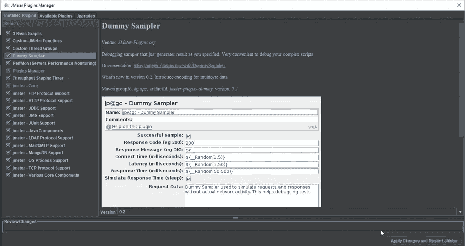

# JMeter 插件——插件管理器综合指南

> 原文：<https://medium.com/edureka/jmeter-plugins-1bceec7f6226?source=collection_archive---------0----------------------->

JMeter Plugins — Edureka

确保软件应用程序的有效运行是非常重要的，而软件测试是确保应用程序无故障运行的关键。插件使每个人都能对程序做出贡献。基本上，它们是用来提高软件性能的。在这篇“ **JMeter 插件**”文章中，我们将看到它们是如何按照以下顺序工作的:

*   JMeter 简介
*   JMeter 插件简介
*   安装插件管理器的步骤
*   手动安装/卸载插件
*   前 5 名 JMeter 插件

# JMeter 简介

[Apache JMeter](https://www.edureka.co/blog/jmeter-tutorial?utm_source=medium&utm_medium=content-link&utm_campaign=jmeter-plugins) 是一个测试工具，用于分析和测量不同软件服务和产品的性能。这是一个纯 Java 开源软件，用于测试 Web 应用程序或 FTP 应用程序。

它用于执行 web 应用程序的性能测试、负载测试和功能测试。JMeter 还可以通过为 web 服务器创建大量虚拟并发用户来模拟服务器上的重负载。

# JMeter 插件简介

JMeter 插件是用于通过扩展能力和插入功能来定制程序的软件组件。Apache JMeter 是一个强大的负载测试工具。JMeter 有很多特性，但是 JMeter 最好的一点是它是开源软件。因此，任何感兴趣的团体都可以开发扩展其功能和插入功能的附加物。这些附加物被称为插件。

在 JMeter 中，插件有多种用途，从图形工具和监听器到开发人员工具。插件管理器为用户安装、升级和卸载插件，使插件安装过程更加流畅和方便。

# 安装插件管理器的步骤

安装插件管理器的步骤包括:

【https://jmeter-plugins.org/wiki/PluginsManager/ 

*   现在重启 JMeter
*   点击“**选项**，然后点击“**插件管理器**，将显示插件列表。

# 手动安装/卸载插件

插件管理器可以执行以下任务:

*   **从可用插件中安装新插件**

*   **从已安装插件列表中卸载旧插件**

*   **如果有任何可用的更新，请升级您现有的插件**

现在我们已经完成了安装过程，让我们来看看几个在业界广泛使用的插件。

# 前 5 名 JMeter 插件

开发人员已经创建了大量有用的插件以及强大的 JMeter 社区。插件网站列出了很多 JMeter 可用的插件。在网站上，你可以搜索所有可用的插件，找到符合你需求的插件。

让我们来看看 JMeter 中最常用的 5 个插件:

## 1.PerfMon 服务器性能监控

这个插件用 PerfMon 服务器性能监控监听器扩展了 JMeter。这个监听器允许我们监控加载的服务器的 CPU、内存、交换、磁盘 I/O 和网络 I/O。

要查找，点击: ***测试计划- >添加- >监听器->jp @ GC-PerfMon 指标收集器***

## 2.自定义线程组

自定义线程组插件添加了五种线程组类型:

*   步进线程组
*   最终线程组
*   并发线程组
*   到达线程组
*   自由形式到达线程组

这五个线程组为创建测试运行所需的时间表提供了巨大的可能性。

要查找，点击: ***测试计划- >添加- >线程(用户)->jp @ GC-终极线程组***

## 3.虚拟取样器

虚拟采样器模拟请求和响应的工作，而不实际运行请求。请求和响应数据在采样器的字段中定义。这是调试后处理器和提取器的一种非常方便的方法。

要查找，请点击: ***线程组- >添加- >采样器->jp @ GC-虚拟采样器***

## 4.吞吐量整形定时器

这个插件为 JMeter 增加了以下功能:吞吐量整形定时器、特殊属性处理和调度反馈功能。这些元素使我们能够限制测试吞吐量，以确保我们不会超过我们需要的吞吐量值。

这个有趣的计时器旨在控制测试运行期间每秒发送给服务器的请求。

要查找，请点击: ***线程组- >添加- >定时器->jp @ GC-吞吐量整形定时器***

## 5.灵活的文件写入程序

这个插件用灵活的文件写入器监听器扩展了 JMeter。这个监听器被设计成以灵活的格式将测试结果写入文件，这可以通过 JMeter GUI 来指定。

要查找，点击: ***测试计划- >添加- >监听器->jp @ GC-灵活文件编写器***

这些是 JMeter 中最常用的插件。说到这里，我们的文章就到此为止了。我希望你们喜欢这个，并且理解 JMeter 插件是如何在测试计划中安装和使用的。

如果你想查看更多关于 Python、DevOps、Ethical Hacking 等市场最热门技术的文章，你可以参考 Edureka 的官方网站。

请留意本系列中的其他文章，它们将解释软件测试的各个方面。

> 1.[移动应用测试](/edureka/mobile-application-testing-51140ebe4a87)
> 
> 2.[软件测试工具](/edureka/software-testing-tools-ebd9ebac6f29)
> 
> 3.[软件测试的种类](/edureka/types-of-software-testing-d7aa29090b5b)
> 
> 4. [Appium 教程](/edureka/appium-tutorial-28e604aebeb)
> 
> 5. [JMeter 教程](/edureka/jmeter-tutorial-774856163ee9)
> 
> 6.[使用 JMeter 进行负载测试](/edureka/load-testing-using-jmeter-3da837c11a02)
> 
> 7.[自动化测试教程](/edureka/automation-testing-tutorial-157d269e60db)
> 
> 8.[什么是功能测试？](/edureka/what-is-functional-testing-complete-guide-to-automation-tools-183e42ad517a)
> 
> 9.[功能测试与非功能测试](/edureka/functional-testing-vs-non-functional-testing-a08bc732fbdd)
> 
> 10. [JMeter vs LoadRunner](/edureka/jmeter-vs-loadrunner-c1ab63acd935)
> 
> 11.[回归测试](/edureka/regression-testing-b913b7064824)
> 
> 12.[性能测试生命周期](/edureka/performance-testing-life-cycle-d4242d39a5aa)
> 
> 13. [Appium 建筑](/edureka/appium-architecture-505f70bf3484)
> 
> 14.[如何在网站上使用 JMeter 进行压力测试？](/edureka/stress-testing-using-jmeter-e6b3c64299d0)

*原载于 2019 年 4 月 23 日*[*https://www.edureka.co*](https://www.edureka.co/blog/jmeter-plugins/)*。*