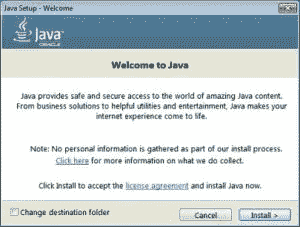
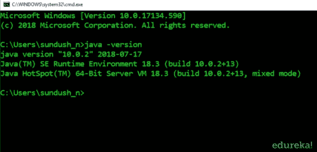
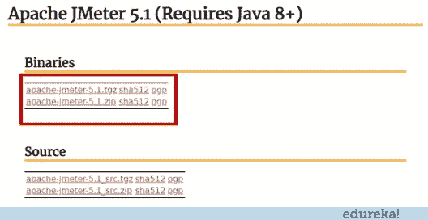
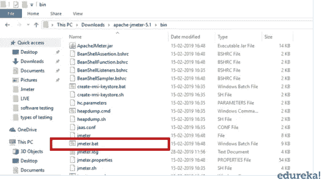
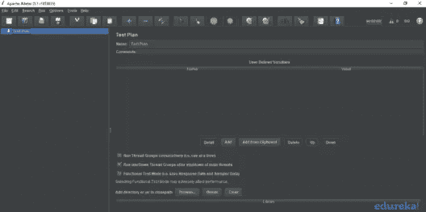
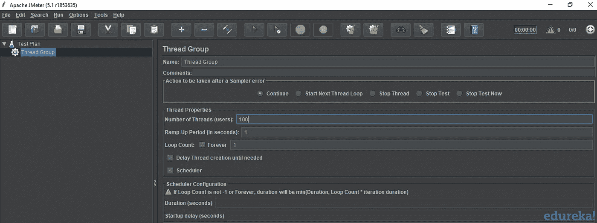
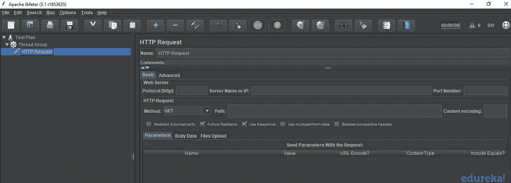
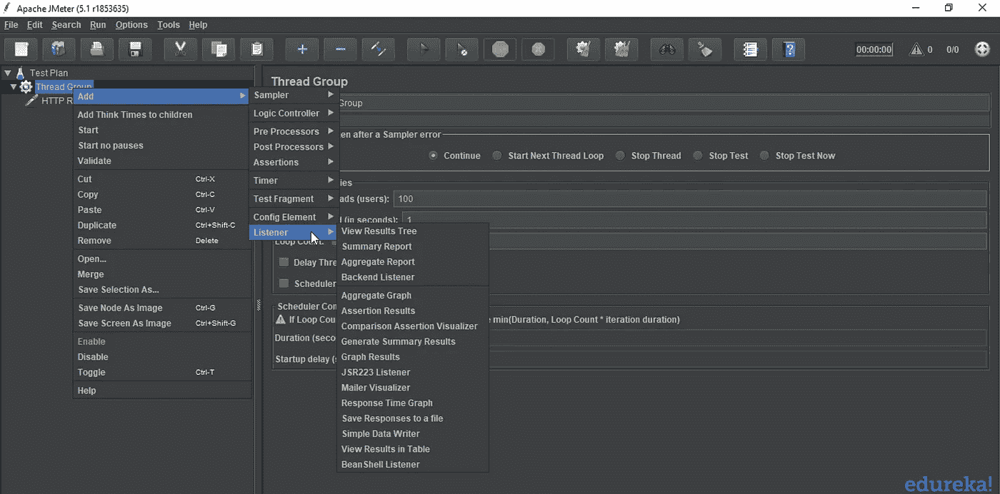
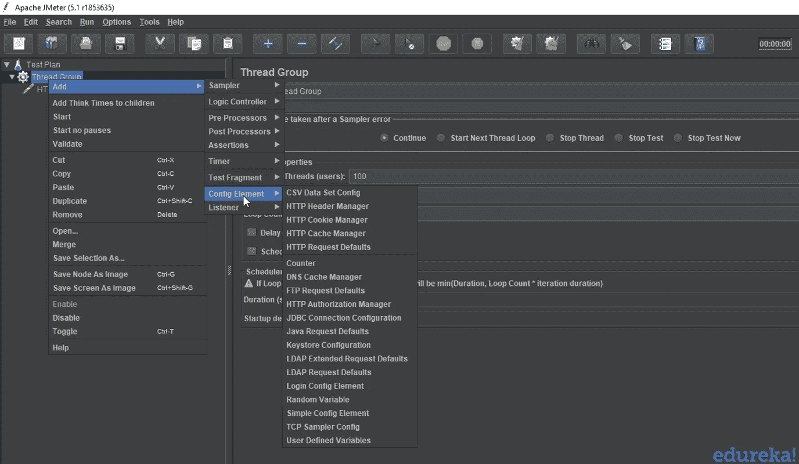

# JMeter 教程——性能测试综合指南

> 原文：<https://medium.com/edureka/jmeter-tutorial-774856163ee9?source=collection_archive---------0----------------------->

在过去的十年中，软件测试行业发生了翻天覆地的变化，让位给了更好的前景。确保软件应用程序的有效性能是很重要的，并且需要软件测试来确保应用程序运行时没有任何故障。本文将提供关于负载测试工具的深入知识，用于按以下顺序分析和测量性能:

*   什么是性能测试？
*   JMeter 是什么？
*   JMeter 的优势
*   JMeter 安装过程
*   JMeter 的要素

# 什么是性能测试？

验证产品是否满足预期或要求的性能是非常重要的。不幸的是，我们在产品交付后才发现这个缺陷。但是现在，性能已经成为一个不可避免的因素，尤其是对于 web 和移动应用程序，因为每个应用程序的用户量都非常大。

性能测试被定义为一种软件测试，以确保软件应用程序在其预期的工作负载下运行良好。它关注软件程序的某些因素，例如:

*   **速度** —检查应用程序的响应是否快速。
*   **可扩展性** —决定最大用户负载。
*   **稳定性** —它检查应用程序在变化的负载下是否稳定。

现在让我们继续我们的文章，找出一些用于性能测试的最好的工具。

## 用于性能测试的工具

性能测试在实时中是非常重要的，尤其是从客户满意度的角度来看。有几种可用的性能测试工具，例如:

*   阿帕奇 JMeter
*   负载运行器
*   WebLOAD
*   装载机队
*   LoadView
*   新负载

JMeter 是性能测试的首选工具之一。因此，让我们继续我们的文章，以了解更多关于特定测试工具的信息。

# JMeter 是什么？

Apache JMeter 是一个测试工具，用于分析和测量不同软件服务和产品的性能。这是一个纯 Java 开源软件，用于测试 Web 应用程序或 FTP 应用程序。

它用于执行 web 应用程序的性能测试、负载测试和功能测试。JMeter 还可以通过为 web 服务器创建大量虚拟并发用户来模拟服务器上的重负载。

## **JMeter 如何执行测试？**

让我们看看 JMeter 在测试过程中执行的不同步骤:

1.  它创建一个请求并发送给服务器。
2.  它接收来自服务器的响应，收集它们，并在图表或图形中可视化这些细节。
3.  它处理来自服务器的响应。
4.  它以文本、XML、JSON 等多种格式生成测试结果，以便测试人员可以分析数据。

现在让我们继续我们的文章，看看是什么让 JMeter 成为最受欢迎的测试工具之一。

# JMeter 的优势

Apache JMeter 开源软件通过简化测试过程填补了一大空白。JMeter 的一些优势包括:

**开源**

JMeter 是一个开源软件。这意味着它可以免费下载。它也是一个 100%纯 Java 应用程序。开发人员可以使用它的源代码，可以根据他们的要求修改和定制它。

**人性化**

JMeter 有一个全面的 GUI，它有助于创建测试计划和配置元素。添加元素也很容易。你只需要右击树形场景，然后添加你需要做的事情。

**支持**

基本上，它是为性能测试而设计的，但也通过创建测试计划来支持其他非功能性测试，如压力测试、分布式测试、Web 服务测试等。

**综合文档**

这是需要强调的最重要的事情之一。由于其强大的文档，用户可以对从头开始的每一个步骤有一个清晰的想法，包括测试设置的安装和配置以及生成最终报告。

**录制**

JMeter 允许用户使用记录工具记录 HTTP/HTTPS 来创建测试计划。我们使用代理服务器，允许 JMeter 在您使用普通浏览器浏览 web 应用程序时观察和记录您的操作。

**报告**

JMeter 支持仪表板报告生成。通过 JMeter 生成大量的报告，帮助用户理解性能测试的执行结果。

现在您已经知道什么是 JMeter，以及为什么我们更喜欢这个测试工具，让我们继续关注以下内容:

*   JMeter 安装过程
*   JMeter 的要素

# JMeter 安装过程

让我们来看看 JMeter 安装过程中涉及的步骤:

**步骤 1 —安装 Java**

JMeter 是一个纯 Java 桌面应用程序，它需要完全兼容的 JVM 6 或更高版本。您可以下载并安装最新版本的 Java SE 开发工具包。

您可以在命令提示符下检查安装是否成功。它将为您提供以下输出:

**步骤 2 —下载 JMeter**

JMeter 的最新版本是 5.1。您可以下载任何二进制文件。

**步骤 3 —安装 JMeter**

JMeter 的安装极其容易和简单。您只需将 zip/tar 文件解压到您希望安装 JMeter 的目录中。没有繁琐的安装屏幕需要处理。

如果您使用的是 Window，只需运行文件 **/bin/jmeter.bat** 即可在 GUI 模式下启动 jmeter:

现在你已经了解了 JMeter 的安装过程，让我们继续我们的“JMeter 教程”,了解 JMeter 的不同元素。

# JMeter 的要素

JMeter 的不同组件被称为元素。每个元素都有特定的用途。一些主要因素是:

*   线程组
*   采样
*   听众
*   配置

## **线程组**

线程组是线程的集合。每个线程代表一个使用被测应用程序的用户。它模拟一个真实的用户对服务器的请求。线程组的控件还允许您设置每个组的线程数量。

例如，如果您将线程数量设置为 100，JMeter 将创建并模拟 100 个用户对被测服务器的请求。

## 采样

JMeter 支持测试 HTTP、FTP、JDBC 和更多的协议。线程组模拟用户对服务器的请求。采样器帮助线程组知道哪种类型的请求(HTTP、FTP 等。)它需要制造。

*   **FTP 请求:**可以使用 JMeter 中的 FTP 请求采样器对 FTP 服务器进行性能测试。该控制器允许您向 FTP 服务器发送 FTP“下载文件”或“上传文件”请求。
*   **HTTP 请求:**这个采样器可以向 web 服务器发送 HTTP/HTTPS 请求。
*   [**JDBC**](https://www.edureka.co/blog/advanced-java-tutorial?utm_source=medium&utm_medium=content-link&utm_campaign=jmeter-tutorial) **请求:**这个采样器让您执行数据库性能测试。它向数据库发送一个 JDBC 请求。
*   **BSF 取样器:**这个取样器允许你使用 BSF 脚本语言编写一个取样器。
*   **访问日志采样器:**这个采样器允许你读取访问日志并生成 HTTP 请求。
*   **SMTP 采样器:**该采样器用于使用 SMTP 协议发送电子邮件消息。

## 听众

监听器显示测试执行的结果。它们可以以不同的格式显示结果，如树、表、图或日志文件。

*   图形结果监听器在图形上显示服务器响应时间
*   查看结果树以基本 HTML 格式显示用户请求的结果
*   表格结果以表格形式显示测试结果的总结
*   日志在文本文件中显示测试结果的摘要

## 配置元素

配置元素用于设置缺省值和变量，供采样器以后使用。

*   **CSV 数据集配置:**CSV 数据集配置允许您从文本文件中读取不同的参数。它用于从文件中读取行，并将它们分成变量。
*   HTTP Cookie 管理器: HTTP Cookie 管理器具有与 web 浏览器相同的功能。如果您有一个 HTTP 请求，并且响应包含一个 cookie，cookie 管理器会自动存储该 Cookie，以便在将来的所有请求中使用。
*   **HTTP 请求默认值:**这个元素允许您设置 HTTP 请求控制器使用的默认值。
*   **Login Config 元素:**log in Config 元素允许您添加或覆盖采样器中的用户名和密码设置。

至此，我们结束了这篇“JMeter 教程”文章。如果你想查看更多关于 Python、DevOps、Ethical Hacking 等市场最热门技术的文章，那么你可以参考 [Edureka 的官方网站。](https://www.edureka.co/blog/?utm_source=medium&utm_medium=content-link&utm_campaign=jmeter-tutorial)

请留意本系列中的其他文章，它们将解释软件测试的各个方面。

> 1.[移动应用测试](/edureka/mobile-application-testing-51140ebe4a87)
> 
> 2.[软件测试工具](/edureka/software-testing-tools-ebd9ebac6f29)
> 
> 3.[软件测试的类型](/edureka/types-of-software-testing-d7aa29090b5b)
> 
> 4.[应用教程](/edureka/appium-tutorial-28e604aebeb)
> 
> 5. [Appium 工作室教程](/edureka/appium-studio-tutorial-8a13ee9662d6)
> 
> 6.[什么是功能测试？](/edureka/what-is-functional-testing-complete-guide-to-automation-tools-183e42ad517a)
> 
> 7.[自动化测试教程](/edureka/automation-testing-tutorial-157d269e60db)
> 
> 8.[功能测试与非功能测试](/edureka/functional-testing-vs-non-functional-testing-a08bc732fbdd)
> 
> 9. [JMeter vs LoadRunner](/edureka/jmeter-vs-loadrunner-c1ab63acd935)
> 
> 10.[回归测试](/edureka/regression-testing-b913b7064824)
> 
> 11.[性能测试生命周期](/edureka/performance-testing-life-cycle-d4242d39a5aa)
> 
> 12. [JMeter 插件](/edureka/jmeter-plugins-1bceec7f6226)
> 
> 13. [Appium 架构](/edureka/appium-architecture-505f70bf3484)
> 
> 14.[如何在网站上使用 JMeter 进行压力测试？](/edureka/stress-testing-using-jmeter-e6b3c64299d0)

*原载于 2019 年 3 月 1 日 www.edureka.co***。**