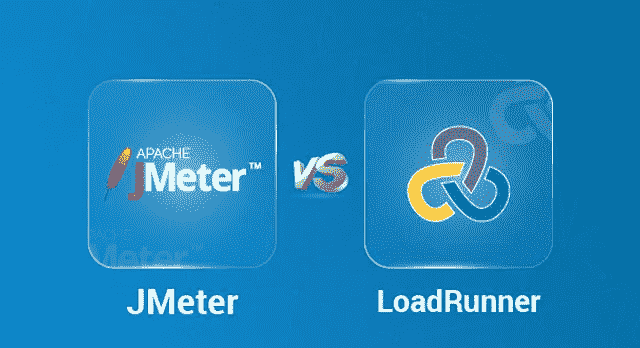

# JMeter vs LoadRunner——最佳性能测试工具之战

> 原文：<https://medium.com/edureka/jmeter-vs-loadrunner-c1ab63acd935?source=collection_archive---------0----------------------->

JMeter vs LoadRunner — Edureka

从卓越中心到开源负载测试的转变鼓励越来越多的开发人员选择像 JMeter 这样的软件测试工具，而不是 LoadRunner。为您的业务选择正确的测试工具的一个明智的方法是对解决方案进行相互比较。这篇关于 JMeter 与 LoadRunner 的比较文章将帮助您按照以下顺序找出哪一个更符合您的目标:

*   JMeter 简介
*   LoadRunner 简介
*   JMeter 与 LoadRunner:比较参数

让我们从介绍这两种软件测试工具开始我们的 JMeter vs LoadRunner 文章。

# JMeter 简介

如今，性能已经成为一个不可避免的因素，尤其是对于 web 和移动应用程序，因为每个应用程序的用户量都非常大。JMeter 是最受欢迎的性能测试工具之一。

**什么是 JMeter？**

Apache JMeter 是一个测试工具，用于分析和测量不同软件服务和产品的性能。这是一个纯 Java 开源软件，用于测试 Web 应用程序或 FTP 应用程序。

它用于执行 web 应用程序的性能测试、负载测试和功能测试。JMeter 还可以通过为 web 服务器创建大量虚拟并发用户来模拟服务器上的重负载。

# LoadRunner 简介

LoadRunner 是 Micro Focus 的一款软件测试工具。它用于测试应用、测量系统行为和负载下的性能。它可以模拟成千上万的用户同时使用应用软件。它有助于分析和预防应用程序性能问题。

***LoadRunner 的一些特性有:***

*   通过准确预测系统容量降低硬件和软件成本
*   它可以快速准确地查明应用程序性能问题的根本原因
*   具有有效的工具使用跟踪
*   基于浏览器访问全球测试资源并优化负载生成器场的使用

既然我已经讨论了这两种性能测试工具，让我们继续我们的 JMeter vs LoadRunner 文章，看看不同的比较参数。

# 比较参数

LoadRunner 在市场上占据强势地位，Apache JMeter 正在迅速崛起，比当今任何其他性能工具都要快。现在，我将通过比较以下参数来帮助您选择这两种测试工具:

*   有效性
*   负载生成能力
*   执行
*   分析报告
*   开源和社区支持
*   脚本
*   构建测试场景
*   元素

## 有效性

Apache JMeter 是一个开源的免费软件测试工具，可以轻松下载用于执行任何测试。

**LoadRunner** 是一款昂贵的软件测试工具。它最近发布了免费试用版，但不能简单地下载使用。

## 负载生成能力

**JMeter** 具有无限的负载发电能力。

**LoadRunner** 的负载生成能力有限。

## 执行

在 **JMeter** 中执行更容易。你只需要安装 Java，下载 JMeter，上传 JMeter 脚本文件。

与 JMeter 相比， **LoadRunner** 的执行较为复杂。它为每个用户创建一个线程。

## 分析报告

在 **JMeter** 中，对于经验较少的工程师来说，结果很容易理解，对于具有较多专业知识的测试人员来说，也允许进行深入的分析。

在 **LoadRunner** 中，信息为原始格式，由 HP Analysis 解析以生成各种图表。

## 开源和社区支持

JMeter 有一个充满活力的社区，支持遇到问题的用户。

**LoadRunner** 由一家大型企业所有，限制了用户数量。

## 脚本

您可以运行一个完整的负载测试，而不需要了解 JMeter 中的一点代码。

**LoadRunner，**则需要脚本知识。

## 构建测试场景

JMeter 不需要添加开始或结束事务元素。

LoadRunner 更复杂，因为它需要管理不同的代理。

## 元素

与 LoadRunner 相比，在 **JMeter** 上添加元素更容易。

在 **LoadRunner** 中配置每个元素更加复杂。

这些是 JMeter 与 LoadRunner 的一些比较参数。至此，我们结束了 JMeter 与 LoadRunner 的比较。我希望你们喜欢这篇文章，并且理解为什么 JMeter 是性能测试的首选工具之一。因此，如果您已经阅读了本文，您可能会清楚地知道哪种测试工具适合您。

如果你想查看更多关于 Python、DevOps、Ethical Hacking 等市场最热门技术的文章，你可以参考 Edureka 的官方网站。

请留意本系列中的其他文章，它们将解释软件测试的各个方面。

> 1.[移动应用测试](/edureka/mobile-application-testing-51140ebe4a87)
> 
> 2.[软件测试工具](/edureka/software-testing-tools-ebd9ebac6f29)
> 
> 3.[软件测试的类型](/edureka/types-of-software-testing-d7aa29090b5b)
> 
> 4. [Appium 教程](/edureka/appium-tutorial-28e604aebeb)
> 
> 5. [JMeter 教程](/edureka/jmeter-tutorial-774856163ee9)
> 
> 6.[使用 JMeter 进行负载测试](/edureka/load-testing-using-jmeter-3da837c11a02)
> 
> 7.[自动化测试教程](/edureka/automation-testing-tutorial-157d269e60db)
> 
> 8.[什么是功能测试？](/edureka/what-is-functional-testing-complete-guide-to-automation-tools-183e42ad517a)
> 
> 9.[功能测试与非功能测试](/edureka/functional-testing-vs-non-functional-testing-a08bc732fbdd)
> 
> 10.[回归测试](/edureka/regression-testing-b913b7064824)
> 
> 11.[性能测试生命周期](/edureka/performance-testing-life-cycle-d4242d39a5aa)
> 
> 12. [JMeter 插件](/edureka/jmeter-plugins-1bceec7f6226)
> 
> 13.Appium 建筑公司
> 
> 14.[如何在网站上使用 JMeter 进行压力测试？](/edureka/stress-testing-using-jmeter-e6b3c64299d0)

*原载于 2019 年 4 月 11 日*[*https://www.edureka.co*](https://www.edureka.co/blog/jmeter-vs-loadrunner/)*。*