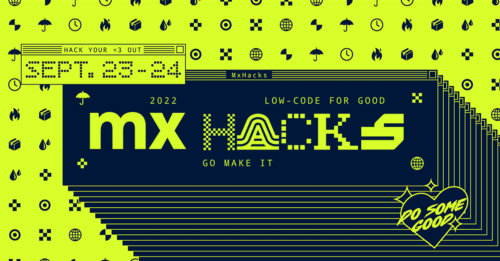
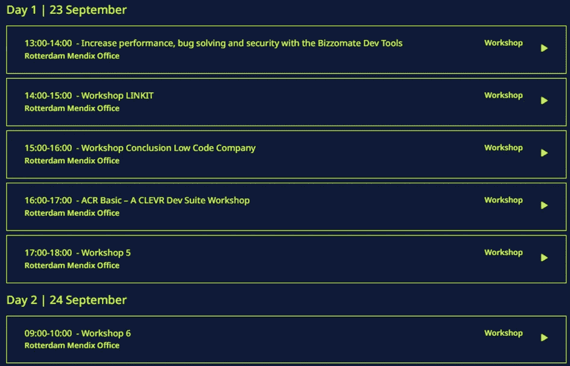
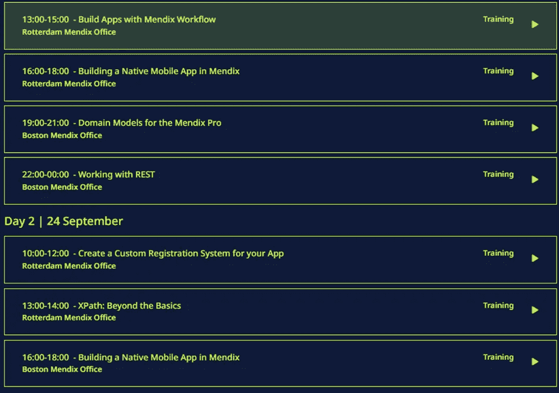
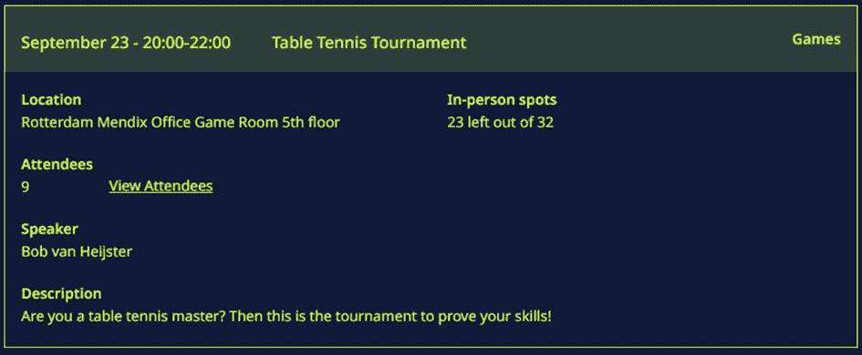

# 加入 MX hacks——低代码做好事——学习、享受乐趣，并帮助慈善机构@全球黑客马拉松

> 原文：<https://medium.com/mendix/join-the-great-hack-contribute-and-have-fun-a-worldwide-hackathon-aea08335bb4e?source=collection_archive---------3----------------------->

# 自从 Mendix 在暑假前宣布其[全球黑客马拉松](https://www.mendix.com/mxhacks/)以来，世界各地的 600 名开发者已经注册，以测试他们的 Mendix 技能，学习新东西，并获得一些乐趣。还没注册？在 9 月 9 日之前，你仍然可以在 [MxHacks 应用](https://mxhacks.mendixcloud.com/)中这样做。如果你正在读这篇文章，并且还在犹豫是否应该加入，让我来帮你做选择。

**MxHacks 是关于学习、认识其他制造商和帮助非营利组织的**

作为一名前 MxHacks 的参与者，我体验过参加这项赛事的刺激。时间紧迫给你的能力增加了一定的压力，增强了你想出解决方案并直接实施的需要。你必须有创意，与你的队友一起工作，仔细聆听和阅读，以理解你试图帮助的组织的要求，并在 Mendix 中快速构建和测试你的解决方案。最重要的是，你有一个明确的完成工作的最后期限，只有几个小时。

在玩游戏、享受食物和饮料的时候，你会有很多乐趣，当然还有抄近路的自由，专注于增加价值而不是所有的细节，因为这都是黑客和原型。与你的团队在作战室中近距离与你的竞争对手一起做所有这些事情会给你带来巨大的能量。相信我:你会需要它的。

你可以看看上次黑客马拉松的视频[来感受一下这种独特的体验。](https://videoshare.mendix.com/watch/dfue68r4mbFDZaahetDu1x?)

MxHacks 2019 at Mendix World 2019 in Ahoy, Rotterdam

这一次，该组织将更大，有更多的参赛队，今年该活动将首次在多个大洲和物理位置举行。每个地区都有自己的启动、提交截止日期和颁奖仪式，尊重不同的时区。根据我们目前所看到的，Mendix 组织得非常好，我期待着一个顶级的事件。

太好了，但是如果我不是一个有经验的 Mendix 开发人员呢？

很高兴你问了这个问题，因为竞争 Mendix 制造商有很多好处:

*   免费的独家研讨会和培训会议，只在黑客马拉松期间举行，有些是直播的，但没有录制，所以这一切都是独一无二的！

MxHacks Workshops schedule

*   参加培训，并在下次获得证书时获得 20%的折扣券

MxHacks Training schedule

*   利用最新的低代码技术
*   与学生、其他开发人员、专家，当然还有 MVP 见面并打招呼
*   分享你的知识，向别人学习
*   当你亲自加入时，收到一些很酷的东西

乒乓球大师，对你来说，有一些特别的事情可以放松，让压力从你身上溜走。如果你准备好和其他乒乓球大师而不是你的常规对手比赛，是时候证明你的技术了。

MxHacks Table Tennis Tournament

**听起来很有趣！还有什么事吗？**

是的。抛开一切不谈，MxHacks 的目标是用低代码解决方案帮助三个非营利组织，这样他们就可以帮助更多的人。您可以帮助并参与他们的挑战，为世界各地的社会正义做出贡献！您可以了解更多关于非营利组织为让世界变得更美好所做的事情。是什么支撑着他们，他们需要什么？我们生活在一个 [VUCA](https://www.techtarget.com/whatis/definition/VUCA-volatility-uncertainty-complexity-and-ambiguity) 的世界，甚至非营利组织也需要敏捷。这给已经堆积的事件增加了另一个维度。在经历了一个麻烦和不可预测的疫情时期后，世界正在开放，每个人都开始习惯新的常态。这种混合和全球事件就是一个很好的例子。

希望我能够提供一个更好的图像，展示您对下一版的 MxHacks 的期望！我将在鹿特丹参加比赛，并作为门第克斯 MVP 指导参赛队伍。

亲自或在[www.mendixhacks.com 远程注册 MxHacks 2022。](http://www.mendixhacks.com.)

加入[社区休闲](http://bit.ly/mxslack)和[# MX packs-general](https://mendixcommunity.slack.com/archives/C03HSKEJR6G)频道的 5000 多家制造商，了解最新消息。

那里见！

**更新后编辑:**

我在博客上得到了很多积极的回应，但也有反馈提到如果你没有门第克斯的经验该怎么办？你应该参加黑客马拉松吗？嗯，是的！首先，我真的很佩服那些没有任何门第知识的人。第二，如果你有勇气，你很酷。对每个仍在怀疑的人来说，这是一点小小的帮助，因为你是门第克斯的新手:

1.[下载 Studio Pro](https://marketplace.mendix.com/link/studiopro/) 并四处玩耍

2. [Mendix](https://signup.mendix.com/link/signup/?source=direct) 签约(免费)

3.遵循尽可能多的[学习路径](https://academy.mendix.com/link/paths)，从基础和快速速成课程开始

4.如果你有时间，还可以上一些中级课程。我可以推荐:[工作流程](https://academy.mendix.com/link/paths/112/Build-a-Powerful-Workflow)、[整合](https://academy.mendix.com/link/paths/44/Importing-and-Exporting-Your-Data)、[页面](https://academy.mendix.com/link/paths/56/Create-an-App-with-Advanced-Page-Building)、[设计](https://academy.mendix.com/link/paths/127/Define-your-Design) & [造型](https://academy.mendix.com/link/paths/123/Style-your-App-with-Sass)。在黑客马拉松期间了解这些将会很方便。

5.下载模板 Mendix 应用程序的示例[,用你新获得的 Mendix 知识分析它们的内部工作原理，理解它们是如何工作的。当你开始构建自己的应用程序时，这将对你有所帮助。](https://marketplace.mendix.com/link/contenttype/11)

去做吧！

*来自发布者-*

*如果你喜欢这篇文章，你可以在我们的* [*中页*](https://medium.com/mendix) *找到更多喜欢的。对于精彩的视频和直播会话，您可以前往*[*MX live*](https://www.mendix.com/live/)*或我们的社区*[*Youtube PAG*](https://www.youtube.com/c/MendixCommunity/community)*e .*

*希望入门的创客可以注册一个* [*免费账号*](https://signup.mendix.com/link/signup/?source=direct) *，通过我们的* [*学苑*](https://academy.mendix.com/link/home) *获得即时学习。*

有兴趣更多地参与我们的社区吗？加入我们的 [*Slack 社区频道*](https://join.slack.com/t/mendixcommunity/shared_invite/zt-hwhwkcxu-~59ywyjqHlUHXmrw5heqpQ) *。*