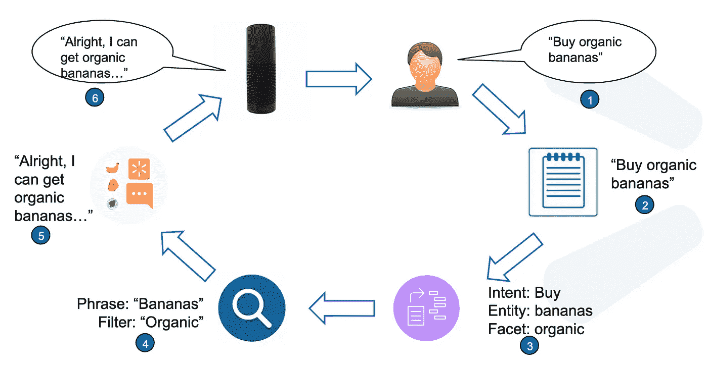
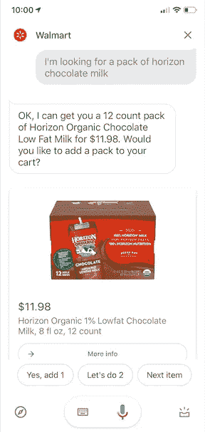

# 会话商务的联合意图分类和实体识别

> 原文：<https://medium.com/walmartglobaltech/joint-intent-classification-and-entity-recognition-for-conversational-commerce-35bf69195176?source=collection_archive---------2----------------------->

在之前的中，我们介绍了我们的端到端电子商务对话人工智能系统，该系统现在在谷歌助手和苹果的 Siri 上运行。我们的人工智能系统为沃尔玛杂货店提供了完整的端到端语音购物体验。我们的用户可以通过语音搜索沃尔玛产品，将它们添加到购物车，在结账前编辑购物车，查询订单状态等。我们的 NLU 管道的一个关键组件是意图分类和命名实体识别，它主要支持所有上述功能和许多其他功能。在接下来的部分中，我们将深入我们的 NLU 系统的意图和实体组件。下图总结了我们对话系统的整体对话流程。

Walmart Grocery Conversation Flow

**了解用户查询**

沃尔玛目录有数百万种产品，分属于几个部门。与网站上传统的关键字搜索相比，语音查询更加自然和完整。为了确保我们的系统针对语音搜索进行了优化，我们必须理解用户的意图，并识别查询中的实体。这是面向目标的[对话系统](https://www.slideshare.net/QiHe2/aaai-2019-tutorial-endtoend-goaloriented-question-answering-systems)的一个关键方面，有助于从目录中检索正确的产品，并为用户生成正确的响应。由于产品可能有各种属性，包括品牌、类型、尺寸、数量和单位，我们需要在查询中仔细识别这些关联。下面是一个示例对话的快照，其中用户希望订购巧克力牛奶。

> 查询:我在找一包地平线巧克力牛奶
> 
> 意图:搜索
> 
> 实体:*包装<* 单位 *>，地平线<* 品牌 *>，巧克力牛奶<产品>*

**意图和实体模型架构**

我们在产品中使用最先进的 [BiLSTM](https://en.wikipedia.org/wiki/Bidirectional_recurrent_neural_networks) 和 BiLSTM- [CRF](https://en.wikipedia.org/wiki/Conditional_random_field) 深度学习模型，分别用于意图分类和实体识别。最近，已经有各种努力来生成上下文单词嵌入。这样的努力导致了诸如 Elmo、InferSent 和 BERT 的嵌入。在[强力胶](/walmartglobaltech/ super.gluebenchmark.com/leaderboard)基准排行榜上，BERT 在解决各种 NLU 任务时大放异彩。考虑到这一点，我们最近开发了一个基于 BERT 的联合意图分类和 NER 模型。通过联合模型，我们利用了两个任务中的依赖关系。BERT 模型考虑了单词的整个上下文，使其能够更好地理解查询。

**与之前型号的结果对比**

> 查询:*搜索海飞丝洗发水*，意图:*搜索*
> 
> 以往型号:*海飞丝* <产品>，*洗发水* <产品>
> 
> 伯特型号:*海飞丝* <品牌>，*洗发水* <产品>

之前的模型将海飞丝标记为产品，而伯特模型正确地将它标记为品牌。BERT 模型学习产品的这些属性关联，而不需要必须定期缩放和维护的附加特征。

> 查询:“A *将万用表添加到购物车*，意图:*添加到购物车*
> 
> 以前的型号:*万用表*品牌>
> 
> 伯特型号:*万用表*产品>
> 
> *BERT 模型正确地标记了以前在训练数据中未见过的产品。这极大地帮助了我们，因为我们可以扩展到支持我们目录中的数百万种产品。*
> 
> 查询:“B *预约今晚取货的时间*”，意图:*设置取货时段*
> 
> 伯特型号:*今晚* < *时间参考>*
> 
> 先前模式:*今夜* < *出域* >

正确地标记上面的查询无缝地帮助我们的用户在他们方便的时候在沃尔玛商店设置取货口。

**BERT 的改进**

我们将这些查询性能的提高归功于 BERT 使用的强大的单词片段标记化和位置嵌入。它们帮助 it 更好地推广新产品和用例。我们观察到，与之前的模型相比，意图分类和实体识别的 F-1 分数提高了约 7%。“添加到购物车”的意图对于电子商务 NLU 系统非常重要。它显示了用户购买产品的真实意图。我们观察到，使用 BERT 模型后,“增加到汽车中”的 F1 得分提高了 4%。

**未来工作**

我们的推理管道的延迟是为用户生成及时响应的关键，使我们的整体对话延迟更小，从而使我们的用户更加投入。由于我们已经看到 BERT 比我们以前的模型具有更高的推理延迟，我们正在努力使用知识提炼和其他技术来改善 BERT 模型的推理延迟。

我们的模型正在支持其他几个语音购物用例，如沃尔玛常见问题的问答和产品发现等。敬请关注我们未来的博客和一些令人兴奋的即将到来的功能，这些功能利用了 BERT 的其他功能，如下一句预测、片段嵌入等。