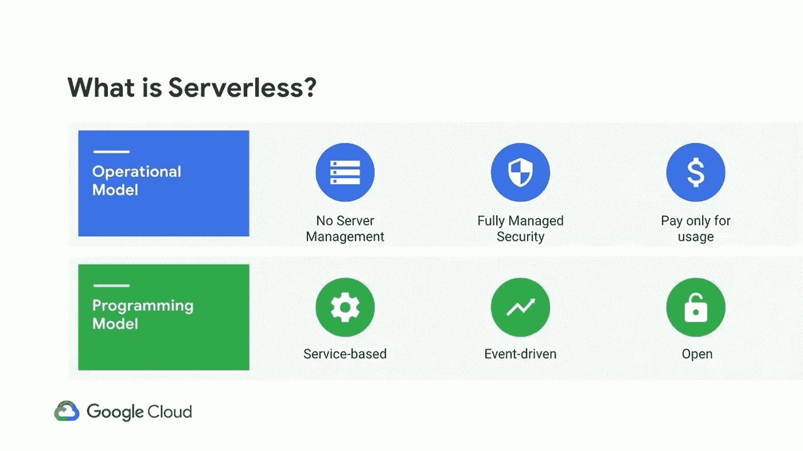

# 谷歌云平台上的无服务器之旅

> 原文：<https://medium.com/google-developer-experts/journey-to-serverless-on-google-cloud-platform-493fa5434ede?source=collection_archive---------0----------------------->

谷歌云的无服务器平台让你可以按照自己的方式编写代码，而不用担心底层基础设施。将功能或应用程序部署为源代码或容器。使用 Google Cloud 的存储、数据库、机器学习等构建全栈无服务器应用，同时使用您最喜欢的语言、运行时、框架和库。

无服务器并不意味着没有服务器，相反，它消除了管理服务器的工作量，从而消除了处理配置、供应、负载平衡、分片、扩展和基础架构管理的需要，因此您可以专注于构建出色的应用程序。

无服务器计算(也称为**无操作**)主要分布在操作和开发人员体验中，从而确保:

*   没有需要管理或调配的服务器
*   账单会根据您的使用情况进行优化
*   关注代码
*   快速扩大规模
*   按比例减少

“功能即服务”( FaaS)和“无服务器”通常可以互换使用，但是“无服务器”比“FaaS”提供更多功能。FaaS 平台从开发者那里获得一个功能，将其构建到一个应用程序中，然后部署到云中。*无服务器不仅仅是 FaaS。*

# GCP 无服务器计算选项

Google Cloud 提供了适合您的应用的无服务器计算选项。这些选项跨越了 ***基于事件的应用、HTTP 应用以及容器化应用*** 。

# 云函数

Google Cloud Functions 是一个轻量级计算解决方案，开发人员可以创建单一用途的独立功能来响应云事件，而无需管理服务器或运行时环境。常见的云功能用例可能是数据处理、Webhooks、轻量级 API、移动后端、物联网

Cloud Functions 允许你从 Google Cloud Platform、Firebase 和 Google Assistant 中触发你的代码，或者通过 HTTP 从任何 web、移动或后端应用程序中直接调用它。

云函数支持用 JavaScript (Node.js)、Python、Go 编写的代码。没有新的语言、工具或框架需要学习。你所需要做的就是带来代码——包括你带到平台上的原生库。

云功能提供了一个逻辑连接层，允许您编写代码来连接和扩展云服务。倾听并回复上传到云存储的文件、日志更改或云发布/订阅主题上的传入消息。

了解更多关于[云函数的信息。](https://cloud.google.com/functions)

# 应用引擎

App Engine 是一个完全托管的无服务器平台，用于大规模开发和托管 web 应用程序。您可以从几种流行的语言、库和框架中进行选择来开发您的应用程序，然后让 App Engine 负责根据需求配置服务器和扩展您的应用程序实例。

使用许多流行语言(如 Java、PHP、Node.js、Python、C#)快速构建和部署应用程序。如果你愿意的话，可以使用你自己的语言运行时和框架。

App Engine 中的应用版本控制允许您轻松托管不同版本的应用，轻松创建开发、测试、试运行和生产环境。

应用引擎中的流量分流支持不同应用版本的传入请求、A/B 测试和增量功能部署。

App Engine 还通过使用 App Engine 防火墙定义访问规则来为您的应用程序提供安全性，并在您的自定义域中默认利用托管 SSL/TLS 证书，无需额外费用。

了解关于[应用引擎](https://cloud.google.com/appengine/)的更多信息

# 云运行

Cloud Run 是一个托管计算平台，可以自动扩展您的无状态容器。云运行是无服务器的:它将所有基础设施管理抽象化，因此您可以专注于最重要的事情—构建优秀的应用程序。

Cloud Run 构建于 Knative 开源项目之上，支持跨平台的工作负载移植。Knative 为 Kubernetes 上的云原生应用程序提供了零扩展、自动扩展、集群内构建和事件框架等功能。

云运行(完全托管)允许您部署无状态容器，而不必担心底层基础设施。您的工作负载会根据应用的流量自动增加或减少至零。你只需在应用运行时付费，计费精确到 100 毫秒。

Cloud Run for Anthos (on-premises)抽象出复杂的 Kubernetes 概念，允许开发人员轻松地利用 Kubernetes 和无服务器的优势。它提供对定制机器类型、附加网络支持和云加速器的访问。

云运行会根据流量自动从 0 扩展到 N。它还允许自定义域映射，并免费提供 SSL。

了解更多关于[云跑](https://cloud.google.com/run)

# 无服务器开发和监控

Google Cloud 将其他产品集成到部署无服务器应用程序和监控日志中。

云功能和应用引擎等无服务器环境的部署在后台使用[云构建](https://cloud.google.com/cloud-build/)，无服务器应用的监控日志也利用 [Stackdriver](https://cloud.google.com/stackdriver/) 。

Cloud Build 是一项服务，可以让您轻松地为无服务器应用程序创建持续集成和交付(CI/CD)管道。

Stackdriver 是一种监控服务，它为运行在 Google Cloud 或内部的无服务器应用程序聚集指标、日志和事件。

# 有用的链接

*   [谷歌云——选择无服务器选项](https://cloud.google.com/serverless-options/)
*   [云功能—功能框架](https://cloud.google.com/functions/docs/functions-framework)
*   [应用引擎—选择应用引擎环境](https://cloud.google.com/appengine/docs/the-appengine-environments)
*   [Ahmetb —云运行常见问题解答](https://github.com/ahmetb/cloud-run-faq)
*   [使用 Firebase 托管服务提供动态内容和托管微服务](https://firebase.google.com/docs/hosting/serverless-overview)