# jQuery 初学者教程——初学者综合指南

> 原文：<https://medium.com/edureka/jquery-tutorial-for-beginners-679021d74ab4?source=collection_archive---------2----------------------->


jQuery Tutorial — Edureka

所有好的东西都是小包装的，jQuery 也是如此。jQuery 是一个很小的 JavaScript 库，它将网络变成了一种娱乐体验。它是最流行的 JavaScript 库之一。在这个 jQuery 教程博客中，您将了解 jQuery 的重要性和基本原理。

我将涉及以下主题:

1.  JavaScript 是什么？
2.  为什么要使用 jQuery？
3.  什么是 jQuery？
4.  安装 jQuery
5.  文档对象模型(DOM)
6.  jQuery 选择器
7.  jQuery 基础知识
8.  jQuery 方法
9.  jQuery 事件
10.  jQuery 效果
11.  jQuery UI

# JavaScript 是什么？

JavaScript 是网络语言，它通过给网络添加动态来使网络看起来更生动。更准确地说，它是一种脚本语言，让你在网页上实现复杂而美丽的东西/设计。当你注意到一个网页不只是坐在那里呆呆地看着你，你可以打赌这个网页正在使用 JavaScript。

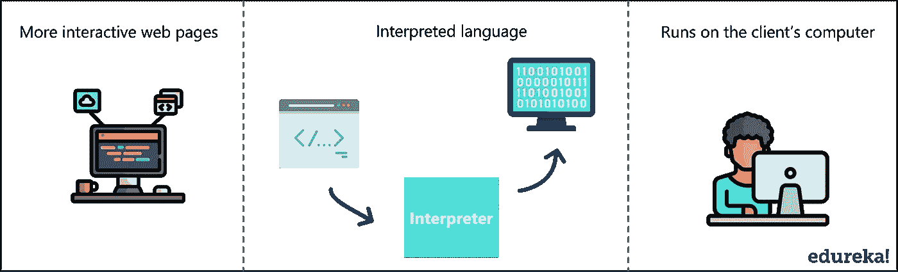

## **JavaScript 的特性:**

*   它通过添加动作和图形使网页更具互动性
*   它是一种解释语言，这意味着你不需要编译器来运行 JavaScript
*   JavaScript 主要是一种客户端脚本语言

# 为什么要使用 jQuery？

我们都知道有上百种 JavaScript 框架和库，但是为什么要使用 jQuery 呢？

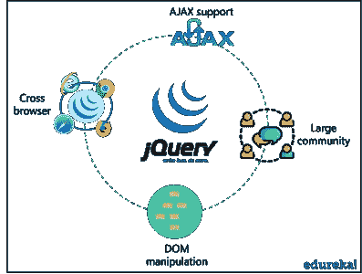

***这里有一个让 jQuery 如此有效的特性列表:***

*   首先，jQuery 使得操作 DOM 变得非常容易。为了使 web 应用程序更具交互性，web 开发人员操纵 DOM & jQuery 使这变得非常容易
*   它的用户群体比其他任何 JavaScript 库都更加多样化。它提供了开发人员所需要的详细文档
*   jQuery 有 1000 多个免费的插件，改善了用户体验。AJAX(异步 JavaScript 和 XML)就是这样一个例子，它开发了一个响应迅速、功能丰富的网站
*   jQuery 提供跨浏览器支持，让您可以在不同的浏览器上运行代码，而不用担心依赖问题

# 什么是 jQuery？

jQuery 是由 John Resig 在 2006 年创建的一个高效快速的 JavaScript 库。jQuery ***的座右铭是少写多做，*** 这非常贴切，因为它的功能围绕着简化每一行代码。下面是 jQuery 主要特性的列表:

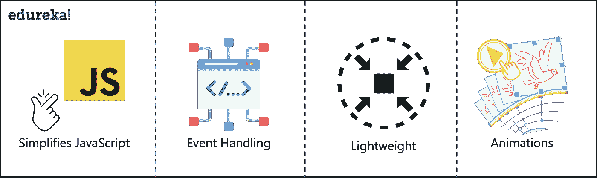

*   **简化 JavaScript** :它简化了快速 web 开发的 DOM 操作和事件处理
*   **事件处理** : jQuery 提供了一种有效的方式来捕获各种各样的事件，比如用户点击一个链接，而不需要弄乱 HTML 代码
*   轻量级:jQuery 是一个紧凑的轻量级库，大约 19KB
*   动画:它有很多内置的动画效果，你可以在你的网络应用中使用，使它更具互动性

# 安装 jQuery

本质上没有安装，更像是下载 jQuery。安装 jQuery 有两种方法:

1.  **本地安装:**你可以直接从他们的官网下载 jQuery 库，包含在你的 HTML 代码中
2.  **链接到 CDN:** 您可以从内容交付网络将 jQuery 库添加到您的 HTML 代码中

在这篇博客中，我将使用第二种方法。这里有一个 CDN 的链接，只需将它复制并粘贴到 HTML 文件的

```
<script type="text/javascript" src="[https://code.jquery.com/jquery-3.3.1.min.js](https://code.jquery.com/jquery-3.3.1.min.js)"></script>
<script src="[https://code.jquery.com/ui/1.12.1/jquery-ui.min.js](https://code.jquery.com/ui/1.12.1/jquery-ui.min.js)"
  integrity="sha256-VazP97ZCwtekAsvgPBSUwPFKdrwD3unUfSGVYrahUqU="
crossorigin="anonymous"></script>
<link href="[https://code.jquery.com/ui/1.10.4/themes/ui-lightness/jquery-ui.css](https://code.jquery.com/ui/1.10.4/themes/ui-lightness/jquery-ui.css)" rel="stylesheet">
```

在我们继续之前，我想提一下，我正在使用 [Visual Studio Code](https://code.visualstudio.com/) 编辑器编写我的代码，我将在谷歌 Chrome 浏览器上运行我的所有代码。谷歌 Chrome 有一个嵌入式 JavaScript 引擎，可以运行所有的基本命令。你所要做的就是打开一个浏览器，右键点击空白处并选择 Inspect。

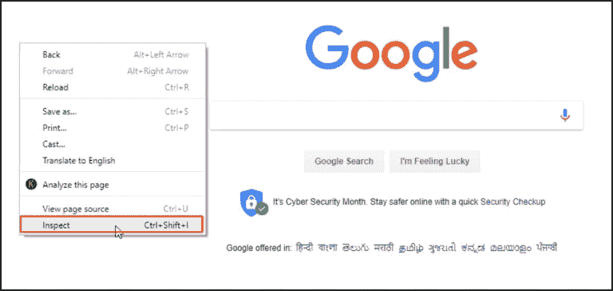

这将为您打开一个 JavaScript 控制台来运行您的命令。

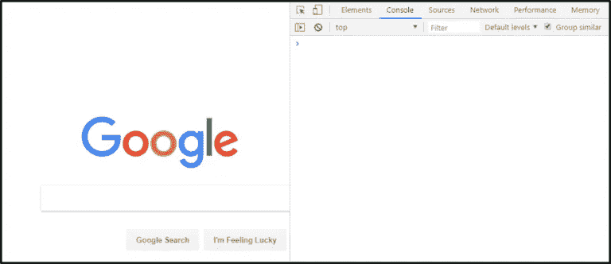

# 文档对象模型(DOM)

DOM 是各种 HTML 元素的树形结构。

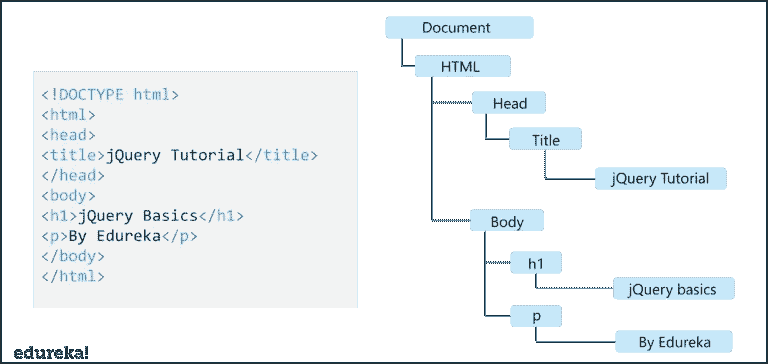

在上图中:

*   是所有其他 DOM 元素的祖先
*   和元素是的后代
*   <title>是的子节点</title>
*   # &

    元素是

    和的子元素

为了操作 DOM 元素，理解 DOM 背后的概念是很重要的。

# jQuery 选择器

jQuery 选择器通过使用“$()”函数来选择和操作 HTML 元素。在常规 JavaScript 中，我们有像 document.getElementById、querySelectorAll、getElementByClass 这样的函数和许多其他复杂的函数来做这件事。但是在 jQuery 中，“$()”函数取代了所有这些函数。请参考以下语法:

## ***$(选择器)。*行动()**

让我们看一个例子:

```
<!DOCTYPE html>
<html>
    <head>
        <title> jQuery Tutorial</title>
        <script type="text/javascript" src="[https://code.jquery.com/jquery-3.3.1.min.js](https://code.jquery.com/jquery-3.3.1.min.js)"></script>
        <script src="[https://code.jquery.com/ui/1.12.1/jquery-ui.min.js](https://code.jquery.com/ui/1.12.1/jquery-ui.min.js)"
                integrity="sha256-VazP97ZCwtekAsvgPBSUwPFKdrwD3unUfSGVYrahUqU="
                crossorigin="anonymous"></script>
        <link href="[https://code.jquery.com/ui/1.10.4/themes/ui-lightness/jquery-ui.css](https://code.jquery.com/ui/1.10.4/themes/ui-lightness/jquery-ui.css)" rel="stylesheet">  
    </head>

<body>
    <h1>jQuery Basics</h1>
    <p>By Edureka</p>   
</body>
</html>
```

运行上面的代码后，打开 JavaScript 控制台，输入“$”(选择器函数)检查是否成功安装了 jQuery。这将返回如下所示的函数:

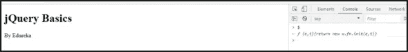

现在您已经安装了 jQuery，让我们在浏览器控制台上运行以下命令:

```
$("h1").css("color", "red")
```

该命令选择

# 标签，并向其添加一个 css()方法，用于样式化

# 标签，在本例中

# 颜色设置为红色。

这是最终结果:

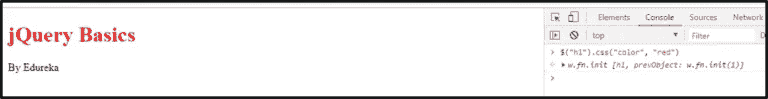

# jQuery 基础知识

现在您已经对 jQuery 有了基本的了解，让我们深入研究 jQuery 编程。我将讲述以下基础知识:

1.  jQuery 方法
2.  jQuery 事件
3.  jQuery 效果
4.  jQuery UI

# jQuery 方法

有几种 jQuery 方法，我将介绍最常用的方法。以下是你将要学习的方法列表:

1.  jQuery 方法— before()
2.  jQuery 方法—在()之后
3.  jQuery 方法—文本()
4.  jQuery 方法— html()
5.  jQuery 方法— css()
6.  jQuery 方法— attr()
7.  jQuery 方法— val()
8.  jQuery 方法— addClass()
9.  jQuery 方法— removeClass()
10.  jQuery 方法— toggleClass()

## jQuery 方法— before()

jQuery before()方法用于在选定的元素之前插入指定的内容。请参考以下语法:

***$(选择器)。之前(内容)；***

让我们看一个例子:

```
<!DOCTYPE html>
<html>
    <head>
        <title> jQuery Tutorial</title>
        <script type="text/javascript" src="[https://code.jquery.com/jquery-3.3.1.min.js](https://code.jquery.com/jquery-3.3.1.min.js)"></script>
        <script src="[https://code.jquery.com/ui/1.12.1/jquery-ui.min.js](https://code.jquery.com/ui/1.12.1/jquery-ui.min.js)"
                integrity="sha256-VazP97ZCwtekAsvgPBSUwPFKdrwD3unUfSGVYrahUqU="
                crossorigin="anonymous"></script>
        <link href="[https://code.jquery.com/ui/1.10.4/themes/ui-lightness/jquery-ui.css](https://code.jquery.com/ui/1.10.4/themes/ui-lightness/jquery-ui.css)" rel="stylesheet">  
    </head>

<body>
    <h1>jQuery Basics</h1>
    <p>By Edureka</p> 
    <ul>
        <li>Golden Retriever</li>
        <li>Syberian Husky</li>
        <li>Boxer</li>
    </ul>  
</body>
</html>
```

运行上述代码后，打开 JavaScript 控制台并键入以下命令:

```
$("ul").before("<h2>My favourite dogs!!</h2>")
```

这个命令选择了

## 标签，上面写着“我最喜欢的狗！!"就在

这是最终结果:

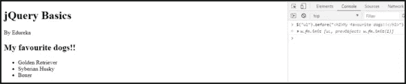

## jQuery 方法—在()之后

jQuery after()方法用于在选定的元素后插入指定的内容。请参考以下语法:

***$(选择器)。(内容)之后；***

引用用于 before()方法的相同代码，打开 JavaScript 控制台并键入以下命令:

```
$("ul").after("<h2>All dogs are adorable!!</h2>")
```

该命令选择

## 标签，上面写着“所有的狗都很可爱！!"就在

这是最终结果:


## jQuery 方法—文本()

jQuery text()方法用于设置或返回所选元素的文本内容。请参考以下语法:

***$(选择器)。*正文()**

***$(选择器)。*正文(内容)**

引用用于 before()方法的相同代码，打开 JavaScript 控制台并键入以下命令:

```
$("li").text()
$("p").text("Welcome to this fun jQuery Tutorial")
```

第一个命令选择了

*   (list)并使用 text()方法返回*   的内容。第二个命令选择唯一的

    标记，并用“欢迎使用这个有趣的 jQuery 教程”设置或替换

    标记的内容。

这是最终结果:

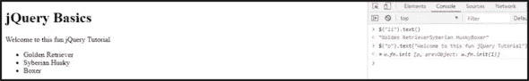

## jQuery 方法— html()

jQuery html()方法用于设置或返回所选元素的全部内容。请参考以下语法:

***$(选择器)。html()***

***$(选择器)。*html(内容)**

引用用于 before()方法的相同代码，打开 JavaScript 控制台并键入以下命令:

```
$("li:first").html() ]
$("li:last").html("<li> German shepherd</li>")
```

第一个命令选择

*   (列表)的第一个元素，并使用 html()方法返回*   的全部内容。第二个命令选择*   标签的最后一个元素，并用“German Shepherd”设置或替换它的内容。

这是最终结果:

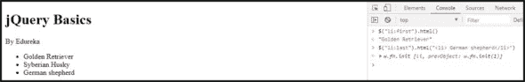

我知道你们都在想，text()和 html()方法有什么区别？好吧，运行下面的命令，自己看看:

```
$("ul").text() 
$("ul").html()
```

## jQuery 方法— css()

jQuery css()方法用于获取或设置所选元素的样式属性。请参考以下语法:

***$(选择器)。CSS(property name)；***

***$(选择器)。css(propertyname，value)；***

引用用于 before()方法的相同代码，打开 JavaScript 控制台并键入以下命令:

```
$("h1").css("background-color", "blue") 
$("ul li").css("color", "green")
```

第一个命令选择

# 并对其应用背景颜色。第二个命令选择

这是最终结果:

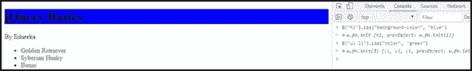

## jQuery 方法— attr()

jQuery attr()方法用于设置或返回所选元素的属性和值。请参考以下语法:

***$(选择器)。【T4 属性】【T5 属性】***

***$(选择器)。attr(属性，值)***

让我们来看一个例子，但是在你运行下面的代码之前，这里要注意的一点是，我加载了三张小狗的图片，我把它们保存在 jQuery 文件夹中一个名为“puppie”的文件夹中(包含 index.html 文件和 css 文件)。

```
<!DOCTYPE html>
<html>
<head>
<title> jQuery Tutorial</title>
<link rel="stylesheet" type="text/css" href="index.css">
<script type="text/javascript" src="[https://code.jquery.com/jquery-3.3.1.min.js](https://code.jquery.com/jquery-3.3.1.min.js)"></script>
<script src="[https://code.jquery.com/ui/1.12.1/jquery-ui.min.js](https://code.jquery.com/ui/1.12.1/jquery-ui.min.js)"
                integrity="sha256-VazP97ZCwtekAsvgPBSUwPFKdrwD3unUfSGVYrahUqU="
                crossorigin="anonymous"></script>
        <link href="[https://code.jquery.com/ui/1.10.4/themes/ui-lightness/jquery-ui.css](https://code.jquery.com/ui/1.10.4/themes/ui-lightness/jquery-ui.css)" rel="stylesheet">  
    </head>

<body>
    <h1>jQuery Basics</h1>
    <p>By Edureka</p> 
    <div class="puppers">

        

        

        

    </div>
</body>
</html>
```

运行上述代码后，打开 JavaScript 控制台并键入以下命令:

```
$("img").attr("border","5px solid black")
```

该命令选择所有图像(img ),并为每个图像添加一个名为 border 的属性，并使用 attr()方法将其设置为纯黑色。

这里需要注意的一点是，在代码中，我链接了一个 index.css 文件，该文件将所有图像并排对齐，并设置图像的宽度和高度。下面是 index.css 文件:

```
.puppers {
float:left;
}

img {
width: 300px;
height: 250px;
}
```

这是最终结果:

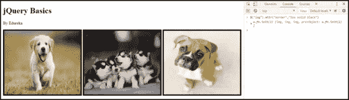

## jQuery 方法— val()

jQuery val()方法用于设置或返回所选元素的当前值。请参考以下语法:

***$(选择器)。*val()**

***$(选择器)。*val(值)**

让我们看一个例子:

```
<!DOCTYPE html>
<html>
    <head>
        <title> jQuery Tutorial</title>
        <script type="text/javascript" src="[https://code.jquery.com/jquery-3.3.1.min.js](https://code.jquery.com/jquery-3.3.1.min.js)"></script>
        <script src="[https://code.jquery.com/ui/1.12.1/jquery-ui.min.js](https://code.jquery.com/ui/1.12.1/jquery-ui.min.js)"
                integrity="sha256-VazP97ZCwtekAsvgPBSUwPFKdrwD3unUfSGVYrahUqU="
                crossorigin="anonymous"></script>
        <link href="[https://code.jquery.com/ui/1.10.4/themes/ui-lightness/jquery-ui.css](https://code.jquery.com/ui/1.10.4/themes/ui-lightness/jquery-ui.css)" rel="stylesheet">  
    </head>

<body>
    <h1>jQuery Basics</h1>
    <p>By Edureka</p> 
    <script>
        $(document).ready(function(){
            $("button").click(function(){
                alert("Value: " + $("#sometext").val());
            });
        });
        </script>
    <input type="text" id="sometext" value=" "></p>
    <button>Submit</button>    
</body>
</html>
```

运行上面的代码后，打开 JavaScript 控制台，在输入框中输入一些值，这个值通过 val()方法作为一个警告返回。

这是最终结果:

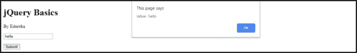

## jQuery 方法— addClass()

addClass()方法用于将一个或多个类添加到选定的元素中。请参考以下语法:

***$(选择器)。*addClass(class name)**

让我们看一个例子:

```
<!DOCTYPE html>
<html>
    <head>
        <title> jQuery Tutorial</title>
        <link rel="stylesheet" type="text/css" href="index.css">
        <script type="text/javascript" src="[https://code.jquery.com/jquery-3.3.1.min.js](https://code.jquery.com/jquery-3.3.1.min.js)"></script>
        <script src="[https://code.jquery.com/ui/1.12.1/jquery-ui.min.js](https://code.jquery.com/ui/1.12.1/jquery-ui.min.js)"
                integrity="sha256-VazP97ZCwtekAsvgPBSUwPFKdrwD3unUfSGVYrahUqU="
                crossorigin="anonymous"></script>
        <link href="[https://code.jquery.com/ui/1.10.4/themes/ui-lightness/jquery-ui.css](https://code.jquery.com/ui/1.10.4/themes/ui-lightness/jquery-ui.css)" rel="stylesheet">  
    </head>

<body>
    <h1>jQuery Basics</h1>
    <p>By Edureka</p> 
    <div class="puppers">

        

        

        

    </div>
    <script>  
            $(document).ready(function(){  
                $("button").click(function(){  
                    $("img").addClass("styleclass");  
                });  
            });  
    </script>  
    <style>  
            .styleclass {  
                border: 5px solid green
            }  
    </style> 
    <button>Try addClass() function</button>
</body>
</html>
```

一旦你运行了上面的代码，打开 JavaScript 控制台，点击“Try addClass”按钮，这将为所有的图片添加一个样式类。

这是最终结果:

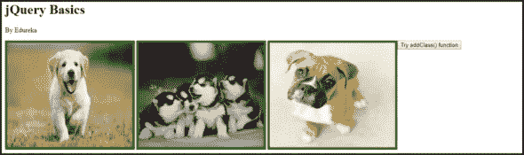

## jQuery 方法— removeClass()

jQuery removeclass()方法删除所选元素的一个或多个类。请参考以下语法:

***$(选择器)。remove class(class name)***

这个方法类似于 addClass，只不过它将删除已添加的类。运行您为 addClass 执行的相同代码，打开控制台，尝试下面的命令，看看您会得到什么！

```
$("img").removeClass("styleclass")
```

## jQuery 方法— toggleClass()

此方法在向所选元素添加和移除一个或多个类之间切换。请参考以下语法:

***$(选择器)。toggle class(class name)***

toggleClass()是 addClass()和 removeClass()的组合。运行您为 addClass 执行的相同代码，打开控制台，尝试下面的命令，看看您会得到什么！

```
$("img").toggleClass("styleclass")
```

# jQuery 事件

有几个 jQuery 事件，我将介绍最常用的事件。以下是您将了解的事件列表:

1.  jQuery 事件—单击()
2.  jQuery 事件-开()
3.  jQuery 事件-按键()

## jQuery 事件—单击()

当您单击一个元素时，click 事件通过执行一个函数或一组语句来发生。请参考以下语法:

***$(选择器)。点击*(功能)**

让我们看一个例子:

```
<!DOCTYPE html>
<html>
    <head>
        <title> jQuery Tutorial</title>
        <link rel="stylesheet" type="text/css" href="index.css">
        <script type="text/javascript" src="[https://code.jquery.com/jquery-3.3.1.min.js](https://code.jquery.com/jquery-3.3.1.min.js)"></script>
        <script src="[https://code.jquery.com/ui/1.12.1/jquery-ui.min.js](https://code.jquery.com/ui/1.12.1/jquery-ui.min.js)"
                integrity="sha256-VazP97ZCwtekAsvgPBSUwPFKdrwD3unUfSGVYrahUqU="
                crossorigin="anonymous"></script>
        <link href="[https://code.jquery.com/ui/1.10.4/themes/ui-lightness/jquery-ui.css](https://code.jquery.com/ui/1.10.4/themes/ui-lightness/jquery-ui.css)" rel="stylesheet">  
    </head>

<body>
    <h1>jQuery Basics</h1>
    <p>By Edureka</p> 
    <script>
        $(document).ready(function(){
            $("img").click(function(){
                $(this).hide();
            });
        });
    </script>   
    <div class="puppers">

        

        

        
    </div>
</body>
</html>
```

运行上述代码后，打开 JavaScript 控制台，在输入框中输入任意字符。在一个字符的按键上，写着“开始输入…”的

标签被隐藏起来。因此，在本例中，我们使用 on()事件来添加另一个事件侦听器，即 keypress()。

这是最终结果:

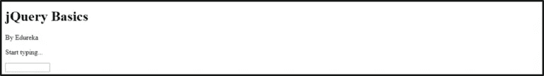

## jQuery 事件—按键()

jQuery keypress()事件在输入字符时执行。请参考以下语法:

***$(选择器)。按键(功能)***

请参考 click()方法来理解 keypress()方法。

# jQuery 效果

有几种 jQuery 效果，我将介绍最常用的效果。以下是您将了解到的效果列表:

1.  jQuery 效果- hide()
2.  jQuery 效果- show()
3.  jQuery 效果-切换()
4.  jQuery Effects- fadeOut()
5.  jQuery Effects- fadeIn()
6.  jQuery Effects- fadeToggle()
7.  jQuery Effects- slideDown()
8.  jQuery Effects- slideUp()
9.  jQuery Effects- slideToggle()

## jQuery 效果—隐藏()

jQuery hide()方法用于隐藏选定的元素。请参考以下语法:

***$(选择器)。隐藏(速度，回调)；***

让我们看一个例子:

```
<!DOCTYPE html>
<html>
    <head>
        <title> jQuery Tutorial</title>
        <link rel="stylesheet" type="text/css" href="index.css">
        <script type="text/javascript" src="[https://code.jquery.com/jquery-3.3.1.min.js](https://code.jquery.com/jquery-3.3.1.min.js)"></script>
        <script src="[https://code.jquery.com/ui/1.12.1/jquery-ui.min.js](https://code.jquery.com/ui/1.12.1/jquery-ui.min.js)"
                integrity="sha256-VazP97ZCwtekAsvgPBSUwPFKdrwD3unUfSGVYrahUqU="
                crossorigin="anonymous"></script>
        <link href="[https://code.jquery.com/ui/1.10.4/themes/ui-lightness/jquery-ui.css](https://code.jquery.com/ui/1.10.4/themes/ui-lightness/jquery-ui.css)" rel="stylesheet">  
    </head>

<body>
    <h1>jQuery Basics</h1>
    <p>By Edureka</p> 
<button class="buttons" id="hide">Hide</button>
<button class="buttons" id="show">Show</button> 
    <div class="puppers">
             
    </div>
<script>
    $(document).ready(function(){
    $("#hide").click(function(){
        $("img").hide();
    });
    $("#show").click(function(){
        $("img").show();
    });
});
</script>
</body>
</html>
```

运行上述代码后，打开 JavaScript 控制台并单击 hide 按钮。这将隐藏图像，因为我们在图像上使用了 hide()方法。

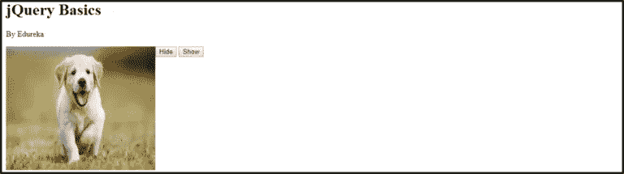

## jQuery 效果—显示()

jQuery show()方法用于显示选定的元素。请参考以下语法:

***$(选择器)。秀(速度，回调)；***

参考用于 hide()方法的相同代码，我在其中提到了 show()方法。

运行代码后，打开 JavaScript 控制台并单击 show 按钮。这将显示隐藏的图像，因为我们在图像上使用了 show()方法。


## jQuery 效果—切换()

jQuery toggle()方法用于在 hide()和 show()方法之间切换。它显示隐藏的元素并隐藏可见的元素。请参考以下语法:

***$(选择器)。toggle(速度，回调)；***

toggle()效果是 hide()和 show()的组合。运行与 hide()效果相同的代码，打开控制台，尝试下面的命令，看看会得到什么！

```
$("img").toggle()
```

## jQuery 效果— fadeOut()

jQuery fadeOut()方法用于淡出选定的元素。请参考以下语法:

***$(选择器)。fadeOut(速度，回调)；***

让我们看一个例子:

```
<!DOCTYPE html>
<html>
    <head>
        <title> jQuery Tutorial</title>
        <link rel="stylesheet" type="text/css" href="index.css">
        <script type="text/javascript" src="[https://code.jquery.com/jquery-3.3.1.min.js](https://code.jquery.com/jquery-3.3.1.min.js)"></script>
        <script src="[https://code.jquery.com/ui/1.12.1/jquery-ui.min.js](https://code.jquery.com/ui/1.12.1/jquery-ui.min.js)"
                integrity="sha256-VazP97ZCwtekAsvgPBSUwPFKdrwD3unUfSGVYrahUqU="
                crossorigin="anonymous"></script>
        <link href="[https://code.jquery.com/ui/1.10.4/themes/ui-lightness/jquery-ui.css](https://code.jquery.com/ui/1.10.4/themes/ui-lightness/jquery-ui.css)" rel="stylesheet">  
    </head>

<body>
    <h1>jQuery Basics</h1>
    <p>By Edureka</p> 
    <button>BYEEEEE</button><br><br>   
    <div class="puppers">
        
        
        
     </div>
<script>
    $(document).ready(function(){
        $("button").click(function(){
            $("#one").fadeOut('slow');
            $("#two").fadeOut("fast");
            $("#three").fadeOut('slow');
        });
    });
</script>
</body>
</html>
```

运行上述代码后，打开 JavaScript 控制台，单击“BYEEE”按钮。这将淡出()每个图像一个接一个。

这是最终结果:

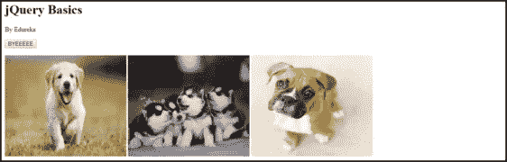

## jQuery 效果— fadeIn()

jQuery fadeIn()方法用于淡入选中的元素。请参考以下语法:

***$(选择器)。fadeIn(速度，回调)；***

让我们看一个例子:

```
<!DOCTYPE html>
<html>
    <head>
        <title> jQuery Tutorial</title>
        <link rel="stylesheet" type="text/css" href="index.css">
        <script type="text/javascript" src="[https://code.jquery.com/jquery-3.3.1.min.js](https://code.jquery.com/jquery-3.3.1.min.js)"></script>
        <script src="[https://code.jquery.com/ui/1.12.1/jquery-ui.min.js](https://code.jquery.com/ui/1.12.1/jquery-ui.min.js)"
                integrity="sha256-VazP97ZCwtekAsvgPBSUwPFKdrwD3unUfSGVYrahUqU="
                crossorigin="anonymous"></script>
        <link href="[https://code.jquery.com/ui/1.10.4/themes/ui-lightness/jquery-ui.css](https://code.jquery.com/ui/1.10.4/themes/ui-lightness/jquery-ui.css)" rel="stylesheet">  
    </head>

<body>
    <h1>jQuery Basics</h1>
    <p>By Edureka</p> 
<script>
        $(document).ready(function(){
            $("button").click(function(){
                $("#one").fadeIn();
                $("#two").fadeIn("slow");
                $("#three").fadeIn(3000);
            });
        });
</script>
<button>Namaste</button><br><br>
<div class="fade">

<div id="one" style="width:2200px;height:60px;display:none;background-color:orange;"></div><br>
<div id="two" style="width:2200px;height:60px;display:none;background-color:white;"></div><br>
<div id="three" style="width:2200px;height:60px;display:none;background-color:green;"></div>

</div>

</body>
</html>
```

一旦你运行了上面的代码，打开 JavaScript 控制台，点击“Namaste”按钮。这将 fadeInOut()三个矩形排序看起来像印度国旗。

这是最终结果:

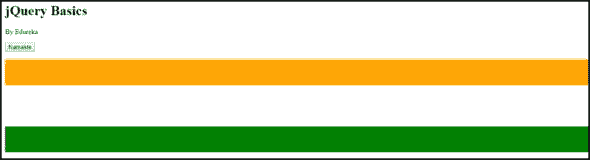

## jQuery 效果— fadeToggle()

jQuery fadeToggle()方法用于在 fadeIn()和 fadeOut()方法之间切换。请参考以下语法:

***$(选择器)。fadeToggle(速度，回调)；***

fadeToggle()效果是 fadeOut()和 fadeIn()的组合。运行与 fadeIn()效果相同的代码，打开控制台，尝试下面的命令，看看会得到什么！

```
$("#one").fadeToggle() 
$("#two").fadeToggle() 
$("#three").fadeToggle()
```

## jQuery 效果—向下滑动()

jQuery slideDown()方法用于向下滑动选定的元素。请参考以下语法:

***$(选择器)。下滑(速度，回调)；***

让我们看一个例子:

```
<!DOCTYPE html>
<html>
    <head>
        <title> jQuery Tutorial</title>
        <script type="text/javascript" src="[https://code.jquery.com/jquery-3.3.1.min.js](https://code.jquery.com/jquery-3.3.1.min.js)"></script>
        <script src="[https://code.jquery.com/ui/1.12.1/jquery-ui.min.js](https://code.jquery.com/ui/1.12.1/jquery-ui.min.js)"
                integrity="sha256-VazP97ZCwtekAsvgPBSUwPFKdrwD3unUfSGVYrahUqU="
                crossorigin="anonymous"></script>
        <link href="[https://code.jquery.com/ui/1.10.4/themes/ui-lightness/jquery-ui.css](https://code.jquery.com/ui/1.10.4/themes/ui-lightness/jquery-ui.css)" rel="stylesheet">  
    </head>

<body>
    <h1>jQuery Basics</h1>
    <p>By Edureka</p> 
<button id="one">Slide</button>
<div id="div1" style="width:90px;height:60px;display:none;background-color:orange;"></div><br>
    <script> 
            $("#one").on("click",function(){
                $("#div1").slideDown("slow")
            });
    </script>
</body>
</html>
```

运行上述代码后，打开 JavaScript 控制台，单击“滑动”按钮。这将向下滑动()一个小盒子。

这是最终结果:

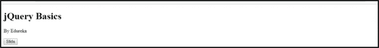

## jQuery 效果— slideUp()

jQuery slideUp()方法用于向上滑动选定的元素。请参考以下语法:

***$(选择器)。slideUp(速度，回调)；***

让我们看一个例子:

```
<!DOCTYPE html>
<html>
    <head>
        <title> jQuery Tutorial</title>
        <script type="text/javascript" src="[https://code.jquery.com/jquery-3.3.1.min.js](https://code.jquery.com/jquery-3.3.1.min.js)"></script>
        <script src="[https://code.jquery.com/ui/1.12.1/jquery-ui.min.js](https://code.jquery.com/ui/1.12.1/jquery-ui.min.js)"
                integrity="sha256-VazP97ZCwtekAsvgPBSUwPFKdrwD3unUfSGVYrahUqU="
                crossorigin="anonymous"></script>
        <link href="[https://code.jquery.com/ui/1.10.4/themes/ui-lightness/jquery-ui.css](https://code.jquery.com/ui/1.10.4/themes/ui-lightness/jquery-ui.css)" rel="stylesheet">  
    </head>

<body>
    <h1>jQuery Basics</h1>
    <p>By Edureka</p> 
<button id="one">Slide</button>
<div id="div1" style="width:90px;height:60px;background-color:orange;"></div><br>
    <script> 
            $("#one").on("click",function(){
                $("#div1").slideUp("slow")
            });
    </script>
</body>
</html>
```

运行上述代码后，打开 JavaScript 控制台，单击“滑动”按钮。这将向上滑动()盒子。

这是最终结果:

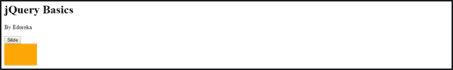

## jQuery 效果— slideToggle()

jQuery slideToggle()方法用于在 slideDown()和 slideUp()方法之间切换。请参考以下语法:

***$(选择器)。slideToggle(速度，回调)；***

slideToggle()效果是 slideDown()和 slideUp()的组合。运行与 slideUp()效果相同的代码，打开控制台，尝试下面的命令，看看会得到什么！

```
$("#div1").slideToggle("slow")
```

# jQuery UI

有几个 jQuery 小部件和效果，我将介绍最常用的效果。我将在 jQuery UI 中介绍以下内容:

1.  jQuery UI- draggable()
2.  jQuery UI-drop table()
3.  jQuery UI- datepicker()

## jQuery UI —可拖动()

jQuery UI draggable()方法用于使任何 DOM 元素可拖动。一旦元素是可拖动的，您就可以将它拖动到 html 页面中的任何位置。请参考以下语法:

***$(选择器)。draggable()；***

让我们看一个例子:

```
<!DOCTYPE html>
<html>
    <head>
        <title> jQuery Tutorial</title>
        <script type="text/javascript" src="[https://code.jquery.com/jquery-3.3.1.min.js](https://code.jquery.com/jquery-3.3.1.min.js)"></script>
        <script src="[https://code.jquery.com/ui/1.12.1/jquery-ui.min.js](https://code.jquery.com/ui/1.12.1/jquery-ui.min.js)"
                integrity="sha256-VazP97ZCwtekAsvgPBSUwPFKdrwD3unUfSGVYrahUqU="
                crossorigin="anonymous"></script>
        <link href="[https://code.jquery.com/ui/1.10.4/themes/ui-lightness/jquery-ui.css](https://code.jquery.com/ui/1.10.4/themes/ui-lightness/jquery-ui.css)" rel="stylesheet">  
    </head>

<body>
    <h1>jQuery Basics</h1>
    <p>By Edureka</p> 
<style>  
            #drag 
            { width: 150px;
              height: 60px; 
              padding: 0.5em; 
              background: blueviolet;
            }  
</style>  
<script>  
            $(function() {  
              $("#drag").draggable();  
            });  
</script>  

<div id="drag">  
<p> Drag me around with you</p>  
</div>
</body>
</html>
```

运行上述代码后，打开 JavaScript 控制台，尝试通过单击并按住矩形来移动它。这是由 draggable() UI 造成的。你自己试试，很好玩的！

这是最终结果:

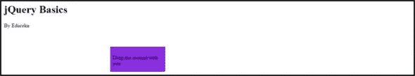

## jQuery UI —可删除()

jQuery UI 便于您使用 drop table()方法使任何 DOM 元素在指定的目标上可被丢弃。请参考以下语法:

***$(选择器)。drop able()；***

让我们看一个例子:

```
<!DOCTYPE html>
<html>
    <head>
        <title> jQuery Tutorial</title>
        <link rel="stylesheet" type="text/css" href="index.css">
        <script type="text/javascript" src="[https://code.jquery.com/jquery-3.3.1.min.js](https://code.jquery.com/jquery-3.3.1.min.js)"></script>
        <script src="[https://code.jquery.com/ui/1.12.1/jquery-ui.min.js](https://code.jquery.com/ui/1.12.1/jquery-ui.min.js)"
                integrity="sha256-VazP97ZCwtekAsvgPBSUwPFKdrwD3unUfSGVYrahUqU="
                crossorigin="anonymous"></script>
        <link href="[https://code.jquery.com/ui/1.10.4/themes/ui-lightness/jquery-ui.css](https://code.jquery.com/ui/1.10.4/themes/ui-lightness/jquery-ui.css)" rel="stylesheet">  
    </head>

<body>
    <h1>jQuery Basics</h1>
    <p>By Edureka</p> 


<style> 
            #drop {   
               width: 400px; 
               height: 400px;
               float: right;   
               background-color:aquamarine;      
            }  
</style>  
<script>  
            $(function() {  
               $("#img1").draggable();  
               $("#drop").droppable();  
            });  
</script>   
<div id="drop">  
    <p>MyHome</p>  
</div>      
</body>
</html>
</html>
```

一旦你运行了上面的代码，打开 JavaScript 控制台，点击并按住图片，然后把它放到我的主页图标上。这是由于 drop able()UI 造成的。你自己试试，很好玩的！

这是最终结果:

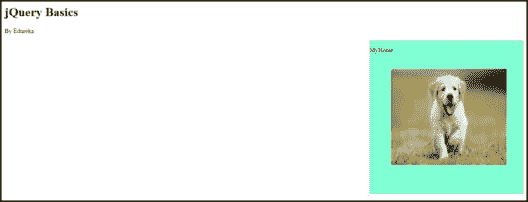

## jQuery UI —日期选择器()

jQuery UI datepicker 小部件使用户能够轻松、直观地输入日期。请参考以下语法:

***$(选择器)。date picker()；***

让我们看一个例子:

```
<!DOCTYPE html>
<html>
    <head>
        <title> jQuery Tutorial</title>
        <link rel="stylesheet" type="text/css" href="index.css">
        <script type="text/javascript" src="[https://code.jquery.com/jquery-3.3.1.min.js](https://code.jquery.com/jquery-3.3.1.min.js)"></script>
        <script src="[https://code.jquery.com/ui/1.12.1/jquery-ui.min.js](https://code.jquery.com/ui/1.12.1/jquery-ui.min.js)"
                integrity="sha256-VazP97ZCwtekAsvgPBSUwPFKdrwD3unUfSGVYrahUqU="
                crossorigin="anonymous"></script>
        <link href="[https://code.jquery.com/ui/1.10.4/themes/ui-lightness/jquery-ui.css](https://code.jquery.com/ui/1.10.4/themes/ui-lightness/jquery-ui.css)" rel="stylesheet">  
    </head>

<body>
    <h1>jQuery Basics</h1>
    <p>By Edureka</p> 
<input id="date" type="text" size="10">
<script>
        $('#date').datepicker()
</script>          
</body>
</html>
```

运行上述代码后，打开 JavaScript 控制台并输入日期，它将出现在日历上，如下所示。

这是最终结果:

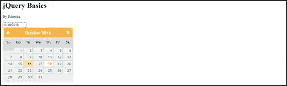

就这样，我们到了这篇文章的结尾。我希望你能发现这些信息并有所帮助，请继续关注更多关于 web 开发的教程。

如果你想查看更多关于人工智能、Python、道德黑客等市场最热门技术的文章，那么你可以参考 [Edureka 的官方网站。](https://www.edureka.co/blog/?utm_source=medium&utm_medium=content-link&utm_campaign=jquery-tutorial)

请留意本系列中的其他文章，它们将解释 JavaScript 的各个方面。

> 1.[十大 JavaScript 框架](/edureka/top-10-javascript-frameworks-3179f1b5bd41)
> 
> 2. [JavaScript 项目](/edureka/javascript-projects-f718db7dd7d5)
> 
> 3. [JSP 面试问答](/edureka/jsp-interview-questions-41b240f9414c)
> 
> 4.[如何搭建一个 JavaScript 计算器？](/edureka/javascript-calculator-47778c7596f3)

*原载于 2018 年 12 月 20 日 www.edureka.co**T21*[。](https://www.edureka.co/blog/jquery-tutorial/)