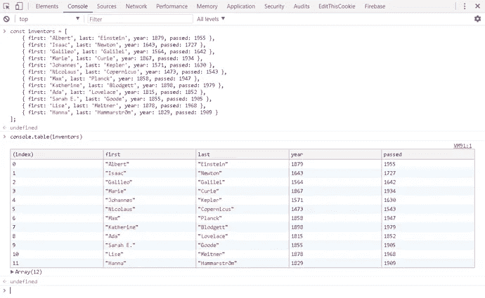
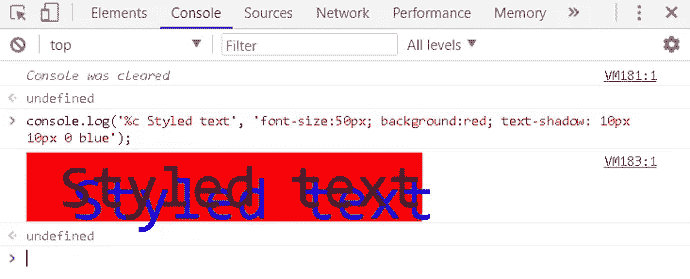
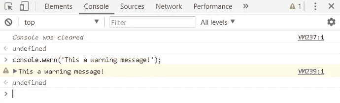
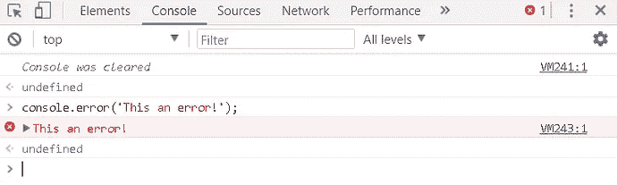
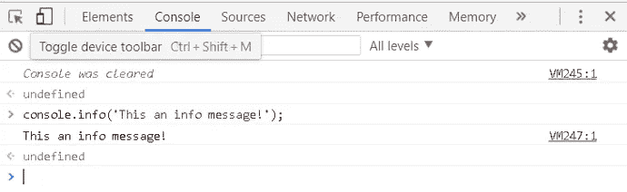
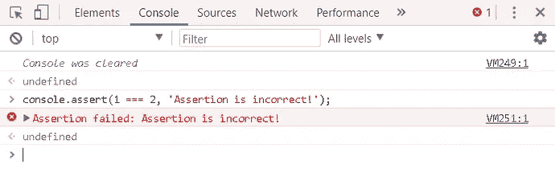
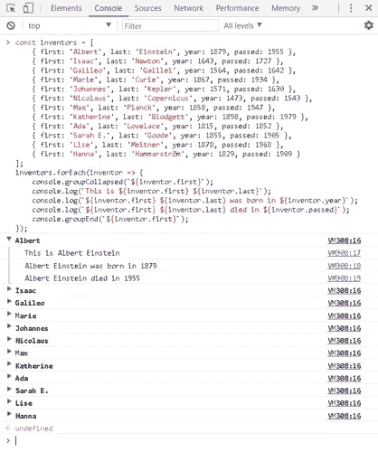
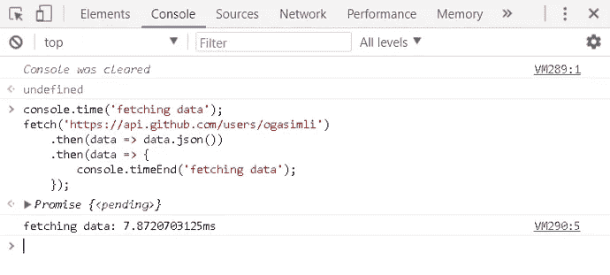
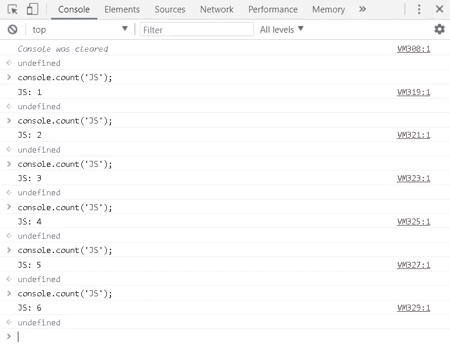

# 💪JS 提示:强大的控制台💪

> 原文：<https://medium.com/quick-code/js-tips-powerful-console-29ad159f1ae9?source=collection_archive---------7----------------------->


可能大多数人都知道`Console`对象让你可以访问浏览器的调试控制台，通过调用`console.log()`你可以在浏览器的控制台中输出几乎任何信息。然而，console object 还附带了其他一些同样有用的方法，可以让您像专家一样测试、调试和记录代码。

在这个故事中，我想和你分享一些方法。

让我们开始编码吧！😎

***1。console . table()***

```
const inventors = [
 { first: ‘Albert’, last: ‘Einstein’, year: 1879, passed: 1955 },
 { first: ‘Isaac’, last: ‘Newton’, year: 1643, passed: 1727 },
 { first: ‘Galileo’, last: ‘Galilei’, year: 1564, passed: 1642 },
 { first: ‘Marie’, last: ‘Curie’, year: 1867, passed: 1934 },
 { first: ‘Johannes’, last: ‘Kepler’, year: 1571, passed: 1630 },
 { first: ‘Nicolaus’, last: ‘Copernicus’, year: 1473, passed: 1543 },
 { first: ‘Max’, last: ‘Planck’, year: 1858, passed: 1947 },
 { first: ‘Katherine’, last: ‘Blodgett’, year: 1898, passed: 1979 },
 { first: ‘Ada’, last: ‘Lovelace’, year: 1815, passed: 1852 },
 { first: ‘Sarah E.’, last: ‘Goode’, year: 1855, passed: 1905 },
 { first: ‘Lise’, last: ‘Meitner’, year: 1878, passed: 1968 },
 { first: ‘Hanna’, last: ‘Hammarström’, year: 1829, passed: 1909 }
];
console.table(inventors);
```

该方法将以表格格式打印对象数组，如下所示:



console.table()

**②*。Styled console.log()***

```
console.log(‘%c Styled text’, ‘font-size:50px; background:red; text-shadow: 10px 10px 0 blue’);
```

在文本前添加`%c`将允许您将 CSS 样式作为第二个参数传递给该方法，并将您的日志输出样式如下:



Styled console.log()

***3。console . warn()***

```
console.warn(‘This a warning message!’);
```

该方法将输出如下警告消息:



console.warn()

***4。console . error()***

```
console.error(‘This an error!’);
```

该方法将输出如下错误消息:



console.error()

***5。console.info()***

```
console.info(‘This an info message!’);
```

该方法将输出如下所示的信息消息:



console.info()

***6。console . assert()***

```
console.assert(1 === 2, ‘Assertion is incorrect!’);
```

该方法将帮助您测试代码，如果断言不正确，将输出一条错误消息。换句话说，如果传递给它的第一个参数是`false`，它将记录一条消息并将跟踪堆栈到控制台:



console.assert()

**7*。console . group()***

```
const inventors = [
 { first: ‘Albert’, last: ‘Einstein’, year: 1879, passed: 1955 },
 { first: ‘Isaac’, last: ‘Newton’, year: 1643, passed: 1727 },
 { first: ‘Galileo’, last: ‘Galilei’, year: 1564, passed: 1642 },
 { first: ‘Marie’, last: ‘Curie’, year: 1867, passed: 1934 },
 { first: ‘Johannes’, last: ‘Kepler’, year: 1571, passed: 1630 },
 { first: ‘Nicolaus’, last: ‘Copernicus’, year: 1473, passed: 1543 },
 { first: ‘Max’, last: ‘Planck’, year: 1858, passed: 1947 },
 { first: ‘Katherine’, last: ‘Blodgett’, year: 1898, passed: 1979 },
 { first: ‘Ada’, last: ‘Lovelace’, year: 1815, passed: 1852 },
 { first: ‘Sarah E.’, last: ‘Goode’, year: 1855, passed: 1905 },
 { first: ‘Lise’, last: ‘Meitner’, year: 1878, passed: 1968 },
 { first: ‘Hanna’, last: ‘Hammarström’, year: 1829, passed: 1909 }
];
inventors.forEach(inventor => {
 console.groupCollapsed(`${inventor.first}`);
 console.log(`This is ${inventor.first} ${inventor.last}`);
 console.log(`${inventor.first} ${inventor.last} was born in ${inventor.year}`);
 console.log(`${inventor.first} ${inventor.last} died in ${inventor.passed}`);
 console.groupEnd(`${inventor.first}`);
});
```

这种方法将帮助您将日志输出分类。您需要通过调用`console.group(‘group name’)`(或者如果您希望您的组以折叠模式显示，则调用`console.groupCollapsed(‘group name’)`)开始分组，并通过调用`console.groupEnd(‘group name’)`语句结束分组。运行上述代码块后，您将得到如下有序的日志输出:



console.group()

***8。console.time()***

```
console.time(‘fetching data’);
fetch(‘[https://api.github.com/users/ogasimli'](https://api.github.com/users/ogasimli'))
 .then(data => data.json())
 .then(data => {
 console.timeEnd(‘fetching data’);
 });
```

此方法将帮助您确定代码的执行时间。在开始代码之前调用`console.time(‘key’)`，在执行结束后立即调用`console.timeEnd(‘key’)`。控制台将确定代码块的执行时间，并以毫秒为单位显示结果:



console.time()

***9。console . count()***

```
console.count('JS');
console.count('JS');
console.count('JS');
console.count('JS');
console.count('JS');
```

此方法将记录使用给定标签调用该行的次数:



console.count()

**10*。console.clear()***

```
console.clear();
```

这个方法将清除控制台的所有输出。

# 结论

这些是我在开发和调试我的应用程序时经常使用的主要方法，我希望了解它们会让你的开发人员的生活稍微轻松一些。然而，还有一些其他的方法，我在这个故事中没有提到。有关可用方法的完整列表，您可以参考页面 [MDN Web API](https://developer.mozilla.org/en/docs/Web/API/console) 。

希望这个故事对你有用。请随意分享您的反馈和意见，不要忘记鼓掌😃。

编码快乐！

> *在* [*上找到各种编程语言的免费课程*](http://www.quickcode.co/) *。获取* [Messenger](https://www.messenger.com/t/1493528657352302) *的新更新。*