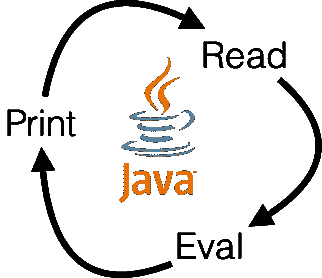
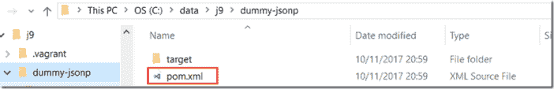
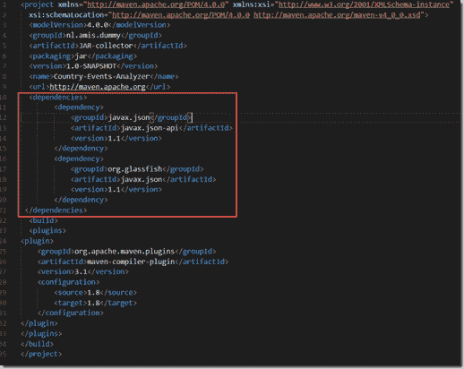
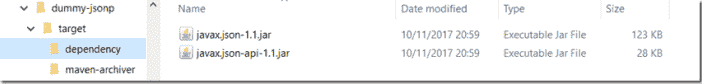
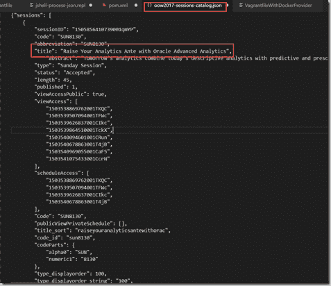
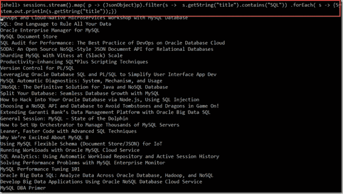

# Java 9 JShell 中的 JSON 操作

> 原文：<https://medium.com/oracledevs/json-manipulation-in-java-9-jshell-bab78f1e26a8?source=collection_archive---------0----------------------->

在本文中，我将展示我们如何在 JShell 中处理基于 JSON 的数据——用于分析、探索、清理和处理，就像我们在 Python 中所做的一样。JShell 是 Java 9 中引入的新命令行工具。它提供了一种交互式 REPL(读取-评估-打印循环)体验，在这里我们可以一个接一个地执行 Java 命令，一路在会话中创建变量，处理数据，以一种快速、愉快的方式尝试编程结构。

我使用一个 JSON 文档，其中包含甲骨文全球大会 2017 大会所有会议的条目([https://raw . githubusercontent . com/lucasjellema/scrape-oow 17/master/oow 2017-sessions-catalog . JSON](https://raw.githubusercontent.com/lucasjellema/scrape-oow17/master/oow2017-sessions-catalog.json))

JDK 的 Java 9 SE 规范不包含用于处理 JSON 的 JSON-P API 和库。为了在 JShell 中使用 JSON-P，我们需要添加库——我们首先需要找到并下载这些库。

我使用了一种有点迂回的方式来获得所需的 jar 文件(但是它以一种非常直接的方式工作):

1.创建一个依赖于 JSON-P 的 pom.xml 文件

2.那就跑

> *mvn 安装依赖:复制依赖*

如本文所述:[https://technology . amis . nl/2017/02/09/download-all-directly-and-ind 间接-required-jar-files-using-maven-install-dependency copy-dependencies/](https://technology.amis.nl/2017/02/09/download-all-directly-and-indirectly-required-jar-files-using-maven-install-dependencycopy-dependencies/)

这将把相关的 JAR 文件下载到子目录 target/dependencies 中

3.将 JAR 文件复制到一个目录中——可以从运行 JShell 的 Docker 容器中访问该目录——对我来说，该目录是本地 lib 目录，由 vagger 和 Docker 映射到运行 JShell 的 Docker 容器中的/var/www/lib。

4.在运行 JShell 的容器中:

当从 HTTP URL 资源中检索 JSON 文档时，使用以下语句启动 JShell，使新的 httpclient 模块可用:

> *jshell–添加模块 jdk.incubator.httpclient*

5.从 jshell 内部更新类路径

要在 JShell 中处理 JSON——使用 JSON-P——我们需要设置类路径，以包含使用 Maven 下载的两个 jar 文件。

> */env–class-path/var/www/lib/javax . JSON-1.1 . jar:/var/www/lib/javax . JSON-API-1.1 . jar*

然后导入 JSON-P 中的类

> *导入 javax . JSON . *；*

如果我们需要从 URL 资源中检索 JSON 数据，我们还应该

> *导入 JDK . incubator . http . *；*

6.我已经在文件系统中提供了 JSON 文档。

可以通过以下方式访问它:

> *InputStream input = new file InputStream("/var/www/oow 2017-sessions-catalog . JSON ")；*

7.将文件中的数据解析到 JSON 文档中，获取根对象并检索会话数组:

> *JSON reader JSON reader = JSON . create reader(input)*
> 
> *JSON object root JSON = JSON reader . read object()；*
> 
> *JSON array sessions = root JSON . getjson array(" sessions ")；*

8.使用流过滤标题中包含术语 SQL 的会话，并将它们的标题打印到系统输出中:

> *sessions.stream()。map( p - > (JsonObject)p)。filter(s->s . getstring(" title ")。包含(" SQL "))。forEach(s->{ system . out . println(s . getstring(" title "))；})*

另一个例子是:显示所有演示文稿的列表，这些演示文稿的幻灯片可通过下载 URL 下载:

> sessions.stream()
> 
> 。map(p-->(JSON object)p)
> 
> 。filter(s-> s . contains key(" files ")& &！s.isNull("files") &&！(s.getJsonArray("files ")。isEmpty()))
> 
> 。forEach(s--> { system . out . println(s . getstring(" title ")+" URL:"+s . getjsonarray(" files ")。getJsonObject(0)。getString(" URL "))；})

# 奖励:做 HTTP 请求

顺便提一下，jshell 中执行 HTTP 请求的一些步骤:

> jshell > http client client = http client . newhttpclient()；
> client = =>JDK . incubator . http . httpclientimpl @ 4d 339552
> 
> jshell > http request = http request . new builder(uri . create("[http://www . Google . com "))。获取()。build()；](http://www.google.com/%22)).GET().build();)
> 请求= =>[http://www.google.com](http://www.google.com/)得到
> 
> jshell > HttpResponse response = client . send(请求，HttpResponse。body handler . asstring())
> response = =>JDK . incubator . http . httpresponseimpl @ 147 ed 70 f
> 
> jshell > system . out . println(response . body())<title>302 已移动</title>
> 
> # 302 已移动
> 
> 文档已移动
> 
> [http://www.google.nl/?gfe_rd=cr&amp；DCR = 0&amp；ei = s 2xewcbpfpah 4g th 6 lb ag "](”<a)>此处< /A >。

*原载于 2017 年 10 月 12 日*[*technology . amis . nl*](https://technology.amis.nl/2017/10/12/json-manipulation-in-java-9-jshell/)*。*