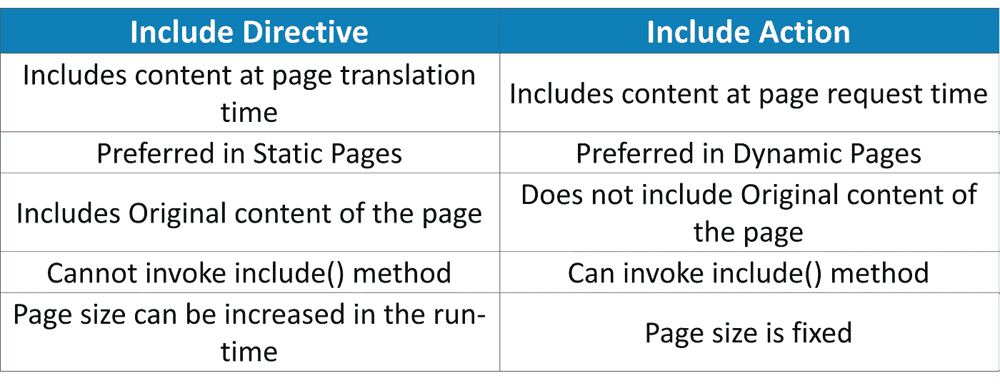
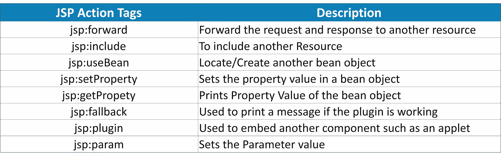
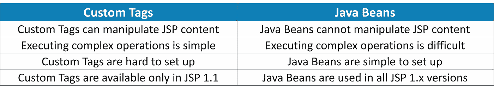
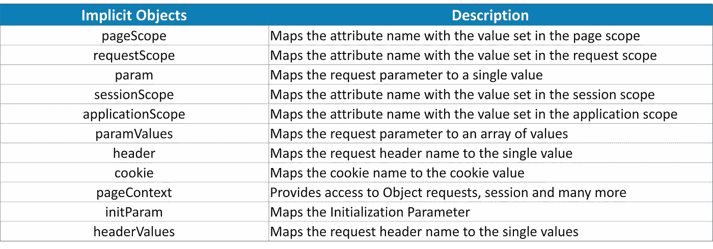
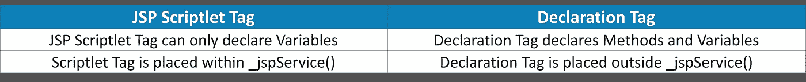

# 2021 年你必须知道的 50 大 JSP 面试问答

> 原文：<https://medium.com/edureka/jsp-interview-questions-41b240f9414c?source=collection_archive---------0----------------------->


JSP Interview Questions — Edureka

Java Servlet Page 是对 **Servlet** 技术的主要扩展之一。这种服务器端编程语言是创建动态网页的主要原因。在这篇文章中，我们将讨论你在最艰难的面试中必须知道的最常被问到的问题。

*   初级 JSP 面试问题
*   中级 JSP 面试问题
*   高级 JSP 面试问题

# 初级 JSP 面试问题

## **Q1。区分包含指令和包含操作。**

**Ans:** 两者的区别可以解释如下:



## **Q2。JSP 是什么？**

**Ans:** JSP 是 **Java Servlet 页面**的缩写。它是一种服务器端编程语言，用于以 HTML 的形式创建动态网页。JSP 页面被隐式地转换成 servlet，它支持一些额外的特性，比如表达式语言、定制标签等等。

## **Q3。你怎么能包含另一页的结果呢？**

**Ans:** 使用以下方法可以包含另一个页面的结果:

*   **包含指令**
*   **包括行动**

## **Q4。提到一些重要的 JSP 动作标签。**

**Ans:** 最常用的 **JSP 动作**标签如下:



## **Q5。如何在 MVC 模式下使用 JSP？**

**Ans:** JSP 用于 MVC 中的**展示**任务。它被用作**视图。**控制器调用模型和获取数据的业务类。这些数据被呈现给 JSP，以便呈现给**客户端。**

## **Q6。上下文初始化参数是什么意思？**

**Ans:** 上下文初始化参数是整个应用的**初始化参数**。它们并不特定于任何 **Servlet** 或 **JSP。**在 **web.xml** 文件中使用以下语法指定上下文初始化参数。

```
<context-param>  
    <param-name>parametername</param-name>  
    <param-value>parametervalue</param-value>  
</context-param>
```

## **Q7。提及< jsp.useBean >标签的范围值。**

**Ans:** 对于 **< jsp.useBean >** 标签，主要有四个作用域值可用。

*   页，面，张，版
*   请求
*   应用
*   会议

## **Q8。JSP 中使用的文字是什么？**

**Ans:**JSP 中使用的**文字**如下:

*   空
*   布尔代数学体系的
*   线
*   整数
*   浮动

## **Q9。ServletContext 和 PageContext 的主要区别是什么？**

**答:**servlet context 和 PageContext 的主要区别在于， **ServletContext** 被设计用来提供关于**容器**的信息，另一方面， **PageContext** 被设计用来提供关于**请求的信息。**

## **Q10。为什么使用 request.getRequestDispatcher()和 context.getRequestDispatcher()。**

**Ans:****request dispatcher()**和**context . getrequest dispatcher()**用于以下目的。

*   **request . getrequestdispatcher()**用于创建请求。我们需要给出资源的相对路径。
*   **context . getrequestdispatcher()**用于创建上下文。我们需要给出资源的绝对路径。

# 中级 JSP 面试问题


## **Q11。列出 JSP 自定义标记和 Java Beans 之间的主要区别。**

**Ans:****JSP 定制标签**和 **Java Beans** 的主要区别如下:



## **Q12。JSP 中的自定义标签是如何创建的？**

**答:**JSP 中的自定义标签是通过以下步骤创建的。

1.  创建标记处理程序类
2.  创建 TLD 文件
3.  创建 JSP 文件

**创建标签处理程序类:**

要创建标签处理程序类，我们需要继承 TagSupport 类，然后覆盖 PageContext 类提供的 **doStartTag()** 方法。要为 JSP 编写数据，我们需要使用 **JspWriter** 类。 **getOut()** 方法，该方法返回 **JspWriter** 类的实例。后来， **TagSupport** 类默认提供了 **pageContext** 的一个实例。

**创建 TLD 文件:**

TLD 代表**标签库描述符**文件。它包含与标记和标记处理程序类相关的信息。它必须保存在 **WEB-INF** 目录中。

**创建 JSP 文件:**

我们将直接指定 TLD 文件的路径。建议使用 URI 名称，而不是 TLD 文件的完整路径。它使用 **taglib** 指令来使用 TLD 文件中定义的标签。

## **Q13。提及表达式**中使用的各种隐式对象

**Ans:** 使用的各种隐式对象如下:



## **Q14。提及 JSP Bean 开发中使用的三个重要标签。**

**Ans:****JSP Bean 开发**中使用的三个标签如下:

*   jsp:useBean
*   jsp:setProperty
*   jsp:getProperty

## **Q15。你能在特定浏览器的后退按钮上禁用缓存吗？**

**答:是的，**缓存过程可以在**浏览器的**后退按钮**上**禁用**。为此，我们可以使用下面的代码。**

```
<% response.setHeader("Cache-Control","no-store"); response.setHeader("Pragma","no-cache"); response.setHeader ("Expires", "0"); %>
```

## **Q16。提及 JSP 中的隐式对象。**

**答:****Web 容器**创建某些对象，这些对象包含与特定*请求、应用*或*页面*相关的信息。这些对象被称为**隐式对象。**JSP 中的隐式对象如下:
**请求**

1.  反应
2.  应用
3.  例外
4.  配置
5.  页
6.  会议
7.  页面上下文
8.  在外

## **Q17。你能通过点击刷新按钮来停止对一个网页的多次提交吗？**

**答:**是的，这个问题可以通过使用 **Post/Redirect/Get** 或 **PRG** 模式来解决。

*   使用 **POST/GET** 方法将用户提交的表单提交给服务器。
*   数据库中的**状态**和业务模型被更新。
*   重定向响应由 **servlet** 用于回复视图页面。
*   浏览器使用 **GET** 命令加载视图，不发送用户数据。
*   这对于多次提交是安全的，因为它是一个单独的 **JSP** 页面。

## **Q18。如何在 JSP 中包含静态文件？**

**Ans:** **静态页面**可以使用 **include 指令包含在 JSP 中。**这样，包含在翻译阶段执行一次。注意，必须为文件属性提供一个相对的 **URL** 。虽然可以包含静态资源，但这不是首选，因为每个**请求**都需要包含。

## **Q19。我们如何停止 JSP 页面中显示的错误？**

**答:**我们可以通过在 JSP 页面中为错误页面的名称设置一个页面目录的 **"ErrorPage"** 属性，然后在错误 JSP 页面中设置 **"isErrorpage="TRUE "来停止 JSP 页面中的错误显示。**

## **Q20。可以用构造函数代替 init()方法来初始化 servlet 吗？**

是的，我们可以用一个构造函数来代替 **init()** 方法。但它不是首选，因为 init()是因为早期的 Java 版本不能动态调用带参数的构造函数而开发的。所以他们不能分配一个 **servletConfig。**然而，servlet 容器仍然调用唯一的无参数构造函数。因此无法访问 **servletContext** 或 **servletConfig。**

## **Q21。有哪些不同的生命周期方法？**

**答:**不同的生命周期方法如下:

*   **jspInit() —** 容器调用 **jspInit()** 方法初始化 servlet 实例。对于 servlet 实例，调用一次**，每隔一次**调用一次**。**
*   **_jspService():** 容器为每个**请求**调用 **_jspService()** 方法，并将其传递给**对象。**
*   **jspDestroy():** 容器在实例销毁之前调用 **jspDestroy()** 。

## **Q22。页面指令的属性是什么？**

**Ans:** 页面指令的不同**属性**如下:

*   **Session:** 用于显示页面是否有 **session** 数据。
*   **导入:**专门显示导入的**包**。
*   **is alignored:**显示 JSP 转换成 servlet 时是否忽略 **EL 表达式**。
*   **contentType:** 允许用户指定页面的**内容类型**。

## **Q23。解释客户端和服务器端验证。**

**答:****客户端**验证是使用 **JavaScript 完成的。**验证在浏览器中进行。当验证成功时，使用 Javascript 提交表单中的数据。验证错误不需要任何额外的网络行程，因为如果有任何错误，表单将无法提交。

提交表格后，在**服务器端**进行类似的数据验证。如果验证**失败，则**需要额外的网络行程来**向客户端重新发送**表格，以用正确的数据重新填充表格。

## **Q24。解释翻译阶段。**

**Ans:** 在翻译阶段， **JSP 引擎**将 JSP 文件翻译并编译成 **servlet。**这个 servlet 移动到**执行** **阶段**，在那里处理所有的请求和响应。它们是第一次为**编译。**除非手动编译，否则无法访问。**手动/显式编译**对于冗长复杂的程序很有用。

## **Q25。什么是对象克隆？**

**答:****对象克隆**是创建现有对象的精确副本的过程。**Ans:**Object class 的 **object cloningclone()** 方法用于创建一个现有对象的克隆。用户试图克隆其对象的类应该实现 **java.lang.Cloneable 接口。**如果它没有实现 **Cloneable 接口，**那么 clone()方法产生 **CloneNotSupportedException。**

```
protected Object clone() throws CloneNotSupportedException
```

## **Q26。为 Clone()方法写一个简单的例子。**

**Ans:** 该代码是 **Clone()** 方法的一个简单示例。

```
class Student18 implements Cloneable{  
     int rollno;  
     String name;  
     Student18(int rollno,String name){  
          this.rollno=rollno;  
          this.name=name;  
     }  
     public Object clone()throws CloneNotSupportedException{  
          return super.clone();  
     }  
     public static void main(String args[]){  
          try{  
               Student18 s1=new Student18(101102,"Arjun");  
               Student18 s2=(Student18)s1.clone();  
               System.out.println(s1.rollno+" "+s1.name);  
               System.out.println(s2.rollno+" "+s2.name);  
          }
          catch(CloneNotSupportedException c){
          }  
     }  
}
```

**//输出:**

```
101102 Arjun
101102 Arjun
```

## **Q27。定义 JSP 声明。**

**Ans**:**JSP 声明标签**用于声明字段和方法。JSP 声明里面写的代码是用< %括起来的！% >标记。它被放在自动生成的 servlet 的 **service()** 方法之外。

**语法:**

```
<%! field or method declaration %>
```

**示例:**

```
<html>  
     <body>  
          <%! int data=50; %>  
          <%= "Value of the variable is:"+data %>  
     </body>  
</html>
```

## **Q28。区分 JSP Scriptlet 标记和声明标记。**

**答:**两者的区别讨论如下:



## **Q29。JSP(Java 服务器页面)比 ASP(动态服务器页面)好在哪里？**

**Ans:****JSP**相对于 **ASP** 的优势如下:

*   代码的动态部分是用 **Java、**而不是用 **Visual Basic** 或**微软特有的**语言编写的。因此，**功能强大**而**更容易**使用。
*   它可以移植到其他操作系统和非微软的网络服务器上。

## **Q30。提到 JSP 相对于纯 Servlets 的优势？**

回答:JSP 相对于纯 Servlets 的一些主要优势如下所述:

*   编写和修改普通的 **HTML** 比编写大量生成 **HTML 的 **println** 语句更方便。**
*   在 HTML 页面中嵌入 Java 代码。
*   **平台**独立。
*   创建**数据库驱动的**网络应用。
*   **服务器端**编程能力。

# 高级 JSP 面试问题


## **Q31。什么是自动刷新属性？**

**Ans:****auto flush**属性用于指定当缓冲区填满时，是否应自动刷新缓冲输出，或者是否应引发异常以指示缓冲区溢出。默认情况下，**真**值表示自动缓冲区刷新，而**假**值则抛出异常。

## **Q32。isScriptingEnabled 属性是什么意思？**

**Ans:****isScriptingEnabled**属性决定是否允许使用脚本元素。缺省值是 **true** ，它启用了 scriptlets、表达式和声明。如果属性的值被设置为 false，那么如果 JSP 使用任何 scriptlets，**表达式/声明，就会出现翻译时错误。**

## **Q33。使用 JSP 从表单中读取数据涉及哪些步骤？**

**Ans:** 数据解析是 JSP 是**自动的。**视情况通过以下步骤完成。

1.  **getParameter():** 调用 request.getParameter()方法获取**表单参数的值。**
2.  **getParameterValues():** 如果参数出现多次并且**返回多个值，则调用该方法。**
3.  **getParameterNames():** 如果用户想要当前**请求中所有参数的完整列表，则调用该方法。**
4.  **getInputStream():** 该方法用于**读取来自客户端的二进制数据**流。

## **Q34。JSP 中 cookies 是如何设置的？**

**Ans:** 用 JSP 设置 cookies 包括以下步骤:

1.  **创建 Cookie 对象:** Cookie 构造函数是用 cookie **名**和 cookie **值**调用的，两者都是字符串。
2.  **设置最大年龄:** **setMaxAge** 用于指定 cookie 应该有效的长度(以秒为单位)。
3.  **将 Cookie 发送到 HTTP 响应头:** **response.addCookie** 用于在 HTTP 响应头中添加 cookie。

## **Q35。如何删除会话数据？**

**答:**删除会话数据包括以下步骤。

1.  **删除特定属性:** *调用 public void Remove attribute(String name)*方法删除与特定键关联的值。
2.  **删除整个会话:** *调用 public void invalidate()* 方法丢弃整个会话。
3.  **设置会话超时:** *调用 public void setMaxInactiveInterval(int interval)*方法单独为一个会话设置超时。
4.  **注销用户:**调用**注销**将客户端从 Web 服务器注销，并使属于所有用户的所有会话无效。
5.  **web.xml 配置:**在 **Tomcat 中，**使用上述方法，可以在 **web.xml** 文件中配置会话超时，如下所示。

## **Q36。如何在 JSP 中删除一个 Cookie？**

**Ans:** 下面的代码片段用于**删除 JSP 中的一个 cookie。**

```
Cookie mycookie = new Cookie("name","value");
response.addCookie(mycookie);
Cookie killcookie = new Cookie("mycookie","value");
killcookie . set MaxAge ( 0 );
killcookie . set Path (" / ");
killcookie . addCookie ( killcookie 1 );
```

## **Q37。解释一下 forward 和 sendRedirect 的区别？**

**Ans:** 当一个 **forward** 请求被调用时，该请求被发送到服务器上的一个不同的资源，而没有通知客户端一个不同的资源将要处理该请求。这个过程完全发生在 web 容器中。

当一个**sendre direct**方法被调用时，它导致 web 容器返回到浏览器，指示一个新的 **URL** 应该被请求。由于浏览器发出了一个全新的请求，在重定向发生之前作为请求属性存储的所有对象都将丢失。这个额外的往返 a 重定向比转发慢**。**

## **Q38。提及 JSTL 核心标签。**

**答:JSTL 核心标签**如下。

*   **< c:out >标签:**用于转义 **XML** 和 **HTML** 标记标签后在客户端显示内容。主要属性是 default 和 **escapeXML。**
*   **< c:设置>标签:**该标签用于在指定范围内设置**变量值**。它基本上计算一个表达式，并在给定的变量中设置结果。
*   **< c:remove > tag:** 用于**从指定作用域或者所有作用域(页面、请求、会话、应用)中移除**一个**属性**。默认情况下，从所有中删除。
*   **< c: if >标签:**此 **JSTL** 核心标签用于测试条件。这个标签还有另外两个可选属性，分别是 var 和 scope，测试是强制性的。
*   **< c:选择>标签:**就像 Java 里的 **switch** 语句。
*   **< c:当>标签:**就像 Java 里的 **case** 语句。
*   **< c:否则> tag:** 它的作用类似于 **switch-case** 语句中的 **default** 属性。
*   **< c:catch >标签:**该标签用于**异常处理。在这篇文章中，我们已经讨论了使用 **< c:catch >** 核心标签的异常处理。**
*   **< c:导入>标签:**这个 **JSTL** 核心标签用于将内容从另一个**文件/页面**导入到当前 JSP 页面。属性—变量、URL 和范围。
*   **< c:forEach >标签:****JSTL**中的这个标签用于执行**有限**次同一组语句。
*   **< c:forTokens >标签:**它用于**迭代**但是它只和分隔符一起工作。
*   **< c:param >标签:**这个 JSTL 标签多与 **< c:url >** 和 **< c:redirect >** 标签一起使用。它将参数及其值添加到这些标签的输出中。
*   **< c:url >标签:**用于 url 格式化或者 **URL 编码。它将一个相对 URL 转换成一个应用程序上下文的 URL。可选属性变量、上下文和范围。**
*   **< c:redirect >标签:**用于将当前页面重定向到另一个 **URL，**在该标签的 URL 属性中提供相对地址，页面将**重定向**到该 URL。

## **Q39。为什么 JSP 页面是创建基于 web 的客户端程序的首选？**

**答:** JSP 是创建基于 web 的客户端程序的首选。因为客户机系统上不需要**插件/安全**策略文件，而 applet 需要。此外，JSP 页面支持更简洁、更模块化的应用程序设计，因为它们提供了一种将应用程序编程与网页设计分开的方法。这意味着参与网页设计的人员不需要理解 Java 编程语言语法来完成他们的工作。

## **Q40。如何让 Finally 子句不执行失败？**

**Ans:** 使用 **System.exit(1)可以使 **Finally 子句**不失败；**在 try 块中。

## **Q41。我们如何检索警告？**

Ans: **SQLWarning** 对象是处理数据库访问警告的 **SQLException** 的子类。警告不会像异常那样停止应用程序的执行；它们只是提醒用户一些事情没有按计划发生。可以对连接对象、包括 PreparedStatement 和 CallableStatement 对象的语句对象或 ResultSet 对象报告警告。这些类中的每一个都有一个 **getWarnings** 方法，您必须调用该方法才能看到调用对象上报告的第一个警告。

下面的代码片段可用于检索警告。

```
SQLWarning warning = stmt.getWarnings();
if (warning != null){
     while (warning != null){
            System.out.println(\"Message: \" + warning.getMessage());
            System.out.println(\"SQLState: \" + warning.getSQLState());
            System.out.print(\"Vendor error code: \");
            System.out.println(warning.getErrorCode());
            warning = warning.getNextWarning();
     }
}
```

## **Q42。为什么 Jcomponent 有 Add()和 Remove()方法，而组件没有？**

**答:**这是因为 **JComponent** 是**容器**的子类，它可以包含其他组件和**JComponent。通过让 JSP**实现 SingleThreadModel 接口，你可以让它们成为线程安全的**。这是通过在 JSP 页面中添加指令**<% @ page is thread safe = " false " %>**来实现的**

## **Q43。解释一些可以被覆盖的 JSP 生命周期方法。**

**Ans:** 您可以在 JSP 页面中覆盖 **jspInit()** 和 **jspDestroy()** 方法。在 **jspDestroy()中释放任何分配的资源是一个很好的编程实践。**JSP init()和 **jspDestroy()** 方法在 JSP 页面的生命周期中只执行一次，通常声明为 JSP 声明:

## **Q44。如何在我的 JSP 页面中声明方法？**

**答:**方法可以在 **JSP** 页面中声明使用。这些方法在您声明的任何其他方法中被调用，或者在 **JSP scriptlets** 和**表达式中被调用。**

**注意:**请注意，您不能从 JSP 方法中直接**访问任何 **JSP 隐式对象**，如请求、响应、会话等等。但是，您应该能够将任何隐式 JSP 变量作为参数传递给您声明的方法。**

## **Q45。servlet 如何与 JSP 页面通信？**

**Ans:** 下面的代码片段显示了 servlet **如何实例化**一个 bean，并用浏览器发布的**表单**数据初始化它。然后将 **bean** 放入请求中，然后通过**请求调度器**将调用转发到 JSP 页面**Bean1.jsp**进行下游处理。

```
public void doPost (HttpServletRequest request, HttpServletResponse response){
     try {
           govi.FormBean f = new govi.FormBean();
           String id = request.getParameter("id");
           f.setName(request.getParameter("name"));
           f.setAddr(request.getParameter("addr"));
           f.setAge(request.getParameter("age"));
           f.setPersonalizationInfo(info);
           request.setAttribute("fBean",f);
           getServletConfig().getServletContext().getRequestDispatcher
           ("/jsp/Bean1.jsp").forward(request, response);
     } 
     catch (Exception ex) {
     }
}
```

JSP 页面**Bean1.jsp**然后可以处理 **fBean，**首先通过 useBean 动作从默认请求范围提取它。

```
jsp:useBean id="fBean" class="govi.FormBean" scope="request"/ jsp:getProperty name="fBean"
property="name" / jsp:getProperty name="fBean"
property="addr" / jsp:getProperty name="fBean" property="age" / jsp:getProperty name="fBean"
property="personalizationInfo" /
```

## **Q46。什么是隐藏评论？**

**Ans:** 记录 JSP 页面但不发送给客户机的注释称为**隐藏注释。**JSP 引擎忽略隐藏注释，并且不处理隐藏注释标签中的任何代码。无论是在显示的 JSP 页面还是 HTML 页面源代码中，隐藏的注释都不会发送给客户端。当您想要隐藏或“注释掉”JSP 页面的一部分时，隐藏注释非常有用。

除了结束-% >组合之外，可以在注释体中使用任何字符。如果您需要在注释中使用-% >，可以通过键入-% >来转义它。

**JSP 语法:**

```
<%-- comment --%>
```

**例题**

```
<%@ page language="java" %>
<html> 
    <head><title>A Hidden Comment </title></head>
        <body>
             <%-- This comment will not be visible to the client in the page source --%>
        </body>
</html>
```

## **Q47。可以禁用 JSP 脚本吗？**

**答:**是的，**通过将部署描述符的 scripting-invalid 元素设置为 true 来禁用脚本**。它是 **JSP-property-group 的**子元素**。**其有效值有真有假。

用于禁用脚本的**语法**如下:

```
<jsp-property-group>
<url-pattern>*.jsp</url-pattern>
<scripting-invalid>true</scripting-invalid>
</jsp-property-group>
```

## **Q48。如何在 JSP 上停用 EL？**

有两种方法可以忽略 **Ans: (EL)表达式语言**在 **JSP** 页面上的执行。

```
<jsp-config>
   <jsp-property-group>
       <url-pattern>*.jsp</url-pattern>
       <el-ignored>true</el-ignored>
   </jsp-property-group>
</jsp-config>
```

## **Q49。容器什么时候初始化多个 JSP 对象？**

**Ans:** 在这种情况下，一个 **servlet** 或 **JSP** 页面的部署描述符中有多个**servlet**和 **servlet-mapping** 元素，那么**容器**为每个元素初始化一个对象，这些对象中的每一个都有自己的 **ServletConfig** 对象和初始化参数。

以下代码片段使用了 **web.xml** 中的一个 **JSP** 页面，如下所示。

```
<servlet>
<servlet-name>Test</servlet-name>  
     <jsp-file>/WEB-INF/test.jsp</jsp-file>
         <init-param>
             <param-name>test</param-name>
             <param-value>Test Value</param-value>
         </init-param>
</servlet>

<servlet-mapping>
      <servlet-name>Test</servlet-name>
      <url-pattern>/Test.do</url-pattern>
</servlet-mapping>

<servlet>
      <servlet-name>Test1</servlet-name>
      <jsp-file>/WEB-INF/test.jsp</jsp-file>
</servlet>

<servlet-mapping>
      <servlet-name>Test1</servlet-name>
      <url-pattern>/Test1.do</url-pattern>
</servlet-mapping>
```

## **Q50。在部署描述符中给出一个示例 JSP 配置。**

**Ans:****JSP-config**元素用于配置 JSP 页面的各种参数。

*   管理页面上的 **scriptlet** 元素，
*   控制语言中表达式的执行
*   用于**编码的 URL 模式定义，**
*   确定用于页面上对象的 **缓冲区**的**大小**
*   对应于要作为 XML 文档处理的 **URL 模式**的资源组的标识。

```
jsp-config>
       <taglib>
           <taglib-uri>[https://www.edureka.co/jsp/tlds/mytags](https://www.edureka.co/jsp/tlds/mytags)</taglib-uri>
           <taglib-location>/WEB-INF/numberformatter.tld</taglib-location>
       </taglib>
</jsp-config>
```

到此，我们来结束这篇文章。如果你想查看更多关于人工智能、DevOps、道德黑客等市场最热门技术的文章，那么你可以参考 [Edureka 的官方网站。](https://www.edureka.co/blog/?utm_source=medium&utm_medium=content-link&utm_campaign=jsp-interview-questions)

请留意本系列中的其他文章，它们将解释 Java 的各个方面。

请留意本系列中的其他文章，它们将解释 JavaScript 的各个方面。

> 1.[十大 JavaScript 框架](/edureka/top-10-javascript-frameworks-3179f1b5bd41)
> 
> 2. [JavaScript 项目](/edureka/javascript-projects-f718db7dd7d5)
> 
> 3.[JQuery 简介](/edureka/jquery-tutorial-for-beginners-679021d74ab4)
> 
> 4.[如何搭建一个 JavaScript 计算器？](/edureka/javascript-calculator-47778c7596f3)

*原载于 2019 年 10 月 4 日*[*https://www.edureka.co*](https://www.edureka.co/blog/interview-questions/jsp-interview-questions/)*。*