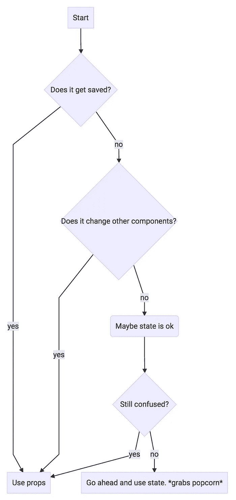

# JSX 看起来令人厌恶

> 原文：<https://medium.com/javascript-scene/jsx-looks-like-an-abomination-1c1ec351a918?source=collection_archive---------1----------------------->

## 但是这对你有好处

# TL；速度三角形定位法(dead reckoning)

JSX 就像一种健康的蔬菜，尝起来像腐朽的巧克力蛋糕。你感到内疚，但这对你有好处。([发这个](https://twitter.com/intent/tweet?text=JSX+is+like+a+healthy+vegetable+that+tastes+like+decadent+chocolate+cake.+You+feel+guilty%2C+but+it%E2%80%99s+good+for+you.+https%3A%2F%2Fmedium.com%2Fjavascript-scene%2Fjsx-looks-like-an-abomination-1c1ec351a918))。

# 什么是 JSX？

对于那些不熟悉 React 的人来说，JSX 是一个内联标记，看起来像 HTML，并被转换成 JavaScript。JSX 表达式以类似 HTML 的开始标记开始，以相应的结束标记结束。JSX 标签支持 XML 自结束语法，因此您可以选择不使用结束标签。

JSX 表达式求值重新遥测。可以把它们看作是调用 *`React.createElement()`* 的简写。

巴贝尔对 JSX 有着内在的支持。如果你需要帮助，请阅读[“如何使用 ES6 实现同构 JavaScript 应用”](/javascript-scene/how-to-use-es6-for-isomorphic-javascript-apps-2a9c3abe5ea2)

以下是可编辑电子邮件字段的 JSX 表达式示例:

让我们来分解一下:

## JavaScript 表达式

您可以使用任何手柄用户都熟悉的语法在 JSX 中嵌入 JavaScript 表达式，例如 *`style = { displayStyle }`* 将 JavaScript 变量 *`displayStyle`* 的值分配给元素的 *`style`* 属性。

## 风格

您可以通过将一个普通的 JavaScript 对象分配给 *`style`* 属性来设置样式。你不用 CSS 语法。相反，您可以使用类似的 JS 对象文字格式。

## 事件

有一组事件处理程序，任何懂 HTML 的人都应该很熟悉。

# 内嵌 JSX

上面的例子看起来和 handlebars 模板差不多，但是你通常会看到混合了 JavaScript 的 JSX 表达式:

…这也是许多开发人员忽略的地方。乍一看，这像是 1990 年的 DHTML 和 2015 年的 ES6 的邪恶私生子。我们在谈论一些科学怪人的疯狂…对吗？

不完全是。让我们仔细看看。

# JSX 不是一种 HTML 模板语言

虽然看起来像，但 JSX 并不是一个模板，车把和 EJS 是模板。它不像许多其他工具那样，是简单的令牌替换和 *`.innerHTML= foo`* 转储。

它实际上是一种声明性语法，用于表达虚拟 DOM。JSX 被解释并转换成虚拟的 DOM，这与真实的 DOM 不同。不用重写整个 DOM 树，只应用不同之处。这使得 React 渲染速度很快。

此外，JSX 还构建了针对 XSS 攻击的通用防护。

JSX 并不局限于 HTML。您可以用它来创建任意的对象树。网飞利用这一能力，在各种设备上镜像他们的 web 应用架构，使用他们自己的定制对象模型进行电视渲染。

React Native 使用它来呈现设备本机 UI 元素。

从这个意义上来说，JSX 实际上比车把模板更加灵活和通用。

# JSX 事件处理程序不像 HTML“onclick”

尽管使用了熟悉的属性语法，JSX 并不像 HTML 中的语法那样处理事件。

JSX 事件 get **自动将**委托给**根 React 节点**。实际上，它更进一步。它在根节点上设置了一个**单一事件处理程序**，处理**你的所有事件。**

那是什么意思？通常，当您将事件侦听器直接附加到用户与之交互的元素时，最终可能会在内存中为单个页面存储许多事件侦听器。React 会自动创建一个监听器，这样你就再也不用考虑事件委托了。

这对于像无限滚动这样的事情来说真的很棒，因为你不必担心无限增长的内存消耗(内存泄漏)。

它看起来像 90 年代的 DHTML，但是在幕后，它做了正确的事情。

> **提示:**不要让 body 标签成为 React 组件的根节点。页面上的其他 JavaScript 可能会改变 body 标签，React 需要完全控制其根元素以进行事件管理。

# 设计师不介意 JSX

乍一看，我担心设计师会被 JSX 吓跑，但是我和许多使用 JSX 的团队讨论过这种担心，设计团队很快就适应了，并且经常发现这比使用 HTML 模板和 CSS 更容易，这带来了另一个问题…

# 内嵌样式很好

一开始我很纠结这个。我完全相信 CSS 的想法，但实际上，CSS 在很多方面都失败了。首先，它本质上是一个全球游乐场，CSS 选择经常以不希望的方式重叠，并产生尴尬的副作用，这导致您使用选择器变得更加具体，这反过来使您的 CSS 选择更加脆弱，因此当 DOM 改变时它们会中断。

将样式放入 React 组件更类似于将样式放入 web 组件，而不是将样式放入原始 HTML。如果你是用原始 HTML 做的，你想改变购买按钮的外观，你有 10k 个商品，你需要在 10k 个地方更新样式。

组件不是那样工作的。由于样式在可重用组件中，您只需在一个地方更新它，并且不必担心选择器范围。

额外的好处是，您还可以获得样式变量、样式模块、样式继承和其他一些您已经在使用预处理器的东西——但是现在您不必学习全新的语法。[你在 JS](https://speakerdeck.com/vjeux/react-css-in-js) 做。

我以为我会讨厌它，但我喜欢它。

# (右)关注点分离

反应过来的全是对**分离的担忧。**这听起来可能令人惊讶，因为这个人曾详细描述了为什么业务逻辑和数据管理应该与表示分离——但是如果你正确地使用了 React，**你应该担心的唯一问题是表示。**

React 不处理数据或业务建模。它所做的只是有效地渲染和委托事件。它知道它需要渲染的数据，它知道什么时候渲染它(当数据改变时)，它知道如何高效地渲染它。类似地，它知道如何将 UI 意图传递回应用程序。

它不知道的是应用程序对这些用户意图做了什么，或者任何数据对业务模型或业务规则意味着什么。

> 如果你把业务规则
> 放在 React 组件中，
> 你就做错了。

我之前对你隐瞒了一些事情。让我们从上面看完整的组件。这是一个简单的可重用组件，显示电子邮件地址。当您单击电子邮件地址时，它会切换到编辑模式，将显示的电子邮件换成 HTML5 电子邮件输入:

注意，这个文件中没有任何状态。组件甚至不知道它是否在使用编辑模式，直到你用 *`props`* 告诉它。这是一个**无状态组件。**

> 有状态组件是 React 中的一种
> 反模式。
> 
> *避免* `this.state`
> 和` setState()` *。*

## 更新:反模式，真的？

有时(但很少)，组件维护内部状态会很有用。正如里奇·希基所说:

> “如果一棵树倒在树林里，它会发出声音吗？如果一个纯函数把数据突变产生一个不可变的值，这样可以吗？”~ [@richhickey](http://twitter.com/richhickey)

换句话说，只要你的状态没有引起副作用，也许就没问题。还在迷茫？我给你做了个流程图。

容器组件是国家经验法则的一大例外。 [*我使用容器组件*](/@_ericelliott/what-do-you-mean-by-does-not-work-could-you-reproduce-the-problem-on-codepen-io-as-i-understand-d24903a14a0) *将通用的、可重用的 UI 组件集成到应用的特定状态上下文中。*

## 什么是*`道具`*？

它们是作为**元素属性**传递给组件的数据。在应用程序的其他地方，React 监听状态变化，并再次调用 *`render()`* 方法，将变化的数据传递到 *`props`* 。

您可能还会注意到，该组件不知道事件侦听器在做什么。我在这里使用了一个技巧，使组件在任何应用程序中都很容易测试和重用——我将它包装在一个工厂函数中。

**工厂允许你传入所有的依赖，**包括 React。如果你愿意，你甚至可以传入基本样式，这样你的组件就可以从应用程序的其他部分继承标准样式。在这种情况下，我没有那样做，但确实传入了 *`setEmail()`* 和 *`setEditMode()`* 函数。在 React / Flux 行话中，这些功能被称为**动作**。

动作将用户意图传达给应用程序。这个组件不知道你的应用程序如何监听或响应动作。它对你如何存储和管理状态一无所知。它只知道如何触发这些动作来传达用户意图。

接下来就看应用程序了。

> 学习 JavaScript app 开发
> 用 Node，ES6 & React。
> 
> [立即预订
> 终身访问所有
> 我的 JavaScript 课程。](https://ericelliottjs.com/product/lifetime-access-pass/)

***Eric Elliott****著有* [*【编程 JavaScript 应用】*](http://pjabook.com) *(O'Reilly)，以及* [*【学习 JavaScript 同构 App 开发用节点，ES6，&【React】*](https://leanpub.com/learn-javascript-react-nodejs-es6/)*。他为 Adobe Systems******Zumba Fitness*******华尔街日报*******ESPN*******BBC****和******

**他大部分时间都在旧金山湾区和世界上最美丽的女人在一起。**